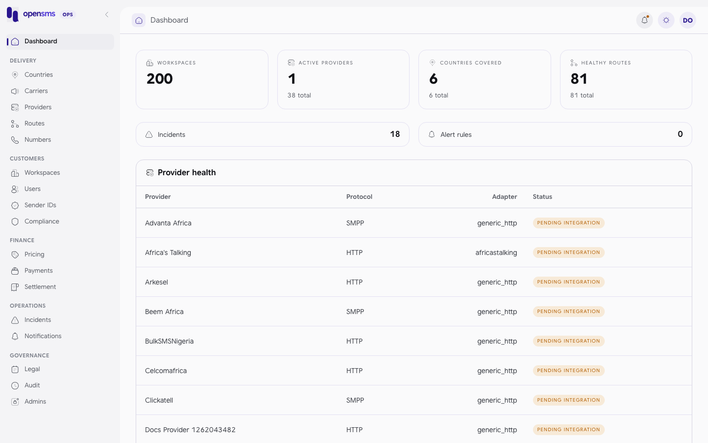

# Operator console

The operator console is the internal side of opensms: the screens under `/admin` and the API under `/admin/v1` that the opensms team uses to run the platform. It is where operators maintain the delivery catalogue (countries, carriers, providers, routes, numbers), review customers (workspaces, KYC documents, sender ID applications, account access), manage money (prices, manual bank transfers, provider settlement) and handle operations (incidents, notifications, legal documents, the audit log and operator accounts). This section is for opensms operators in the `superadmin`, `ops`, `finance` and `support` roles. Customers never see it: a customer session is refused by every `/admin/v1` endpoint.

## Start here

1. [Get access](getting-access.md): create an operator with `opensms-admin`, sign in, and set up two-factor authentication.
2. Read the [roles table](#roles-and-what-each-can-do) below so you know which screens and actions your role has.
3. Pick the guide for the task in front of you from the [guide index](#guides).

## How the console is organised

The left rail groups pages the way an operator's work flows. Every page is a real route in the console.

| Group | Pages |
|---|---|
| (top) | [Dashboard](dashboard.md) |
| Delivery | [Countries](countries.md), [Carriers](carriers.md), [Providers](providers.md), [Routes](routes.md), [Numbers](numbers.md) |
| Customers | [Workspaces](workspaces.md), [Users](users.md), [Sender IDs](sender-ids.md), [Compliance](compliance.md) |
| Finance | [Pricing](pricing.md), [Payments](payments.md), [Settlement](settlement.md) |
| Operations | [Incidents](incidents.md), [Notifications](notifications.md) (inbox, alert rules and channels) |
| Governance | [Legal](legal.md), [Audit](audit-log.md), [Admins](admins.md) |

The bell in the header opens the same notification inbox as the Notifications page.

## Roles and what each can do

Every operator has exactly one role. The API checks the role on every request against the operator's current `admin_users` row, so a role change or removal takes effect immediately. The left rail shows every page to every role. Opening a page your role cannot use shows **Not authorized** ("Your admin role does not have access to this section"). The API is the authority, though: this table is taken from the role checks in `api/internal/admin/*.go`.

| Area | superadmin | ops | finance | support |
|---|---|---|---|---|
| Dashboard | yes | yes | yes | yes |
| Countries, carriers, providers: read | yes | yes | yes | yes |
| Countries, carriers, providers: create and edit | yes | yes | no | no |
| Provider account (currency, balance threshold): read | yes | yes | yes | no |
| Provider account: configure | yes | no | yes | no |
| Routes: read | yes | yes | yes | yes |
| Routes: create, edit, pin health | yes | yes | no | no |
| Routes: append a provider cost version | yes | yes | yes | no |
| Route recovery probes | yes | no | no | no |
| Number inventory: read | yes | yes | yes | no |
| Number inventory: confirm provider provisioning | yes | yes | no | no |
| Number inventory: confirm provider release | yes | yes | yes | no |
| Workspaces: list, detail, messages, ledger | yes | yes | yes | yes |
| Workspaces: KYC decisions, document review, live status | yes | yes | no | no |
| Refunds (message, number, sender registration, lookup) | yes | no | yes | no |
| Customer users: list, detail, access history | yes | no | no | yes |
| Customer users: lock, force logout, reset 2FA, ban, unban | yes | no | no | no |
| Sender ID applications and registrations | yes | yes | no | no |
| Protected sender names: read | yes | yes | no | no |
| Protected sender names: change | yes | no | no | no |
| Compliance: held messages, content rules, quiet hours, DND import, DLR reviews | yes | yes | no | no |
| Pricing: read and margin preview | yes | yes | yes | yes |
| Pricing: CSV import | yes | no | yes | no |
| Payments: manual transfers, payment reviews, automatic top-up intents | yes | no | yes | no |
| Settlement, provider invoices and postings, statements, realized margin | yes | no | yes | no |
| Incidents | yes | yes | no | no |
| Broker dead letters: read, replay (API only) | yes | yes | no | no |
| Uncertain lookup reviews (API only) | yes | no | yes | no |
| Notifications and alert rules | yes (all events) | yes (all events except `payment.awaiting_approval`) | yes (finance events only) | no |
| Legal documents | yes | no | no | no |
| Audit log | yes | no | no | no |
| Operator accounts (Admins page) | yes | no | no | no |

`support` is a read-only role. The console lets support open the Sender IDs page, but the API refuses every `/admin/v1/sender-*` call for support, so the page cannot load for that role (see [drift notes](#known-gaps-between-the-console-and-the-api)).

### Console page access

The console has its own page gate (`ADMIN_ROLE_PAGES` in `frontend/src/lib/auth/adminCan.ts`), and it is stricter than the API in several places. A role outside a page's list sees **Not authorized** even when the API would answer its calls, so that role has to use the API directly.

| Console page | Roles the console lets in | API allows more |
|---|---|---|
| Dashboard | all four | |
| Countries, Carriers | superadmin, ops | every role can read |
| Providers | superadmin, ops | every role can read; finance can read and set the provider account |
| Routes | superadmin, ops | every role can read; finance can append cost versions |
| Numbers | superadmin, ops | finance can read and confirm releases |
| Pricing | superadmin, finance | every role can read and preview margins |
| Workspaces | all four | |
| Sender IDs | superadmin, ops, support | no: the API refuses support |
| Compliance, Incidents | superadmin, ops | |
| Payments, Settlement | superadmin, finance | |
| Notifications (`/admin/alerts`) | superadmin, ops, finance | |
| Users | superadmin, support | |
| Legal, Audit, Admins | superadmin | |

### Actions that need a fresh authenticator code

Some actions carry more risk, so they need more than a signed-in session. They require an operator who has an authenticator enrolled (created with `--with-totp`, or who accepted an invitation) and who entered a code on this exact session in the last ten minutes:

- inviting, removing or revoking operators ([Admins](admins.md))
- lock, force logout, reset 2FA, ban and unban on customer users ([Users](users.md))
- sender ID platform decisions, provider submission and registration outcomes ([Sender IDs](sender-ids.md))
- pricing CSV imports ([Pricing](pricing.md))
- confirming number provisioning or release ([Numbers](numbers.md))
- refunds, provider postings and invoice reconciliation ([Payments](payments.md), [Settlement](settlement.md))
- Slack alert destinations and Slack alert rules ([Notifications](notifications.md))
- replaying broker dead letters (API only, [Compliance](compliance.md#broker-dead-letters-api-only))
- deciding uncertain paid-lookup reviews (API only, [Settlement](settlement.md#uncertain-lookup-reviews-api-only))

An operator created with `--development-no-totp` can sign in and read everything their role allows, but gets `403` on these actions. [Getting access](getting-access.md#refresh-the-ten-minute-window) explains how to refresh the ten-minute window.

## Guides

| Guide | What you do there |
|---|---|
| [Getting access](getting-access.md) | Create operators, sign in, two-factor authentication |
| [Dashboard](dashboard.md) | Read platform health at a glance |
| [Countries](countries.md) | Add a market, set VAT, currency and launch status |
| [Carriers](carriers.md) | Maintain mobile networks, prefixes and MCC/MNC codes |
| [Providers](providers.md) | Onboard an SMS provider, credentials, balance threshold |
| [Routes](routes.md) | Link providers to countries, costs, priority, health overrides |
| [Numbers](numbers.md) | Confirm provider provisioning and release of numbers |
| [Workspaces](workspaces.md) | KYC review, documents, moving a workspace toward live |
| [Users](users.md) | Look up a customer account, lock, ban, reset 2FA |
| [Sender IDs](sender-ids.md) | Review applications and documents, protected names |
| [Compliance](compliance.md) | Held messages, content rules, quiet hours, DND lists |
| [Pricing](pricing.md) | Import prices, workspace-specific rates, margin preview |
| [Payments](payments.md) | Approve or reject manual bank transfers, payment reviews |
| [Settlement](settlement.md) | Provider invoices, reconciliation, statements, margin |
| [Incidents](incidents.md) | Publish and resolve status page incidents |
| [Notifications](notifications.md) | Operator inbox, alert rules, email, SMS and Slack channels |
| [Legal](legal.md) | Publish new terms, privacy and DPA versions |
| [Audit log](audit-log.md) | Trace who did what |
| [Admins](admins.md) | Invite and remove operators |
| [API reference](api-reference.md) | Every `/admin/v1` operation, with live examples |

## Things to know before you act

- **Reasons are required and recorded.** Almost every change asks for a reason (usually 5 to 1000 characters). It goes into the [audit log](audit-log.md). Some reasons are shown to the customer (sender ID rejections, document rejections, KYC rejections, bans), so write them for the customer.
- **Security scanning comes before human review.** Uploaded documents are scanned for malware first. A document that has not been scanned clean cannot be downloaded, previewed or approved. See [Workspaces](workspaces.md#review-kyc-documents).
- **Most money actions are idempotent.** Payment decisions, refunds, imports and incidents take an `Idempotency-Key`. Repeating the same request with the same key returns the original result instead of acting twice.
- **Nothing here moves money at a provider or bank.** Recording provider invoices, postings and reversals records evidence only.

## Known gaps between the console and the API

These were found while writing this section. The API behaviour is what is documented in each guide.

- The Workspace detail page has a **Wallet adjustment** form, but it posts to `/admin/v1/workspaces/{id}/wallet/adjust`, which does not exist (the API answers `404`). There is no way to credit or debit a wallet by hand. See [Workspaces](workspaces.md#wallet-adjustment-not-available).
- The Users page shows an **Impersonate** action that is disabled for everyone: there is no impersonation endpoint.
- The console lets the `support` role open **Sender IDs**, but the API denies support on every `/admin/v1/sender-*` endpoint (`403 Sender management requires operations access.`), so the page cannot load for support. See [Sender IDs](sender-ids.md#known-issue).
- Role-limited pages still load some data a role cannot read. For example the Dashboard's Incidents tile shows `-` for finance, because `GET /admin/v1/incidents` answers `403`.
- The console has no in-place "re-enter your code" prompt. When an action needs a fresh code, sign out and sign in again. See [Getting access](getting-access.md#refresh-the-ten-minute-window).
- Provider **test send** exists in the API, but every valid request answers `501 test_send_not_implemented` (invalid ones get `400` first); no SMS is sent. The console has no test-send button. See [Providers](providers.md#test-send-not-implemented).
- KYC approve and reject, and every customer user action (ban and unban included), answer `204 No Content` with no body. Re-read the workspace or user to see the result. See [Workspaces](workspaces.md#example-reject-kyc-real-calls) and [Users](users.md#act-on-an-account).
- The Carriers form's MCC/MNC placeholder shows `639-02`, a format the API refuses (`400 invalid operator code`). See [Carriers](carriers.md#add-a-carrier).
- Several console forms leave out a field the API requires, so they fail until fixed. Use the API calls shown in each guide instead:
  - **Add country** has no timezone field (`400`). See [Countries](countries.md#add-a-country).
  - **Provider detail** save sends `base_url: null` and plain-text credentials (`400`). See [Providers](providers.md#configure-a-provider-detail-page).
  - **Create incident**, **Post an update** and the incident status buttons send no reason (`400`). See [Incidents](incidents.md#known-issue-the-console-forms-do-not-save).
  - **Publish new version** on Legal sends no reason (`400`). See [Legal](legal.md#publish-a-new-version).
  - **Invite admin** and **Remove** on Admins send no reason (`422`). See [Admins](admins.md).
  - **Import CSV** on Pricing sends no reason field, so every CSV row needs its own, and it sends a fresh random `Idempotency-Key` per upload, so a retried upload is a new import rather than a replay. See [Pricing](pricing.md#in-the-console).
- The console has no pages for accepting or declining an operator invitation. See [Admins](admins.md#accepting-an-invitation).
- The Audit page's Actor search promises email search, but the API matches only an exact actor ID or type. See [Audit log](audit-log.md#search-the-log).
- The Users directory shows "No workspace" for everyone because the list endpoint returns no memberships. See [Users](users.md#find-a-user).
- The Workspaces **Search by workspace name** box has no effect: the API ignores the `search` parameter the console sends. See [Workspaces](workspaces.md#find-a-workspace).
