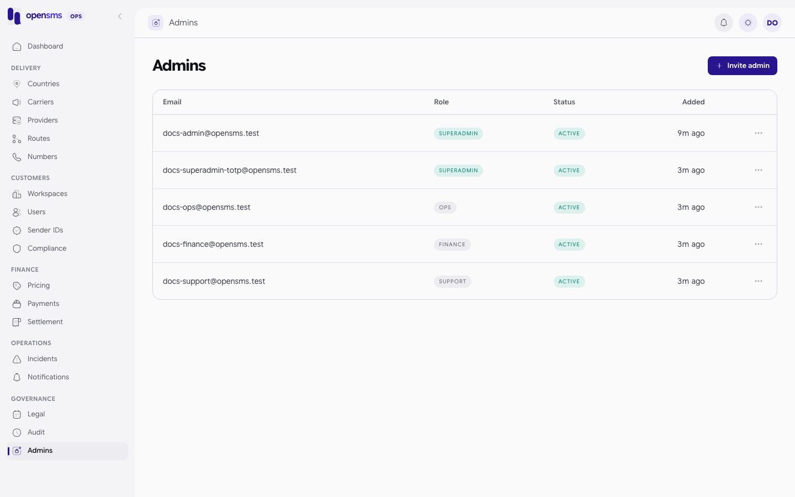

# Admins

The Admins page (`/admin/admins`) lists every operator account and lets a superadmin invite new operators and remove existing ones. It is for `superadmin` operators only. Inviting, revoking an invitation and removing also need an authenticator code entered on this session in the last ten minutes. To create the very first operator on a new installation, use the `opensms-admin` command instead (see [Getting access](getting-access.md)).



## The operator list

Each row shows the email, role, whether the account is active, whether it has an authenticator (`totp_enabled`, API only) and when it was added. Removed operators stay in the list as inactive so the history is kept. Passwords, authenticator secrets and invitation tokens are never returned.

```http
GET /admin/v1/admins
```

```json
200 [{"id":"536e0267-e321-403c-a670-169e37717df5","role":"superadmin","email":"docs-admin@opensms.test","active":true,"created_at":"2026-09-24T04:08:44.332569+00:00","totp_enabled":false},{"id":"88009eee-81d9-408d-bdc6-6d3667f72d4a","role":"superadmin","email":"docs-superadmin-totp@opensms.test","active":true,"created_at":"2026-09-24T04:14:02.84587+00:00","totp_enabled":true},{"id":"f345c647-7f37-4b91-863d-3332afbdcce3","role":"ops","email":"docs-ops@opensms.test","active":true,"created_at":"2026-09-24T04:14:02.942076+00:00","totp_enabled":false}]
```

(First three entries of the real response.) The list is capped at 1000 operators; above that the API answers `422` rather than returning a partial list.

## Invite an operator

The invitee must already have a customer account on opensms with a verified email and two-factor authentication turned on. Their authenticator becomes their operator authenticator when they accept.

1. Sign in again if your last code is more than ten minutes old.
2. Click **Invite admin**.
3. Enter the **Email** and choose the **Role** (`superadmin`, `ops`, `finance` or `support`).
4. Send.

> **Known issue.** The console's invite form sends only email and role. The API also requires a `reason` (5 to 1000 characters), so the form fails with `422 Valid email, role and reason required.` Invite through the API until the form is fixed.

API (real calls):

```http
POST /admin/v1/admins/invite
{"email":"docs-invitee-4579340623@opensms.test","role":"support","reason":"New support hire starting Monday"}
```

```json
201 {"delivery_status":"pending","email":"docs-invitee-4579340623@opensms.test","expires_at":"2026-09-25T07:22:21.866372+03:00","id":"ff8930ee-dcb2-4540-b88c-79feb77db8f9","role":"support"}
```

- `delivery_status: pending` means the invitation email is **queued**, not delivered or accepted. It goes out only when `OPENSMS_EMAIL_DELIVERY_ENABLED=true` and `OPENSMS_ADMIN_CONSOLE_URL` is set (both off on the docs stack, so nothing was sent).
- Invitations expire after 24 hours.
- A second invitation to someone who is already an operator or already invited returns `409 Active admin or pending invitation already exists.`
- Without a fresh code: `403 Current superadmin access and admin two-factor verification within ten minutes required.`

### Revoke an invitation

If the person should not join, or delivery is uncertain and you want to send a new one, revoke it first:

```http
DELETE /admin/v1/admins/invitations/ff8930ee-dcb2-4540-b88c-79feb77db8f9
{"reason":"Hire postponed"}
```

`204 No Content`. There is no console button for this. Like inviting, it needs a fresh authenticator code.

## Accepting an invitation

The email link opens `/admin/invitations/accept?token=...` or `/admin/invitations/decline?token=...` in the console. The invitee, signed in to their customer account, accepts with a current authenticator code (`POST /admin/v1/admins/invitations/accept` with `{token, code}`) or declines (`POST /admin/v1/admins/invitations/decline` with `{token}`). Acceptance signs them out everywhere. They then sign in at `/admin/login` with the same email and password and complete the operator code step.

> **Known issue.** The console has no accept or decline pages: those routes are not in the router, so the link lands on "not found". Invitations can only be completed through the API today. This was not exercised for these docs, because it needs the emailed token and email delivery is off.

## Remove an operator

1. Sign in again if your last code is more than ten minutes old.
2. Open the row menu and choose **Remove**.
3. Confirm.

Removal deactivates the operator at once: their sessions and pending invitations are revoked and they can no longer sign in. Their customer account and history are kept. You cannot remove yourself, and the last active superadmin cannot be removed (the console disables **Remove** for them).

> **Known issue.** The console sends the removal without the required JSON `{"reason": ...}` body, so it fails with `422 Removal reason required.` Remove through the API:

```http
DELETE /admin/v1/admins/11b9a7af-2dc1-455f-8f96-4b4ac7d15b3a
{"reason":"Contract ended, access no longer needed"}
```

`204 No Content` (real call on a throwaway operator). Afterwards the operator's login returns `401 Invalid admin credentials.` and the list shows them with `"active":false`.

Other responses: `404 Admin not found.` for an unknown ID, `409 Self removal is not permitted.`, and `409 The last active superadmin cannot be removed.`

## Changing someone's role

There is no role change. Remove the operator and invite them again with the new role.

## Related

- [Getting access](getting-access.md), [Audit log](audit-log.md), [README: roles](README.md#roles-and-what-each-can-do)
