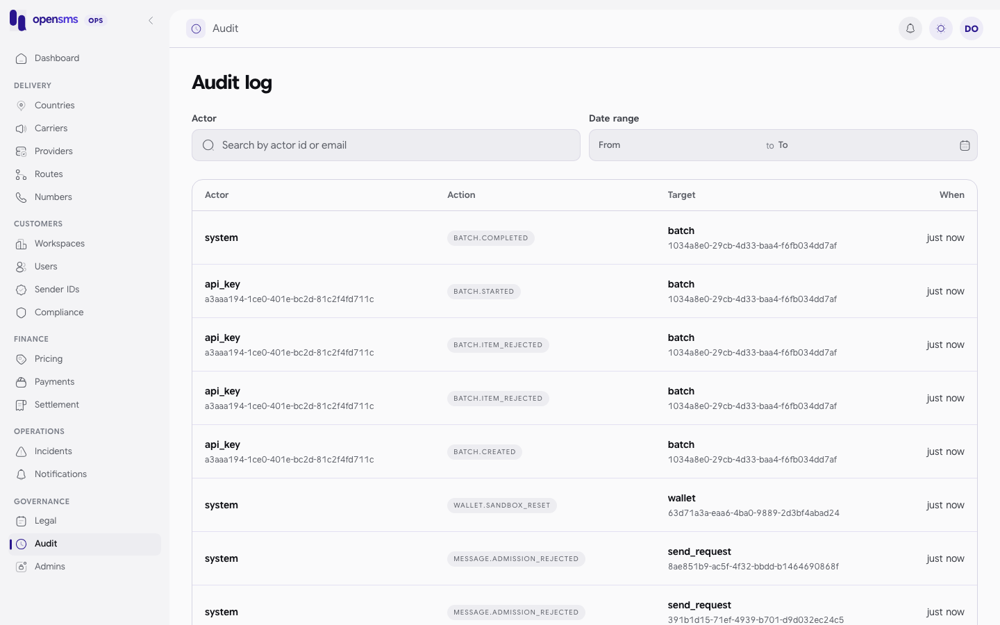

# Audit log

The audit log is the permanent record of who did what on the platform: customer actions, API key actions, system jobs and every operator decision in this console (document reviews, sender decisions, bans, price imports, route overrides and so on). The Audit page (`/admin/audit`) lets a superadmin search it. It is for `superadmin` operators only. Other roles get `403 Superadmin access required.`



## What each entry shows

| Field | Meaning |
|---|---|
| `actor_type` | `user` (customer), `api_key`, `admin` (operator) or `system`. |
| `actor_id` | The actor's ID, when it is a UUID. |
| `action` | What happened, for example `sender_id.platform_decision`, `sender.document_rejected`, `workspace.kyc_rejected`, `admin.operator_created`. |
| `target_type`, `target_id` | What it happened to. |
| `workspace_id` | The workspace it belongs to, if any. |
| `at` | When. Newest first. |

For privacy, the console API never returns the stored before/after values or the IP address: `before`, `after` and `ip` are always `null` in the response. The reasons operators type are stored in the log but are only visible in the pages where they apply (for example a user's access history).

## Search the log

1. Open **Audit**.
2. Filter by **Actor**: an exact actor ID (UUID) or an actor type (`admin`, `user`, `api_key`, `system`).
3. Pick a **Date range**. Both dates are whole UTC days and the end day is included.
4. Scroll and page through the results.

> **Known issue.** The Actor box says "Search by actor id or email", but the API only matches an exact actor ID or actor type. An email address returns no entries.

API: `GET /admin/v1/audit` with any of `actor`, `date_from`, `date_to` (both `YYYY-MM-DD`), `workspace_id`, `limit` and `cursor`. Any other parameter is refused:

```json
400 {"type":"about:blank","title":"Bad Request","status":400,"detail":"Invalid audit filters."}
```

### Example: everything that happened to one workspace (real call)

After the [sender ID review example](sender-ids.md#example-a-rejected-application-real-calls):

```http
GET /admin/v1/audit?limit=3&workspace_id=6d3b54e8-5b94-413b-847d-a05fe9b6901d
```

```json
200 {"items":[{"id":182,"actor_type":"system","actor_id":null,"workspace_id":"6d3b54e8-5b94-413b-847d-a05fe9b6901d","action":"wallet.sandbox_reset","target_type":"wallet","target_id":"946fec10-ac89-4372-b70d-88846238bf16","before":null,"after":null,"ip":null,"at":"2026-09-24T07:22:21.569578+03:00"},{"id":166,"actor_type":"admin","actor_id":"88009eee-81d9-408d-bdc6-6d3667f72d4a","workspace_id":"6d3b54e8-5b94-413b-847d-a05fe9b6901d","action":"sender_id.platform_decision","target_type":"sender_id","target_id":"74192aa4-9e4a-480a-bec1-d90d29213297","before":null,"after":null,"ip":null,"at":"2026-09-24T07:22:21.27106+03:00"},{"id":165,"actor_type":"admin","actor_id":"536e0267-e321-403c-a670-169e37717df5","workspace_id":"6d3b54e8-5b94-413b-847d-a05fe9b6901d","action":"sender.document_rejected","target_type":"sender_document","target_id":"8b904b7c-ea25-498e-b0af-68c8bcc31e7f","before":null,"after":null,"ip":null,"at":"2026-09-24T07:22:21.254109+03:00"}],"next_cursor":"eyJpZCI6IjE2NSIsImF0IjoiMjAyNi0wOS0yNFQwNzoyMjoyMS4yNTQxMDkrMDM6MDAiLCJjb2xsZWN0aW9uIjoiYWRtaW4tYXVkaXQ6NmQzYjU0ZTgtNWI5NC00MTNiLTg0N2QtYTA1ZmU5YjY5MDFkOjo6In0"}
```

Match `actor_id` against the [Admins](admins.md) list to see which operator acted.

## Related

- [Admins](admins.md), [Users](users.md), [Legal](legal.md)
