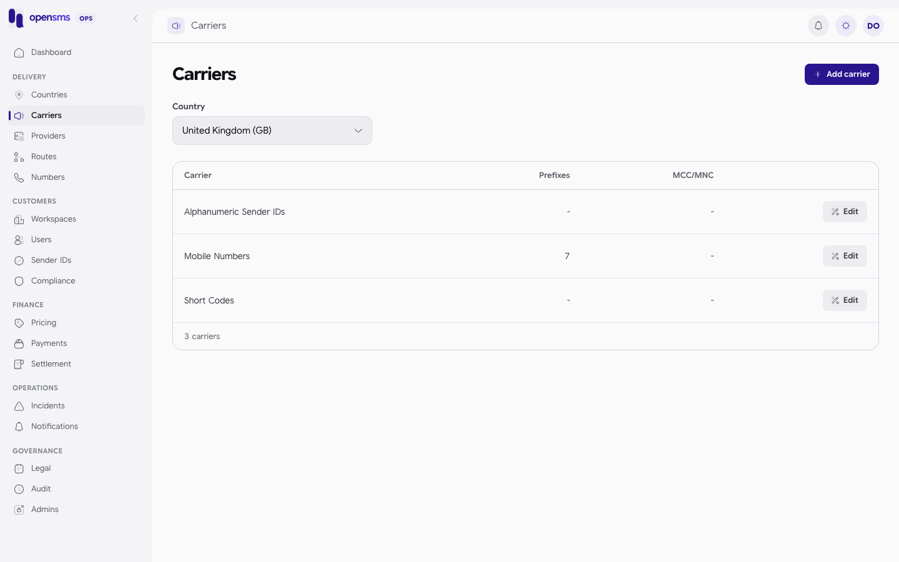

# Carriers

The Carriers page (`/admin/carriers`) lists the mobile networks inside each country, with the number prefixes and MCC/MNC codes used to recognise them. Routes and prices can target a single carrier instead of a whole country, so these records decide which network a phone number belongs to. The page is for `ops` and `superadmin` operators. Every role can read carriers through the API. Only ops and superadmin can add or edit them.



## Fields

| Field | Required | Rules |
|---|---|---|
| `country_id` | yes on create | The country the carrier belongs to. It can be changed on edit, unless the carrier has routes in its current country (`409 operator country conflicts with existing routes`). |
| `name` | yes | 1 to 200 characters, for example `Safaricom`. |
| `prefixes` | no | Up to 1000 digit strings (1 to 15 digits each), for example `254701`. Default `[]`. |
| `mcc_mnc` | no | Up to 1000 codes of 5 or 6 digits, for example `63902`. Default `[]`. |

## Add a carrier

1. Choose the **Country** at the top of the page. The list only shows that country's carriers.
2. Click **Add carrier**.
3. Enter the carrier name, prefixes (comma separated) and MCC/MNC codes (comma separated, digits only).
4. Save.

> **Known issue.** The MCC/MNC box's placeholder shows `639-02, 639-07`, but the API accepts digits only (5 or 6 per code). Typing codes in the placeholder's format fails with `400 invalid operator code`. Enter them as `63902, 63907`.

The same thing through the API (real call on the docs stack):

```http
POST /admin/v1/carriers

{"country_id":"a48b6a15-c567-4cd8-9c21-9936054b2c55","name":"Docs Carrier 4579340623","prefixes":[],"mcc_mnc":[]}
```

```json
201 {"country_id":"a48b6a15-c567-4cd8-9c21-9936054b2c55","id":"dedfcb88-05a0-47d9-bec6-329b4dcba37b","mcc_mnc":[],"name":"Docs Carrier 4579340623","prefixes":[]}
```

## Edit a carrier

1. Click **Edit** on the row.
2. Change the name, prefixes or codes and save. The console sends `PATCH /admin/v1/carriers/{id}` with the whole form (country, name, prefixes and codes).

```http
PATCH /admin/v1/carriers/dedfcb88-05a0-47d9-bec6-329b4dcba37b

{"name":"Docs Carrier 4579340623 (renamed)"}
```

```json
200 {"country_id":"a48b6a15-c567-4cd8-9c21-9936054b2c55","id":"dedfcb88-05a0-47d9-bec6-329b4dcba37b","mcc_mnc":[],"name":"Docs Carrier 4579340623 (renamed)","prefixes":[]}
```

Changes are transactional and audited. A `support` or `finance` operator gets `403 catalog changes require ops access`.

## Tips

- Adding a prefix changes which carrier a number resolves to. Check [Routes](routes.md) and [Pricing](pricing.md) for rules that target the carrier before you save.
- `GET /admin/v1/carriers?iso2=KE` filters by country (case-insensitive).

## Related

- [Countries](countries.md), [Routes](routes.md), [Pricing](pricing.md)
