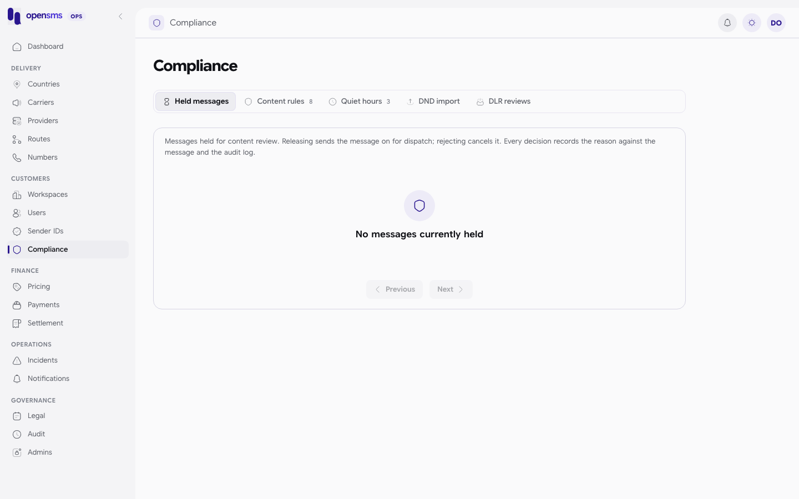
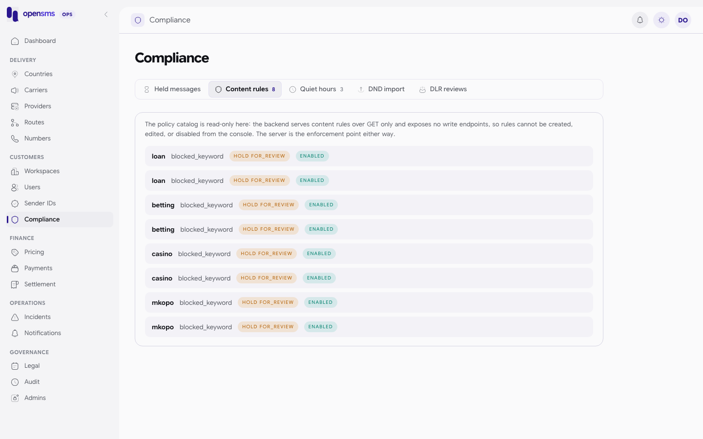
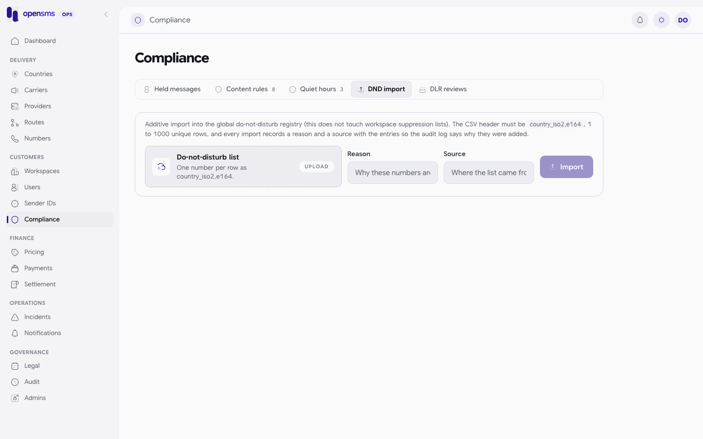

# Compliance

The Compliance page (`/admin/compliance`) is where operators handle messages that content rules held back for review, and see the policies that decide what gets held or delayed: content rules, quiet hours and the global do-not-disturb (DND) list. It also lists delivery receipt timeout reviews. It is for `ops` and `superadmin` operators. The other roles get `403` from these endpoints: `Operations access required.` on `/compliance/*`, `held message review requires operations access` on `/messages/held`, and `reconciliation requires operations access` on the DLR review and reconciliation lists.

Customer documents (KYC and sender ID evidence) are reviewed elsewhere: see [Workspaces](workspaces.md#review-kyc-documents) and [Sender IDs](sender-ids.md#review-an-application).



## Tabs

| Tab | What it shows | Can you change it here? |
|---|---|---|
| Held messages | Messages stopped by a `hold_for_review` content rule | Yes: release or reject each one |
| Content rules | Keyword and pattern rules per country and traffic type | No, read only |
| Quiet hours | Local-time windows when marketing is deferred | No, read only |
| DND import | Upload numbers into the global do-not-disturb registry | Yes: additive import |
| DLR reviews | Delivery receipts that timed out and need a look | No, read-only metadata |

## Review held messages

A message is held when its text matches an enabled content rule with action `hold_for_review` (for example the keyword `loan` for Kenya). Its wallet reservation stays in place while it waits.

1. Open the **Held messages** tab. The newest held messages are listed first.
2. Read the message text, sender, destination and the reason it was held.
3. Choose **Release** or **Reject**, write a reason and confirm.
   - **Release** checks the workspace, sender, route and reservation again, then queues the message for dispatch (`status: "queued"`), or schedules it (`"scheduled"`) if quiet hours or the customer's own schedule apply. Suppression lists, marketing DND and content *reject* rules cannot be overridden.
   - **Reject** fails the message (`status: "failed"`) and releases its reservation once.

API: `POST /admin/v1/messages/held/{id}/release` or `/reject` with `{"reason":"..."}` and an `Idempotency-Key` header. Use a new key for each review. The same key with the same body returns the original decision, a different body returns `409`. Lists: `GET /admin/v1/compliance/held-messages` (what the console uses) and `GET /admin/v1/messages/held`, both `{items, next_cursor}`.

**Not verified locally.** No message could be held on the docs stack: sandbox sending requires a verified email, and email delivery (which carries the verification code) is disabled. The queue was read (`{"items":[],"next_cursor":null}`) but release and reject were not run.

## Content rules and quiet hours



Both are read only in the console and the API (`GET` only). A real content rule:

```json
{"id":1,"kind":"blocked_keyword","action":"hold_for_review","enabled":true,"pattern":"loan","country_id":"a48b6a15-c567-4cd8-9c21-9936054b2c55","traffic_types":["marketing","transactional"]}
```

and the quiet hours on the docs stack:

```json
[{"enforce":"defer","end_local":"08:00:00","country_id":"2ded95a8-6cfb-4096-928a-f4cfd6997b86","start_local":"21:00:00","traffic_type":"marketing"},{"enforce":"defer","end_local":"08:00:00","country_id":"a48b6a15-c567-4cd8-9c21-9936054b2c55","start_local":"21:00:00","traffic_type":"marketing"},{"enforce":"defer","end_local":"08:00:00","country_id":"f9c1ab64-63de-4255-af05-43b3f9fd7e7f","start_local":"21:00:00","traffic_type":"marketing"}]
```

Quiet hours use each country's timezone from [Countries](countries.md). Marketing messages sent between 21:00 and 08:00 local time are deferred to the end of the window.

## Import numbers into the DND registry



The DND registry is global: a number on it cannot receive marketing from any workspace. Imports only add numbers. They never remove numbers, and they do not touch each workspace's own suppression list.

1. Prepare a CSV with the header `country_iso2,e164` and 1 to 1000 unique rows, for example:

   ```csv
   country_iso2,e164
   KE,+254712000001
   ```

   Each number must belong to the country named on its row (longest known dialling prefix).
2. Open the **DND import** tab and choose the file.
3. Enter a **Reason** (why these numbers are being added, 5 characters or more) and a **Source** (where the list came from, for example "regulator feed 2026-09").
4. Click **Import**.

API: `POST /admin/v1/compliance/dnd/import` as multipart with `file`, `reason` and `source`, plus an `Idempotency-Key` header. The body is limited to 1 MiB. A country mismatch returns `422`, a reused key with a different file `409`.

**Not run for these docs.** The registry is shared by every workspace on the docs stack, and entries cannot be removed, so no numbers were imported.

## DLR reviews

Messages whose delivery receipt never arrived within the route's timeout are listed here (`GET /admin/v1/reconciliation/dlr-reviews`). Reviewing is read only: it never changes delivery state, retries or charges. The related reconciliation lists for unresolved attempts and receipts are at `GET /admin/v1/reconciliation/attempts` and `/receipts` (API only).

## Broker dead letters (API only)

When a background event handler gives up on an event after its retries, the delivery lands in the broker's dead-letter list. There is no console page for it. `ops` and `superadmin` can read it; other roles get `403 Operations access required.`

```http
GET /admin/v1/broker/dead-letters
```

Real entry from the docs stack (the response is `{items, next_cursor}`):

```json
{"event":"message.created","reason":"handler_failed","attempts":10,"consumer":"opensms-business","event_id":"82ca0806-2118-4aec-95c6-273f37a0e2cc","created_at":"2026-09-24T05:40:52.605103+00:00","generation":0,"environment":"sandbox","workspace_id":"26025884-f934-4e11-89b5-cdff81a3fd1f"}
```

To retry one, `POST /admin/v1/broker/dead-letters/{event_id}/replay` with `{"workspace_id","environment","generation","reason"}` and an `Idempotency-Key`. It needs an ops or superadmin operator with an authenticator code entered in the last ten minutes (an operator with no authenticator gets `403 Current operations session required.`; one whose last code is more than ten minutes old gets `403 Recent operations two-factor session required.`). A new request answers `202 {"replay_id":"..."}`, a repeat with the same key `200` with the same ID, and a changed `generation` `409 Dead-letter generation changed.` A successful replay was not run for these docs, because the docs operator has no authenticator.

## Related

- [Routes](routes.md): the DLR timeout per route.
- [Countries](countries.md): timezones and STOP keywords.
- [Workspaces](workspaces.md) and [Sender IDs](sender-ids.md): document review.
