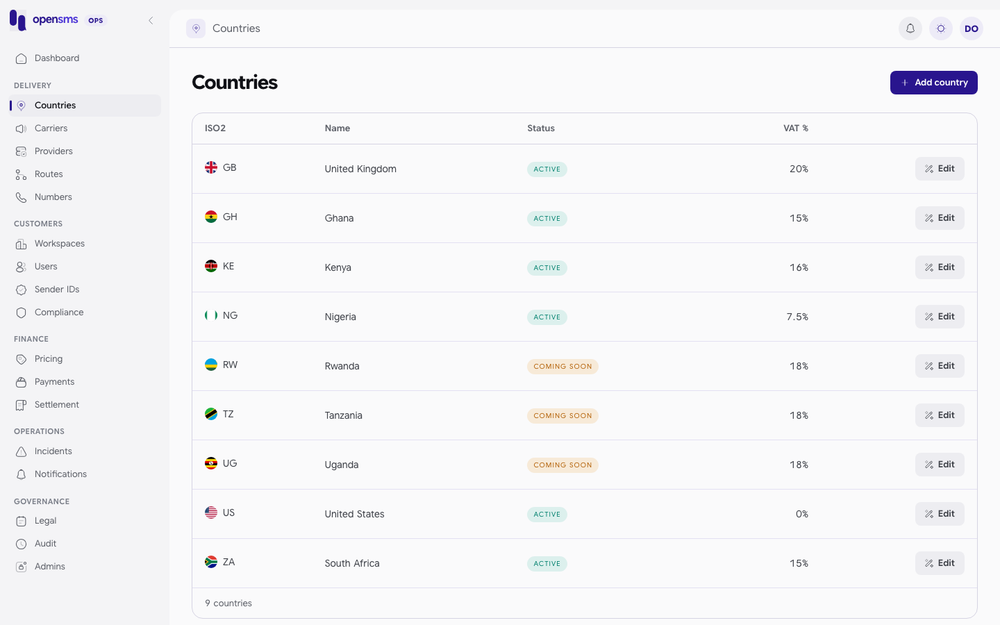

# Countries

The Countries page (`/admin/countries`) is the list of markets opensms knows about. For each one it holds the dial code, currency, timezone, VAT rate, default markups, STOP keywords and launch status. It is for `ops` and `superadmin` operators who open a new market or change a market's tax or launch status. Every role can read the list through the API. Only ops and superadmin can create or edit.



## Launch status

| Status | Meaning |
|---|---|
| `active` | Open for sending. Listed in the public catalogue (`GET /v1/countries`) that customers and the [Dashboard](dashboard.md) use. |
| `coming_soon` | Shown in the console but not in the public catalogue. This is the default for a new country. |
| `disabled` | Closed. Customers cannot choose it for sender ID applications. |

## Fields

| Field | Required | Rules |
|---|---|---|
| `iso2` | yes | Two uppercase letters, for example `KE`. |
| `name` | yes | 1 to 200 characters. |
| `dial_code` | yes | `+` followed by 1 to 4 digits, for example `+254`. |
| `currency` | yes | Three uppercase letters, for example `KES`. |
| `timezone` | yes | A valid IANA timezone, for example `Africa/Nairobi`. Used for quiet hours. |
| `vat_percent` | no | 0 to 100, at most two decimal places, as a number or decimal string. Default 0. |
| `default_percent_markup` | no | Below 1000, at most three decimal places. Default 15. |
| `default_fixed_markup` | no | Default 0. |
| `portability` | no | `true` when numbers can move between networks. Default `false`. |
| `lookup_unavailable_policy` | no | `reject` (default) refuses sending when a verified portability lookup is missing. `country_routes_only` lets the message use country-wide routes only. |
| `stop_keywords` | no | Default `["STOP","UNSUBSCRIBE","END"]`. |
| `status` | no | `active`, `coming_soon` (default) or `disabled`. |

## Add a country

1. Click **Add country**.
2. Fill in ISO2, name, dial code, currency, VAT % and status.
3. Save. The new country appears in the list.

> **Known issue.** The **Add country** form has no timezone field, but the API requires one. Saving from the form fails with `A valid IANA timezone is required.` Until the form is fixed, create countries through the API:

```http
POST /admin/v1/countries
Authorization: Bearer <ops or superadmin session>

{"iso2":"RW","name":"Rwanda","dial_code":"+250","currency":"RWF","timezone":"Africa/Kigali","vat_percent":"18","status":"coming_soon"}
```

This is what the API does when the timezone is missing (real response):

```json
400 {"type":"about:blank","title":"Bad Request","status":400,"detail":"A valid IANA timezone is required."}
```

and when the ISO2 code is lowercase and the dial code has no `+`:

```json
400 {"type":"about:blank","title":"Bad Request","status":400,"detail":"Country requires ISO2, name, numeric dial_code and currency."}
```

A successful create returns `201` with the stored country. No live create example is published because the docs stack is shared, and a new country would appear in other guides' screenshots.

## Edit a country

1. Click **Edit** on the row.
2. Change the fields you need and save. The console sends `PATCH /admin/v1/countries/{id}` with the whole form (ISO2, name, dial code, currency, VAT % and status), not only what changed. Fields the form does not show (timezone, markups, portability, lookup policy, STOP keywords) are left as they are.

ISO2, dial code and currency cannot change after creation. Editing any of them returns `409 Country ISO2, dial code and currency are immutable; create a separate country entry for a new identity.`

Every change is written to the [audit log](audit-log.md). Unknown fields are rejected with `Unsupported country field: <name>`.

## Reading the list through the API

`GET /admin/v1/countries` returns a bare array. A trimmed real entry:

```json
{"id":"a48b6a15-c567-4cd8-9c21-9936054b2c55","iso2":"KE","name":"Kenya","status":"active","currency":"KES","timezone":"Africa/Nairobi","dial_code":"+254","portability":false,"vat_percent":16,"stop_keywords":["STOP","UNSUBSCRIBE","END"],"default_fixed_markup":0,"default_percent_markup":15,"lookup_unavailable_policy":"reject"}
```

## Related

- [Carriers](carriers.md): networks inside a country.
- [Routes](routes.md): which provider delivers to a country.
- [Pricing](pricing.md): what customers pay per country.
- [Compliance](compliance.md): quiet hours use the country timezone.
