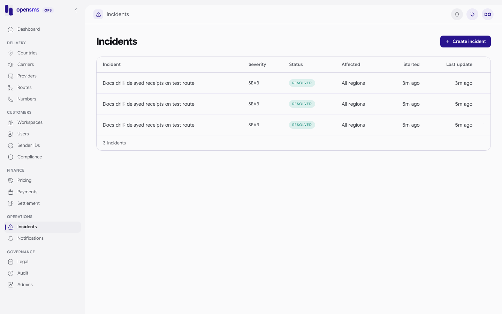
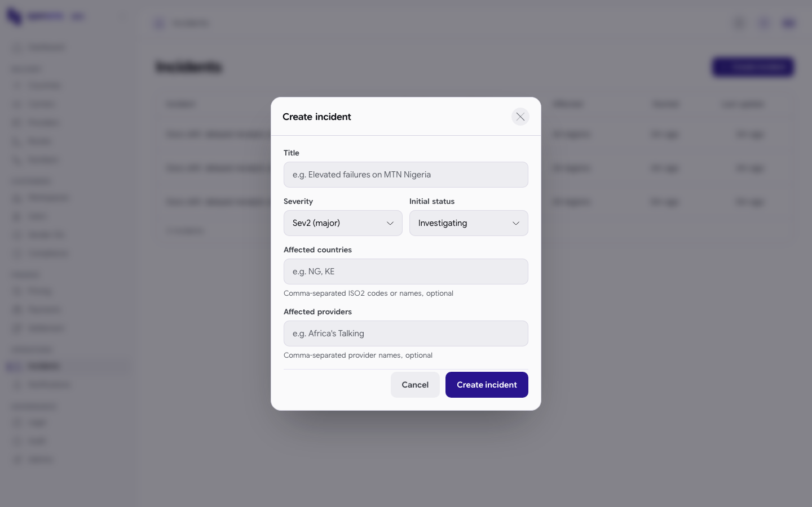

# Incidents

An incident is a public notice about a service problem, such as delayed receipts or failures on one network. It is shown on the public status page while it is open. The Incidents page (`/admin/incidents`) lists incidents and their updates. It is for `ops` and `superadmin` operators. Other roles get `403 Operations access required.`



## Lifecycle

| Status | Meaning |
|---|---|
| `investigating` | Something is wrong and you are looking into it. |
| `identified` | You know the cause. |
| `monitoring` | A fix is in and you are watching. |
| `resolved` | Over. Leaves the public status page. **Cannot be changed or reopened.** |

Severity is `sev1` (critical), `sev2` (major) or `sev3` (minor). An incident can name affected countries and providers.

What is public and what is private:

- `title`, `severity`, `status` and each update's `body` appear on the status page while the incident is not resolved. Write them for customers.
- `reason` is required on every create and change, and goes only to the [audit log](audit-log.md).

## Known issue: the console forms do not save

> The **Create incident** dialog, the **Post an update** box and the status buttons on this page send requests the API refuses. They leave out the required `reason` (and, for create, the public `body`), and they send fields the server owns (`started_at`, `resolved_at`, `updates`). Every one of them gets:
>
> ```json
> 400 {"type":"about:blank","title":"Bad Request","status":400,"detail":"Provide bounded incident fields, reason and Idempotency-Key."}
> ```
>
> This was checked on the docs stack with the same payloads the console sends. Until it is fixed, publish and update incidents through the API as shown below. The page still works for reading incidents and their updates.



## Publish an incident (API)

1. Send the incident with a first public update in `body`, and a private `reason`. Use a new `Idempotency-Key`:

   ```http
   POST /admin/v1/incidents
   Idempotency-Key: docs-incident-4579340623

   {"title":"Docs drill: delayed receipts on test route","severity":"sev3","status":"investigating","body":"We are investigating delayed delivery receipts.","reason":"Documentation drill, resolved immediately"}
   ```

   ```json
   201 {"id":"a02ce1a4-cdb3-497c-a52d-c0502e080ada","title":"Docs drill: delayed receipts on test route","status":"investigating","updates":[{"at":"2026-09-24T04:22:21.703482+00:00","id":3,"body":"We are investigating delayed delivery receipts.","incident_id":"a02ce1a4-cdb3-497c-a52d-c0502e080ada"}],"severity":"sev3","started_at":"2026-09-24T04:22:21.703482+00:00","country_ids":[],"resolved_at":null,"provider_ids":[]}
   ```

   Sending the same request with the same key returns the same incident instead of creating a second one. Optional: `country_ids` and `provider_ids` (UUIDs, up to 100 each). An unknown ID returns `422`.

2. Post updates and move the status with `PATCH /admin/v1/incidents/{id}`. Each call needs a `reason` and its own `Idempotency-Key`. Add `body` to append a public update, and `status`, `severity`, `title` or the affected lists to change them.

3. Resolve it:

   ```http
   PATCH /admin/v1/incidents/a02ce1a4-cdb3-497c-a52d-c0502e080ada
   Idempotency-Key: docs-incident-4579340623-r

   {"status":"resolved","body":"Receipts are flowing normally again.","reason":"Drill complete"}
   ```

   ```json
   200 {"id":"a02ce1a4-cdb3-497c-a52d-c0502e080ada","title":"Docs drill: delayed receipts on test route","status":"resolved","updates":[{"at":"2026-09-24T04:22:21.703482+00:00","id":3,"body":"We are investigating delayed delivery receipts.","incident_id":"a02ce1a4-cdb3-497c-a52d-c0502e080ada"},{"at":"2026-09-24T04:22:21.713183+00:00","id":4,"body":"Receipts are flowing normally again.","incident_id":"a02ce1a4-cdb3-497c-a52d-c0502e080ada"}],"severity":"sev3","started_at":"2026-09-24T04:22:21.703482+00:00","country_ids":[],"resolved_at":"2026-09-24T04:22:21.713183+00:00","provider_ids":[]}
   ```

4. After that the incident is frozen:

   ```json
   409 {"type":"about:blank","title":"Conflict","status":409,"detail":"Incident transition is not allowed; resolved history cannot be reopened."}
   ```

   If the problem comes back, open a new incident.

The server sets `started_at`, `resolved_at` and every update's time and ID. `GET /admin/v1/incidents` returns up to 200 incidents, each with its latest 100 updates.

## Tips

- Pair an incident with a route health override when a provider is down: see [Routes](routes.md#pin-or-release-route-health-during-an-incident).
- Resolve the drill or test incidents you create right away, because open incidents are public.

## Related

- [Routes](routes.md), [Providers](providers.md), [Notifications](notifications.md)
