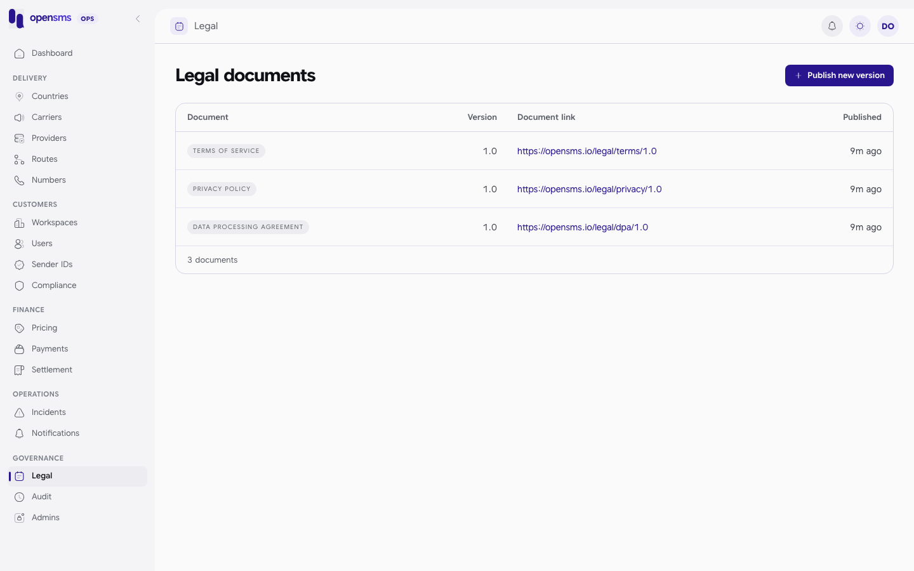

# Legal documents

The Legal page (`/admin/legal`) lists the versions of the three documents customers must accept: the terms of service, the privacy policy and the data processing agreement (DPA). A superadmin publishes a new version here when the lawyers change a document. Customers are then asked to accept it, and live-access decisions check that an owner accepted the **current** terms and DPA. This page is for `superadmin` operators only. Other roles get `403 Superadmin access required.`



## What a version is

| Field | Rules |
|---|---|
| `kind` | `terms`, `privacy` or `dpa`. |
| `version` | 1 to 128 characters, for example `2026-10-01` or `v2`. A kind and version pair can only be published once. |
| `url` | Where the document lives. Must be HTTPS with no user info, query or fragment. opensms does not fetch it. |
| `reason` | Why you are publishing (3 to 1000 characters). Goes to the audit log. |
| `published_at` | Optional. Set by the server; if you send one it must be within five minutes of now. |

Versions are immutable. You cannot edit or delete one. To fix a mistake, publish a new version.

## What publishing does to customers

- The newest published `terms` and `dpa` become the ones that count. A workspace owner who accepted the previous version has not accepted the new one.
- Operators cannot approve live access (see [Workspaces](workspaces.md#decide-a-live-access-request)) until an owner has accepted the current terms and DPA.
- Publish at a planned time and tell customers first.

## Publish a new version

1. Put the new document at its final HTTPS URL.
2. On **Legal**, click **Publish new version**.
3. Choose the **Document type**, enter the **Version** and the **Document URL**.
4. Publish.

> **Known issue.** The console's publish form sends no `reason`, and the API requires one, so publishing from the console fails with `400 Kind, version, trusted HTTPS URL and publication reason are required.` Publish through the API instead:
>
> ```http
> POST /admin/v1/legal
> {"kind":"terms","version":"2026-10-01","url":"https://opensms.io/legal/terms/2026-10-01","reason":"Annual terms update approved by legal"}
> ```
>
> A successful call returns `201` with `id`, `kind`, `version`, `url` and `published_at`.

Real responses from the docs stack:

- Without a reason (as the console sends it):

  ```json
  400 {"type":"about:blank","title":"Bad Request","status":400,"detail":"Kind, version, trusted HTTPS URL and publication reason are required."}
  ```

- Republishing an existing version:

  ```json
  409 {"type":"about:blank","title":"Conflict","status":409,"detail":"That legal version already exists and is immutable."}
  ```

No new version was published for these docs. Every workspace on the shared docs stack would have had to accept it again, which would have broken the other guides.

## List versions

`GET /admin/v1/legal` returns the newest 200 versions, newest first (real response):

```json
[{"id":"ddad007d-0ac9-4823-b083-d2965a7af750","kind":"dpa","version":"1.0","url":"https://opensms.io/legal/dpa/1.0","published_at":"2026-09-24T07:08:21.163602+03:00"},{"id":"30ca7041-ca82-4eaa-94ea-422969ca10ca","kind":"privacy","version":"1.0","url":"https://opensms.io/legal/privacy/1.0","published_at":"2026-09-24T07:08:21.163602+03:00"},{"id":"1d1ef5b2-dfa8-45dd-a3b0-83bdc600c08f","kind":"terms","version":"1.0","url":"https://opensms.io/legal/terms/1.0","published_at":"2026-09-24T07:08:21.163602+03:00"}]
```

## Related

- [Workspaces](workspaces.md), [Audit log](audit-log.md)
