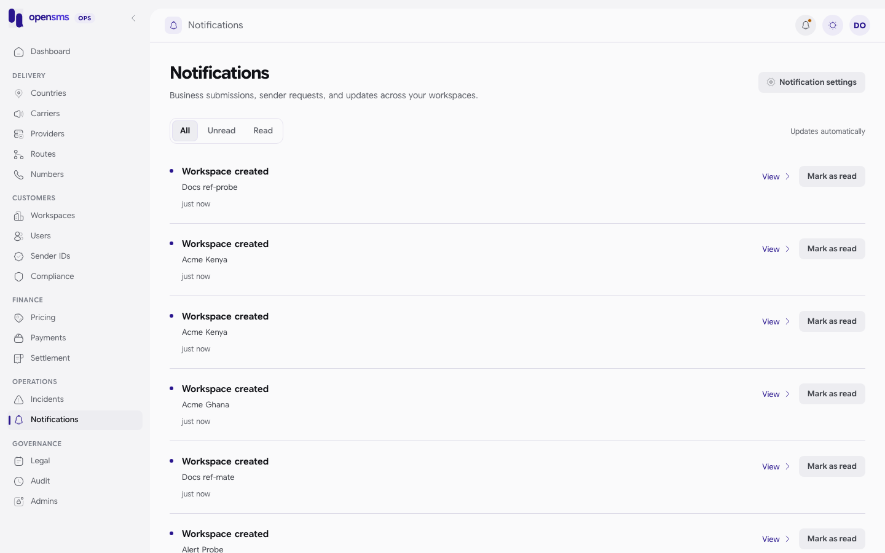
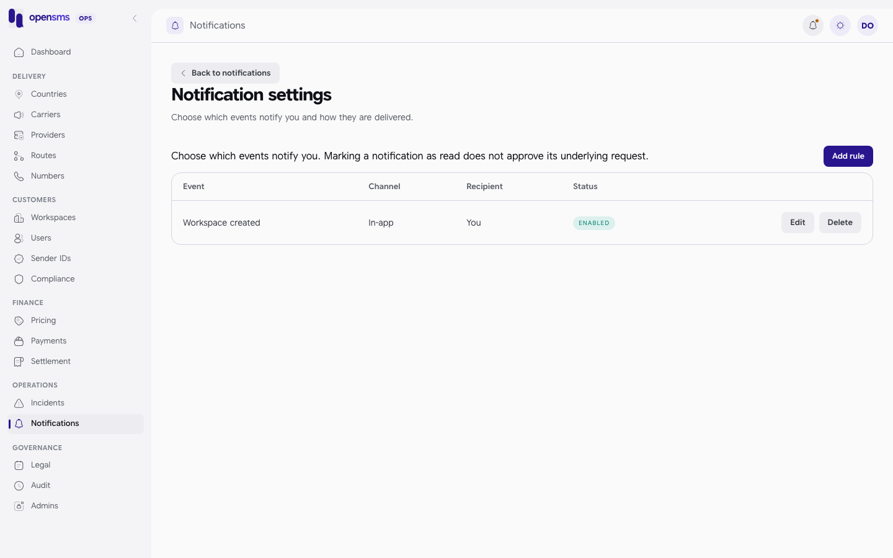

# Notifications and alerts

The Notifications page (`/admin/alerts`, **Notifications** in the rail) is each operator's personal inbox of platform events, such as a new workspace, a sender ID request, documents waiting for review, a route going down or a manual payment waiting for approval. **Notification settings** on the same page holds the alert rules that decide which events reach which operator, and through which channel (in-app, email, SMS or Slack). It is for `ops`, `finance` and `superadmin` operators. `support` has no notifications (`403 Operations access required.`).



## Events and who can receive them

| Event | Meaning | Roles |
|---|---|---|
| `workspace.created` | A customer signed up | superadmin, ops |
| `onboarding.company_submitted` | Company details waiting for review | superadmin, ops |
| `onboarding.document_uploaded`, `onboarding.documents_submitted` | KYC documents uploaded or complete | superadmin, ops |
| `onboarding.document_scan_failed`, `sender.document_scan_failed` | A document failed the malware scan | superadmin, ops |
| `sender.document_uploaded` | Sender evidence uploaded | superadmin, ops |
| `sender_id.requested`, `sender_id.resubmitted` | A sender ID application arrived | superadmin, ops |
| `sender_id.approved`, `sender_id.rejected` | A sender decision was made | superadmin, ops |
| `workspace.kyc_approved`, `workspace.kyc_rejected` | A KYC decision was made | superadmin, ops |
| `onboarding.live_requested` | A workspace asked for live access | superadmin, ops |
| `route.down`, `route.degraded`, `route.recovered` | Route health changed | superadmin, ops |
| `webhook.disabled` | A customer webhook was switched off | superadmin, ops |
| `provider.balance_low` | A provider account fell below its threshold | superadmin, ops, finance |
| `wallet.low_balance`, `spend_cap.warning`, `spend_cap.reached` | Customer wallet and spend cap events | superadmin, ops, finance |
| `payment.awaiting_approval` | A manual bank transfer needs a decision | superadmin, finance |

`GET /admin/v1/alerts/catalog` returns the events your role may use, the channels switched on for this installation, and your own operator ID:

```json
200 {"channels":["in_app","email"],"current_admin_id":"536e0267-e321-403c-a670-169e37717df5","email_events":["onboarding.company_submitted","onboarding.document_uploaded","onboarding.documents_submitted","onboarding.live_requested","payment.awaiting_approval","provider.balance_low","route.degraded","route.down","route.recovered","sender_id.approved","sender_id.rejected","sender_id.requested","sender_id.resubmitted","spend_cap.reached","spend_cap.warning","wallet.low_balance","webhook.disabled","workspace.created","workspace.kyc_approved","workspace.kyc_rejected"],"events":{"onboarding.company_submitted":"Company details awaiting review","onboarding.document_scan_failed":"Verification document scan failed","onboarding.document_uploaded":"Verification document uploaded","onboarding.documents_submitted":"Verification documents awaiting review","onboarding.live_requested":"Workspace requested live access","payment.awaiting_approval":"Manual payment awaiting approval","provider.balance_low":"Provider reported balance low","route.degraded":"Route degraded","route.down":"Route down","route.recovered":"Route recovered","sender.document_scan_failed":"Sender document scan failed","sender.document_uploaded":"Sender document uploaded","sender_id.approved":"Sender ID approved","sender_id.rejected":"Sender ID rejected","sender_id.requested":"Sender ID requested","sender_id.resubmitted":"Sender ID resubmitted","spend_cap.reached":"Workspace spend cap reached","spend_cap.warning":"Workspace spend threshold reached","wallet.low_balance":"Workspace wallet low","webhook.disabled":"Webhook disabled","workspace.created":"Workspace created","workspace.kyc_approved":"Workspace KYC approved","workspace.kyc_rejected":"Workspace KYC rejected"},"target":"active admin UUID with permission for the selected event; email requires a linked verified email; SMS requires a linked verified phone"}
```

This is a superadmin's catalog. The two scan-failure events and `sender.document_uploaded` have no email template, so they are in-app only.

## Channels

| Channel | Needs | Status |
|---|---|---|
| `in_app` | Nothing | Always available. |
| `email` | A verified email on the recipient's linked account, an event from `email_events`, and `OPENSMS_EMAIL_DELIVERY_ENABLED=true` for delivery | Available in the console. Delivery is off on the docs stack. |
| `sms` | `OPENSMS_ADMIN_SMS_ALERTS_ENABLED=true`, live dispatch, a service workspace key and sender, a daily limit, and a verified phone on the recipient's account | Off by default. API only: the console only offers in-app and email. |
| `slack` | `OPENSMS_ADMIN_SLACK_ALERTS_ENABLED=true` and a Slack destination owned by the recipient | Off by default. API only. |

Channels that are not switched on do not appear in the catalog, and rules for them are refused with `422`.

## Read your inbox

1. Open **Notifications**. The bell in the header shows a dot when you have unread items.
2. Use the **All**, **Unread** and **Read** tabs to filter. The list updates by itself.
3. Click **View** to open the workspace or item behind the notification.
4. Click **Mark as read** when you have dealt with it. Marking as read does not approve anything.

Notifications hold only a fixed event label and references. Customer message text, documents and balances are never copied into them.

API: `GET /admin/v1/alerts/inbox?status=unacknowledged&limit=50` returns `{items, next_cursor}` for you only. `POST /admin/v1/alerts/inbox/{id}/ack` marks one as read (real response):

```json
200 {"id":"be1c937d-4be1-4026-9eeb-708d6b881794","event":"workspace.created","title":"workspace.created","channel":"in_app","rule_id":"0fd537c4-8c75-4910-bd71-e26cabdcd084","created_at":"2026-09-24T04:31:44.561683+00:00","source_key":"outbox:a2ded21d-1263-478d-b8f4-fbd368f93095","admin_user_id":"536e0267-e321-403c-a670-169e37717df5","acknowledged_at":"2026-09-24T04:31:46.438934+00:00"}
```

## Set up a notification rule



1. On **Notifications**, click **Notification settings**.
2. Click **Add rule**.
3. Pick the **Event** and the **Delivery** channel (In-app or Email), tick **Enabled**, and write a **Reason** (5 to 1000 characters).
4. Save. The rule appears in the table with its recipient ("You").

A rule only fires for events that happen **after** it was saved or last edited. Nothing is sent retroactively. Deliveries appeared in the inbox within a few seconds on the docs stack.

Through the API, you can also target another operator (superadmin only) by putting their operator ID in `target`. Real calls:

```http
POST /admin/v1/alerts
{"event":"workspace.created","channel":"in_app","target":"536e0267-e321-403c-a670-169e37717df5","enabled":true,"reason":"Watch new customer sign-ups"}
```

```json
201 {"id":"4325fe12-319a-4887-8ca9-eb2f6c318ccc","event":"workspace.created","target":"536e0267-e321-403c-a670-169e37717df5","channel":"in_app","enabled":true,"created_at":"2026-09-24T04:40:25.010888+00:00","deleted_at":null,"updated_at":"2026-09-24T04:40:25.010888+00:00","slack_destination_id":null}
```

An email rule for an operator without a verified email is refused:

```json
422 {"type":"about:blank","title":"Unprocessable Entity","status":422,"detail":"Target must have event permission and an active linked user with a verified address for the selected external channel."}
```

- **Edit** a rule: `PATCH /admin/v1/alerts/{id}` with the full `{event, channel, target, enabled, reason}`. This resets the "only newer events" cut-off.
- **Delete** a rule: **Delete** in the table, or `DELETE /admin/v1/alerts/{id}` with `{"reason":"..."}` (answers `204`). Notifications already delivered stay in the inbox.
- Rule creation has no idempotency key, so do not retry a `POST` blindly: check the list first.

## Slack destinations (API only)

With Slack switched on, each operator registers their own Slack incoming webhook at `/admin/v1/alerts/slack-destinations` (`GET`, `POST`, `PATCH`, `DELETE`). The webhook URL is a secret: it is encrypted and never returned. Only `https://hooks.slack.com` URLs are accepted, and creating one sends no message. Changes need a fresh authenticator code and the destination's current `version` (a stale version returns `409`). A superadmin can manage another operator's destination. Not exercised for these docs: Slack is off on the docs stack.

## Related

- [Workspaces](workspaces.md), [Sender IDs](sender-ids.md), [Payments](payments.md), [Routes](routes.md): where you act on what a notification tells you.
