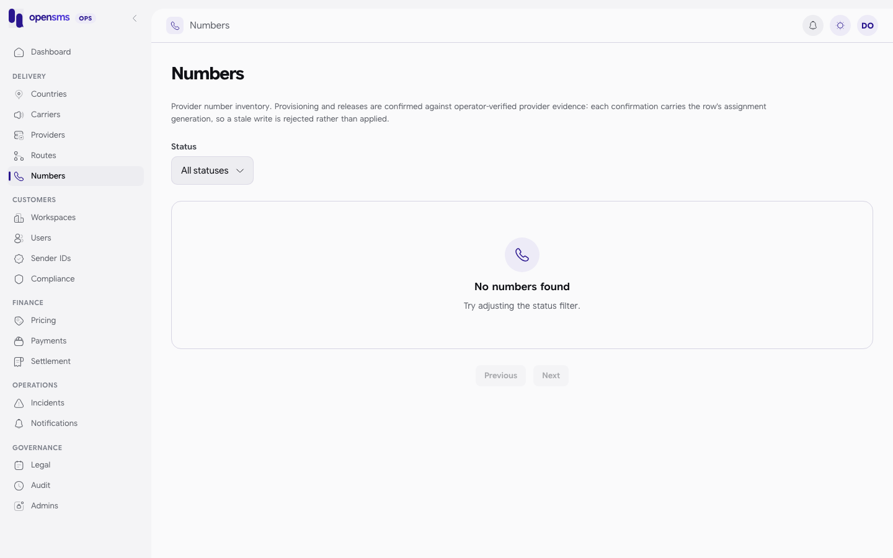

# Numbers

The Numbers page (`/admin/numbers`) is the inventory of phone numbers opensms rents from providers and assigns to customer workspaces for two-way messaging. Operators use it to record, with evidence, that a provider really gave us a number or really took one back. It is for `ops` and `superadmin` operators (both confirmations) and `finance` operators (release confirmations). `finance` can also read the inventory. `support` cannot use it at all. The console page itself only admits `ops` and `superadmin`, so `finance` sees **Not authorized** there and records release confirmations through the API.

## Why confirmations exist

opensms does not call provider APIs to provision or release numbers. Instead an operator checks the provider's portal or statement and records what they saw. Each confirmation carries the number's **assignment generation**, a counter that goes up whenever the number's status, owner or assignment changes. If someone else changed the number since you loaded the page, your stale generation is rejected with `409` instead of overwriting their work.

## Statuses

| Status | Meaning |
|---|---|
| `available` | In inventory and assignable to a customer. |
| `assigned` | Owned by a workspace. |
| `releasing` | The customer released it, or it expired. It cannot be assigned until the provider release is confirmed and then a fresh provisioning is confirmed. |

Filter by status with the **Status** menu (`GET /admin/v1/numbers?status=releasing`). Lists return up to 100 per page with a cursor.

## Confirm that a provider released a number

Use this after a customer releases a number and you have checked that the provider no longer bills us for it.

1. Filter by **Releasing** and open the number's confirm action.
2. Check the **Assignment generation** and **Workspace ID** that are prefilled from the row.
3. Enter a **Reason** and a **Provider evidence reference** (for example a ticket or statement ID), each at least 5 characters.
4. Confirm.

The number keeps its `releasing` status (it is not assignable yet), its owner and billing dates are cleared, and `provider_released_at` is set. A `number.released` event is sent to the workspace.

API: `POST /admin/v1/numbers/{id}/confirm-release` with `assignment_generation`, `workspace_id`, `reason`, `provider_evidence_reference` and an `Idempotency-Key` header.

## Confirm fresh provisioning

Use this to put a released number back into stock after you have verified the provider has it active again, and what it can do.

1. Open the number's provision action.
2. Tick **Inbound capable** and/or **Outbound capable** (at least one).
3. Enter the reason and a provider evidence reference that has never been used for this number before.
4. Confirm. The number becomes `available`. It is not assigned to anyone and the next customer still pays the normal fee.

The provider must be `active` with an enabled route in the number's country, and outbound needs a provider that supports numeric senders.

API: `POST /admin/v1/numbers/{id}/confirm-provision` with `assignment_generation`, `inbound`, `outbound`, `reason`, `provider_evidence_reference` and an `Idempotency-Key` header.

## Requirements

Both confirmations need an operator with an authenticator who entered a code in the last ten minutes (see [Getting access](getting-access.md#refresh-the-ten-minute-window)). Repeating the exact same request returns the original result. The same key with different data returns `409`.

## Not verified locally

The docs stack has no numbers in inventory (`GET /admin/v1/numbers` returns `{"items":[],"next_cursor":""}`). Numbers only appear once a customer buys one, and that needs a live provider and payment, which the docs stack cannot do. So neither confirmation was run for these docs.

## Related

- [Workspaces](workspaces.md): the number's owner.
- [Payments](payments.md): number charge refunds go through `POST /admin/v1/workspaces/{id}/number-refunds` (finance).
