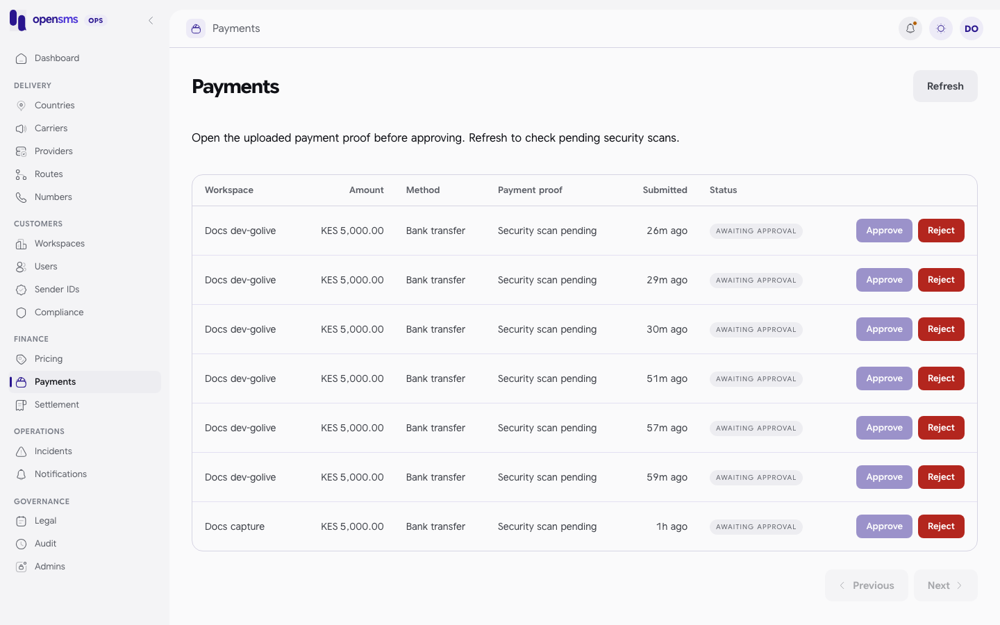

# Payments

The Payments page (`/admin/payments`) is the finance queue for manual bank transfers. A customer pays by bank transfer, uploads proof, and a finance operator checks the bank statement and approves or rejects it. Approval is the only supported way to credit a wallet by hand. This page also covers **payment reviews**, which are Paystack refunds and disputes that need a finance finding, and reversals. It is for `finance` and `superadmin` operators. Other roles get `403`.



## Manual bank transfers

### How a transfer arrives

1. A workspace owner, admin or finance member with two-factor turned on uploads proof (PDF, PNG or JPEG, up to 10 MiB) with the amount and currency (`POST /v1/wallet/topups/manual` with `X-Environment: live`). The transfer always funds the workspace's **live** wallet, but the workspace itself can still be in sandbox: funding the live wallet is one of the steps before it asks for live access.
2. The proof is scanned for malware and the payment waits in `awaiting_approval`. No money is credited yet.
3. An operator with a `payment.awaiting_approval` [notification rule](notifications.md) is told about it.

Only live `manual_bank` payments are in this queue. Sandbox and card payments are not.

### Approve or reject

1. Open **Payments**. Click **Refresh** to pick up proofs whose scan has finished.
2. Click **Open proof** to download the file. The download is recorded. **Approve** stays disabled until you have opened a proof whose scan is clean.
3. Compare it with the bank statement: amount, currency, reference and payer.
4. Click **Approve** and enter why the proof matches (for example "Bank receipt matched"), or **Reject** with the reason.

What happens:

- **Approve** credits the workspace's live wallet once, for exactly the stored amount and currency. You cannot change the amount. It also completes the "wallet funded" onboarding step.
- **Reject** marks the payment failed. Nothing is credited.
- Both write an audit entry with your name and reason, and a payment event.

API: `POST /admin/v1/payments/{id}/approve` or `/reject` with `{"reason":"..."}` (up to 1000 bytes) and an `Idempotency-Key` header (up to 200 bytes). Repeating the same key, action and reason returns the recorded result; a different decision or key returns `409`. `GET /admin/v1/payments` lists the queue (`limit`, `cursor`, optional `workspace_id`), `GET /admin/v1/payments/{id}` shows one, and `GET /admin/v1/payments/{id}/proof` downloads the proof.

opensms does not check the bank for you. Approve only after you have seen the money arrive.

### On the docs stack

Manual transfers can be submitted on the docs stack (the [developer go-live test](../tests/developer.test.mjs) submits one from a sandbox workspace), but the file scanner is disabled, so no proof ever becomes clean. A real queued transfer (`GET /admin/v1/payments/{id}`):

```json
200 {"proof_scan_status":"pending","proof_available":true,"id":"183ffa12-c58c-44ce-8b5c-a9c526489331","workspace_id":"d14f0044-f6a0-4d16-a7a5-f00e8233f2c2","workspace_name":"Docs dev-golive","wallet_id":"485d94fb-d0ad-4931-a99b-cd40f5b56bfd","environment":"live","amount":"5000.00","currency":"KES","status":"awaiting_approval","payer_email":null,"proof_url":null,"created_at":"2026-09-24T08:29:52.782083+03:00","decided_at":null}
```

Its proof cannot be downloaded yet (`404 Proof not found.` while the scan is pending), and approving it is refused:

```http
POST /admin/v1/payments/183ffa12-c58c-44ce-8b5c-a9c526489331/approve
Idempotency-Key: docs-verify-approve-1
{"reason":"Bank receipt matched"}
```

```json
422 {"type":"about:blank","title":"Unprocessable Entity","status":422,"detail":"A clean malware scan of the payment proof is required."}
```

So a successful approval or rejection was not run. A decision on an unknown payment is refused too (real call):

```http
POST /admin/v1/payments/00000000-0000-4000-8000-000000000000/approve
Idempotency-Key: docs-pay-4579340623

{"reason":"Bank receipt matched"}
```

```json
404 {"type":"about:blank","title":"Not Found","status":404,"detail":"Payment not found."}
```

## No manual wallet credit

There is no endpoint to add or remove money from a wallet directly. The **Wallet adjustment** form on the workspace page does not work (see [Workspaces](workspaces.md#wallet-adjustment-not-available)). To give money back for a specific charge, use a typed refund (see [Workspaces](workspaces.md#refunds-finance)).

## Payment reviews: refunds and disputes

When Paystack reports a refund or a dispute on a card payment, opensms records a **payment review**. If the event can be tied to a payment, it puts a hold on the workspace: automatic top-up is turned off and the saved card cannot be reused. Nothing is debited automatically.

Find them in [Settlement](settlement.md), **Reviews** tab, or with `GET /admin/v1/payment-reviews` (`{items, next_cursor}`, empty on the docs stack). For each review:

1. Read the detail and evidence history (`GET /admin/v1/payment-reviews/{id}` and `/evidence`). Note the latest `evidence_sha256`.
2. If the review is not yet linked to a payment, **attribute** it: `POST /admin/v1/payment-reviews/{id}/attribute` with `payment_id` and a reason. This only works when every signed evidence version identifies that payment.
3. If the provider confirms money was actually lost, record a **reversal**: `POST /admin/v1/payment-reviews/{id}/reversal` with `amount_minor`, the latest `evidence_sha256`, `reason` and `provider_evidence_reference`. This debits the available wallet balance (never reserved funds) up to the original payment. If the balance is too low you get `402` and the hold stays.
4. **Resolve** it: `POST /admin/v1/payment-reviews/{id}/resolve` with `decision` (`no_financial_loss` or `accounted_in_ledger`), `reason`, `evidence_reference`, the latest `evidence_sha256`, and for `accounted_in_ledger` the `ledger_id` of the reversal. A stale evidence hash returns `409`.

All of these need an `Idempotency-Key`. The hold on the workspace clears when all its reviews are resolved. A card whose consent was removed is not restored.

These could not be run on the docs stack: they start from signed Paystack webhooks, and Paystack is disabled locally.

## Automatic top-up intents

`GET /admin/v1/auto-topup-intents` (finance, read only) lists automatic card top-ups under investigation. It is shown in [Settlement](settlement.md), **Reviews** tab. Automatic top-ups are disabled on the docs stack, so the list was empty.

## Related

- [Settlement](settlement.md): provider-side money, statements and margin.
- [Workspaces](workspaces.md): refunds and the customer's ledger.
- [Notifications](notifications.md): the `payment.awaiting_approval` event.
