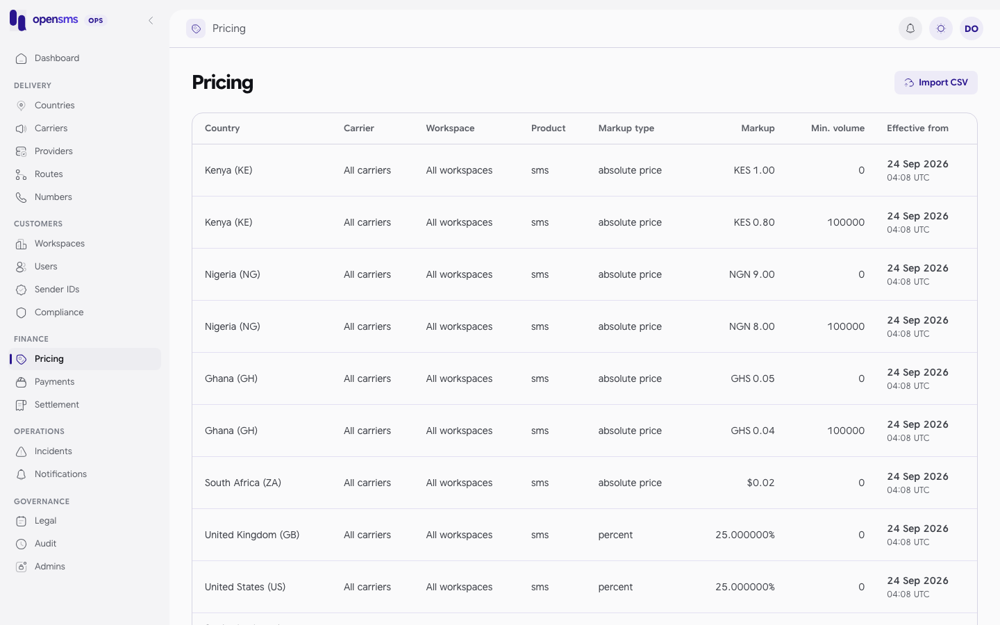

# Pricing

The Pricing page (`/admin/pricing`) holds what customers pay: price versions per country, optionally per carrier or per workspace, for SMS, number lookups and monthly number rental. Operators add new versions by importing a CSV, and can preview the margin between a provider cost and a sell price. It is for `finance` and `superadmin` operators. Every role can read prices and preview margins through the API, but the console page only admits `finance` and `superadmin` (the others see **Not authorized**). Only finance and superadmin can import, and only with an authenticator code entered in the last ten minutes.



## How prices work

- Prices are **immutable versions**. You never edit a price. You import a new version with an `effective_from` time, and it takes over from then on. Old versions stay in the list as history.
- A version can target a whole country, one carrier, or one **workspace**. A workspace version overrides the country price for that customer only. Customers see it flagged as `workspace_override: true` on `GET /v1/pricing`.
- `markup_type` decides how `markup_value` is read:

| `markup_type` | `markup_value` means | Example |
|---|---|---|
| `absolute_price` | The sell price per message part, in `sell_currency`. Must be above 0. | `1.00` KES |
| `percent` | Percent added on top of the provider cost. | `25` |
| `fixed` | Amount added on top of the provider cost. | `0.10` |

Provider costs are set separately, per route (see [Routes](routes.md#record-the-providers-cost)).

## Import prices from CSV

### CSV format

| Column | Required | Rules |
|---|---|---|
| `country_id` | yes | Country UUID (from `GET /admin/v1/countries`). |
| `carrier_id` | no | Must be empty for now: carrier prices are refused until carrier resolution supports them. |
| `workspace_id` | no | Workspace UUID for a customer-specific price. Empty for everyone. |
| `product` | no | `sms` (default), `lookup` or `number_monthly`. The import currently accepts SMS base prices only. |
| `markup_type` | yes | `absolute_price`, `percent` or `fixed`. |
| `markup_value` | yes | Decimal. |
| `sell_currency` | yes | Three uppercase letters. |
| `min_monthly_volume` | no | Must be 0 or empty: volume tiers are refused for now. |
| `effective_from` | yes | RFC 3339 time, for example `2026-10-01T00:00:00Z`. |
| `reason` | yes, unless a default reason is sent | 5 to 1000 characters. |

At most 1000 rows and 2 MiB. Two rows for the same target and time are refused. The whole file is applied in one transaction, or not at all.

### In the console

1. Put a `reason` on every row (see the known issue below).
2. Sign in again if your last authenticator code is more than ten minutes old.
3. Click **Import CSV** and choose the file. The upload starts as soon as you pick it.
4. The table refreshes with the new versions.

> **Known issue.** The console uploads only the file: it sends no `reason` form field, so every row needs its own `reason` column, or the whole import fails with `422 Invalid CSV headers, values, reason, timestamps or duplicate price targets (maximum 1000 rows).` The console also gives you no control over the `Idempotency-Key`: like every console write it attaches a new random key to each upload (seen in the browser on the docs stack), so picking the same file twice is not treated as a replay of the first import. (The API only replays an identical file automatically when no key is sent.) Check the table before you retry.

### Through the API: a workspace-specific price (real calls)

This gives one workspace a negotiated KES 0.85 SMS price in Kenya.

```http
POST /admin/v1/pricing/import
Authorization: Bearer <finance or superadmin session, code verified in the last 10 minutes>
Idempotency-Key: docs-price-4579340623
Content-Type: multipart/form-data

file=prices.csv
reason=Negotiated rate for annual contract
```

`prices.csv`:

```csv
country_id,workspace_id,product,markup_type,markup_value,sell_currency,effective_from,reason
a48b6a15-c567-4cd8-9c21-9936054b2c55,b63292d6-1634-4398-8444-25b7cb162316,sms,absolute_price,0.85,KES,2026-09-24T04:22:21Z,Negotiated rate for annual contract
```

```json
200 {"id":"8eb4418b-b1d9-413f-96b3-42f5a967072c","imported":1,"replayed":false}
```

Sending the same request again returns the same `id` with `"replayed":true` and imports nothing. The customer's price list now shows the override first:

```json
{"country_iso2":"KE","country_name":"Kenya","carrier_id":null,"carrier_name":null,"product":"sms","min_monthly_volume":0,"markup_type":"absolute_price","markup_value":"0.850000","sell_currency":"KES","sell_amount":"0.850000","converted_amount":"0.850000","converted_currency":"KES","workspace_override":true,"effective_from":"2026-09-24T07:22:21+03:00","fx_rate":"1"}
```

Errors:

| Response | Why |
|---|---|
| `403 Current finance access and admin two-factor verification within ten minutes required.` | No authenticator on your account, or the code is too old. Seen on the docs stack with an operator created with `--development-no-totp`. |
| `403 Pricing imports require finance access.` | Your role is ops or support. |
| `409` | Same key, different file or reason. |
| `422 Invalid CSV headers, values, reason, timestamps or duplicate price targets (maximum 1000 rows).` | Something in the file is wrong. |

## Preview a margin

Use the margin preview to check a price before you import it. Enter the provider cost, the sell price and the currency. The result is a quote only: there is no currency conversion and nothing is saved.

```http
POST /admin/v1/pricing/preview-margin
{"cost_amount":"0.62","sell_amount":"0.95","currency":"KES"}
```

```json
200 {"basis":"quoted_preview","cost_amount":"0.620000","currency":"KES","margin_amount":"0.330000","margin_percent":"34.736842","sell_amount":"0.950000"}
```

`margin_percent` is (sell minus cost) divided by sell, times 100, and is `null` when the sell price is 0.

## Read the price history

`GET /admin/v1/pricing?limit=500` returns a bare array of versions in id order. When there are more, the `X-Next-Cursor` header holds the last id; pass it as `cursor`. Each entry has the country, carrier and workspace (names included), product, markup, currency, volume, `effective_from`, who created it and the reason.

## Related

- [Routes](routes.md): provider costs.
- [Settlement](settlement.md#realized-margin): margin actually earned.
- [Workspaces](workspaces.md): find the workspace ID for a customer price.
