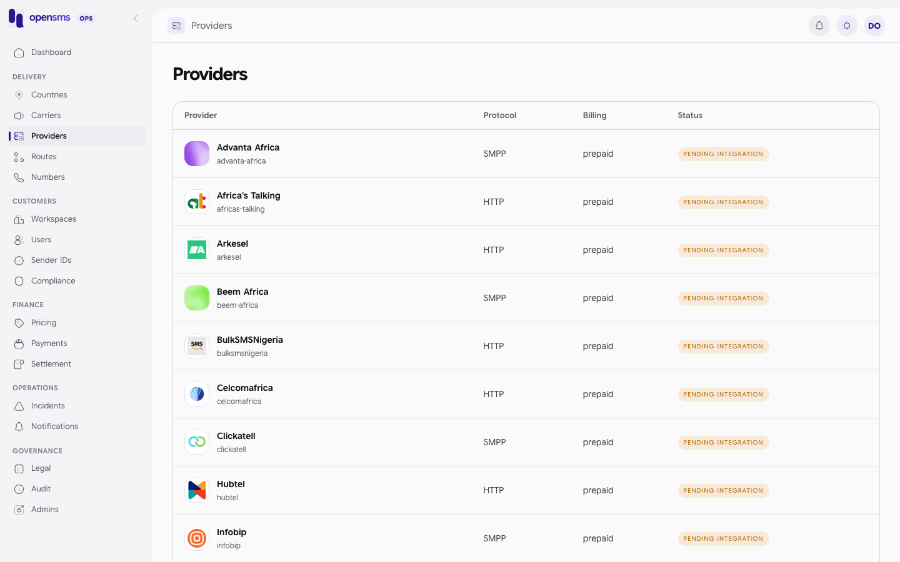
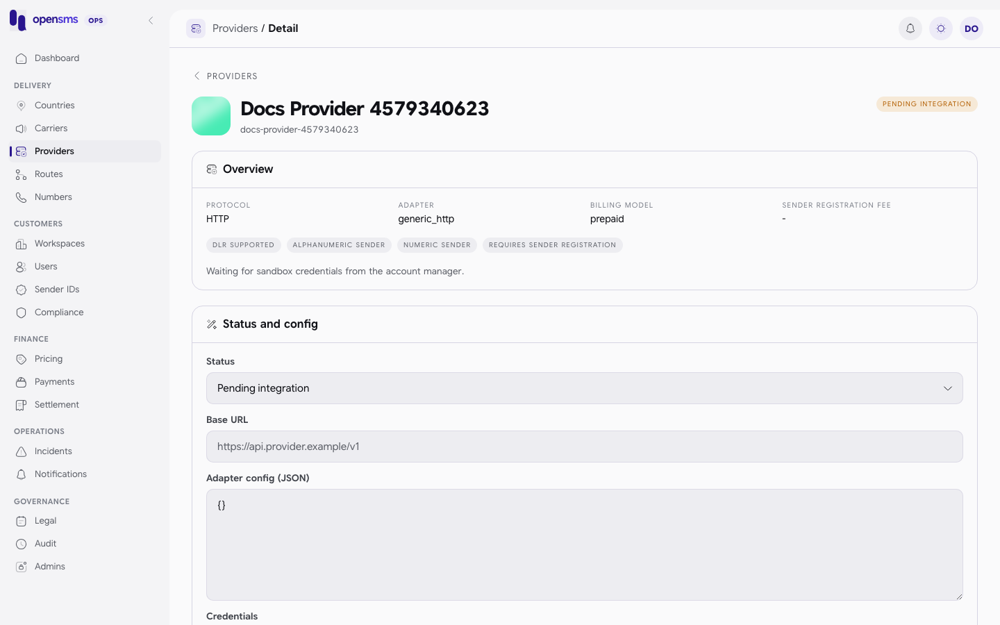

# Providers

The Providers pages (`/admin/providers` and `/admin/providers/{id}`) hold the SMS providers opensms can hand messages to: protocol, adapter, billing model, what the provider supports, its credentials and its account balance threshold. They are for `ops` and `superadmin` operators who onboard or configure a provider, and for `finance` operators who set the provider account currency and low-balance threshold. Every role can read providers through the API. The console only lets `ops` and `superadmin` open these pages, so `finance` sees **Not authorized** and sets the provider account through the API call shown below.



## Provider status

| Status | Meaning |
|---|---|
| `pending_integration` | Created but not wired up. New providers must start here. |
| `testing` | Being tested. |
| `active` | Can carry traffic through its enabled [routes](routes.md). |
| `disabled` | Switched off. The console asks for confirmation before you save this. |

## Provider fields

| Field | Notes |
|---|---|
| `slug` | Lowercase letters, digits, `-` and `_`, 2 to 64 characters. Unique. Create only. |
| `name` | 1 to 200 characters. |
| `protocol` | `http` or `smpp`. |
| `adapter` | `africastalking`, `generic_http`, `smpp` or `mock`. |
| `base_url` | Provider API base URL. |
| `credentials` | A JSON object, for example `{"api_key":"..."}`. Write only: stored encrypted, never returned, never written to the audit log. Responses only show `credentials_configured: true/false`. |
| `adapter_config` | JSON object with adapter settings. Write only. |
| `billing_model` | `prepaid` or `postpaid`. |
| `dlr_supported`, `supports_alphanumeric`, `supports_numeric`, `requires_sender_registration`, `balance_check_supported` | Capability flags. |
| `onboarding_notes` | Free text shown on the detail page. |

## Add a provider

The console has no "add provider" button. Create providers through the API (ops or superadmin):

```http
POST /admin/v1/providers

{"slug":"docs-provider-4579340623","name":"Docs Provider 4579340623","protocol":"http","adapter":"generic_http","status":"pending_integration","dlr_supported":true,"supports_alphanumeric":true,"supports_numeric":true}
```

```json
201 {"adapter":"generic_http","balance_check_supported":false,"base_url":null,"billing_model":"prepaid","created_at":"2026-09-24T04:22:21.665158+00:00","credentials_configured":false,"dlr_supported":true,"id":"1015dd22-5c29-4e4d-8fe1-a7950939036e","name":"Docs Provider 4579340623","onboarding_notes":null,"protocol":"http","requires_sender_registration":true,"sender_registration_fee":null,"sender_registration_fee_currency":null,"slug":"docs-provider-4579340623","status":"pending_integration","supports_alphanumeric":true,"supports_numeric":true}
```

Then add [routes](routes.md) for the countries it serves. New routes start disabled.

## Configure a provider (detail page)



1. Open the provider from the list.
2. Under **Status and config**, set the status, base URL and adapter config (JSON).
3. To set or replace credentials, type them in **Credentials**. Leave it blank to keep the current ones.
4. Save.

> **Known issue.** The detail form sends `base_url: null` when the Base URL box is empty, which the API refuses with `400 catalog text fields must be strings`. It also sends any typed credentials as a plain string, which the API refuses with `400 credentials must be a nonempty object`. Fill in the Base URL and set credentials through the API until the form is fixed:
>
> ```http
> PATCH /admin/v1/providers/{id}
> {"credentials":{"api_key":"..."}}
> ```
>
> On the docs stack this returned `200` with `"credentials_configured":true`. A string such as `"credentials":"api-key-123"` (with a valid `base_url`) returned `400 credentials must be a nonempty object`.

Updating notes through the API (real call):

```http
PATCH /admin/v1/providers/1015dd22-5c29-4e4d-8fe1-a7950939036e
{"onboarding_notes":"Waiting for sandbox credentials from the account manager."}
```

```json
200 {"adapter":"generic_http","balance_check_supported":false,"base_url":null,"billing_model":"prepaid","created_at":"2026-09-24T04:22:21.665158+00:00","credentials_configured":false,"dlr_supported":true,"id":"1015dd22-5c29-4e4d-8fe1-a7950939036e","name":"Docs Provider 4579340623","onboarding_notes":"Waiting for sandbox credentials from the account manager.","protocol":"http","requires_sender_registration":true,"sender_registration_fee":null,"sender_registration_fee_currency":null,"slug":"docs-provider-4579340623","status":"pending_integration","supports_alphanumeric":true,"supports_numeric":true}
```

## Provider account and balance threshold

The account record holds the provider's billing currency and the low-balance threshold that raises a `provider.balance_low` [notification](notifications.md). `ops`, `finance` and `superadmin` can read it. Only `finance` and `superadmin` can set it. The currency cannot be changed once set.

1. Configure it through the API:

   ```http
   PUT /admin/v1/providers/42ecb226-f863-4ad2-b19e-8b4a6a5fb2e4/account
   {"currency":"KES","low_threshold":"500.00","balance_checks_enabled":false}
   ```

   ```json
   200 {"balance_checks_enabled":false,"balance_poll_interval_seconds":300,"provider_id":"42ecb226-f863-4ad2-b19e-8b4a6a5fb2e4","currency":"KES","low_threshold":"500.00","balance_reported":null,"balance_reported_at":null}
   ```

2. On the detail page, in the **Account** card, click **Load account** (then **Refresh**) to see the reported **Balance**, the **Low threshold** and when the balance was reported. The card only reads the account; it cannot set it.

`balance_reported` is filled only by the balance poller (`OPENSMS_PROVIDER_BALANCE_POLLING_ENABLED`), which is off on the docs stack, so no reported balance is shown here. A provider without an account answers `404 Provider account is not configured.` on `/account` and `/balance`. You also need an account before you can record [provider invoices](settlement.md).

## Test send (not implemented)

> **Known issue.** Provider test sending does not work. The console has no test-send button, and the API endpoint always refuses a valid request with `501`, so no SMS is ever sent.

`POST /admin/v1/providers/{id}/test-send` (ops and superadmin) exists but never sends. The body is `{"to_e164":"+2547...","text":"optional, up to 160 characters"}`. The request is validated first, so a missing or invalid `to_e164` answers `400`, an unknown provider `404`, and a disabled provider `422 Disabled providers cannot receive test traffic.` A request that passes those checks always answers:

```json
501 {"type":"https://api.opensms.io/problems/test_send_not_implemented","title":"Not Implemented","status":501,"detail":"Direct provider test sending is not implemented. No SMS was sent. Use the standard message sending API with a configured workspace and route.","code":"test_send_not_implemented"}
```

To test a provider, send a real message from a workspace whose route goes through that provider.

## Related

- [Routes](routes.md): link the provider to countries, set costs.
- [Settlement](settlement.md): provider invoices, postings and reconciliation.
- [Notifications](notifications.md): `provider.balance_low` alerts.
