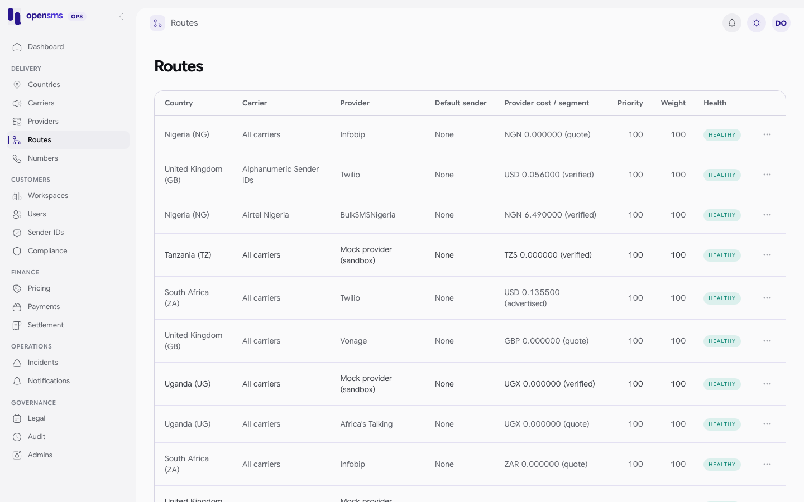

# Routes

A route links a [provider](providers.md) to a [country](countries.md), and optionally to one [carrier](carriers.md) in it. The Routes page (`/admin/routes`) is where operators turn routes on and off, set priority and weight, choose a default shared sender, pin health during an outage, and look at the provider's cost per message part. It is for `ops` and `superadmin` operators. `finance` can read routes and append cost versions, and `support` can read the list, but only through the API: the console shows both roles **Not authorized** on this page.



## How a route gets picked

For a live message, the router only considers routes that are all of these:

- enabled, with weight above 0
- on an `active` provider in an `active` country, not using the `mock` adapter
- not `down` (automatic health, or your override)
- with a current cost whose confidence is `verified` or `advertised`. A `quote` or `stale` cost, or no cost at all, keeps the route out of live traffic.
- able to carry the sender kind (alphanumeric or numeric), and, when the provider requires sender registration, with an approved registration for the sender

Among those, `healthy` routes are preferred over `degraded` ones. Next come the routes with the **lowest priority number**, and one of them is chosen at random in proportion to its **weight**. The other eligible routes become fallbacks, ordered by priority, health, cost, speed and ID. Sandbox messages only use enabled `mock` routes that are not down.

## Columns

| Column | Meaning |
|---|---|
| Country, Carrier | Where the route delivers. "All carriers" means country-wide. |
| Provider | Who delivers. |
| Default sender | Shared sender used when the customer does not choose one. |
| Provider cost / segment | Current cost version and its confidence (`verified`, `advertised`, `quote`, `stale`). |
| Priority | Lower number is tried first. |
| Weight | 0 to 100, share of traffic among routes of equal priority. |
| Health | Effective health: your override if set, otherwise the automatic value. |

## Add a route

The console has no "add route" button. Create routes through the API (ops or superadmin). New routes are always created **disabled**.

```http
POST /admin/v1/routes

{"provider_id":"1015dd22-5c29-4e4d-8fe1-a7950939036e","country_id":"a48b6a15-c567-4cd8-9c21-9936054b2c55","priority":900,"weight":50}
```

```json
201 {"id":"afe6127a-89d9-487e-b83a-c9e61030b929","health":"healthy","weight":50,"enabled":false,"priority":900,"carrier_id":null,"country_id":"a48b6a15-c567-4cd8-9c21-9936054b2c55","updated_at":"2026-09-24T04:22:21.675956+00:00","updated_by":"536e0267-e321-403c-a670-169e37717df5","provider_id":"1015dd22-5c29-4e4d-8fe1-a7950939036e","health_reason":null,"health_override":null,"dlr_timeout_seconds":90,"default_sender_id_id":null}
```

Optional fields: `carrier_id`, `priority` (default 100), `weight` (default 100), `dlr_timeout_seconds` (1 to 86400, default 90). A duplicate route returns `409`.

## Record the provider's cost

Before a route can carry live traffic it needs a cost version with `verified` or `advertised` confidence. Costs are immutable versions: you append a new one, you never edit the old one. Customer prices are separate (see [Pricing](pricing.md)). There is no console form for this, so use the API (ops, finance or superadmin):

```http
POST /admin/v1/routes/afe6127a-89d9-487e-b83a-c9e61030b929/costs

{"cost_amount":"0.45","cost_currency":"KES","confidence":"quote"}
```

```json
201 {"id":89,"route_id":"afe6127a-89d9-487e-b83a-c9e61030b929","confidence":"quote","cost_amount":"0.450000","cost_currency":"KES","effective_from":"2026-09-24T04:22:21.680378+00:00"}
```

`effective_from` is optional (defaults to now), so you can schedule a price change. To see all versions, pick **Cost history** from the row menu, or call `GET /admin/v1/routes/{id}/cost-history`.

## Edit a route

1. Open the row menu (the three dots) and choose **Edit route**.
2. Change **Enabled**, **Priority**, **Weight**, **Delivery receipt timeout (seconds)** or **Default sender ID**.
3. Save. The console sends all five fields every time (the values currently in the form), not only the ones you changed; the API itself also accepts a partial `PATCH`. Setting the default sender to none clears it.

The default sender list only offers shared, approved senders that this provider supports and, when the provider requires registration, that are registered for this country and provider.

API equivalent (real call):

```http
PATCH /admin/v1/routes/afe6127a-89d9-487e-b83a-c9e61030b929
{"weight":25}
```

```json
200 {"id":"afe6127a-89d9-487e-b83a-c9e61030b929","health":"healthy","weight":25,"enabled":false,"priority":900,"carrier_id":null,"country_id":"a48b6a15-c567-4cd8-9c21-9936054b2c55","updated_at":"2026-09-24T04:22:21.686803+00:00","updated_by":"536e0267-e321-403c-a670-169e37717df5","provider_id":"1015dd22-5c29-4e4d-8fe1-a7950939036e","health_reason":null,"health_override":null,"dlr_timeout_seconds":90,"default_sender_id_id":null}
```

Finance operators get `403 route configuration requires ops access` on this call.

## Pin or release route health during an incident

Automatic health comes from delivery results. When you know better (a provider has told you about an outage, for example), pin the health:

1. Row menu, **Health override**.
2. Choose **Down**, **Degraded** or **Healthy**, or **No override (use computed health)** to go back to automatic.
3. Save.

The automatic value is kept, and the list shows both. Each change writes an audit entry and a route health event, which can trigger `route.down`, `route.degraded` or `route.recovered` [notifications](notifications.md).

```http
PUT /admin/v1/routes/afe6127a-89d9-487e-b83a-c9e61030b929/health-override
{"status":"down"}
```

```json
200 {"id":"afe6127a-89d9-487e-b83a-c9e61030b929","health":"healthy","weight":25,"enabled":false,"priority":900,"carrier_id":null,"country_id":"a48b6a15-c567-4cd8-9c21-9936054b2c55","updated_at":"2026-09-24T04:22:21.691193+00:00","updated_by":"536e0267-e321-403c-a670-169e37717df5","provider_id":"1015dd22-5c29-4e4d-8fe1-a7950939036e","health_reason":null,"health_override":"down","dlr_timeout_seconds":90,"default_sender_id_id":null}
```

Send `{"status":null}` to return to automatic health. The history is at `GET /admin/v1/routes/{id}/health-history`:

```json
[{"at":"2026-09-24T04:22:21.696092+00:00","id":4,"reason":"admin health override","metrics":{"admin_id":"536e0267-e321-403c-a670-169e37717df5","health_override":null},"route_id":"afe6127a-89d9-487e-b83a-c9e61030b929","to_health":"healthy","from_health":"down"},{"at":"2026-09-24T04:22:21.691193+00:00","id":3,"reason":"admin health override","metrics":{"admin_id":"536e0267-e321-403c-a670-169e37717df5","health_override":"down"},"route_id":"afe6127a-89d9-487e-b83a-c9e61030b929","to_health":"down","from_health":"healthy"}]
```

## Recovery probes (superadmin, API only)

`GET` and `PUT /admin/v1/routes/{id}/probe` configure a funded, controlled test message that checks whether a route has recovered after an outage. Probes are disabled at runtime by default (`OPENSMS_ROUTE_PROBES_ENABLED`, off on the docs stack) and need a service workspace, a controlled recipient, a price cap and a daily budget. They were not exercised for these docs because they send real messages.

## Related

- [Providers](providers.md), [Countries](countries.md), [Carriers](carriers.md)
- [Incidents](incidents.md): tell customers about an outage.
- [Pricing](pricing.md): what customers pay, separate from provider cost.
