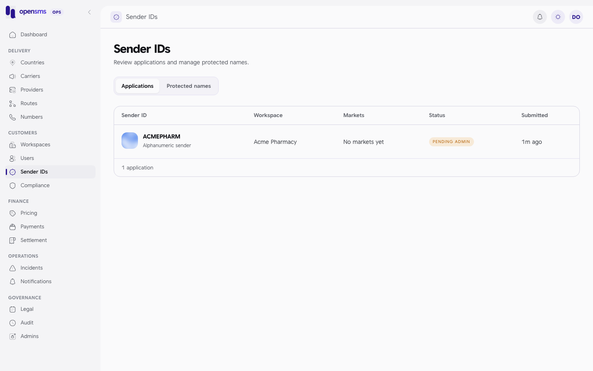
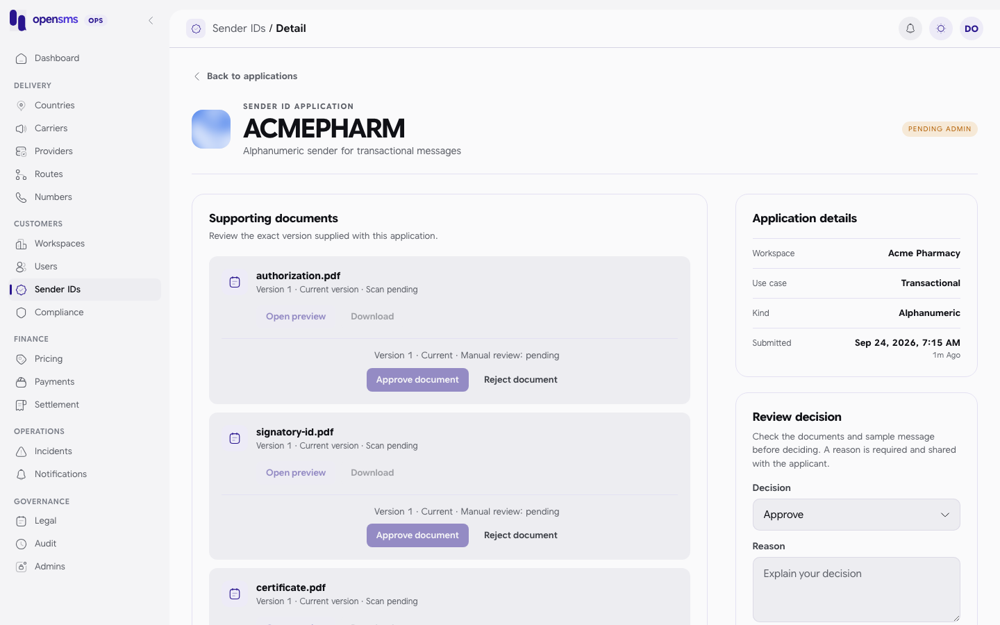
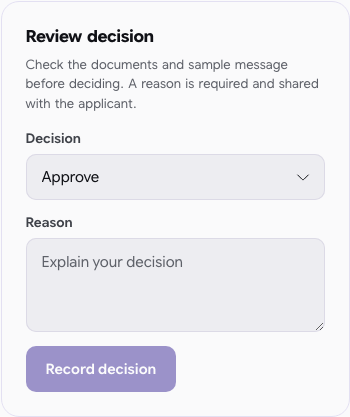
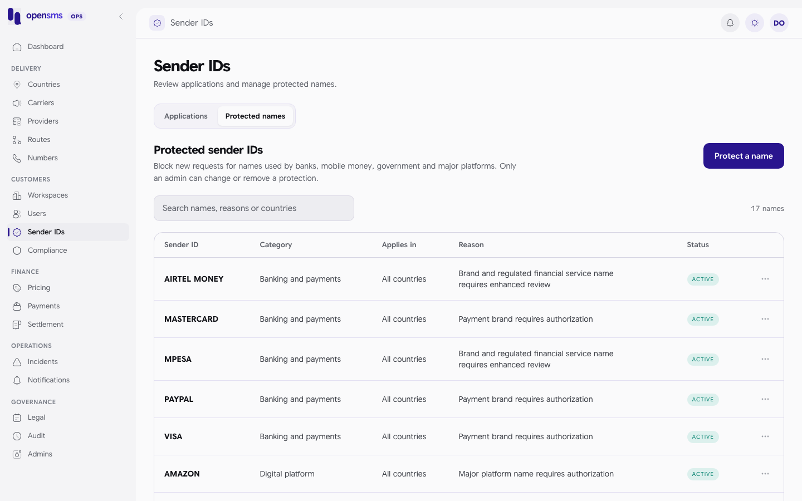

# Sender IDs

A sender ID is the name or number a message appears to come from, such as `ACMEPHARM`. Customers apply for custom sender IDs. Operators check the application and its supporting documents, decide it, and then track the separate registration with each provider. The Sender IDs pages (`/admin/sender-ids` and `/admin/sender-ids/{id}`) also hold the **protected names** list, which blocks brand and regulated names. These pages are for `ops` and `superadmin` operators. Changing protected names is superadmin only.



## How an application moves

1. The customer uploads three documents (certificate, signatory ID, authorization letter) and requests the sender for one or more countries. Status: `pending_admin`. One provider registration per country and provider is created with status `pending`.
2. Each document is scanned for malware.
3. An operator reviews each document, then makes the **platform decision**: approve or reject.
4. If approved, an operator **submits to providers**. Any registration fee is charged to the customer's live wallet now. Provider registrations are queued.
5. As providers answer, an operator **records each provider outcome** with evidence.

The platform approval and each provider's approval are separate decisions. Approving the sender on opensms does not make it usable on a provider that requires registration until that registration is approved too.

| Sender status | Meaning |
|---|---|
| `pending_admin` | Waiting for the operator decision. Shows in the queue. |
| `pending_provider` | Older status, also in the queue. |
| `approved` | Platform approved. Ready to submit to providers. |
| `rejected` | Refused. The reason is shown to the customer, who can resubmit. |

## Review an application



1. Open **Sender IDs**, **Applications** tab, and click an application.
2. Under **Supporting documents**, open each file with **Open preview** or **Download**. Only files whose scan is clean can be opened, and you must open the exact version before recording a decision on it.
3. For each document click **Approve document**, or **Reject document** and enter a reason the customer will see.
4. Check the sample message and use case under **Application details**.
5. In **Review decision**, choose **Approve** or **Reject**, write a reason (5 to 1000 characters, shared with the applicant) and click **Record decision**, then **Confirm decision**.



The API refuses an approval until each current custom registration has an approved, clean certificate, signatory ID and authorization document, and refuses any sender that matches an active [protected name](#protected-names). Platform decisions and submissions need an ops or superadmin operator with an authenticator code entered in the last ten minutes.

### Example: a rejected application (real calls)

The customer applied for `ACMECLINIC` with three documents. The queue showed it:

```http
GET /admin/v1/sender-ids/queue
```

```json
[{"use_case":"transactional","sample_message":"Your appointment is confirmed for 10:00.","rejection_reason":"","id":"74192aa4-9e4a-480a-bec1-d90d29213297","value":"ACMECLINIC","kind":"alphanumeric","status":"pending_admin","workspace_id":"6d3b54e8-5b94-413b-847d-a05fe9b6901d","workspace_name":"Docs admin-sender","country_id":"a48b6a15-c567-4cd8-9c21-9936054b2c55","country_iso2":"KE","country_name":"Kenya","provider_id":"fed088d8-d3a8-47c4-bf5a-8d0e1a27871e","provider_name":"Mock provider (sandbox)","created_at":"2026-09-24T07:22:21.233176+03:00"}]
```

1. List the workspace's sender documents:

   ```http
   GET /admin/v1/workspaces/6d3b54e8-5b94-413b-847d-a05fe9b6901d/sender-documents
   ```

   The response is `{"items":[...]}` with one entry per file. The first of the three entries:

   ```json
   {"id":"8b904b7c-ea25-498e-b0af-68c8bcc31e7f","kind":"authorization","filename":"authorization.pdf","content_type":"application/pdf","size":205,"scan_status":"pending","created_at":"2026-09-24T07:22:21.228842+03:00","version":1,"review_status":"pending","is_current":true}
   ```

2. Approving a document that has not been scanned is refused:

   ```json
   409 {"type":"about:blank","title":"Conflict","status":409,"detail":"document must pass security scanning before human approval"}
   ```

3. Rejecting the unsigned authorization letter works without a scan:

   ```http
   POST /admin/v1/workspaces/6d3b54e8-5b94-413b-847d-a05fe9b6901d/sender-documents/8b904b7c-ea25-498e-b0af-68c8bcc31e7f/review
   {"decision":"rejected","reason":"Authorization letter is unsigned. Upload a signed copy."}
   ```

   `204 No Content`. A second decision on the same version returns `409 current pending document version required`.

4. Approving the sender is refused while evidence is missing:

   ```json
   409 {"type":"about:blank","title":"Conflict","status":409,"detail":"Each current custom sender registration needs approved certificate, signatory ID, and authorization documents before approval or submission."}
   ```

5. Reject the application:

   ```http
   POST /admin/v1/sender-ids/74192aa4-9e4a-480a-bec1-d90d29213297/decision
   {"status":"rejected","reason":"The authorization letter is unsigned. Upload a signed letter and resubmit."}
   ```

   ```json
   200 {"id":"74192aa4-9e4a-480a-bec1-d90d29213297","status":"rejected"}
   ```

   The customer now sees `"status":"rejected"`, the `rejection_reason`, and a `review_history` entry on `GET /v1/sender-ids/{id}`.

An operator without a fresh code gets:

```json
403 {"type":"about:blank","title":"Forbidden","status":403,"detail":"Current operations access, active workspace and fresh TOTP required."}
```

### Why approval was not shown

The docs stack runs with the file scanner disabled, so uploaded documents stay `scan_status: "pending"` and can never be approved. The approve, **Submit to providers** and provider outcome steps below are documented from the code and contract, not from a live run.

## Submit to providers

After a platform approval, click **Submit to providers** on the application and give a reason. The API (`POST /admin/v1/sender-ids/{id}/submit`):

- rechecks the documents,
- charges each quoted, nonzero registration fee to the customer's **live** wallet (`402 insufficient balance for registration fee` rolls the whole submission back),
- queues one registration intent per pending registration, and answers `202 {"id":"...","status":"queued"}`.

No provider is called in that request. A background registration worker (off unless its feature flag is enabled) sends them later. Any uncertain provider outcome becomes `unknown` and is never resent automatically.

## Record provider outcomes

Under **Provider registrations**, use **Record evidence** for each market filing. Choose the **Provider action**, enter the **Provider reference**, the **Evidence SHA-256** of the file you checked, and a reason.

| Decision | When |
|---|---|
| `submitted` | You filed it in the provider's portal by hand (TextSMS and Africa's Talking only). Needs a provider reference. |
| `approved` | The provider approved it. Needs a provider reference. |
| `rejected` | The provider refused it. |
| `confirmed_not_accepted` | You confirmed the provider never accepted it. Becomes rejected and is not requeued. |

API: `POST /admin/v1/sender-registrations/{id}` with an `Idempotency-Key` header and `decision`, `reason`, `evidence_sha256` and (where needed) `provider_reference`. Like the platform decision, it needs an ops or superadmin operator with an authenticator code entered in the last ten minutes; otherwise it answers `403` (`Current operations access and fresh TOTP required.`, or `Fresh TOTP required.` when the code expires while the request waits). `GET /admin/v1/sender-registrations` lists registration and submission state.

Registration fees are not refunded automatically when a provider rejects. Finance refunds them with `POST /admin/v1/workspaces/{id}/sender-registration-refunds` (see [Workspaces](workspaces.md#refunds-finance)).

## Protected names



Protected names stop customers from even requesting brand or regulated names (banks, mobile money, government, big platforms). Matching ignores case and punctuation, so `M-PESA`, `m pesa` and `MPESA` are the same name. A protected name can apply to all countries or one.

1. Open **Sender IDs**, **Protected names** tab.
2. Click **Protect a name**.
3. Enter the **Sender ID** (up to 11 letters, digits, spaces or hyphens, or 3 to 15 digits), the **Category** (`financial`, `telecom`, `government`, `platform`, `other`), the **Country** (or all), the **Status** and **Why is this name protected?** (5 to 500 characters).
4. Save. To pause a rule set its status to inactive; to remove it use **Delete name**.

Only superadmins can change the list (ops can read it). Real calls:

```http
POST /admin/v1/reserved-sender-ids
{"value":"DBANK0623","reason":"Regulated bank brand, needs proof of authorization","category":"financial","status":"active","country_iso2":"KE"}
```

```json
201 {"id":"9216ccba-9a5f-4a25-9b27-08fb62efcbcf","value":"DBANK0623","reason":"Regulated bank brand, needs proof of authorization","category":"financial","status":"active","country_iso2":"KE","created_at":"2026-09-24 04:22:21.285821+00"}
```

A customer then asking for `d-bank0623` in Kenya is refused before anything is filed:

```json
409 {"type":"about:blank","title":"Conflict","status":409,"detail":"This sender ID is reserved. Contact support with proof of brand authorization."}
```

Deactivate with `PATCH /admin/v1/reserved-sender-ids/{id}` (send the full object with `"status":"inactive"`, answer `200`) and remove with `DELETE` (answer `204`). An ops operator trying to add one gets `403 Only superadmins may change reserved sender IDs.`, and a value that is too long returns `400`.

If a brand owner proves they are entitled to a protected name, deactivate the rule only after you have verified the authorization. The approval API refuses matching senders while the rule is active.

## Known issue

The console shows **Sender IDs** in the menu for the `support` role, but the API refuses every `/admin/v1/sender-*` call for support (`403 Sender management requires operations access.`), so the page does not load for them.

## Related

- [Workspaces](workspaces.md): the customer and its KYC documents.
- [Routes](routes.md): which providers require sender registration.
- [Notifications](notifications.md): `sender_id.requested` and `sender_id.resubmitted` alerts.
