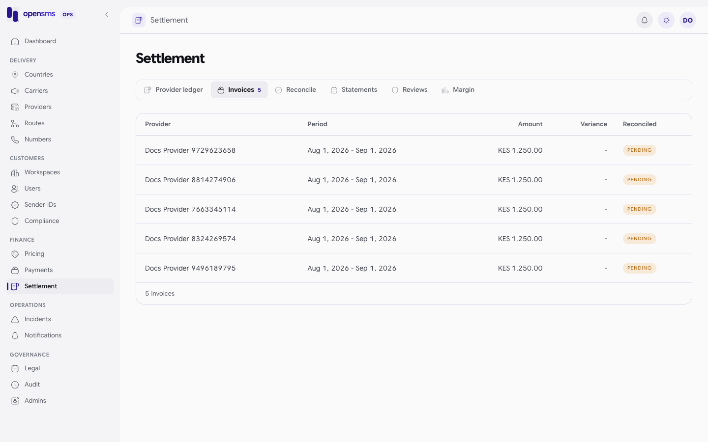
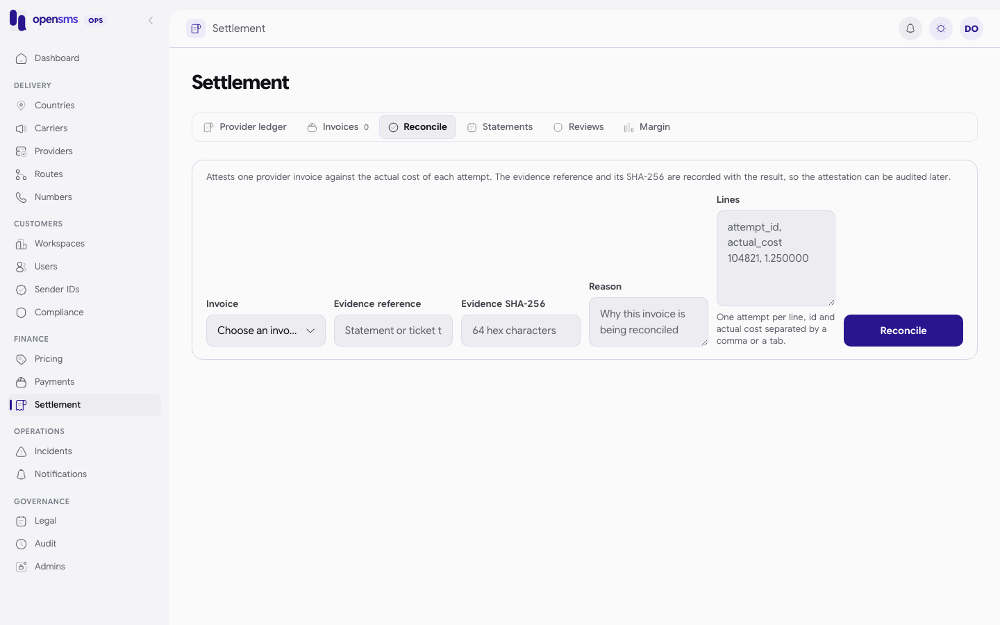
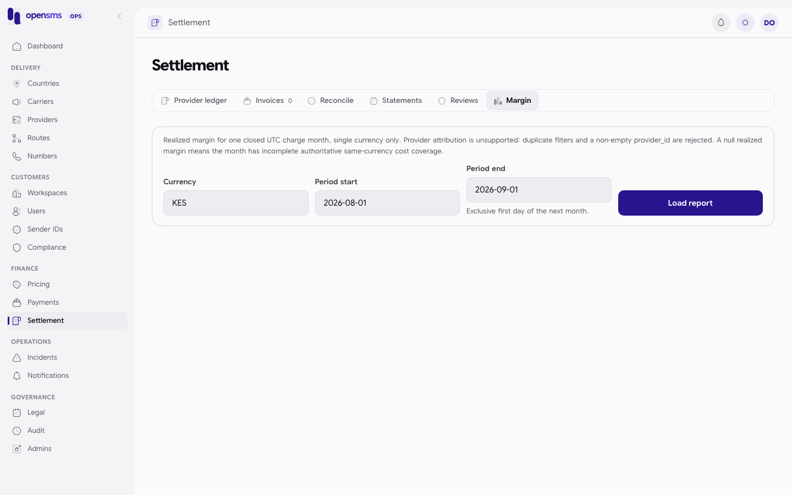

# Settlement and reconciliation

The Settlement page (`/admin/settlement`) is the finance view of money on the provider side: what we paid providers, what they invoiced, whether each invoice matches the messages we sent, plus draft monthly customer statements, payment reviews and realized margin. It is for `finance` and `superadmin` operators. Everything here records evidence and findings. Nothing moves money at a provider or a bank.



## Tabs

| Tab | What it is | API |
|---|---|---|
| Provider ledger | Immutable postings per provider: top-ups, adjustments, message costs | `GET /admin/v1/settlement/provider-ledger` (`provider_id`, `currency`, `limit`, `cursor`) |
| Invoices | Provider invoices you recorded, with their reconciliation state | `GET /admin/v1/settlement/invoices` (`provider_id`, `currency`) |
| Reconcile | Attest one invoice against the actual cost of each message attempt | `POST /admin/v1/settlement/reconcile` |
| Statements | Immutable monthly draft statements per workspace. Review only: nothing is issued and no PDF is made. | `GET /admin/v1/statements`, `/statements/{id}`, `/lines`, `/late-entries` |
| Reviews | Payment reviews (Paystack refunds and disputes) and automatic top-up intents | See [Payments](payments.md#payment-reviews-refunds-and-disputes) |
| Margin | Realized margin for one closed month and currency | `GET /admin/v1/settlement/realized-margin` |

## Month-end workflow

1. **Make sure the provider has an account.** Each provider needs an account currency before invoices can be recorded. See [Providers](providers.md#provider-account-and-balance-threshold).
2. **Record the provider's invoice** for a closed UTC month (below).
3. **Record top-ups and adjustments** you made with the provider (below).
4. **Compare** invoice totals with recorded ledger costs.
5. **Reconcile** the invoice line by line on the **Reconcile** tab.
6. **Check realized margin** on the **Margin** tab.

### Record a provider invoice

There is no console form. Use the API. `period_start` is the first day of a closed UTC month and `period_end` is the first day of the next month. `evidence_sha256` is the SHA-256 of the invoice file you checked.

```http
POST /admin/v1/provider-invoices
Idempotency-Key: docs-inv-7663345114

{"provider_id":"42ecb226-f863-4ad2-b19e-8b4a6a5fb2e4","period_start":"2026-08-01","period_end":"2026-09-01","amount":"1250.00","currency":"KES","reason":"August usage invoice from provider portal","evidence_reference":"INV-2026-08-7663345114","evidence_sha256":"1d3dbc6cd8f395320425105a0080723104af530c8548c9c0aea63178d92a0636"}
```

```json
201 {"id":"8b394f29-0679-42c1-b439-98b3dc7f824b","reconciled":false}
```

The same key again returns the same `id`. It then shows on `GET /admin/v1/provider-invoices?provider_id=...&currency=KES&period_start=2026-08-01&period_end=2026-09-01`:

```json
200 {"items":[{"id":"8b394f29-0679-42c1-b439-98b3dc7f824b","amount":"1250.00","reason":"August usage invoice from provider portal","currency":"KES","created_at":"2026-09-24T04:34:10.669148+00:00","period_end":"2026-09-01","reconciled":false,"provider_id":"42ecb226-f863-4ad2-b19e-8b4a6a5fb2e4","period_start":"2026-08-01","evidence_sha256":"1d3dbc6cd8f395320425105a0080723104af530c8548c9c0aea63178d92a0636","variance_amount":null,"evidence_reference":"INV-2026-08-7663345114"}],"next_cursor":null}
```

A currency that does not match the provider account is refused: `422 Invoice currency must match the provider account.` Ops operators get `403`.

### Record a provider top-up or adjustment

`POST /admin/v1/provider-postings` with `provider_id`, `type` (`topup` or `adjustment`), `amount` (non-zero; top-ups positive), `currency`, `reason`, `evidence_reference`, `evidence_sha256` and an `Idempotency-Key`. It needs a fresh authenticator code. It records what you did with the provider. It does not move money and does not touch any customer wallet. Not run for these docs.

### Compare invoice and ledger

`GET /admin/v1/provider-settlement` (provider, currency, month) returns the invoice amount, recorded ledger cost and their variance. It always reports `reconciled: false`, because it is a comparison, not an attestation.

### Reconcile an invoice



1. Open the **Reconcile** tab and choose the **Invoice**.
2. Enter the **Evidence reference** and **Evidence SHA-256** of the provider's detailed usage report.
3. Enter a **Reason**.
4. In **Lines**, put one attempt per line: the attempt ID and its actual cost, separated by a comma or tab (for example `104821, 1.250000`).
5. Click **Reconcile**. Sign in again first if your code is over ten minutes old.

API: `POST /admin/v1/settlement/reconcile` with `invoice_id`, `invoice_kind` (`sms_usage_only`, `mixed_usage` or `non_sms_only`), `reason`, `evidence_reference`, `evidence_sha256`, `lines` (and optional `additional_lines` for non-SMS items), an `Idempotency-Key`, and a fresh authenticator code. The invoice must be complete for a closed month: every accepted live attempt in it must have an actual cost. Once committed it cannot be edited.

**Not run for these docs.** Reconciling needs live message attempts, and live dispatch is disabled on the docs stack.

## Realized margin



Pick a currency and a closed month. The result covers every customer charge in that month, with refunds and reconciliations linked so far. Real call (the docs stack has no live traffic, so every figure is zero):

```http
GET /admin/v1/settlement/realized-margin?currency=KES&period_start=2026-08-01&period_end=2026-09-01
```

```json
200 {"as_of":"2026-09-24T04:50:20.647077+00:00","basis":"customer_charge_month_cohort_all_attempts_current_reconciliation","attempts":0,"currency":"KES","period_end":"2026-09-01","environment":"live","net_revenue":"0","period_start":"2026-08-01","linked_refunds":"0","realized_margin":"0","charged_messages":0,"unknown_attempts":0,"coverage_complete":true,"recognized_revenue":"0","reconciled_attempts":0,"unreconciled_attempts":0,"cross_currency_attempts":0,"messages_without_attempts":0,"reconciled_cost_in_currency":"0","confirmed_not_accepted_attempts":0,"separate_non_message_fee_revenue":"0","unreconciled_cross_currency_attempts":0,"unreconciled_quoted_cost_in_currency":"0"}
```

When the month does not yet have complete, same-currency, authoritative cost coverage, `coverage_complete` is `false` and `realized_margin` is `null`. Reconcile the remaining invoices and load the report again. Filtering by provider is not supported: a `provider_id` parameter is rejected with `400`.

## Uncertain lookup reviews (API only)

A paid number lookup whose provider outcome is unknown (for example a timeout) keeps its wallet reservation until finance decides it. There is no console page. `finance` and `superadmin` can list them (`GET /admin/v1/reconciliation/lookups`, optional `workspace_id`, `environment`, `limit`, `cursor`; other roles get `403 Current finance access required.`). The docs stack had none: `{"items":[],"next_cursor":null}`.

Resolve one with `POST /admin/v1/reconciliation/lookups/{id}`, an `Idempotency-Key`, and a fresh authenticator code. The body names `workspace_id`, `environment`, `decision` (`confirmed_not_accepted` releases the reservation; `confirmed_result` needs the full reviewed provider `result` and captures it), `reason` and `evidence_sha256`. An incomplete body answers `422` (real response):

```json
422 {"type":"about:blank","title":"Unprocessable Entity","status":422,"detail":"Explicit workspace/environment, confirmed_not_accepted or confirmed_result with provider result, reason, SHA256 evidence and Idempotency-Key required."}
```

A real resolution was not run: the docs stack has no uncertain lookups.

## Statements

The **Statements** tab lists monthly draft statements per workspace (`GET /admin/v1/statements?workspace_id=...`). Open one to see its lines and any late entries posted after the month closed. They are read only. The docs stack had none (`{"items":[],"next_cursor":null}`).

## Related

- [Providers](providers.md), [Payments](payments.md), [Pricing](pricing.md)
