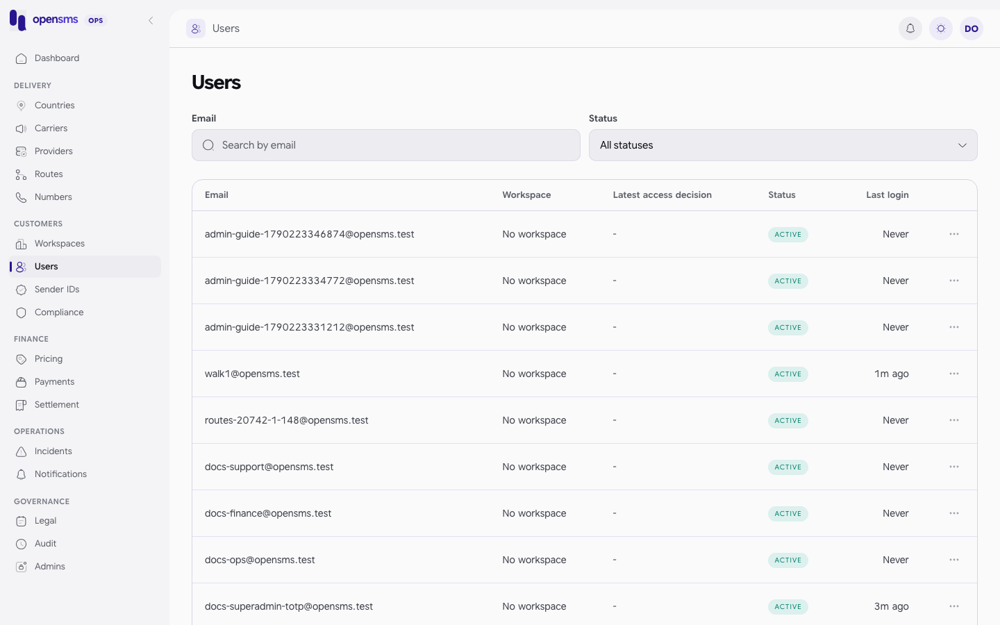
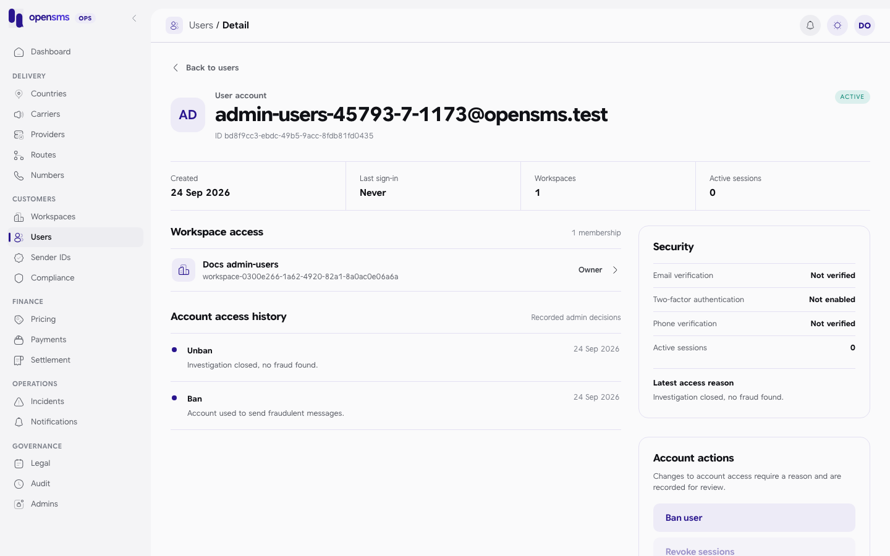

# Users

The Users pages (`/admin/users` and `/admin/users/{id}`) show customer accounts: the people who sign in to the customer app, the workspaces they belong to, their security state, and any ban decisions. Operators use them to answer "who is this person and what can they access", and to act on a compromised or abusive account. `support` and `superadmin` can read. Only `superadmin` can act, and every action needs a fresh authenticator code.



## Find a user

1. Open **Users**.
2. Type part of the email in **Search by email** (case-insensitive substring) and/or pick a **Status** (`active`, `locked`, `deleted`).
3. Click a row to open the detail page.

```http
GET /admin/v1/users?email=admin-users-45793-7-1173%40opensms.test
```

```json
200 {"items":[{"id":"bd8f9cc3-ebdc-49b5-9acc-8fdb81fd0435","email":"admin-users-45793-7-1173@opensms.test","email_verified_at":null,"phone_e164":null,"phone_verified_at":null,"password_hash":null,"totp_secret_enc":null,"totp_enabled":false,"status":"active","is_banned":false,"access_reason":null,"last_login_at":null,"created_at":"2026-09-24T07:22:21.745604+03:00"}],"next_cursor":null}
```

`password_hash`, `totp_secret_enc` and `phone_e164` are always `null`: secrets and phone numbers are never returned. Pages hold 50 by default, up to 200.

> **Known issue.** The Workspace column in the directory shows "No workspace" for every user, even users who own one. The list endpoint does not return memberships. Open the detail page to see them.

## Read a user's detail



The detail page shows:

- **Workspace access**: each membership with role, live and KYC status. Click one to open the [workspace](workspaces.md).
- **Account access history**: every ban and unban decision with its reason, newest first (`GET /admin/v1/users/{id}/access-history`).
- **Security**: email, phone and two-factor verification, and the number of active sessions. Tokens, IP addresses and secrets are never shown.

## Act on an account

All actions need a reason of 5 to 1000 characters and a superadmin with an authenticator code entered in the last ten minutes. You cannot act on yourself or on any account linked to an operator, and deleted accounts cannot be changed.

| Action | Console | API | Effect |
|---|---|---|---|
| Revoke sessions | **Revoke sessions** | `POST /admin/v1/users/{id}/force-logout` | Signs the user out everywhere. Password and authenticator stay as they are. |
| Reset 2FA | **Reset 2FA** | `POST /admin/v1/users/{id}/reset-2fa` | Signs out, removes the authenticator and recovery codes. |
| Lock | none (API only) | `POST /admin/v1/users/{id}/lock` | Signs out and sets status `locked`. Refused for the last active owner of a workspace. |
| Ban | **Ban user** | `POST /admin/v1/users/{id}/ban` | Locks the account and signs it out. Workspaces where this user is the only active owner are **suspended** and their API keys revoked. The reason is shown to the customer and a security email is queued. |
| Unban | **Lift ban** | `POST /admin/v1/users/{id}/unban` | Restores sign-in only. Suspended workspaces, sessions and API keys are not restored. |

The directory's row menu (the three dots) offers the same actions under shorter labels: **Force logout**, **Ban** and **Unban**.

Every action also cancels outstanding login, password reset and verification challenges, and writes an audit entry.

> **Known issue (API shape).** Every one of these actions, including ban and unban, answers `204 No Content` with no body. It does not return the updated user. Re-read `GET /admin/v1/users/{id}` or `/access-history` to see the result.

### Example: sign a user out, ban, then lift the ban (real calls)

1. Revoke sessions:

   ```http
   POST /admin/v1/users/bd8f9cc3-ebdc-49b5-9acc-8fdb81fd0435/force-logout
   {"reason":"Suspicious sign-in reported by the customer"}
   ```

   `204`. The customer's existing session token then gets `401` on `GET /v1/me`.

2. Ban:

   ```http
   POST /admin/v1/users/bd8f9cc3-ebdc-49b5-9acc-8fdb81fd0435/ban
   {"reason":"Account used to send fraudulent messages."}
   ```

   `204`. The user's only workspace changed to `"live_status":"suspended"`, and an `account.ban` security email job was queued (email delivery is off on the docs stack, so it was not sent).

3. Lift the ban:

   ```http
   POST /admin/v1/users/bd8f9cc3-ebdc-49b5-9acc-8fdb81fd0435/unban
   {"reason":"Investigation closed, no fraud found."}
   ```

   `204`. The access history now reads:

   ```json
   200 {"items":[{"id":"e932df16-54ea-450b-b78e-def17362f9e9","action":"unban","reason":"Investigation closed, no fraud found.","admin_id":"88009eee-81d9-408d-bdc6-6d3667f72d4a","created_at":"2026-09-24T07:22:21.844547+03:00"},{"id":"24e02714-2f7e-4858-b047-3c2434cef182","action":"ban","reason":"Account used to send fraudulent messages.","admin_id":"88009eee-81d9-408d-bdc6-6d3667f72d4a","created_at":"2026-09-24T07:22:21.834142+03:00"}],"next_cursor":null}
   ```

4. The workspace stays suspended. An ops operator restores it on the [Workspaces](workspaces.md#decide-a-live-access-request) page (sandbox, or live if it was live before and still meets the checks).

### Errors you will see

| Response | Why |
|---|---|
| `403 Current superadmin and fresh TOTP required.` | Your role is not superadmin, your account has no authenticator, or your last code is over ten minutes old. [Refresh it](getting-access.md#refresh-the-ten-minute-window). |
| `409` | Self, operator-linked or deleted target; locking the last active owner; or banning an already banned user. |

## Impersonation (not available)

The directory's row menu has an **Impersonate** entry. It is always disabled, with the tooltip "Impersonation is unavailable: no backend endpoint exists yet."

## Related

- [Workspaces](workspaces.md), [Admins](admins.md) (operator accounts are managed there, not here), [Audit log](audit-log.md)
