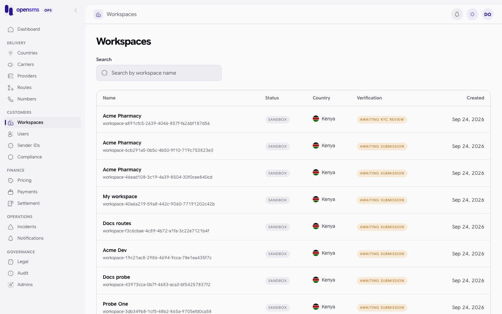
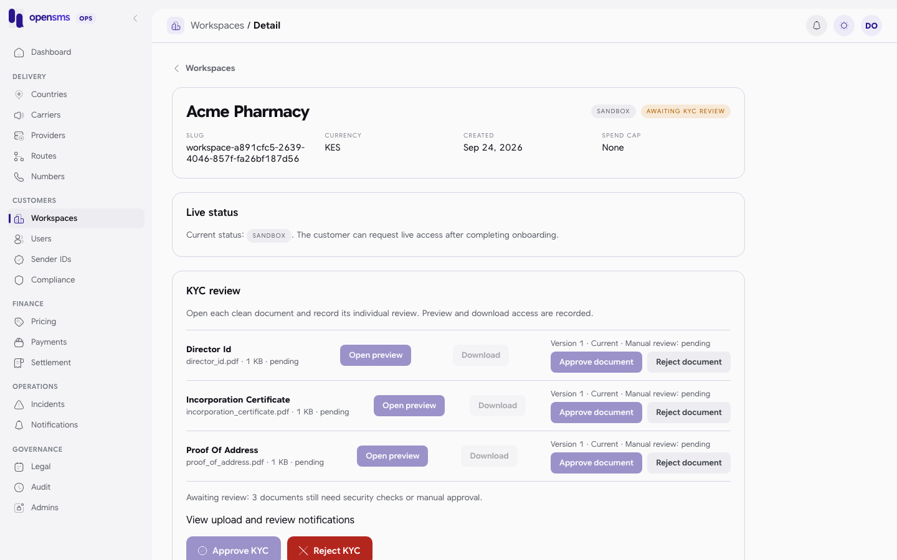
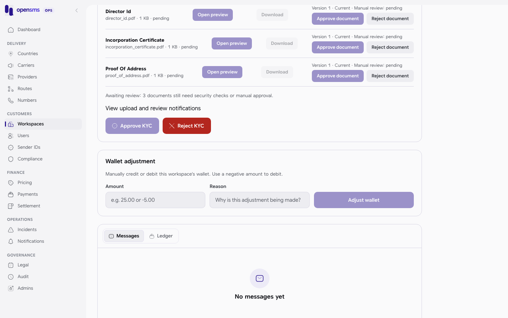

# Workspaces

A workspace is one customer account: its members, wallet, messages and sending status. The Workspaces pages (`/admin/workspaces` and `/admin/workspaces/{id}`) let operators find a customer, review their company verification (KYC) documents, decide their live-sending request, and read their messages and wallet ledger. The list and detail are open to every role. KYC decisions, document reviews and live status changes are for `ops` and `superadmin`.



## The path from sandbox to live

Every new workspace starts in **sandbox**. It moves to live like this. Steps 1 to 3 are done by the customer, the rest by operators.

1. The owner verifies their email and submits **company details** (name, country, registration number).
2. The owner uploads the three **KYC documents**: incorporation certificate, proof of address and director ID.
3. Each file is scanned for malware. Only files that come back `clean` can be reviewed.
4. An ops operator **reviews each document** (approve or reject), then **approves or rejects KYC** for the workspace.
5. The customer accepts the current terms and DPA, funds the live wallet and **requests live access**. The workspace moves to `pending_review`.
6. An ops operator **approves live access**. Before it allows this, the API checks all of the following again:
   - KYC is approved
   - email verified, company details, documents, admin approval and wallet funding steps are all approved
   - the owner has accepted the current terms and DPA
   - every active owner and finance member has two-factor authentication turned on
   - there is an active owner

| `live_status` | Meaning | Operator actions |
|---|---|---|
| `sandbox` | Test traffic only. | None. The customer must request live access. |
| `pending_review` | Customer asked for live. | Approve live access, or return to sandbox. |
| `live` | Real traffic allowed. | Suspend sending. |
| `suspended` | Sending stopped (by an operator, or automatically when the only owner was banned). | Approve live access again, or restore sandbox. |

| `kyc_status` | Meaning |
|---|---|
| `pending` | Nothing submitted yet. The console shows "Awaiting submission". |
| `submitted` | Company details and all three documents are in. The console shows "Awaiting KYC review". |
| `approved` | KYC approved. Documents can no longer be reviewed again. |
| `rejected` | Rejected, or a document was rejected. The customer must resubmit. |

## Find a workspace

1. Open **Workspaces**. The newest workspaces are listed first.
2. Use **Next** and **Previous** to page through the list, then click a row to open its detail page.

> **Known issue.** The **Search by workspace name** box does not narrow the list. Each keystroke re-requests the page with a `search` parameter that the API ignores, and the console does not filter the rows itself, so the same unfiltered page comes back (`GET /admin/v1/workspaces?search=zzzz-no-such-name&limit=2` still answered `200` with workspaces on the docs stack). Find a workspace through its owner on [Users](users.md) instead, or page through the list.

`GET /admin/v1/workspaces?limit=5` returns `{items, next_cursor}` with id, name, slug, country, currency, `live_status`, `kyc_status` and `created_at` for each workspace.

## Review KYC documents



1. Open the workspace. The **KYC review** card lists each document with its version, scan status and review status.
2. For a document whose scan is `clean`, click **Open preview** or **Download**. You must open the exact version before you can record a decision: the API checks that you downloaded it.
3. Click **Approve document**, or **Reject document** and enter a reason (5 to 1000 characters). The customer sees the reason.
4. When all three current documents are clean and approved, click **Approve KYC**. To refuse, click **Reject KYC** and enter a reason.

Rules the API enforces:

- A document that is not scanned clean cannot be downloaded (`404 document not found`) or approved:

  ```json
  409 {"type":"about:blank","title":"Conflict","status":409,"detail":"document must pass security scanning before human approval"}
  ```

- A decision cannot be changed, and an old version cannot be reviewed once a newer one exists: `409 current pending document version required`.
- Rejecting a document also sets the workspace KYC to `rejected`.
- KYC approval needs every current required document clean and approved:

  ```json
  409 {"type":"about:blank","title":"Conflict","status":409,"detail":"each current required document must pass scanning and human review before KYC approval"}
  ```

### Example: reject KYC (real calls)

```http
POST /admin/v1/workspaces/7620422f-fe95-4862-8023-6968a7ad2e5d/kyc/reject
{"reason":"Proof of address is older than three months. Upload a recent utility bill."}
```

```http
HTTP/1.1 204 No Content
```

The workspace afterwards (trimmed to the changed fields):

```json
{"kyc_status":"rejected","live_status":"sandbox","company_details_status":"rejected","documents_uploaded_status":"rejected","reviewed_documents_count":0}
```

KYC approve is `POST /admin/v1/workspaces/{id}/kyc/approve` with no body, `{}` or `{"reason":"..."}` and also returns `204`. A KYC rejection reason is required (up to 1000 characters); an empty one returns `422 rejection reason is required and must be at most 1000 characters`.

> **Known issue (API shape).** KYC approve and reject answer `204 No Content` with no body, not the updated workspace. Re-read `GET /admin/v1/workspaces/{id}` to see the new `kyc_status`, as above.

## Decide a live-access request

1. Open a workspace whose live status is pending review. The Live status card says "The customer has requested live sending."
2. Check KYC, funding, legal acceptance and member two-factor status.
3. Click **Approve live access** (only enabled when KYC is approved), or **Return to sandbox**. Enter a decision reason and click **Save decision**.
4. For a live workspace that must stop sending, click **Suspend sending** and give a reason.

API: `PUT /admin/v1/workspaces/{id}` with `{"live_status":"live"|"sandbox"|"suspended","reason":"..."}`. A reason is required for sandbox and suspended. Invalid moves are refused. For example, trying to make a sandbox workspace live directly (real call):

```json
409 {"type":"about:blank","title":"Conflict","status":409,"detail":"invalid workspace status transition"}
```

Restoring a suspended workspace to sandbox (real call, after its owner was banned and unbanned on the [Users](users.md) page):

```http
PUT /admin/v1/workspaces/a8d489fd-9259-4504-8d27-61a451830f05
{"live_status":"sandbox","reason":"Owner unbanned after review"}
```

```json
200 {"id":"a8d489fd-9259-4504-8d27-61a451830f05","name":"Docs admin-users","slug":"workspace-0300e266-1a62-4920-82a1-8a0ac0e06a6a","country_id":"","country_iso2":"","country_name":"","currency":"KES","live_status":"sandbox","kyc_status":"pending","created_at":"2026-09-24T07:22:21.745604+03:00"}
```

Other refusals you may see: `422 all active owners and finance members must enable two-factor authentication before live activation`, `422 live sending prerequisites are incomplete`, `422 Restore or assign an active owner before reactivating this workspace.`

### What could not be done on the docs stack

The full sandbox-to-live path was not completed locally, for two reasons. The file scanner is disabled (`scanner.status: "disabled"` at `GET /admin/v1/operations/file-scanning`), so no uploaded document ever becomes `clean` and approvable. And a live wallet cannot be funded because payments are disabled. The KYC and live-status gates above were each exercised up to the point where they refused.

## Messages and ledger

At the bottom of the detail page, the **Messages** and **Ledger** tabs page through the workspace's messages and wallet ledger (`GET /admin/v1/workspaces/{id}/messages` and `/ledger`, each `{items, next_cursor}`).



## Wallet adjustment (not available)

> **Known issue.** The **Wallet adjustment** card (Amount, Reason, **Adjust wallet**) looks usable for finance and superadmin, but it posts to an endpoint that does not exist. The API has no manual wallet credit or debit. Real response:
>
> ```http
> POST /admin/v1/workspaces/074cfe82-f573-4c3e-a6f2-3b246175b94f/wallet/adjust
> {"amount":"25.00","reason":"Goodwill credit"}
> ```
>
> ```json
> 404 {"type":"https://api.opensms.io/problems/not_found","title":"Not Found","status":404,"detail":"The requested endpoint was not found.","code":"not_found"}
> ```

To put money into a wallet, use the supported, audited paths instead: approve a manual bank transfer ([Payments](payments.md)), or refund a specific charge (message, number, sender registration or lookup refunds, below).

## Refunds (finance)

Finance and superadmin can refund one original charge to the workspace wallet. Each refund is tied to the original ledger entry, can never exceed it, and needs an `Idempotency-Key` and a fresh authenticator code:

| Refund | Endpoint |
|---|---|
| Message charge | `POST /admin/v1/workspaces/{id}/refunds` |
| Number purchase or renewal | `POST /admin/v1/workspaces/{id}/number-refunds` |
| Rejected sender registration fee | `POST /admin/v1/workspaces/{id}/sender-registration-refunds` |
| Paid number lookup | `POST /admin/v1/workspaces/{id}/lookup-refunds` |

None of these has a console form. They were not run for these docs because the docs stack has no live charges to refund. See the [API reference](api-reference.md#workspaces) for their fields.

## Related

- [Users](users.md): the people in a workspace.
- [Sender IDs](sender-ids.md): the workspace's sender applications.
- [Payments](payments.md): manual transfers that fund the wallet.
- [Notifications](notifications.md): get told when a workspace submits documents or requests live access.
