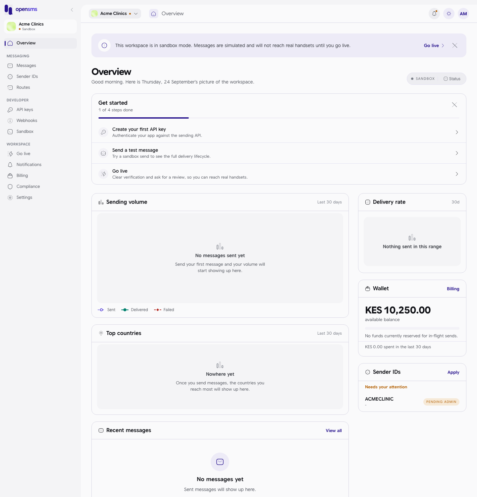

# The OpenSMS web app

These guides walk through the OpenSMS web app (the "console") one task at a time: signing in, setting up your workspace, sending messages, managing sender IDs and keys, paying for messages and going live. They are written for people who use the app in a browser, such as business owners, operations staff and finance teams. You do not need to be technical. Developers who want the API should read the integration guides instead; each page here ends with pointers for them where it helps.

Every screenshot comes from a real walk through the app. Some show the messages you see when a step is refused, so you know what they mean.

## Where to start

If you are new, go through these in order:

1. [Signing up and signing in](signing-up-and-signing-in.md): create your account and verify your email.
2. [Onboarding](onboarding.md): pick your markets and your first sender ID.
3. [Legal acceptance](legal-acceptance.md): the terms screen you meet on your first visit.
4. [Overview dashboard](overview-dashboard.md): the home page and its **Get started** checklist.
5. [Sandbox](sandbox.md): send free test messages before you go live.
6. [Go live](go-live.md): the checklist that unlocks real sending.

## How the app is laid out

| Area | What it holds |
| --- | --- |
| Left-hand menu | Every section, grouped as **Messaging**, **Developer** and **Workspace**. The arrow at the top collapses it to icons; the app remembers your choice on this browser. |
| Workspace block (top of the menu) | The workspace you are in and its status: **Sandbox**, **In review**, **Live** or **Suspended**. (The Overview banner calls the review state "Pending review".) |
| Workspace switcher (top bar, left) | Switch workspace, create another one, or see them all. See [Choose a workspace](signing-up-and-signing-in.md#choose-a-workspace). |
| Breadcrumb (top bar) | The section and page you are on. |
| Bell (top bar, right) | Opens your [notifications](notifications.md). A dot means something is unread. |
| Sun icon (top bar, right) | Switches between light and dark colours. |
| Your initials (top bar, right) | Account menu: **Account settings**, **Security**, **Team** and **Log out**. |

### The menu, section by section

| Menu entry | Guide | What you do there |
| --- | --- | --- |
| Overview | [Overview dashboard](overview-dashboard.md) | See volume, delivery, wallet and sender IDs at a glance. |
| Messages | [Messages](messages.md) | Read your message history, send one message, or upload a batch. |
| Sender IDs | [Sender IDs](sender-ids.md) | Apply for the name your messages come from, and follow its review. |
| Routes | [Routes](routes.md) | See which countries and carriers OpenSMS can reach, and set fallback. |
| API keys | [API keys](api-keys.md) | Create, rotate and revoke keys for your software. |
| AI assistants | [AI assistants](ai-assistants.md) | Connect Claude, ChatGPT or another assistant, approve what it may do, and disconnect it (not in production yet). |
| Webhooks | [Webhooks](webhooks.md) | Tell OpenSMS where to send delivery updates. |
| Sandbox | [Sandbox](sandbox.md) | Test numbers that force a result, and the sandbox inbox. |
| Go live | [Go live](go-live.md) | The checklist between sandbox and real sending. |
| Notifications | [Notifications](notifications.md) | Your inbox of workspace alerts. |
| Billing | [Billing](billing.md) | Wallet balance, credits, transactions and (once live) invoices. |
| Compliance | [Compliance and verification](compliance-and-verification.md) | Numbers you must not message, quiet hours and content rules. |
| Settings | [Settings](settings.md) | Workspace, team, security, notification choices and legal. |

### Pages that are not in the menu

Some finished pages are not listed in the left-hand menu in this version of the app. You can still open them by typing the address after your console's web address (for example `https://your-console/app/contacts`):

| Page | Address | Guide |
| --- | --- | --- |
| Contacts and groups | `/app/contacts` | [Contacts and groups](contacts-and-groups.md) |
| Templates | `/app/templates` | [Templates](templates.md) |
| Numbers | `/app/numbers` | [Numbers](numbers.md) |
| Inbound | `/app/inbound` | [Inbound](inbound.md) |
| Verification codes | `/app/otp` | [OTP](otp.md) |
| Usage | `/app/usage` | [Usage](usage.md) |
| Business verification | `/app/verification/company` | [Compliance and verification](compliance-and-verification.md#business-verification) (also reachable from [Settings](settings.md) and [Go live](go-live.md)) |
| System status (public, no sign-in needed) | `/status` | [System status page](status-page.md) |

## Roles in one table

Everyone in a workspace has one role. The role decides which buttons work for you; buttons you cannot use are greyed out, and hovering usually tells you why.

| Role | In short |
| --- | --- |
| Owner | Everything, including going live, deleting the workspace and handing it to someone else. A workspace always has at least one owner. |
| Admin | Everything except deleting the workspace, requesting to go live, and editing the spend cap and data retention. |
| Developer | Send messages, sandbox API keys, webhooks, templates, contacts, read analytics and the wallet. |
| Finance | Read messages and analytics, see billing and add credits. |
| Viewer | Read messages, analytics and the wallet balance. |

Each guide has its own "who can do this" note. Roles are managed in [Settings > Team](settings.md#team).

## All guides

- [Signing up and signing in](signing-up-and-signing-in.md)
- [Onboarding](onboarding.md)
- [Legal acceptance](legal-acceptance.md)
- [Overview dashboard](overview-dashboard.md)
- [Messages](messages.md)
- [Contacts and groups](contacts-and-groups.md)
- [Templates](templates.md)
- [Sender IDs](sender-ids.md)
- [Numbers](numbers.md)
- [Inbound](inbound.md)
- [OTP (verification codes)](otp.md)
- [Webhooks](webhooks.md)
- [API keys](api-keys.md)
- [AI assistants](ai-assistants.md)
- [Usage](usage.md)
- [Billing](billing.md)
- [Routes](routes.md)
- [Sandbox](sandbox.md)
- [Go live](go-live.md)
- [Compliance and verification](compliance-and-verification.md)
- [Notifications](notifications.md)
- [Settings](settings.md)
- [System status page](status-page.md) (public, no sign-in)
