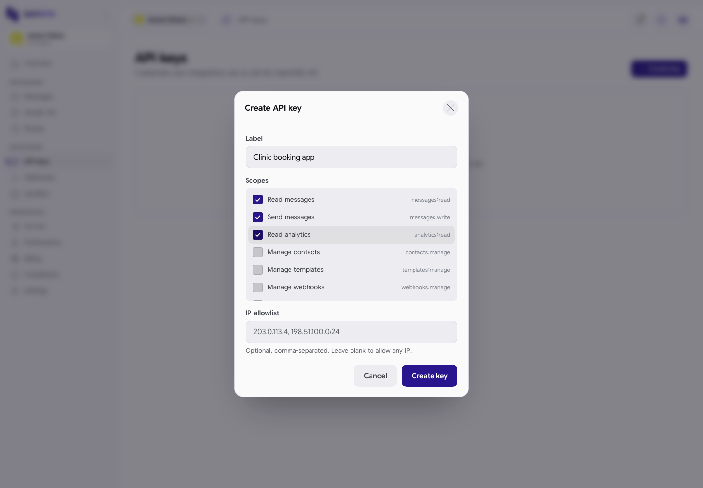
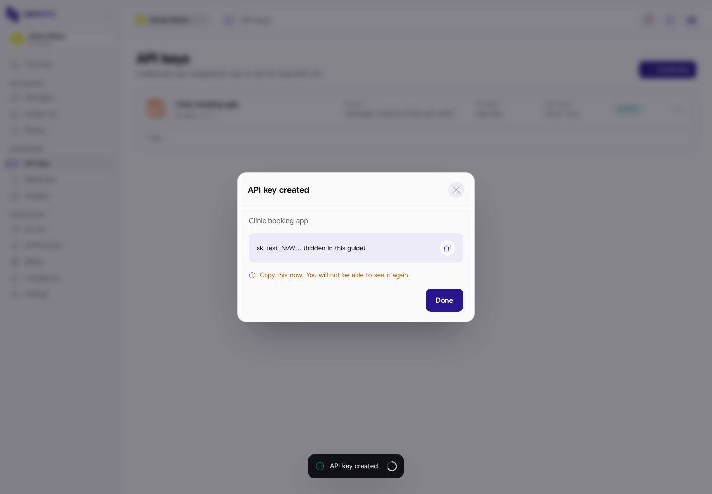
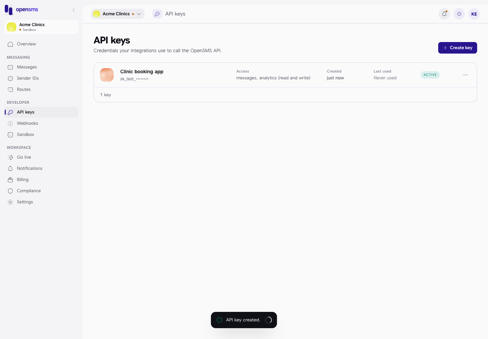
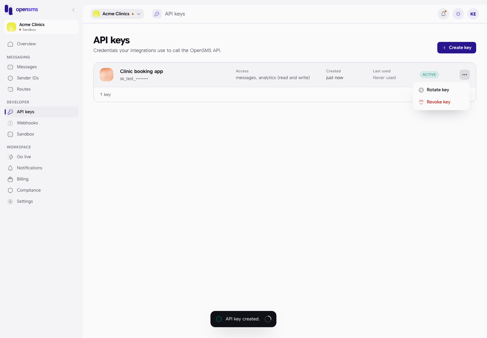
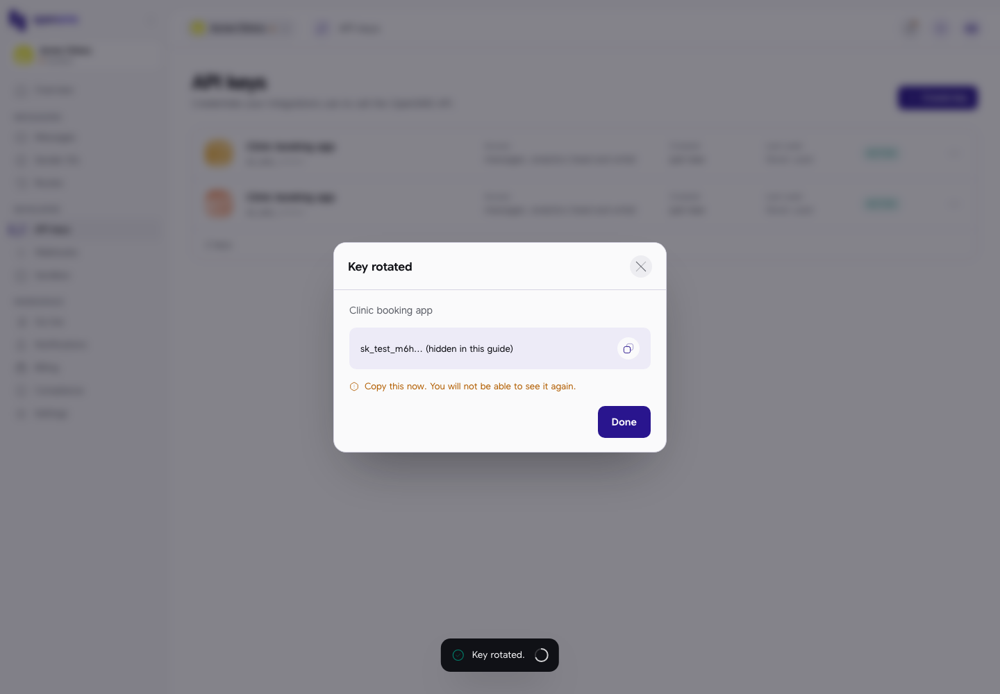
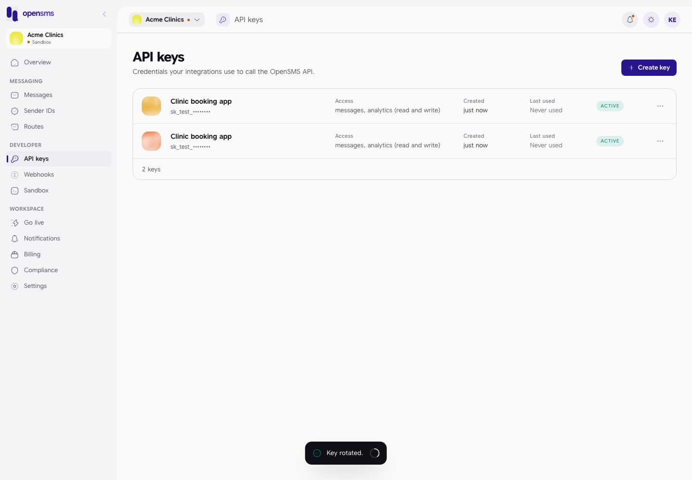
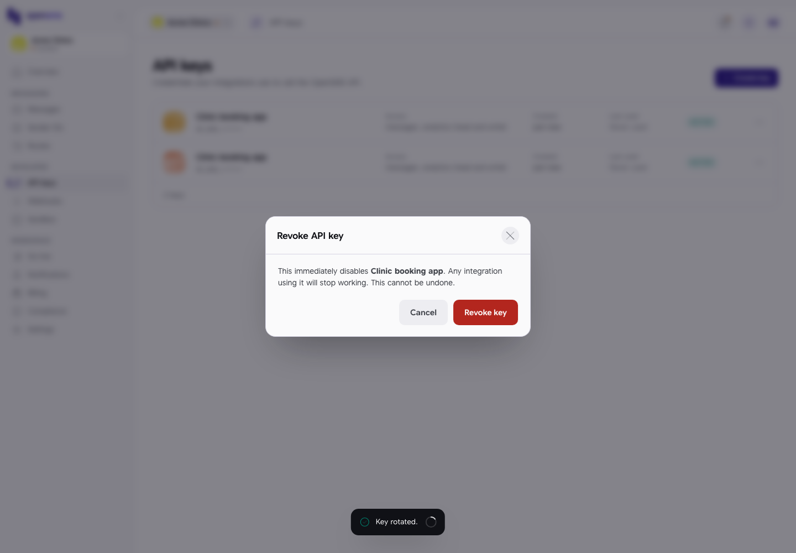
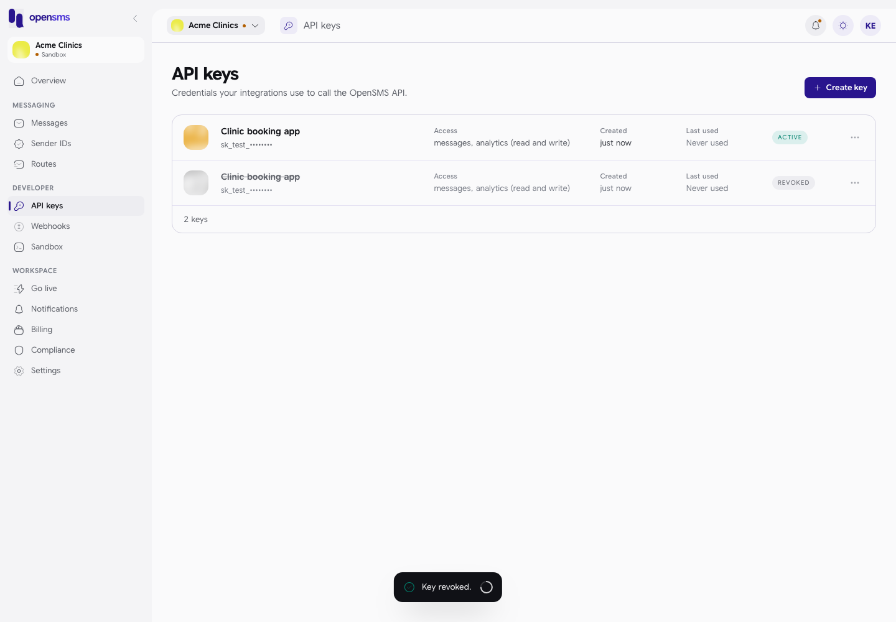

# API keys

An API key is the password your own software (a website, an app, a booking system) uses to send messages through OpenSMS. This page covers creating keys, choosing what each key may do, copying the secret, replacing ("rotating") a key and switching one off ("revoking"). It is for workspace owners and admins, and for developers in sandbox workspaces. You do not need to be technical to create a key for a developer, but treat the secret like a password.

Open **API keys** in the left-hand menu, under **Developer** (`/app/api-keys`).

## Who can do what

| Action | Owner | Admin | Developer | Finance | Viewer |
| --- | --- | --- | --- | --- | --- |
| See the key list | Yes | Yes | Yes (sandbox keys only) | No | No |
| Create sandbox keys | Yes | Yes | Yes | No | No |
| Create live keys | Yes | Yes | No | No | No |
| Rotate or revoke any key | Yes | Yes | No | No | No |
| Give a key the extra scopes marked "privileged" below | Yes | Yes | No | No | No |

Once a workspace is live, owners (and finance members) must have [two-factor authentication](settings.md#security) turned on before they can create live keys; the page tells you and links to the Security page if it is missing.

Rotating and revoking are owner and admin actions on the server, even in sandbox: the console shows **Rotate key** and **Revoke key** to developers too, but the server refuses them ("Key rotation requires owner or admin access." / "Key revocation requires owner or admin access."). Finance and viewer members get "key administration is restricted" from the server if they open the page.

## Sandbox keys and live keys

A key belongs to the environment your workspace is in when you create it:

| Workspace status | Key starts with | What it can do |
| --- | --- | --- |
| Sandbox | `sk_test_` | Send simulated messages only. Free. |
| Live | `sk_live_` | Send real messages, charged to your wallet. |

There is no switch on the page to choose: the console decides from the workspace's status.

## Create a key

1. Click **Create key**. A new workspace shows **No API keys yet** with the same button.
2. Fill in the form:

   | Field | What to enter |
   | --- | --- |
   | Label | A name that says where the key is used, for example `Clinic booking app`, up to 128 characters. **Fill it in:** the form lets you leave it empty, but the server then refuses with "label is required". |
   | Scopes | What the key is allowed to do. **Read messages** and **Send messages** are ticked for you. Tick only what the software needs. |
   | IP allowlist | Optional. The internet addresses the key may be used from, separated by commas, for example `203.0.113.4, 198.51.100.0/24`. Leave it empty to allow any address. |

3. Click **Create key**.



### Scopes you can pick

| Scope on screen | Code | Privileged |
| --- | --- | --- |
| Read messages | `messages:read` | |
| Send messages | `messages:write` | |
| Read analytics | `analytics:read` | |
| Manage contacts | `contacts:manage` | |
| Manage templates | `templates:manage` | |
| Manage webhooks | `webhooks:manage` | |
| Stream live events | `realtime:read` | |
| Manage sender IDs | `senders:manage` | Yes |
| Read wallet balance | `wallet:read` | Yes |
| Top up the wallet | `wallet:topup` | Yes |
| Read numbers | `numbers:read` | Yes |
| Manage numbers | `numbers:manage` | Yes |
| Read compliance lists | `compliance:read` | Yes |
| Manage compliance lists | `compliance:manage` | Yes |

Privileged scopes are only listed for owners and admins. The API itself supports a few more scopes than the console lists (for example `lookup:request` for number lookups and `pricing:read`); a developer can request those through the API.

## Copy the secret: shown once

Right after you create a key, a box titled **API key created** shows the full secret with a copy button, and the warning **Copy this now. You will not be able to see it again.**



1. Click the copy button (you see "Copied to clipboard.") and paste the secret straight into your software's settings or a password manager.
2. Click **Done**.

After that, OpenSMS only ever shows the start of the key (`sk_test_••••••••`). If you lose the secret, you cannot get it back: [rotate](#rotate-a-key) the key or create a new one. (In the screenshots in this guide the secret is cut short on purpose.)

## The key list



Each key shows its label and masked prefix, **Access** (a short summary of its scopes; hover over it to see the exact list), **Created**, **Last used** ("Never used" until your software first uses it) and **ACTIVE** or **REVOKED**.

The **...** button on each row has **Rotate key** and **Revoke key**:



## Rotate a key

Rotating gives you a new secret with the same label and scopes, for example after a developer leaves or a secret may have leaked.

1. Click **...** on the key and choose **Rotate key**.
2. A box titled **Key rotated** shows the new secret, once. Copy it and click **Done**. You see "Key rotated."
3. Put the new secret into your software.
4. When your software is using the new secret, revoke the old key (next section).



What happens to the old key: it keeps working for **24 hours** after you rotate, so your software does not break mid-change, and then stops. During that time the list shows **two ACTIVE rows with the same label**; the newer one is at the top. The page does not show when the old one expires.



## Revoke a key

Revoking switches a key off immediately and permanently.

1. Click **...** on the key and choose **Revoke key**.
2. Read the warning: "This immediately disables *label*. Any integration using it will stop working. This cannot be undone."
3. Click **Revoke key**. You see "Key revoked." The row stays in the list, crossed out, marked **REVOKED**.





## For your developer

The same actions exist in the API (`POST /v1/keys`, `POST /v1/keys/{id}/rotate`, `DELETE /v1/keys/{id}`, all with a signed-in session). This is a real response from creating a sandbox key, with the secret shortened:

```json
{
  "key": "sk_test_V4mv...",
  "key_info": {
    "id": "86b1dca3-0f75-4622-af89-a10d8bb07ce5",
    "prefix": "sk_test_",
    "label": "rot",
    "scopes": ["messages:read", "messages:write"],
    "created_at": "2026-09-24T08:36:31.70649+03:00",
    "last_used_at": null
  }
}
```

After a rotation, the old key's entry in `GET /v1/keys` gains an `expires_at` 24 hours after the rotation. A revoked key answers `401` from then on. The integration guides in this documentation cover using keys in code.

## Related

- [Sandbox](sandbox.md)
- [Webhooks](webhooks.md)
- [Settings: security](settings.md#security)
- [Go live](go-live.md)
