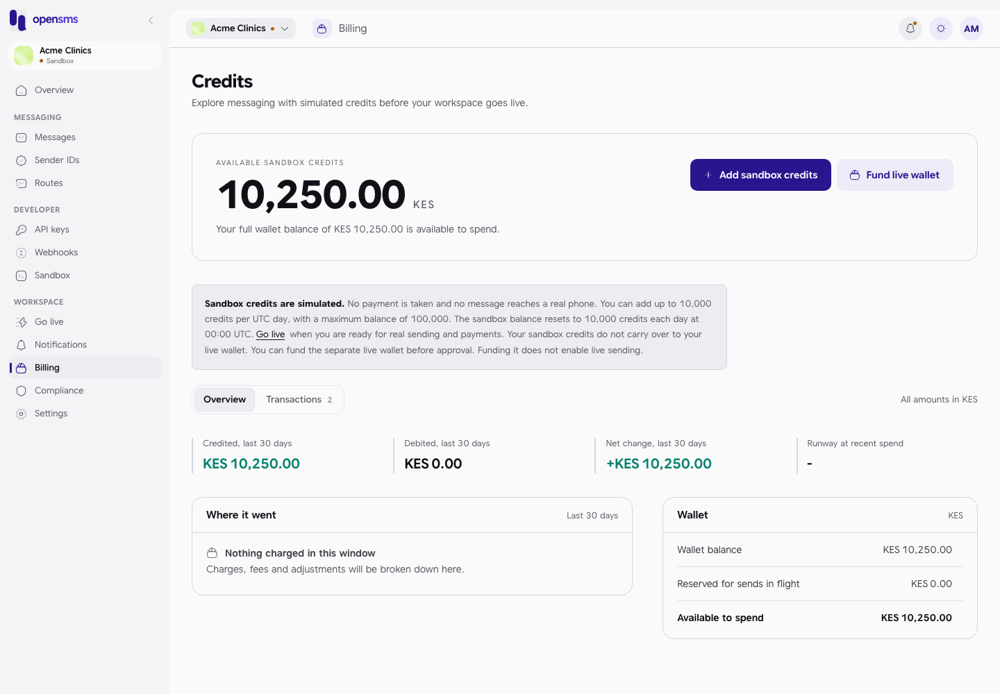
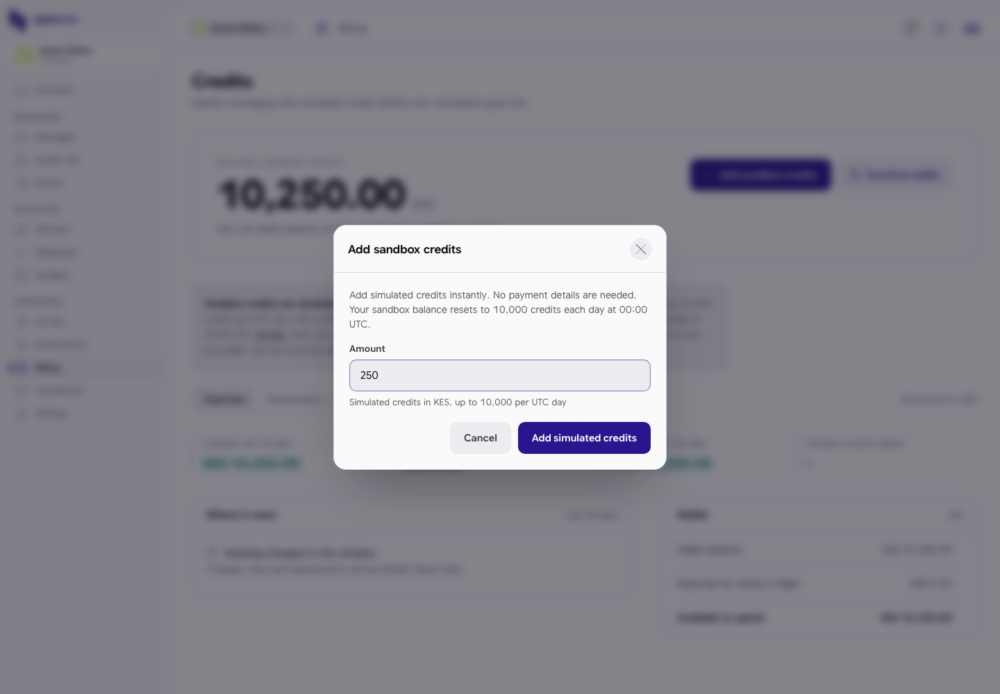
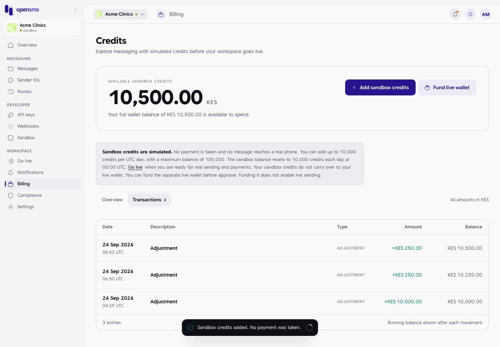
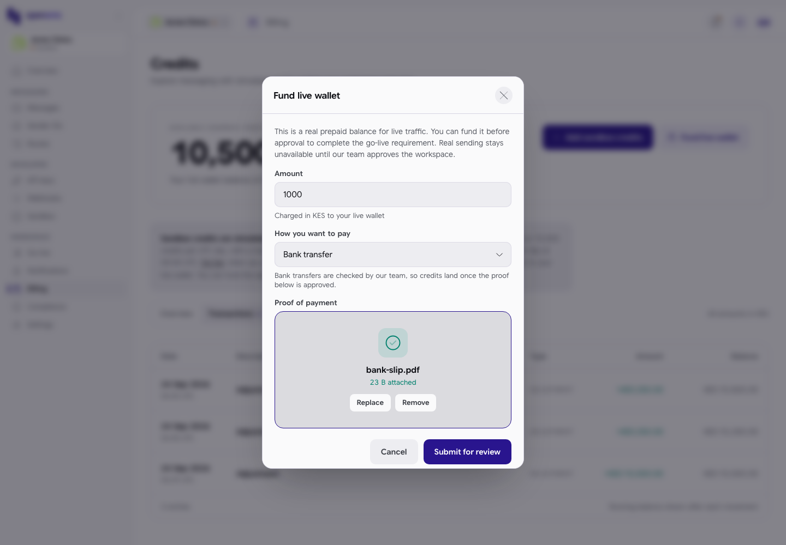
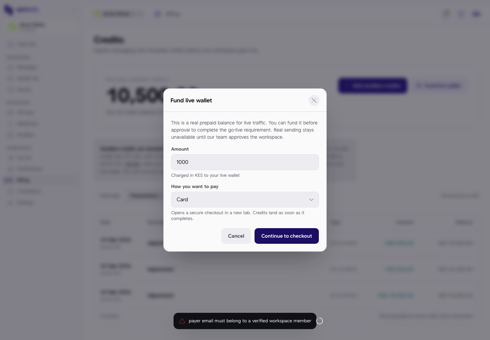

# Billing

OpenSMS is prepaid: you put money in a wallet and each message is paid for from it. The Billing page shows your balance, lets you add credits, lists every movement on the wallet and, once your workspace is live, shows payments, invoices and saved payment methods. This guide is for workspace owners, admins and finance members, who can add credits, and for anyone else who wants to see the balance.

Open **Billing** in the left-hand menu, under **Workspace** (`/app/billing`). The page title is **Credits**.

## Two wallets: sandbox and live

Every workspace has two separate wallets in its currency (the currency comes from the country you chose at signup, for example KES for Kenya):

| Wallet | Money | Used for |
| --- | --- | --- |
| Sandbox | Simulated credits. No payment is ever taken. | Test messages while the workspace is in [sandbox](sandbox.md). |
| Live | Real prepaid balance. | Real messages once the workspace is [live](go-live.md). |

Sandbox credits never carry over to the live wallet. You can put money in the live wallet **before** you are approved (it is one of the [Go live](go-live.md) requirements), but that alone does not switch on real sending.

The page shows the wallet for the workspace's current status: a sandbox workspace sees its sandbox wallet.

## Who can do what

| Action | Owner | Admin | Finance | Developer | Viewer |
| --- | --- | --- | --- | --- | --- |
| See balance and transactions | Yes | Yes | Yes | Yes | Yes |
| Add sandbox credits | Yes | Yes | Yes | No | No |
| Fund the live wallet, set auto top-up | Yes | Yes | Yes | No | No |
| Download invoice PDFs, remove saved payment methods | Yes | Yes | Yes | No | No |

If your role cannot add credits, the buttons are greyed out and hovering says "Your role can view billing but not add credits." Once a workspace is live, owners and finance members must also have [two-factor authentication](settings.md#security) on to add credits; until then a notice on the page asks you to turn it on in Settings, Security.

## The page

- **Available sandbox credits** (or **Available balance** once live): what you can spend now. The line below says whether any of it is held for messages still being sent, for example "Your full wallet balance of KES 10,000.00 is available to spend."
- **Add sandbox credits** and **Fund live wallet** (sandbox workspaces), or **Add credits** and **Auto top-up** (live workspaces).
- A grey box explaining sandbox credits (sandbox only).
- Tabs: **Overview** and **Transactions** always; **Payments**, **Invoices** and **Payment methods** once live. "All amounts in KES" (your currency) is shown at the right.

### Overview tab

| Figure | Meaning |
| --- | --- |
| Credited, last 30 days | Money added to the wallet in the last 30 days. |
| Debited, last 30 days | Money taken out (message charges, fees, adjustments down). |
| Net change, last 30 days | Credited minus debited. |
| Runway at recent spend | Roughly how many days your balance lasts at the last 30 days' spending. **-** until you have spent something. |

**Where it went** splits the money taken out in the last 30 days by type (Charge, Fee, a downward Adjustment and so on); credits added do not count, so until something is spent it says **Nothing charged in this window**. **Wallet** shows the wallet balance, the amount **Reserved for sends in flight**, and **Available to spend**.

## Sandbox credits

A new workspace's sandbox wallet is filled to **10,000 credits** within a few seconds of signup, and is reset to 10,000 every day at 00:00 UTC. If you need more for a test:

1. Click **Add sandbox credits**.
2. Enter an **Amount**, for example `250`.
3. Click **Add simulated credits**.

You see "Sandbox credits added. No payment was taken." and the balance goes up straight away.

Limits, as the page and the server enforce them:

| Rule | What happens if you break it |
| --- | --- |
| Each addition must be between 0.01 and 10,000.00. | "Practice credit amount must be between 0.01 and 10,000.00." |
| At most 10,000 added per workspace per UTC day. | "Daily practice credit limit is 10,000.00 across this workspace." |
| The balance may not go above 100,000. | "Practice balance cannot exceed 100,000.00." (Not reachable in practice today: the daily reset and the daily limit keep the balance at or below 20,000.) |
| The daily reset sets the balance back to 10,000. | Extra credits you added are gone the next day. |

## Transactions tab

Every movement on the wallet, newest first, with its date and time (UTC), a description, the type, the amount (green with **+** for money in) and the balance after it.

In the screenshot, the bottom row is the balance being set to 10,000 and the two rows above it are 250 credits added by hand, twice; all three are type **ADJUSTMENT**. Other types you can meet are Top-up, Charge, Refund, Reserve, Release and Fee. The table shows up to the latest 200 movements.

## Fund the live wallet

Real money goes into the live wallet. In a sandbox workspace use **Fund live wallet**; in a live workspace use **Add credits**. Both open the same form.

1. Enter the **Amount** in your currency.
2. Choose **How you want to pay**: **Card**, **Mobile money** or **Bank transfer**.
3. For card or mobile money, click **Continue to checkout**. A secure payment page opens in a new tab; credits land as soon as the payment completes there.
4. For bank transfer, attach a **Proof of payment** (a screenshot or bank slip, as an image or PDF) and click **Submit for review**. Our team checks the transfer, and the credits land once it is approved. You see "Proof of payment submitted. Your live wallet will be funded after review."

Requirements the server checks:

- The payment must be started by a workspace member with a **verified email**. Otherwise you see "payer email must belong to a verified workspace member".
- A bank-transfer proof needs **two-factor authentication** turned on for your login. Otherwise you see "Authorized membership and enabled two-factor authentication required."

## Live-only tabs

These appear only once the workspace is live.

### Payments

Each settled payment into the wallet with its date, status (for example **Paid**) and amount. The footer notes that the list is rebuilt from the wallet history, so the payment channel and provider are not shown. Empty: "No payments yet".

### Invoices

One invoice per billing period once the period closes, with its number, period, issue date, subtotal, VAT and total. The **...** menu on a row has **Download PDF** (owners, admins and finance only; other roles see "Your role can view invoices but not download their PDFs."). If no PDF is attached yet you see "No PDF is attached to this invoice yet." Empty: "No invoices yet" with "An invoice is issued for each billing period once it closes."

### Payment methods

Cards saved from successful payments, shown as for example "visa ending 4242", with the expiry date and when they were added. **Remove** asks for confirmation: removing a card means it can no longer be used for automatic top-ups, and removing the last one switches auto top-up off. Empty: "No saved payment methods".

### Auto top-up

The **Auto top-up** button (live only) opens a form to add credits automatically when the balance runs low:

| Field | What to enter |
| --- | --- |
| Automatically add credits when the balance runs low | Switch on or off. |
| Trigger below | The balance, in your currency, that starts a top-up. |
| Amount to add | How much to charge each time. |
| Saved card | One of your saved cards. Mobile money cannot be used. If you have none: "Add credits with a card first to save a payment method." |

Click **Save settings**. You see "Auto top-up settings saved."

## Statements

There is no statements page for customers. OpenSMS prepares monthly statement drafts for its own finance team (in the operator console), but they are not shown in the customer app. For your own records, use the **Transactions** tab, **Invoices** once you are live, or a full [data export](settings.md#data-export).

## Related

- [Go live](go-live.md) (funding the live wallet is one of the requirements)
- [Settings > Workspace](settings.md#workspace) (monthly spend cap)
- [Settings > Security](settings.md#security) (two-factor authentication)
- [Notifications](notifications.md) (low balance and spend cap alerts)
