# Compliance and verification

This guide covers two things that keep your messaging legal. **Compliance** (`/app/compliance`) is where you keep the list of numbers you must not message and read the quiet hours and content rules OpenSMS applies. **Business verification** (`/app/verification/company` and `/app/verification/documents`) is where the workspace owner tells OpenSMS who the business is and uploads the papers to prove it, which is required before you can [go live](go-live.md). It is written for workspace owners and admins, and for anyone who handles opt-outs or complaints.

## Compliance

Open **Compliance** in the left-hand menu, under **Workspace**. The page has three tabs: **Suppressions**, **Quiet hours** and **Content rules**.

**Who can change it:** owners and admins. Every other role can read the list, but the form is greyed out and a notice says "Your role can view the suppression list but not change it."

### Suppressions

A suppressed number is one OpenSMS will not message from this workspace, for example because the person replied STOP or complained. Sending to it is refused with "This destination is on your suppression list and cannot be messaged." (see [Messages](messages.md)). Numbers can land on the list by themselves when someone opts out, and you can add them by hand.

#### Add a number

1. On the **Suppressions** tab, type the **Number** with its country code, for example `+254 700 000009`. Spaces are fine.
2. Choose a **Reason**:

   | Reason | Use it when |
   | --- | --- |
   | Manual | Any other reason (the default). |
   | Stop keyword | The person replied with a stop word such as STOP. |
   | Complaint | The person complained about your messages. |
   | Invalid number | The number does not work. |

3. Click **Add suppression**. You see "Number suppressed." and the number appears in the list.

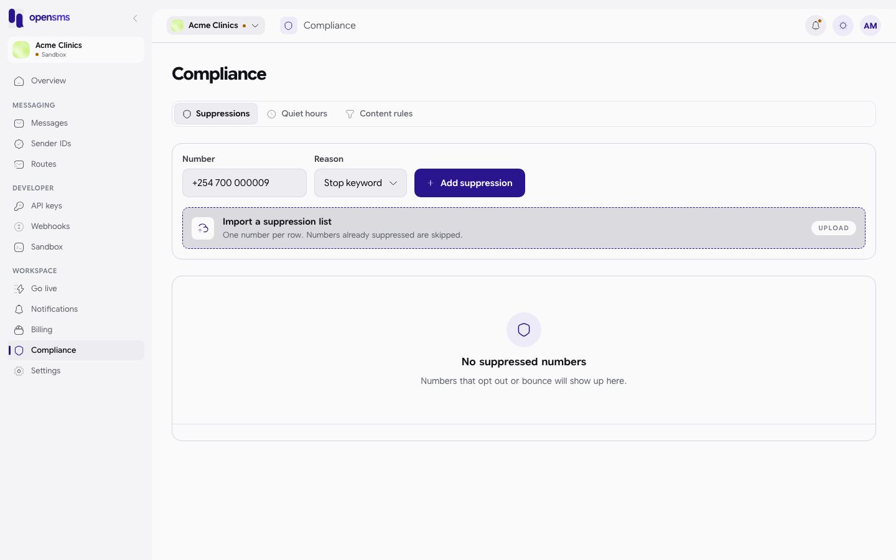

A number without a country code (for example `0700 12`) is refused on the spot with "Enter a valid number in E.164 format, e.g. +254700000000.":

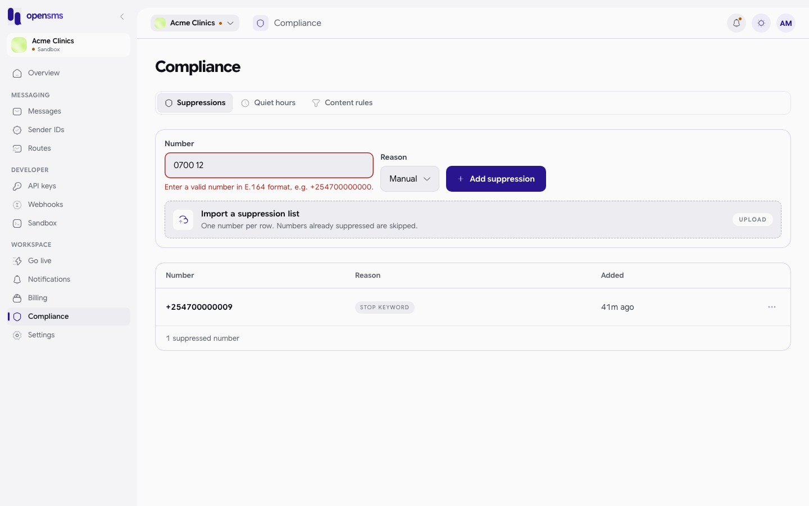

The list shows each **Number**, its **Reason** and when it was **Added**, 50 per page with **Previous** and **Next** below. Empty: "No suppressed numbers" and "Numbers that opt out or bounce will show up here."

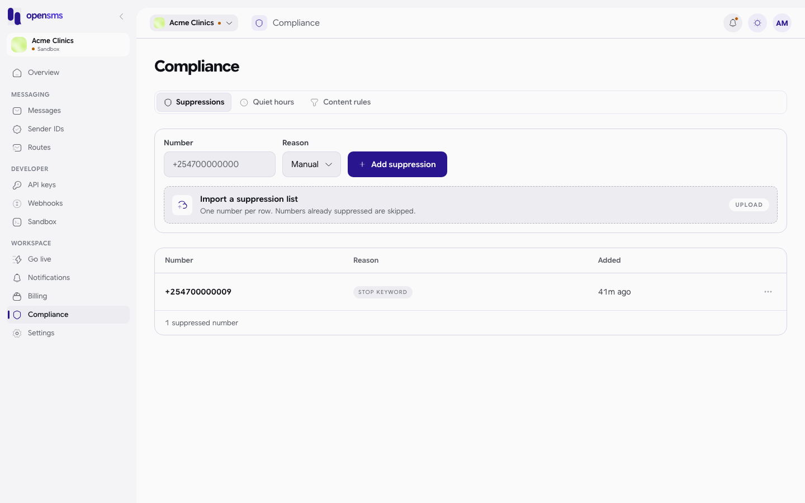

#### Remove a number

1. Click **...** at the end of the row and choose **Remove from list**.
2. Confirm with **Remove**. The message warns "They will become reachable again."
3. You see "Suppression removed."

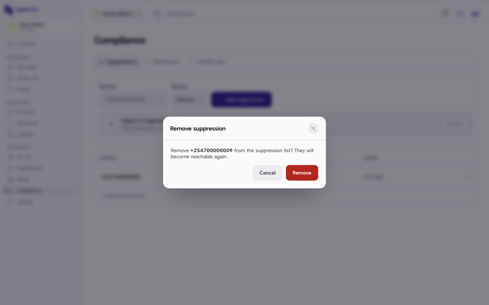

#### Import a list (does not work in this version)

The **Import a suppression list** box accepts a .csv or .txt file with one number per row. **In this version of the app every import fails** with "items must contain between 1 and 10000 suppressions": the app uploads the file, but the server only accepts the list in a different format that the app does not send. Until this is fixed, add numbers one at a time, or ask your developer to use the import API (`POST /v1/compliance/suppressions/import` with a JSON list), which works: a two-number import on the docs stack answered `{"created": 2, "received": 2}`.

### Quiet hours

Quiet hours are times of day when some kinds of message are held back until morning. A message held this way shows as **Scheduled** in [Messages](messages.md).

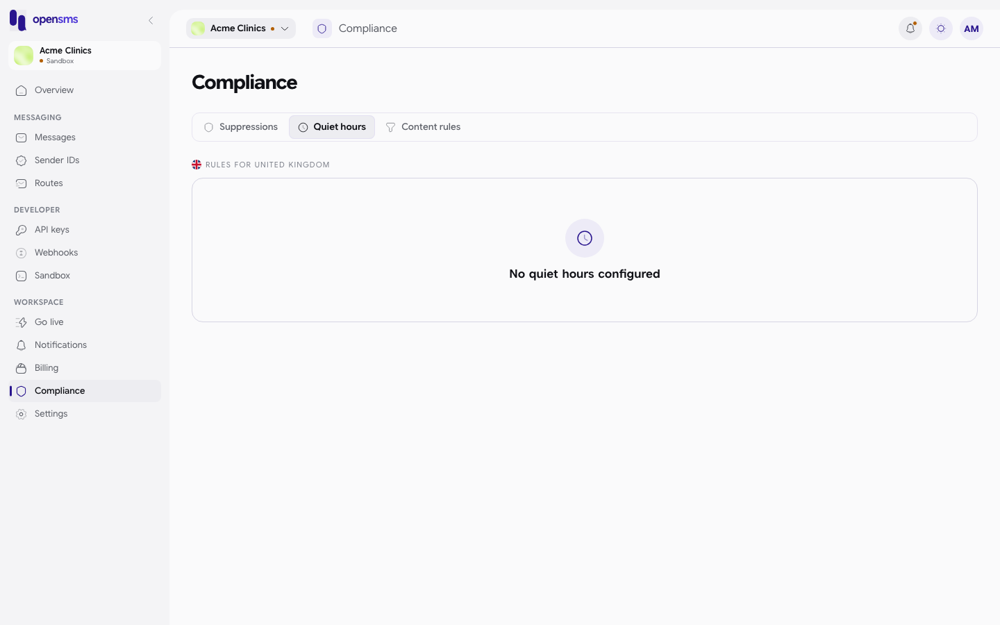

The table shows the **Traffic type** it applies to, the **Quiet window** in local time, and the **Enforcement** (**DEFER** means the message waits until the window ends).

**Limitation:** the tab only shows the rules for **one** country, the first active one in the platform's list, named above the table ("Rules for United Kingdom" in the screenshot). It does not follow your workspace's country or your markets. On the docs stack that meant the tab showed the United Kingdom, which has no quiet hours, while Kenya does have one. The rules still apply to every country you send to; they are just not all shown here. These are Kenya's rules as the API returned them on the docs stack:

| Traffic type | Quiet window (local time) | Enforcement |
| --- | --- | --- |
| Marketing | 21:00 to 08:00 | Defer |

### Content rules

Content rules are words or patterns that stop a message from being sent straight away. The tab shows the country's **Stop keywords** (the words that opt someone out) and a table of rules with the **Pattern**, **Kind**, the traffic it **Applies to**, the **Action** and whether it is **ENABLED**. The same one-country limitation applies.

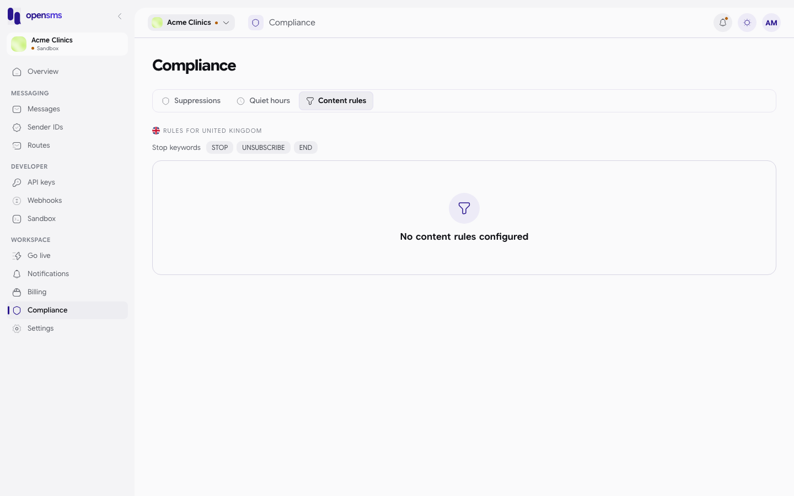

For Kenya the API returned the stop keywords STOP, UNSUBSCRIBE and END, and four blocked words, each set to **hold for review** for marketing and transactional messages: `loan`, `betting`, `casino` and `mkopo`. A held message waits for the OpenSMS team to release or reject it.

## Business verification

Business verification (sometimes called KYC, "know your customer") is how OpenSMS confirms your business is real. It is needed once, before your workspace can send real messages. Sandbox sending works without it, and the page says review typically takes 1 to 2 business days.

**Who can do this:** the workspace owner only. The server refuses anyone else with "workspace owner access required".

There are two steps. Reach them from **Go live** (**Fill in your details**, **Upload documents**), from **Settings > Business verification**, or at `/app/verification/company`.

### Step 1: company details

1. Fill in the form:

   | Field | What to enter |
   | --- | --- |
   | Company name | Your registered company name, for example `Acme Clinics Ltd`. |
   | Country of registration | The country the company is registered in. You can type to search the list. |
   | Registration number | The number on your certificate of incorporation, for example `PVT-2026-0042`. |

2. Click **Save and continue**. You move on to the documents step, and Company details shows **IN REVIEW** on the [Go live](go-live.md) checklist.

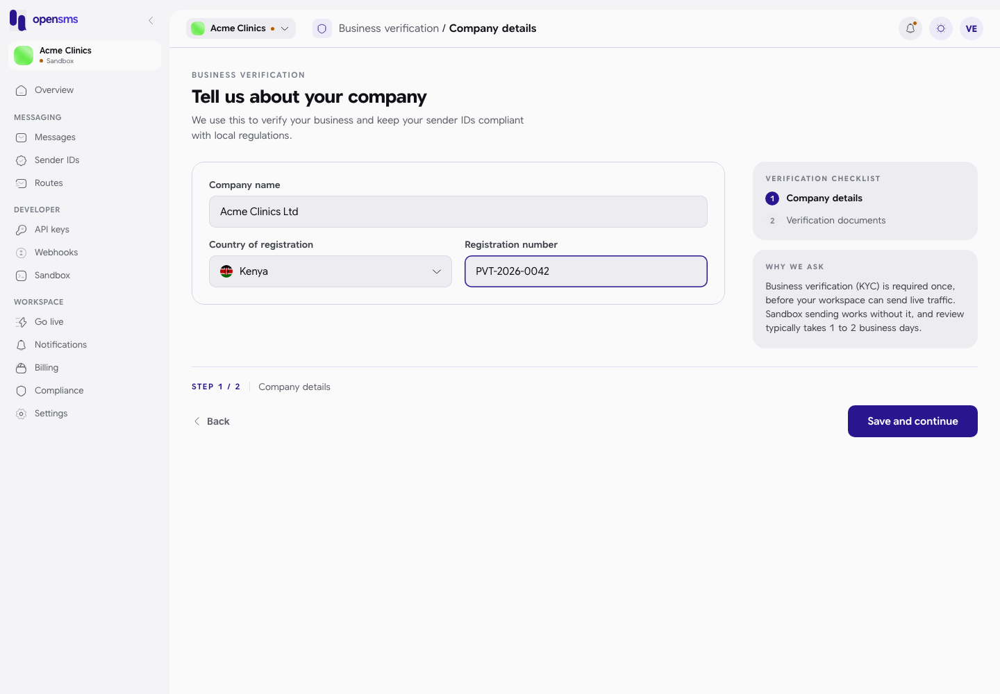

Leaving a field empty shows "Enter your company name.", "Choose a country." or "Enter a registration number.". The red messages stay on screen after you fill the fields in and only clear when you click **Save and continue** again:

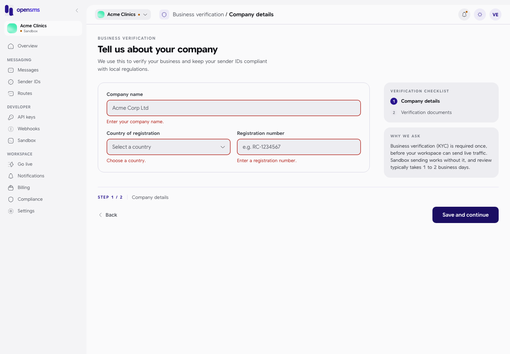

Once submitted, the details are locked while they are in review or approved: the fields are greyed out, a line says "Your company details are under review. Continue to the document step.", and the button reads **Continue to documents**.

If the reviewer sends your details back, the page shows **Review feedback:** followed by the reason, and the form opens for editing again:

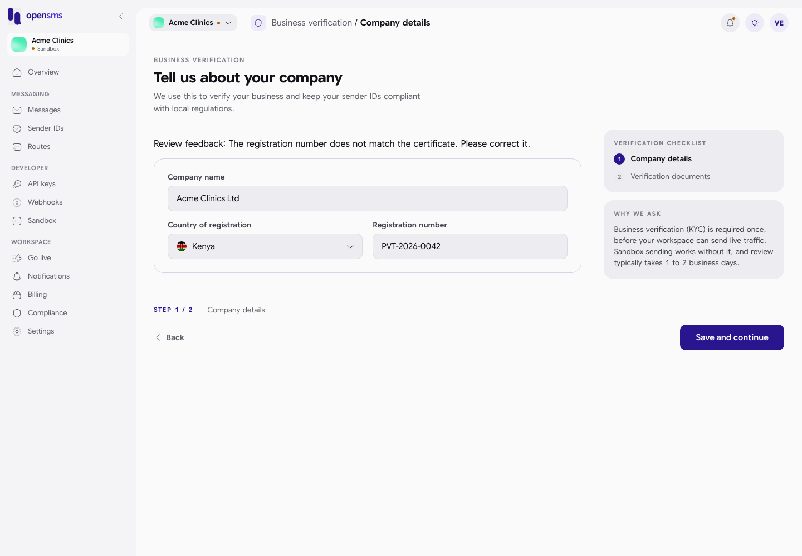

Correct the details and click **Save and continue** again.

### Upload your documents

Three documents are needed, each a PDF, PNG or JPEG of up to 10 MiB:

| Document | Notes |
| --- | --- |
| Certificate of incorporation | |
| Proof of business address | A recent utility bill or lease. |
| Director's ID | A government-issued ID. |

1. Click a box (or drag a file onto it) and pick the file. It uploads straight away.
2. Repeat for the other two. The **Progress** panel counts "Documents attached", for example **3 / 3**.
3. Click **View go-live checklist** to return to [Go live](go-live.md). You can also leave and come back later; uploads are kept.

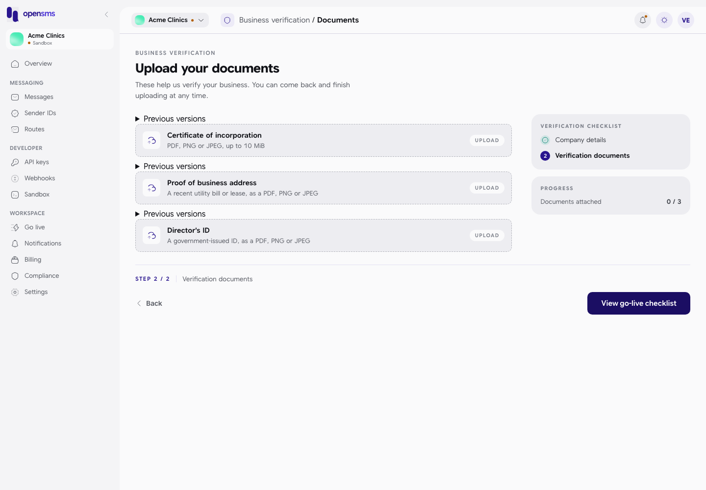

A file that is not really a PDF, PNG or JPEG (for example a renamed file) is refused with "document must be a valid PDF, PNG or JPEG", and the box turns red with a **RETRY** badge:

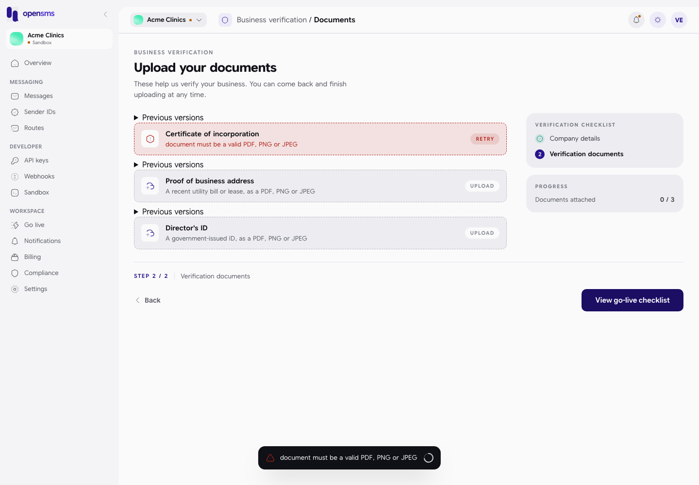

After a successful upload, a plain status line appears above each box with the file name and version, the security check status and the manual review status, plus **Open preview** and **Download** buttons:

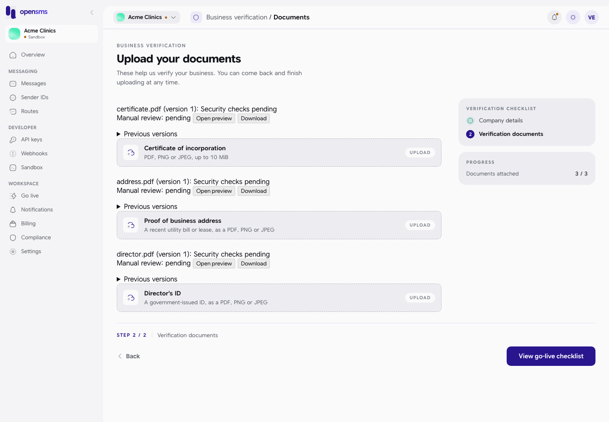

| Status line | Meaning |
| --- | --- |
| Security checks pending | The file is waiting for its virus scan. **Open preview** and **Download** stay disabled until it passes. |
| Security checks passed | The scan is clean; you can preview or download it. |
| File rejected by security checks. Upload a replacement. | The scan found a problem. |
| Security check delayed. Please check again shortly. | The scan could not run yet. |
| Manual review: pending / approved / rejected | The OpenSMS reviewer's decision, with a **Reason** if rejected. |

To replace a document, upload a new file into the same box. It becomes version 2, and the old one moves under **Previous versions** (the arrow above each box). The "Previous versions" arrow is shown even when there are none. Once all documents are approved, the page says "Your documents are approved." and the boxes are locked.

**On the local docs stack** virus scanning is switched off, so every document stays at "Security checks pending", the preview and download buttons stay disabled, and the reviewer cannot approve (see [Go live](go-live.md#what-cannot-be-done-on-the-local-docs-stack)).

The page checks for review updates every 10 seconds, and you also get [notifications](notifications.md) such as "Document uploaded" and "Documents submitted for review".

## Related

- [Go live](go-live.md)
- [Messages](messages.md)
- [Sender IDs](sender-ids.md) (sender ID applications have their own documents)
- [Notifications](notifications.md)
