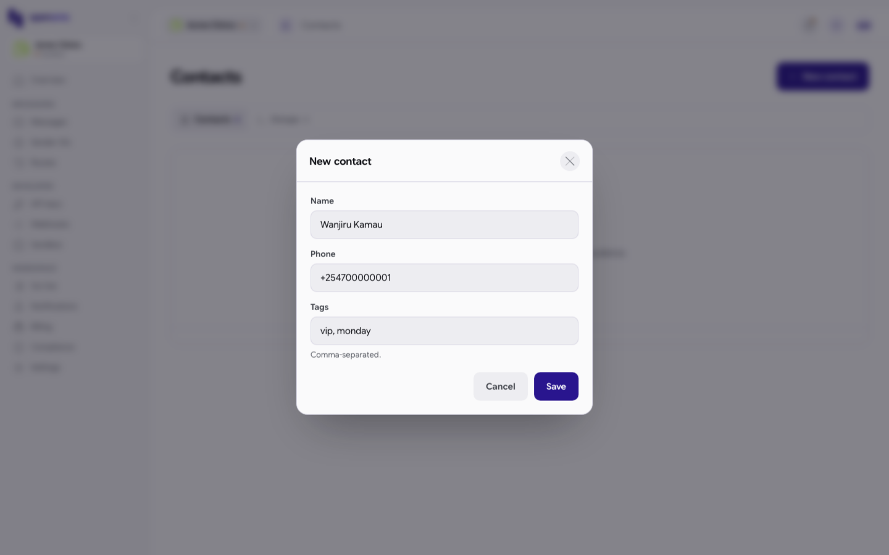
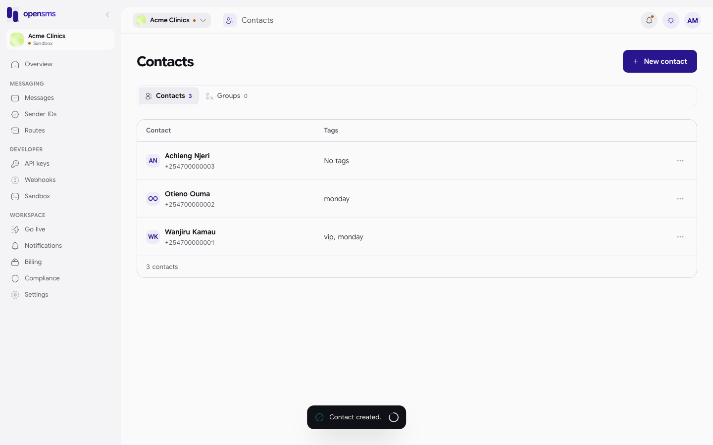
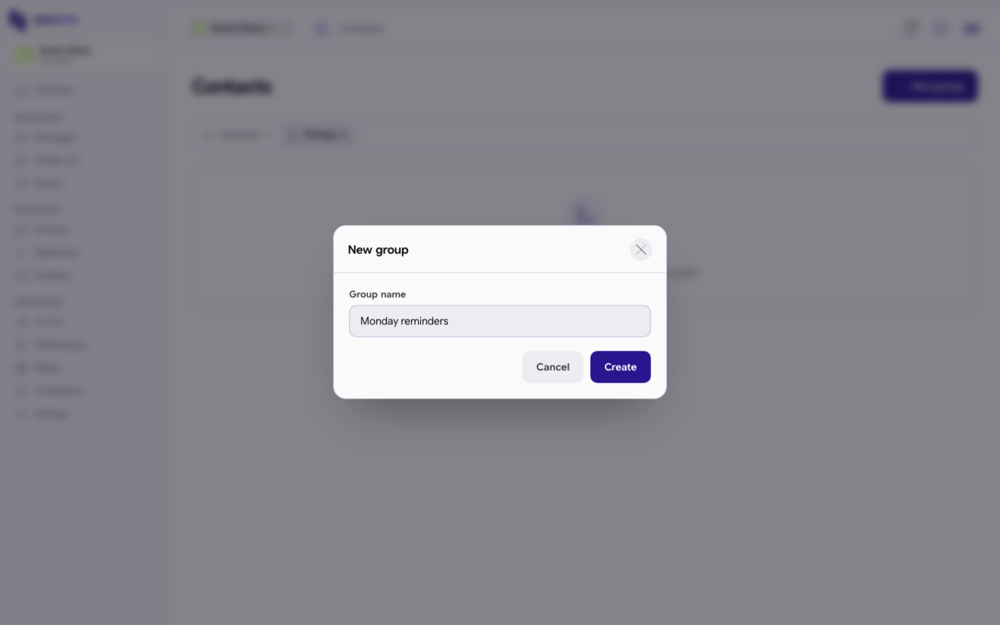
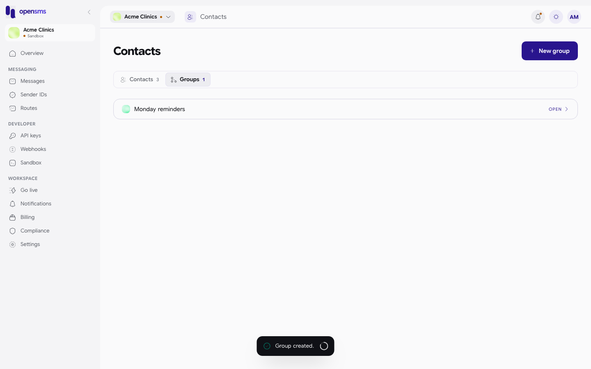
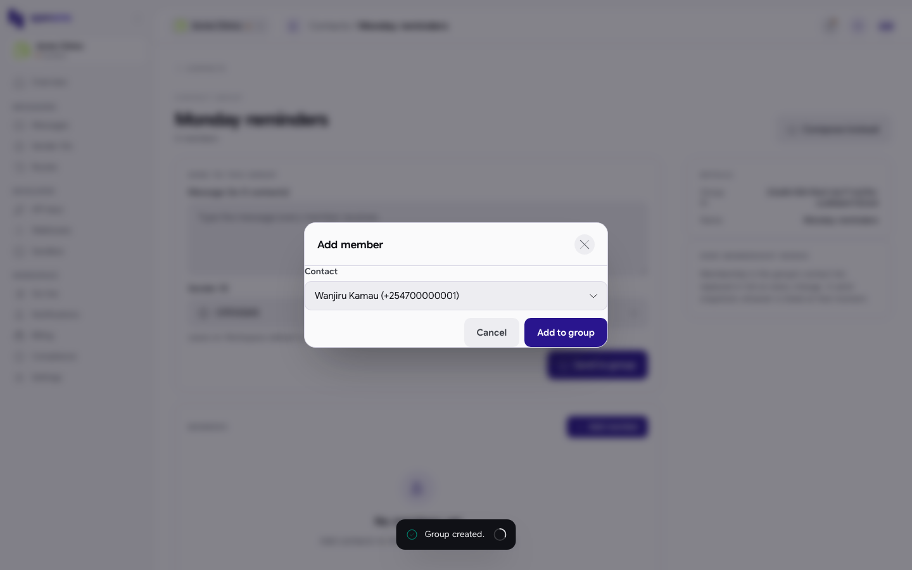
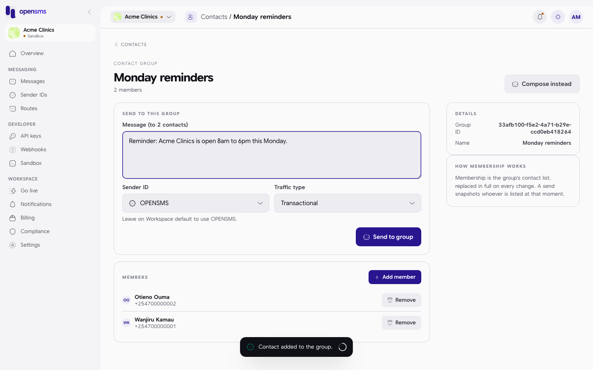
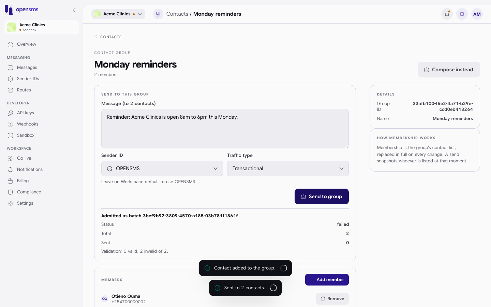

# Contacts and groups

Contacts is your address book inside OpenSMS: people's names, phone numbers and tags. Groups are saved lists of contacts you can send one message to in a single step. This guide is for owners, admins and developers who keep the list up to date, and for anyone who wants to look at it.

**Where to find it:** Contacts is not in the left-hand menu in this version of the console. Open it by going to `/app/contacts` in your browser's address bar.

## Who can do what

| Action | Owner | Admin | Developer | Finance | Viewer |
| --- | --- | --- | --- | --- | --- |
| See contacts and groups | Yes | Yes | Yes | Yes | Yes |
| Add, edit, delete contacts; create groups; change members | Yes | Yes | Yes | No | No |
| Send to a group | Yes | Yes | Yes | No | No |

Members who cannot make changes see a notice at the top of the page and greyed-out buttons.

## Add a contact

1. Go to `/app/contacts`. A new workspace shows **No contacts yet**.
2. Click **New contact**.
3. Fill in the form and click **Save**. You see "Contact created."

| Field | What to enter |
| --- | --- |
| Name | The person's name, for example `Wanjiru Kamau`. |
| Phone | The full number with country code, for example `+254700000001`. It cannot be changed after the contact is created. |
| Tags | Optional labels, separated by commas, for example `vip, monday`. |

The list shows each contact's initials, name, number and tags ("No tags" when there are none). The tab label shows how many contacts and groups you have.

## Edit or delete a contact

1. Click the **...** button at the end of the contact's row.
2. Choose **Edit contact** to change the name or tags (the phone number is fixed), then **Save**. You see "Contact updated."
3. Or choose **Delete contact**. The box asks "Delete *name*? This cannot be undone." Click **Delete**. You see "Contact deleted."

## Create a group

1. On Contacts, click the **Groups** tab.
2. Click **New group**.
3. Type a **Group name**, for example `Monday reminders`, and click **Create**. You see "Group created." An empty name shows "Enter a group name."

Click **Open** on a group to manage it. The console has no button to rename or delete a group.

## Add and remove group members

On the group's page (`/app/contacts/groups/<id>`):

1. Click **Add member**.
2. Pick a contact from the **Contact** list and click **Add to group**. You see "Contact added to the group." Contacts already in the group are not offered; when everyone is already in it the button explains "Every contact is already in this group."
3. To take someone out, click **Remove** on their row. You see "Contact removed from the group."

As the "How membership works" panel says, a send uses whoever is in the group at the moment you send. Changing the group later does not change messages already sent.

## Send to a group

The **Send to this group** panel sends the same text to every member at once.

1. Type the message in **Message (to *n* contacts)**.
2. Pick a **Sender ID** (only approved ones are offered; with none of your own, `OPENSMS` is used) and a **Traffic type** (Transactional, OTP or Marketing, see [Templates](templates.md#traffic-types)).
3. Click **Send to group**.

After sending, a result box appears under the button: "Admitted as batch *id*", with the batch **Status**, **Total**, **Sent**, the **Estimated cost** when known, and a validation line such as "Validation: 2 valid, 0 invalid of 2."

**Always read that result box.** A green "Sent to 2 contacts." message appears whenever the request was accepted, even if no message actually went out. In the example below the batch came back with **Status: failed** and "Validation: 0 valid, 2 invalid of 2.", because the account's email was not verified yet (the server rejected both rows with "email verification is required for sandbox sending"):

Other messages you may see: "Enter the message text to send." and "This group has no members yet. Add contacts before sending."

The panel sends plain text only. Sending a saved [template](templates.md) to a group is possible through the API but not from this page.

**Compose instead** opens the normal [Compose](messages.md#send-a-message) page. It does not fill in the group's members for you.

## Related

- [Messages](messages.md)
- [Templates](templates.md)
- [Compliance: suppressions](compliance-and-verification.md#suppressions) (numbers that must not be messaged)
