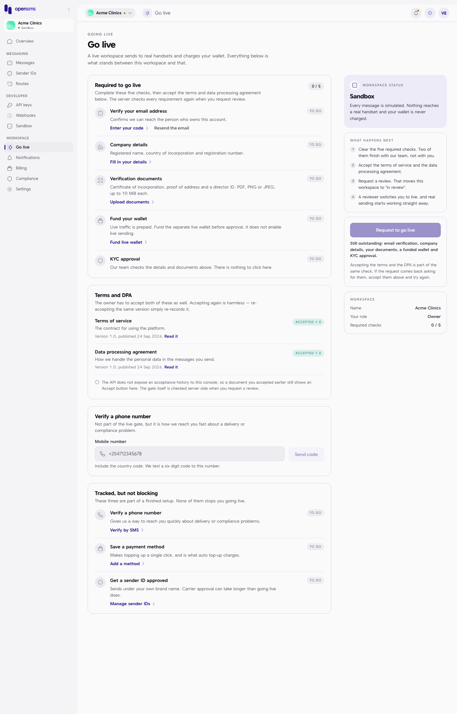
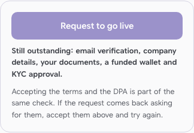
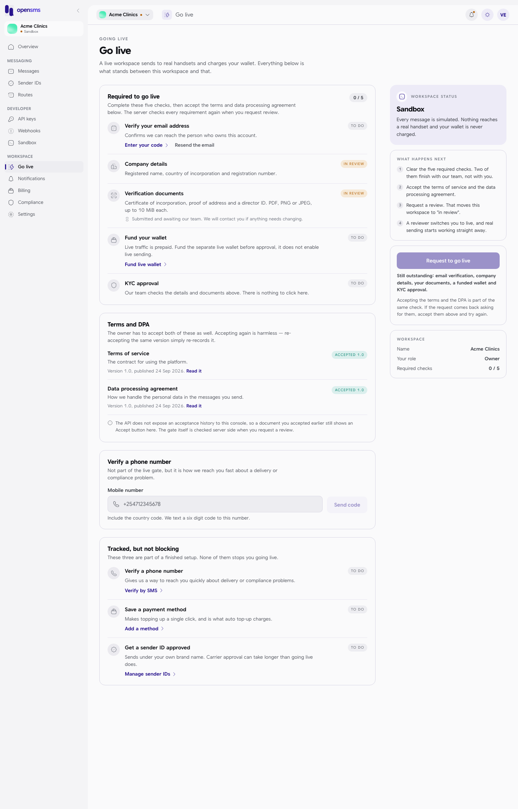
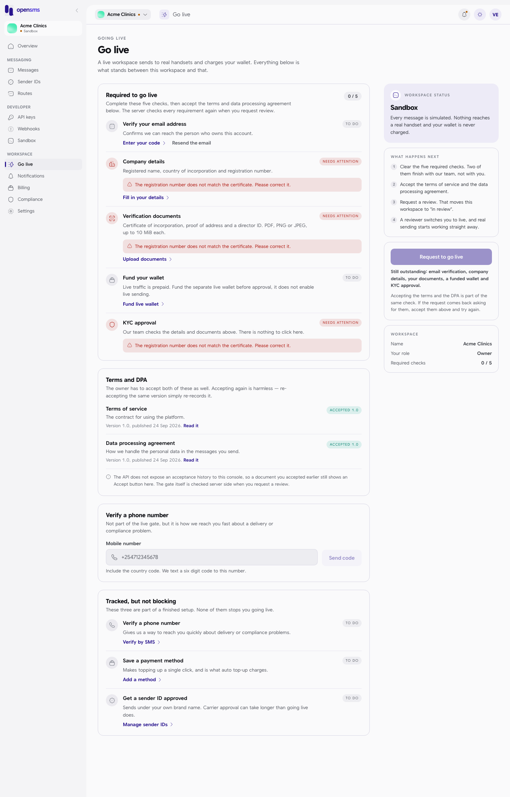
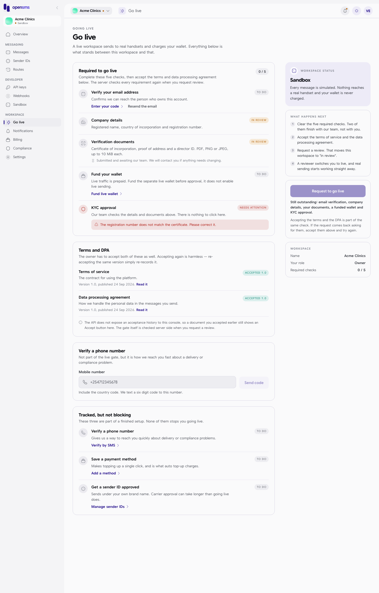
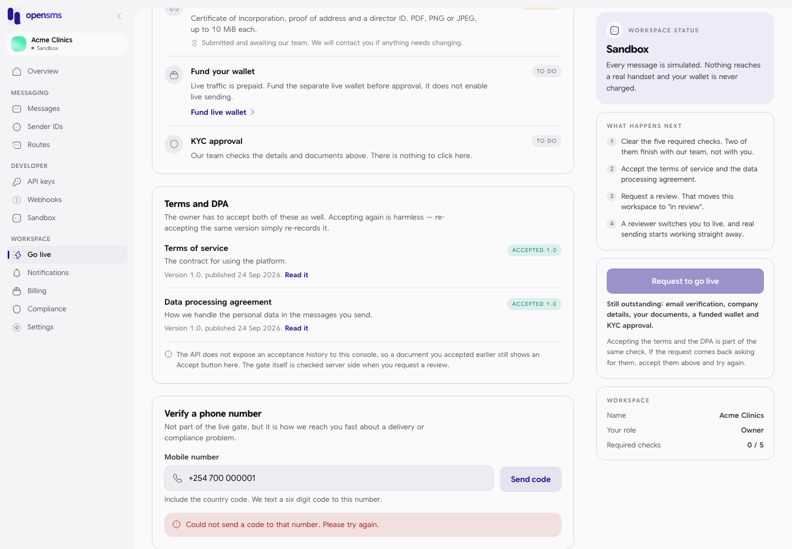

# Go live

Every workspace starts in sandbox, where messages are simulated. Going live means OpenSMS has checked your business and your workspace can send real messages to real phones, paid from your live wallet. The Go live page is the checklist for getting there: what is done, what is still outstanding, and the button to ask for a review. This guide is for the workspace owner, who is the only person who can request the review. Everyone else can open the page to see where things stand.

Open **Go live** in the left-hand menu, under **Workspace** (`/app/go-live`).

## The stages

The panel on the right, **Workspace status**, shows where you are:

| Status | What it means | What happens next |
| --- | --- | --- |
| Sandbox | Every message is simulated. Nothing reaches a real handset and your wallet is never charged. | Clear the five required checks, accept the terms and the data processing agreement, then request a review. |
| In review | You asked to go live and the workspace is with the OpenSMS review team. There is nothing left for you to do. | A reviewer checks your company details and documents. Sandbox sending keeps working while you wait. |
| Live | Review is done and the workspace sends real traffic. | Messages reach real phones and cost money; live API keys work; two-factor confirmation is required for live keys, wallet changes and deleting the workspace. |
| Suspended | Sending is stopped by the OpenSMS team, usually after a compliance report or an unpaid balance. | Check [Compliance](compliance-and-verification.md) and [Billing](billing.md), then email info@opensms.io from the owner's address with your workspace name. Only the OpenSMS team can lift a suspension. |

## The five required checks

The **Required to go live** card counts your progress ("0 / 5"). Each check has a status badge:

| Badge | Meaning |
| --- | --- |
| TO DO | Not started. |
| IN REVIEW | You submitted it; the OpenSMS team has not decided yet. The line "Submitted and awaiting our team. We will contact you if anything needs changing." appears under it. |
| NEEDS ATTENTION | The team sent it back. The reason is shown in a red box under the check. |
| DONE | Approved. |

| Check | What you do | Where |
| --- | --- | --- |
| Verify your email address | Enter the 6-digit code emailed to you. **Enter your code** opens the code screen; **Resend the email** sends a new one. | [Signing up](signing-up-and-signing-in.md#verify-your-email) |
| Company details | Registered name, country of registration and registration number. | [Compliance and verification](compliance-and-verification.md#business-verification) |
| Verification documents | Certificate of incorporation, proof of business address and a director's ID. | [Compliance and verification](compliance-and-verification.md#upload-your-documents) |
| Fund your wallet | Put money in the live wallet. This does not switch on real sending by itself. | [Billing](billing.md#fund-the-live-wallet) |
| KYC approval | Nothing to click. The OpenSMS team approves your company details and documents together. | |

Below that, **Terms and DPA** lists the terms of service and the data processing agreement with their versions. The owner must have accepted both; if you already did (usually at the [legal acceptance](legal-acceptance.md) screen) they show **ACCEPTED 1.0**, otherwise an **Accept** button. (A grey note under the card says an earlier acceptance "still shows an Accept button here"; that note is out of date, as the screenshots show the **ACCEPTED 1.0** badge.)

**Tracked, but not blocking** lists three steps that are part of a finished setup but do not stop you going live: verify a phone number, save a payment method, and get a sender ID approved.

## Request the review

**Who can do this:** the workspace owner only. Other roles see "Requesting a review is the workspace owner's to do. You can still see where everything stands."

1. Clear all five required checks and accept both documents.
2. Click **Request to go live** in the right-hand panel.
3. You see "Review requested. We will take it from here." and the status changes to **In review**.

While anything is missing the button is greyed out and the panel lists what is outstanding:

The server checks the same list again when you click. If something is still missing it answers "live sending prerequisites are incomplete".

While you are in review, **Check for an update** fetches your latest status; the page also updates by itself when the review team changes it.

## A worked example: submit, get sent back, fix

This is what happened on the docs stack with a new workspace.

1. **Company details and documents submitted.** Both checks move to **IN REVIEW**.

   

2. **The reviewer sends it back** with the reason "The registration number does not match the certificate. Please correct it." Company details, documents and KYC approval all show **NEEDS ATTENTION** with that reason, and a "Verification needs attention" [notification](notifications.md) arrives.

   

3. **Fix and resubmit.** The owner corrects the registration number and uploads a replacement certificate. Company details and documents go back to **IN REVIEW**; KYC approval keeps its **NEEDS ATTENTION** badge until the reviewer decides again.

   

## Verify a phone number

The **Verify a phone number** card is optional. It gives OpenSMS a quick way to reach you about delivery or compliance problems.

1. Enter your **Mobile number** with its country code, for example `+254712345678`.
2. Click **Send code**. A 6-digit code is texted to you.
3. Type the code. You see "Phone number verified."

**Known problem:** in this version of the app, **Send code** always fails with "Could not send a code to that number. Please try again." The app sends the number in a different field from the one the server expects, so the server rejects every request. Even with that fixed, the docs stack cannot send the text ("phone code delivery unavailable").

## What cannot be done on the local docs stack

- **Email verification:** no email can be sent, so the check stays **TO DO** ("email delivery is not configured").
- **Funding the live wallet:** payments are switched off; see [Billing](billing.md#fund-the-live-wallet).
- **KYC approval:** the reviewer can only approve once every document has passed a virus scan and a human review, and scanning is switched off locally. The server answered "each current required document must pass scanning and human review before KYC approval".

So no workspace could be taken to **In review** or **Live** for these guides; those states are described from the app's code.

## Related

- [Compliance and verification](compliance-and-verification.md)
- [Billing](billing.md)
- [Legal acceptance](legal-acceptance.md)
- [Sandbox](sandbox.md)
- [API keys](api-keys.md) (live keys)
