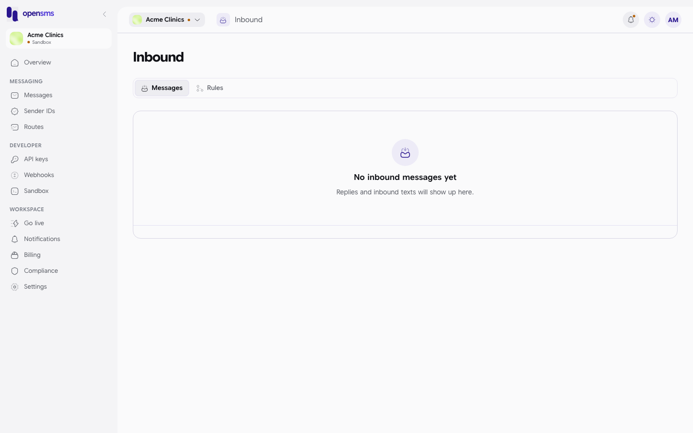
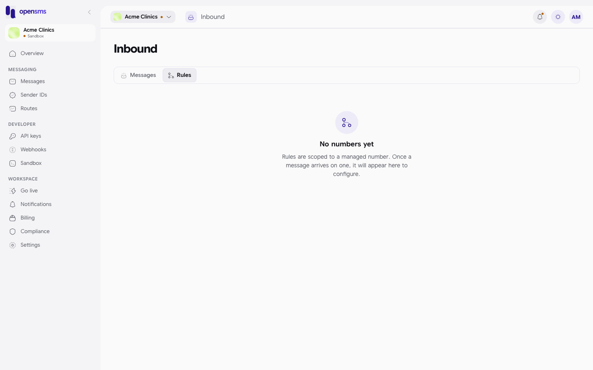

# Inbound

Inbound shows the text messages people send **to** your numbers (replies, keywords like STOP, questions) and lets you set rules for what happens when one arrives: call your webhook, send an automatic reply, or forward it by email. This guide is for anyone who reads replies, and for owners and admins who set the rules.

**Where to find it:** Inbound is not in the left-hand menu in this version of the console. Open it by going to `/app/inbound`.

**Not functional yet.** In the current build of OpenSMS no part of the platform receives incoming texts from carriers into this list, and nothing carries out the rules you save here. The page, the reply form and the rule editor exist and save data, but treat Inbound as a preview until incoming messages are wired up.

**Live workspaces only.** Inbound belongs to numbers you rent in [Numbers](numbers.md), and numbers only exist for live workspaces. In sandbox both tabs are always empty, and saving a rule or replying is refused. The screenshots below show a sandbox workspace, so both tabs are empty.

## Who can do what

| Action | Owner | Admin | Developer | Finance | Viewer |
| --- | --- | --- | --- | --- | --- |
| Read inbound messages | Yes | Yes | Yes | Yes | Yes |
| Reply to a message | Yes | Yes | Yes | No | No |
| Add or remove rules | Yes (with 2FA on) | Yes (with 2FA on) | No | No | No |

## Read inbound messages

The **Messages** tab lists what arrived, newest first: **From** (the sender's number and which of your numbers it reached), **Message** and **Received**.

A workspace with nothing yet shows **No inbound messages yet**.

### Reply

1. Click **...** on a message and choose **Reply**.
2. Type your **Message** and send it. You see "Reply sent."

A reply is an ordinary outgoing message: it needs an approved sender and route, it is charged like any other message, and it shows up in [Messages](messages.md). An empty reply shows "Enter a reply message."

## Rules

The **Rules** tab lists each of your numbers that has received something, with a message count and a **Manage rules** button. Rules belong to one number.

Until a message has arrived on a number, the tab says **No numbers yet**: "Rules are scoped to a managed number. Once a message arrives on one, it will appear here to configure."

### Add a rule

1. Click **Manage rules** on a number. Existing rules are listed first ("No rules yet" when there are none).
2. Under **Add rule**, fill in:

   | Field | Options |
   | --- | --- |
   | Match | **Any message**, **Keyword**, **Prefix** or **Regex** (a pattern, for technical users): the kind of text the rule should match. |
   | Pattern | The keyword, prefix or pattern, for example `STOP`. Not needed for Any message. |
   | Action | **Call webhook**, **Auto-reply** or **Forward to email**. |
   | Target | The webhook URL, the reply text, or the email address, to match the action. |

3. Save the rule. You see "Rule saved." An empty target shows "Enter a target (webhook URL, reply text, or email)."

Saved rules are stored against the number, but, as noted at the top, nothing runs them yet.

To delete a rule, remove it from the list ("Rule removed.").

If a message did not arrive on one of your managed numbers, its rules cannot be edited here: "This inbound message isn't linked to a managed number, so its rules can't be edited here."

## Related

- [Numbers](numbers.md)
- [Webhooks](webhooks.md)
- [Compliance: suppressions](compliance-and-verification.md#suppressions)
