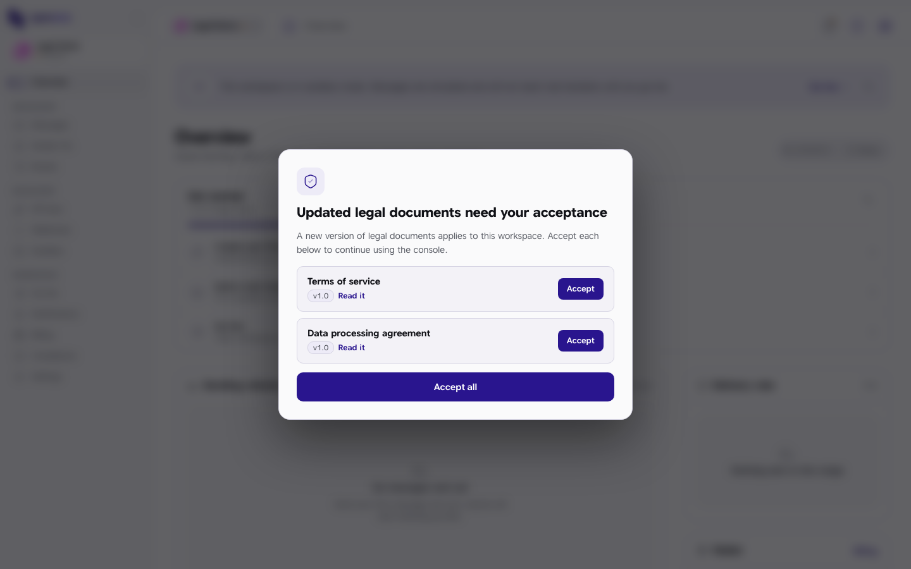
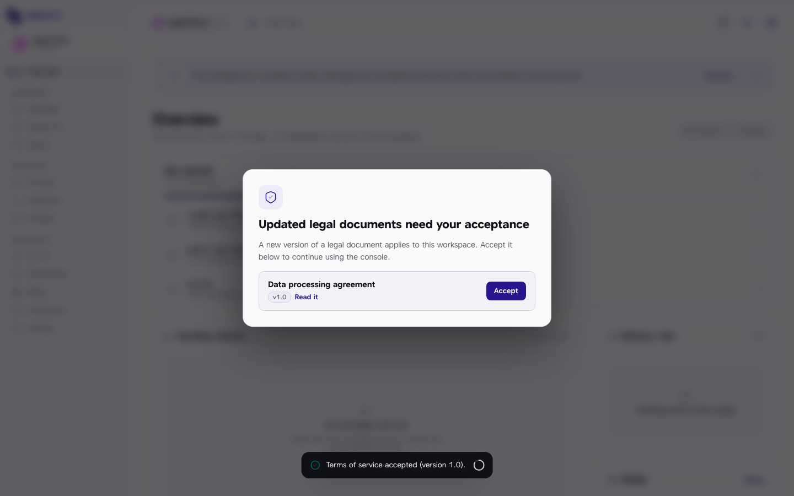
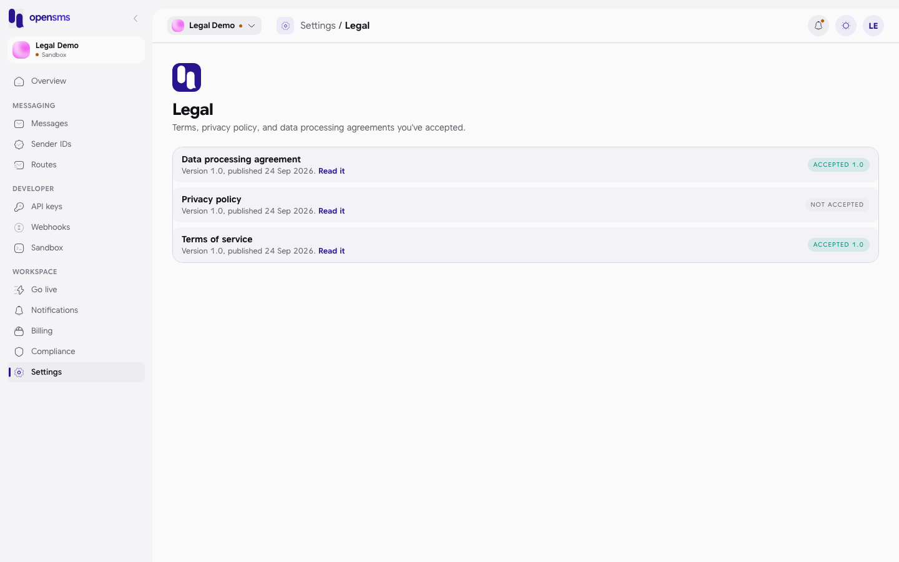

# Legal acceptance

The first time you open a workspace in the console, and again whenever OpenSMS publishes a new version of its terms, a screen covers the console and asks you to accept the current **Terms of service** and **Data processing agreement**. This page explains that screen and where to see what you have accepted. It is for every member of a workspace: each person accepts for themselves, in each workspace they belong to.

## What you will see

Right after logging in (or after onboarding) you land in the console with this on top of it:

The screen is titled **Updated legal documents need your acceptance** and lists each document you still need to accept, with its version (for example `v1.0`) and a **Read it** link that opens the document in a new tab. There is no close button: the only way through is to accept.

The two documents that block the console:

| Document | What it covers |
| --- | --- |
| Terms of service | The contract for using the platform. |
| Data processing agreement (DPA) | How OpenSMS handles the personal data in the messages you send. |

A **Privacy policy** is also published, but it never blocks you and there is no accept button for it in the console.

## Accept the documents

1. Click **Read it** next to each document and read it.
2. Click **Accept** next to a document, or **Accept all** to accept every listed document in one go.
3. After each acceptance a message confirms it, for example "Terms of service accepted (version 1.0)." The accepted document drops off the list:

   

4. When the last one is accepted the screen disappears and the console is usable.

Accepting is recorded on the server against your login and this workspace, with the time. Accepting the same version again is harmless: it keeps the original record.

If the published version changed while the screen was open, accepting fails with a message and the list refreshes, so the next click accepts the current version.

## When it appears again

- When OpenSMS publishes a newer version of the terms or the DPA. The list then shows the new version and "previously v*x*" next to it.
- In each new workspace you join or create, because acceptance is per workspace.
- For each teammate: your acceptance does not count for anyone else.
- In a new browser or on a new device, or after clearing site data, even for versions you already accepted. See below.

If the list of documents cannot be loaded (for example a network blip), the screen does not appear rather than locking you out. The server still checks acceptance when the owner asks to [go live](go-live.md), so nothing is skipped.

> **Asked again in a new browser?** The web app remembers your acceptance in the browser you accepted in, so a new browser, a new device or cleared site data can show the screen again for documents you already accepted. Accepting again is safe: the server keeps your original acceptance record and does not create a duplicate.

## Needed to go live

Going live requires the workspace owner to have accepted the current terms and DPA. The [Go live](go-live.md) page also has **Accept** buttons for both documents, so the owner can accept there too.

## See what you have accepted

Go to **Settings > Legal** (`/app/settings/legal`). It lists each published document, its version and publication date, a **Read it** link, and a badge:

| Badge | Meaning |
| --- | --- |
| Accepted 1.0 | You accepted the current version. |
| Accepted *x*, newer available | You accepted an older version; the gate will ask for the new one. |
| Not accepted | No acceptance is on record for this document. |

This page is a record only. It has no accept buttons.

> **Note:** for the same reason, in a browser other than the one you accepted in, Settings > Legal can show **Not accepted** for documents you did accept, until you accept them again in that browser. The server record is what counts for going live.

## Related

- [Go live](go-live.md)
- [Settings](settings.md#legal)
- [Signing up and signing in](signing-up-and-signing-in.md)
