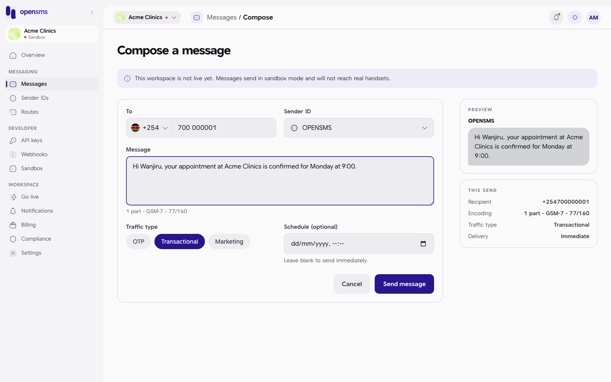
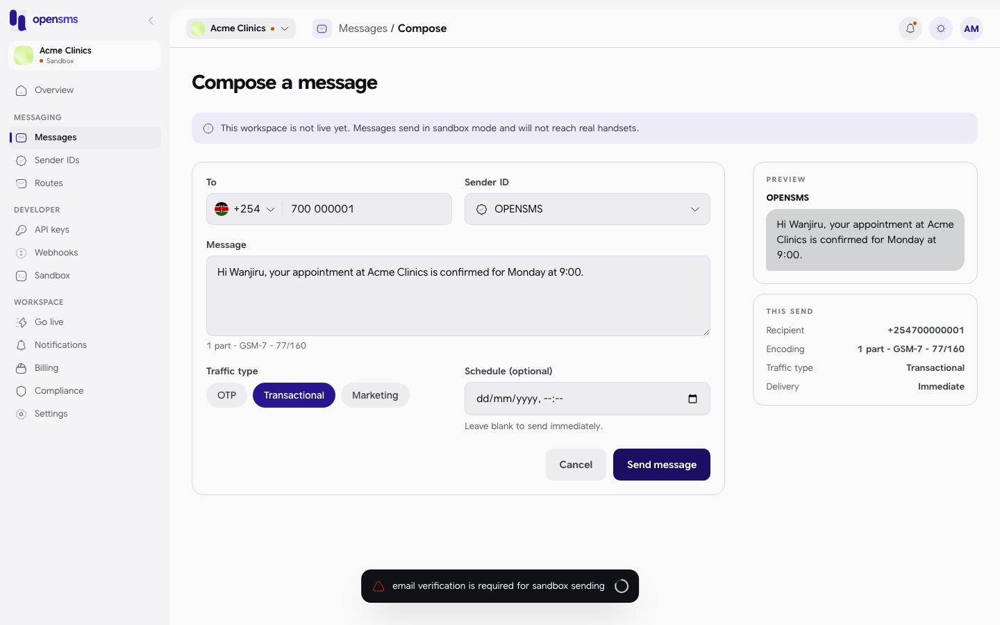
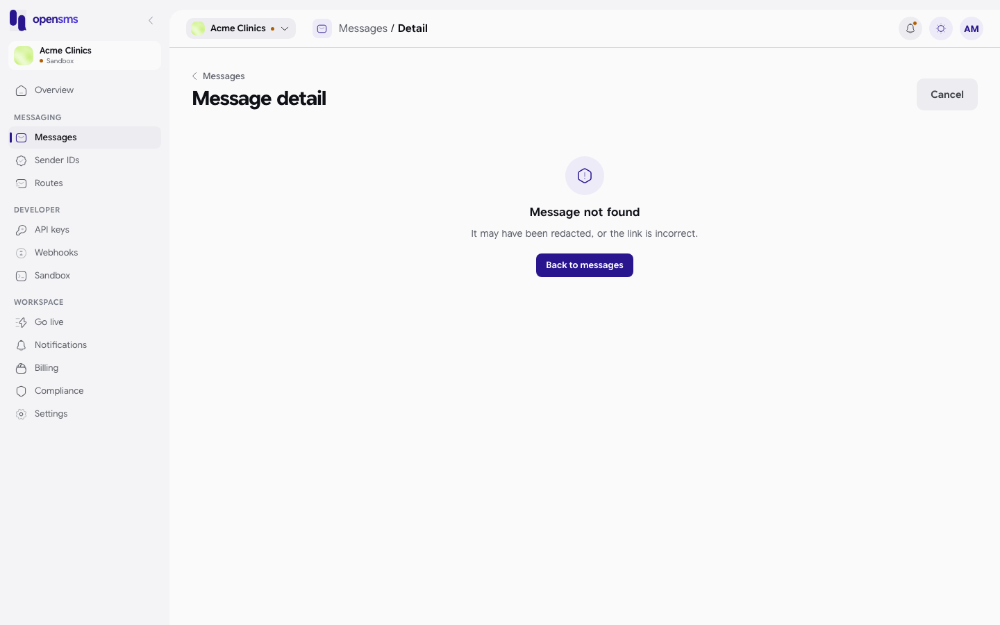
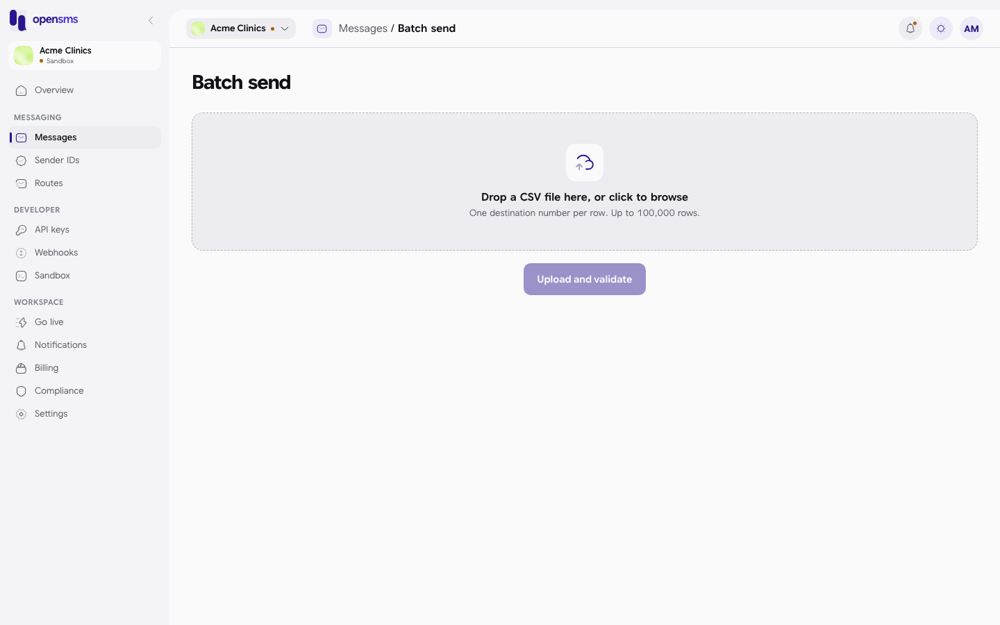
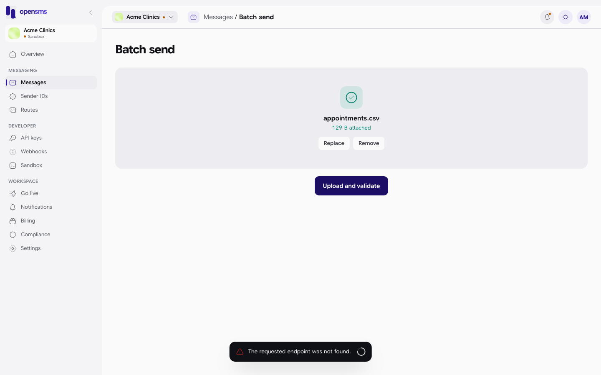

# Messages

The Messages pages are where you send a text by hand, look back at what your workspace has sent, and follow a single message from "accepted" to "delivered". This guide is for anyone in a workspace: everyone can read message history, and owners, admins and developers can also send.

Open it from **Messages** in the left-hand menu (`/app/messages`).

> **Local docs stack:** sending needs a verified email (see [Signing up and signing in](signing-up-and-signing-in.md#verify-your-email)), and email is switched off on the stack used for these screenshots. So every send in this guide stops at the server's refusal, and the message list is empty. The screens, fields and messages shown are real; the parts of the list and detail pages that only appear once messages exist are described from the product and marked as such.

## Who can do what

| Action | Owner | Admin | Developer | Finance | Viewer |
| --- | --- | --- | --- | --- | --- |
| See the message list and details | Yes | Yes | Yes | Yes | Yes |
| Compose, cancel, resend, look up a number | Yes | Yes | Yes | No | No |

Finance and viewer members still see the Compose page, but every field is greyed out and the buttons explain "Your role can view messages but not send them."

## Sandbox or live

Until your workspace is [live](go-live.md), every message is a **sandbox** message: it is simulated, never reaches a real phone, and costs nothing from your real wallet. The Compose page says so at the top: "This workspace is not live yet. Messages send in sandbox mode and will not reach real handsets." To force a particular result in sandbox (delivered, failed, expired...), send to one of the [magic numbers](sandbox.md#magic-numbers).

## The message list


The list shows the newest messages first, 20 per page, with these columns: **To** (destination number and country), **Carrier**, **Status**, **Created** and **Cost**. Click a row to open its [detail page](#message-detail). The list refreshes by itself when a message changes status.

Ways to narrow it down:

| Control | What it does |
| --- | --- |
| Status tabs (All, Queued, Held, Sending, Sent, Delivered, Failed, Scheduled, Cancelled, Expired) | Show only messages in that status. |
| Country | Two-letter country code, for example `KE`. |
| Date range | From and to dates. The "to" date includes that whole day. |
| Destination | Part of a phone number, for example `700000`. |
| Previous / Next | Move between pages. |

**Export CSV** downloads the rows currently on screen (the page you are looking at, with your filters) as `messages-YYYY-MM-DD.csv`, with the columns id, to, carrier, status, created_at, cost_amount and cost_currency. It is greyed out when the list is empty. It does not export your whole history; for that, use the workspace [data export](settings.md#data-export).

On a new workspace you see **No messages found** with a **Compose** button.

### What each status means

| Status | Meaning |
| --- | --- |
| Queued | Accepted by OpenSMS, waiting to go to a carrier. |
| Scheduled | Waiting for the time you picked, or held back by [quiet hours](compliance-and-verification.md#quiet-hours). |
| Held | Stopped by a content rule and waiting for an OpenSMS operator to release or reject it. |
| Sending | Being handed to a carrier right now. |
| Sent | The carrier accepted it; waiting for a delivery receipt. |
| Delivered | The carrier confirmed the phone received it. |
| Failed | Refused at submission, or the carrier reported it was not delivered. |
| Cancelled | You cancelled it before it went out. |
| Expired | No delivery receipt arrived in time. |

## Send a message

1. Click **Compose** (on the list, or on the [Overview](overview-dashboard.md)). The address is `/app/messages/new`.
2. Fill in the form. The panel on the right shows a **Preview** of how the text will look and a summary of **This send**.
3. Click **Send message**.



| Field | What to enter |
| --- | --- |
| To | The phone number. Pick the country from the flag menu (it starts on +1, United States) or type the full number with its country code, for example `+254 700 000001`; the country switches automatically. The field checks the number is valid for that country. The last country you used is remembered. |
| Sender ID | The name the message comes from. Only approved sender IDs can be picked. A new workspace can use the platform sender `OPENSMS`. Your own names appear here once approved in [Sender IDs](sender-ids.md). The one you used last is tagged "Last used". |
| Message | The text, up to 1,600 characters. Under the box you see the number of parts, the encoding and the character count, for example "1 part - GSM-7 - 77/160". Plain Latin text fits 160 characters in one part; emoji or some accented characters switch to UCS-2, where a part holds fewer characters. Each part is billed. |
| Traffic type | **OTP** (one-time codes), **Transactional** (the default: receipts, reminders) or **Marketing** (promotions). It affects routing and the rules applied, such as quiet hours and opt-outs. |
| Schedule (optional) | A date and time to send later. Leave it empty to send now. |

**Cancel** goes back to the list without sending.

When the send works you see "Message sent." and the console opens the new message's detail page.

### When a send is refused



| Message | What to do |
| --- | --- |
| Please fill out this field. (on **To**) | Enter a phone number. |
| Choose a sender ID before sending. | Pick a sender ID. |
| Message text cannot be empty. | Type a message. |
| email verification is required for sandbox sending | Verify your email first, from [Go live](go-live.md) > Verify your email address. (This is the message every send gets on the local docs stack.) |
| Insufficient wallet balance. Top up your wallet to send this message. | Add funds in [Billing](billing.md). |
| This destination is on your suppression list and cannot be messaged. | The number opted out or was blocked. See [Compliance](compliance-and-verification.md#suppressions). |
| We couldn't resolve a country for this number. Check the destination and try again. | The number does not match any known country. |
| No delivery route is available for this destination right now. | OpenSMS has no working route to that country. See [Routes](routes.md). |

## Message detail

Click a message in the list to open `/app/messages/<id>`. The page title is **Message detail**; the message ID next to it copies to your clipboard when clicked ("Message ID copied.").

The following is what the page shows for a real message. It could not be captured on the local docs stack because no message could be sent there.

- **A verdict** at the top in plain words: Delivered, Rejected by the carrier, Rejected at submission, Expired without a receipt, Waiting for a delivery receipt, Not submitted yet, Scheduled or Cancelled.
- **What was sent:** destination, sender ID, text, parts and encoding, traffic type.
- **Lifecycle:** a timeline of each step with times (Accepted by the API, Scheduled, Submitted to a provider, the delivery receipt, and so on).
- **Routing and attempts:** each attempt to hand the message to a provider, and the receipt for it.
- **Status, Billing and Metadata** panels on the right. The carrier shown is worked out from the number's prefix; the page marks it as inferred, not verified.
- **Number lookup:** **Look up number** checks the destination's carrier, whether it was ported to another network, and whether it is valid. Lookups are **charged per request**, and the charge is shown with the result. In sandbox the answer is simulated and the carrier shows as "Not verified".

Buttons in the header:

| Button | Shown when | What it does |
| --- | --- | --- |
| Cancel | The message is Queued or Scheduled | Stops it going out ("Message cancelled."). |
| Resend | The message Failed or Expired | Sends the same message again as a new message ("Message resent."). |

If the ID does not exist in this workspace, or the message was removed by your [data retention](settings.md#workspace) setting, you see **Message not found** with a **Back to messages** button:



(In that state the page still shows a **Cancel** button in the header. It has nothing to cancel; ignore it.)

## Batch send

**Batch send** (`/app/messages/batch`) is meant for sending one message each to many numbers from a CSV file: upload the file, see a validation report, then start or stop the send.

> **Does not work in this version of the console.** Uploading any file fails with "The requested endpoint was not found." The console sends the file to an address the API does not have. Until that is fixed, send batches through the API (`POST /v1/messages/batch`, see the integration guides) or use [Contacts > Send to a group](contacts-and-groups.md#send-to-a-group).



What the page offers, as built:

1. Drop a CSV on the upload area, or click it to browse. The file name and size appear, with **Replace** and **Remove**.
2. Click **Upload and validate**.
3. The planned report shows: Total rows, Valid, Invalid (with reasons), Duplicates, Suppressed and Estimated cost, followed by a table of rows with their status.
4. **Start sending** asks "Start sending?" with the number of valid destinations and estimated cost, and warns it cannot be undone.
5. **Stop** asks "Stop this batch?": messages already sent are not recalled, the rest are not sent.
6. **Upload another CSV** starts again.



**CSV format:** the page says "One destination number per row", but the API needs a header row with at least a `to` column and a `text` column (optional columns: `sender_id`, `traffic_type`, `callback_url`, `metadata`). For example:

```csv
to,text
+254700000001,Your appointment is confirmed for Monday 9am.
+254700000002,Your appointment is confirmed for Monday 10am.
```

Only owners, admins and developers can upload or start a batch.

## Related

- [Sandbox and magic numbers](sandbox.md)
- [Templates](templates.md) and [Contacts and groups](contacts-and-groups.md)
- [Sender IDs](sender-ids.md)
- [Usage](usage.md) for delivery charts
- [Billing](billing.md) for what messages cost
