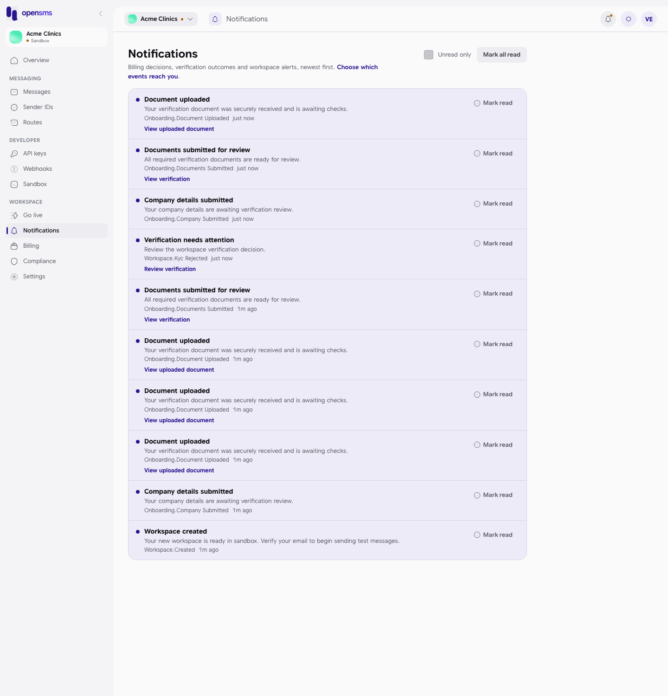
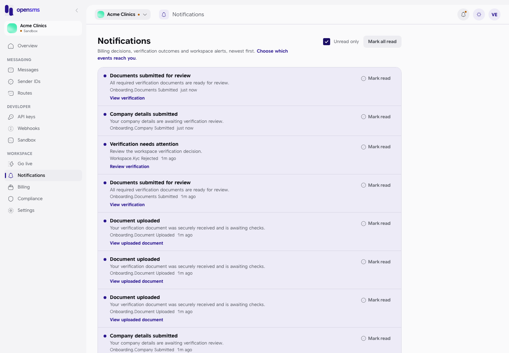
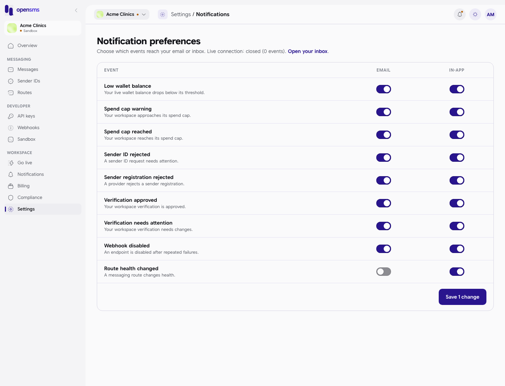

# Notifications

OpenSMS tells you when something in your workspace needs a look: a document was received or sent back, your balance is low, a sender ID was rejected, a webhook stopped working. These alerts land in your notifications inbox in the app and, depending on your choices, by email. This guide covers reading the inbox and choosing which alerts reach you. It is for every member of a workspace; each person has their own inbox and their own choices.

## Open your inbox

- Click the **bell** at the top right of any page. A dot on the bell means you have unread notifications. The app checks for new ones every 10 seconds and whenever you come back to the tab.
- Or open **Notifications** in the left-hand menu, under **Workspace** (`/app/notifications`).

Each notification shows:

- a dot if it is unread, and its **title** (for example "Verification needs attention");
- a sentence explaining it (for example "Review the workspace verification decision.");
- the event name and how long ago it arrived (hover over the time for the exact UTC date and time);
- for many events, a link straight to the page where you act on it.

Newest notifications are at the top, 50 per page, with **Previous** and **Next** at the bottom when there are more.

## Mark notifications as read

1. Click **Mark read** on a notification. Its dot disappears.
2. Or click **Mark all read** at the top to mark every unread notification on the current page. You see "All notifications marked read."

Tick **Unread only** to hide what you have already read:

With nothing left you see "Nothing unread" and "You are all caught up." A brand-new inbox says "No notifications yet".

## What you can be notified about

Common notifications, and the link each one carries:

| Title | When | Link |
| --- | --- | --- |
| Workspace created | Right after signup. "Your new workspace is ready in sandbox. Verify your email to begin sending test messages." | |
| Company details submitted | You saved your company details. | |
| Document uploaded | A verification document was received and is waiting for checks. | View uploaded document |
| Documents submitted for review | All three verification documents are in. | View verification |
| Verification needs attention | The OpenSMS team sent your verification back. | Review verification |

You are also notified, with a link to act on it, about: verification approved (Continue onboarding), document approved or rejected, live access requested, sending status changed, sender evidence uploaded or rejected, sender ID rejected, sender registration rejected, low wallet balance (Add funds), spend cap warning or reached (Review spending), number renewal failed or release pending, webhook disabled (Review webhooks), route health changed or degraded or down (Review routes), and data export ready (Download export).

## Choose which alerts reach you

Open **Settings > Notifications** (`/app/settings/notifications`), or click **Choose which events reach you** at the top of the inbox.

1. Each row is an event; each has two switches, **Email** and **In-app** (the inbox). All switches start **on**.
2. Click the switches you want to change. The button at the bottom counts your changes, for example **Save 1 change**.
3. Click the button. You see "Preference saved." (or "*n* preferences saved.").

| Event | Sent when |
| --- | --- |
| Low wallet balance | Your live wallet balance drops below its threshold. |
| Spend cap warning | Your workspace approaches its [spend cap](settings.md#workspace). |
| Spend cap reached | Your workspace reaches its spend cap. |
| Sender ID rejected | A sender ID request needs attention. |
| Sender registration rejected | A provider rejects a sender registration. |
| Verification approved | Your workspace verification is approved. |
| Verification needs attention | Your workspace verification needs changes. |
| Webhook disabled | An endpoint is disabled after repeated failures. |
| Route health changed | A messaging route changes health. |

Your choices apply to you in this workspace only; other members keep their own. Events that are not in this list (such as "Document uploaded") cannot be switched off here.

The line under the title, "Live connection: ...", is a technical indicator of the app's live update connection. If it reads "closed", the page still works; it just does not refresh by itself.

## Related

- [Settings](settings.md)
- [Go live](go-live.md)
- [Billing](billing.md)
- [Webhooks](webhooks.md)
