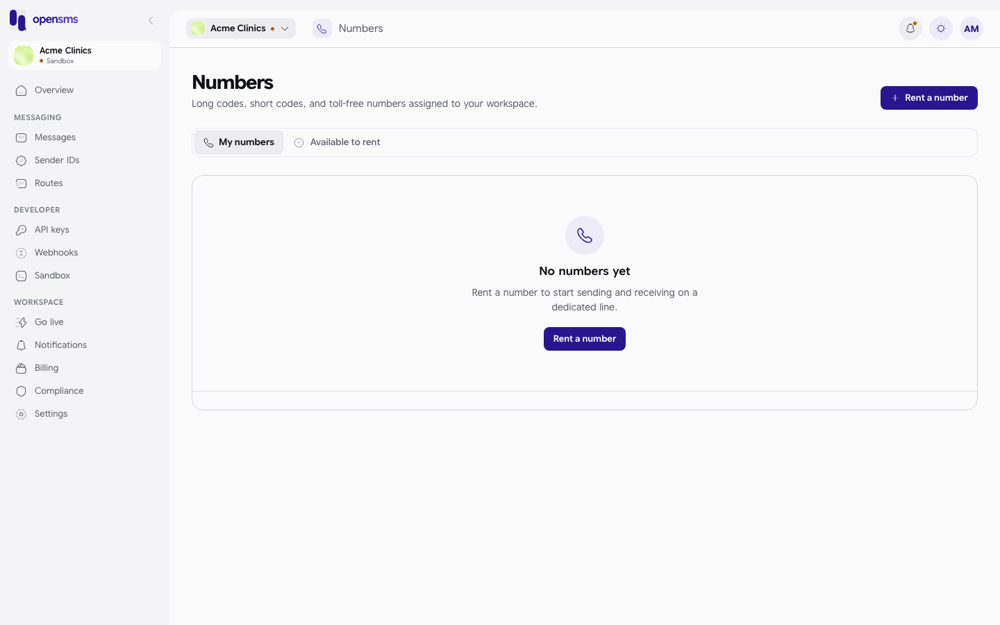
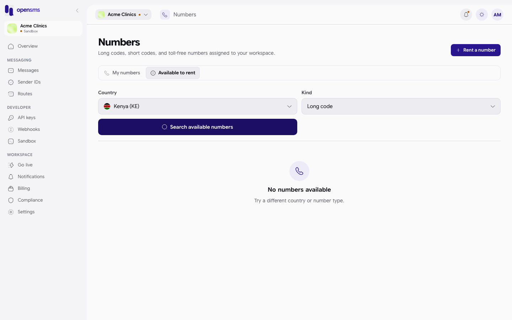

# Numbers

The Numbers page is where a live workspace rents its own phone numbers (long codes, short codes and toll-free numbers) and releases them when they are no longer needed. A dedicated number lets you send from a real number and receive replies, which then appear in [Inbound](inbound.md). This guide is for workspace owners and admins.

**Where to find it:** Numbers is not in the left-hand menu in this version of the console. Open it by going to `/app/numbers`.

**Live workspaces only.** Numbers are real inventory, so they only exist for [live](go-live.md) workspaces. In sandbox the page opens, but "My numbers" is always empty and a search finds nothing. The screenshots below show a sandbox workspace.

## Who can do what

| Action | Owner | Admin | Developer | Finance | Viewer |
| --- | --- | --- | --- | --- | --- |
| See numbers and search what is available | Yes | Yes | Yes | Yes | Yes |
| Rent or release a number | Yes (with 2FA on) | Yes (with 2FA on) | No | No | No |

Renting and releasing also need [two-factor authentication](settings.md#security) to be turned on for your login; the server refuses these actions otherwise.

## My numbers

The **My numbers** tab lists the numbers assigned to your workspace, with the **Number**, its **Country** and its **Status**. A workspace with none shows **No numbers yet** and a **Rent a number** button.

## Rent a number

1. Click **Rent a number** (top right) or the **Available to rent** tab.
2. Choose a **Country** and a **Kind**:

   | Kind | What it is |
   | --- | --- |
   | Long code | An ordinary local mobile or landline-style number. |
   | Short code | A short number (usually 4 to 6 digits), often used for campaigns and keywords. |
   | Toll-free | A free-to-call number, where the country supports it. |

3. Click **Search available numbers**. Matching numbers are listed, each with its monthly fee followed by "/mo".
4. Click **Rent** next to the one you want. You see "Number rented." and it moves to **My numbers**.

The first rental fee is taken from your wallet at once, and the number renews each rental period. Retrying the same rental does not charge twice.

In sandbox the search always comes back empty:

| Message | Meaning |
| --- | --- |
| Choose a country first. | Pick a country before searching. |
| No numbers available. Try a different country or number type. | Nothing in stock for that choice (and always the case in sandbox). |
| Couldn't rent this number. | The server refused, for example: not live, 2FA not on, not enough balance, or your [spend cap](settings.md#workspace) would be exceeded. |

## Release a number

1. On **My numbers**, click **...** on the number's row and choose **Release number**.
2. Read the warning: the number goes back to the pool, any inbound rules or sender set-up tied to it stop working, and it cannot be undone.
3. Click **Release number**. You see "Number released."

## Related

- [Inbound](inbound.md) (replies to your numbers, and rules for them)
- [Billing](billing.md) (rental fees)
- [Go live](go-live.md)
