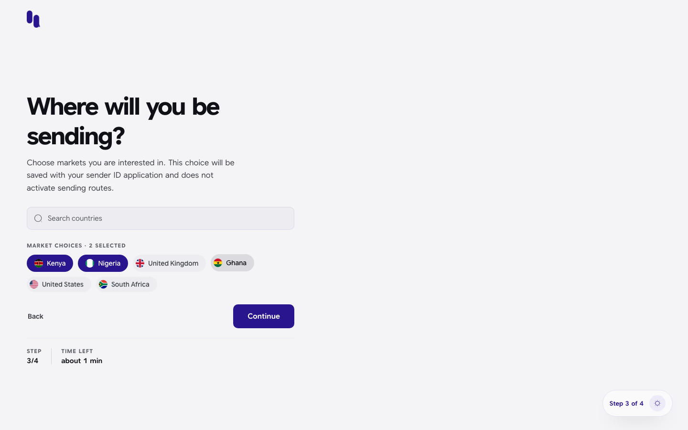
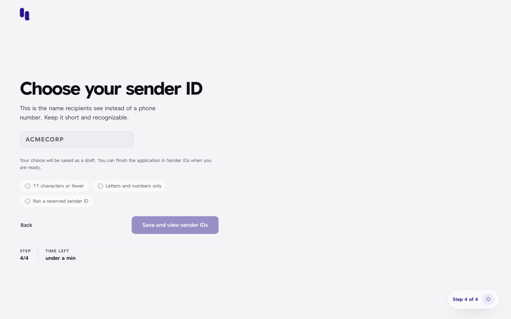
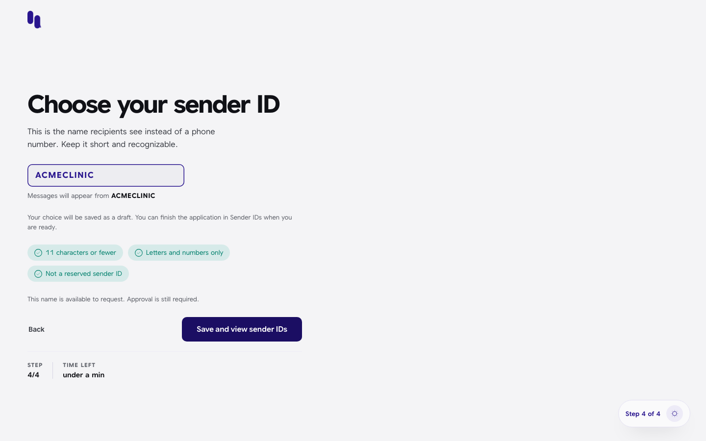
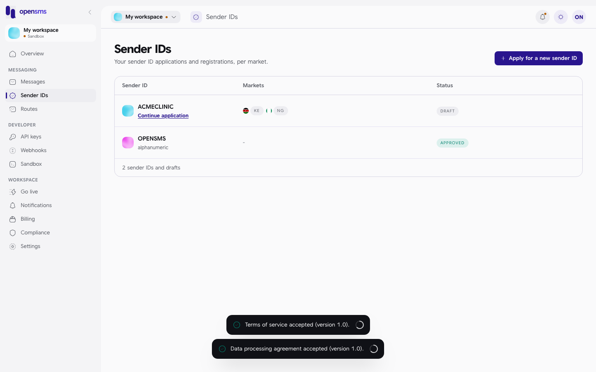

# Onboarding: markets and sender ID

Onboarding is the short path a new account walks right after [signing up and verifying its email](signing-up-and-signing-in.md): pick the countries you want to send to, then pick the name your messages will come from. It is for the person who just created the workspace (the owner). Both steps only save a draft. Nothing is sent to carriers, nothing is charged, and you can change your mind later.

The signup flow has four steps, counted at the bottom of each screen:

| Step | Screen | Covered in |
| --- | --- | --- |
| 1 of 4 | Create your account | [Signing up and signing in](signing-up-and-signing-in.md#create-an-account) |
| 2 of 4 | Check your inbox (email code) | [Signing up and signing in](signing-up-and-signing-in.md#verify-your-email) |
| 3 of 4 | Where will you be sending? | This page |
| 4 of 4 | Choose your sender ID | This page |

There is no separate "done" screen: the last step takes you into the console. (The old `/onboarding/done` address still works and simply opens the console.)

Company details and documents are **not** part of onboarding. You only need them to go live, and they live under [Compliance and verification](compliance-and-verification.md). API keys are not part of onboarding either; create them when you need them in [API keys](api-keys.md).

## Step 3: choose your markets

The address is `/onboarding/markets`.

1. Click the countries you plan to send to. Each one you pick turns dark, and the counter above them ("Market choices · 2 selected") goes up. Click again to remove one.
2. To find a country that is not shown as a chip, type in **Search countries** and click it in the list (or use the arrow keys and Enter).
3. Click **Continue**. It stays greyed out until at least one market is picked.

What this does: your choices are saved with your sender ID draft, so the sender ID application later knows which countries to register in. As the page says, picking a market **does not switch on any sending route**. Which countries you can really reach is shown in [Routes](routes.md).

The list shows only countries that OpenSMS has switched on, for example Ghana, Kenya, Nigeria and South Africa.

**Back** returns to the email code step.

| Message | Meaning |
| --- | --- |
| Could not load your market choices. **Retry** | The country list or your saved draft did not load. Click Retry. |
| Could not save your market choices. Please retry. | Saving failed; your picks are still on screen. Click Continue again. |

## Step 4: choose your sender ID

The address is `/onboarding/sender-id`. A sender ID is the name people see as the sender of your text instead of a phone number, for example `ACMECLINIC`.

1. Type the name you want. As you type, the box turns it into capitals and drops anything that is not a letter or a number, so `acme clinic!` becomes `ACMECLINIC`.
2. Watch the three rule chips turn green:
   - **11 characters or fewer**
   - **Letters and numbers only**
   - **Not a reserved sender ID** (`OPENSMS` and `SMSINFO` are reserved)
3. When all three pass, OpenSMS checks the name with the server. You see "Checking availability..." and then either "This name is available to request. Approval is still required." or the reason it is not available.
4. Click **Save and view sender IDs**. It only works when the name is available.

The preview line "Messages will appear from **ACMECLINIC**" shows what recipients will see once the name is approved.

What happens next: the name is saved as a **draft** sender ID application and you land on the [Sender IDs](sender-ids.md) list, where the draft shows your markets and a **Continue application** link. The first time you reach the console you will also meet the [legal acceptance](legal-acceptance.md) screen.

A draft is not an application yet. To have it filed with carriers you finish the full application (company, use case, documents, fees) from **Continue application**. See [Sender IDs](sender-ids.md#apply-for-a-sender-id).

Messages you may see:

| Message | Meaning |
| --- | --- |
| OpenSMS platform sender is not available for registration | You typed a reserved platform name. Pick your own brand name. |
| Could not check this name. **Retry check** | The availability check failed. Click Retry check. |
| Could not save this sender ID. Please retry. | Saving the draft failed. Click the button again. |
| This sender ID application has already been submitted. | You already finished this application. The button changes to **View sender ID** and opens it. |

## Coming back later

You can leave at any point. Your market picks and sender ID draft are stored on the server, so they are filled in again if you return to `/onboarding/markets` or `/onboarding/sender-id`, even from another browser. The [Overview](overview-dashboard.md) page's **Get started** card and the [Go live](go-live.md) checklist point to anything still outstanding.

## Related

- [Sender IDs](sender-ids.md)
- [Routes](routes.md)
- [Go live](go-live.md)
