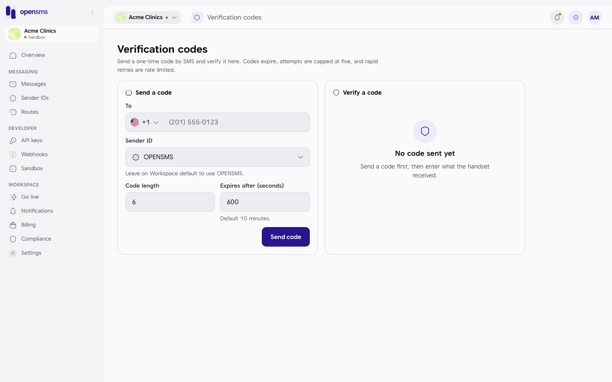
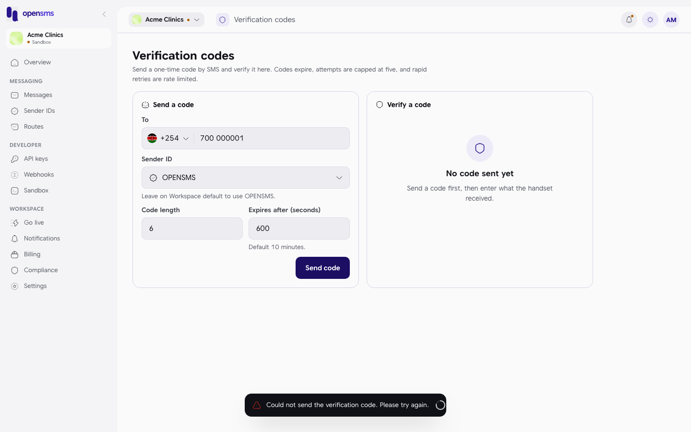

# Verification codes (OTP)

The Verification codes page lets you send a one-time code (OTP) by SMS to a phone number and then check the code the person types back. OpenSMS creates the code, sends it, times it out and limits guessing, so you do not have to. The page is mainly a way to try the feature by hand before your developers use the same thing through the API. It is for owners, admins and developers.

**Where to find it:** Verification codes is not in the left-hand menu in this version of the console. Open it by going to `/app/otp`.

Sending a code needs a verified email address, like any send.

## Who can do what

| Action | Owner | Admin | Developer | Finance | Viewer |
| --- | --- | --- | --- | --- | --- |
| Send and verify codes | Yes | Yes | Yes | No | No |

## Send a code

1. In **Send a code**, fill in:

   | Field | What to enter |
   | --- | --- |
   | To | The phone number, with its country (pick the flag or type `+254...`). |
   | Sender ID | An approved sender ID. Leave the workspace default to use `OPENSMS`. |
   | Code length | 4 to 10 digits. 6 by default. |
   | Expires after (seconds) | 30 seconds to 24 hours (86,400). 600 (10 minutes) by default. |

2. Click **Send code**. You see "Verification code sent." and the **Verify a code** panel starts a countdown ("Expires in 9:59").

Each code is sent as an ordinary message with the OTP traffic type, so it also appears in [Messages](messages.md) and is charged like one (nothing is charged in sandbox). In sandbox no phone receives it; the text is kept in the API's sandbox outbox (`GET /v1/sandbox/messages`), which the console's [Sandbox](sandbox.md#sandbox-inbox) page does not show.

| Message | Meaning |
| --- | --- |
| Enter a destination number first. | The To field is empty. |
| Code length must be between 4 and 10 digits. | Fix the length. |
| Expiry must be between 30 seconds and 24 hours. | Fix the expiry. |
| Could not send the verification code. Please try again. | The server refused. The page does not say why; the most common reason is that the workspace owner's email is not verified yet. |

## Verify a code

1. In **Verify a code** you see "Enter the 6-digit code sent to +254...".
2. Type the code the person received. It is checked when the last digit is in, or click **Verify**.

| Result | What you see |
| --- | --- |
| Right code | **Verified**: "The code for +254... checked out." ("Code verified.") |
| Wrong code | "Incorrect code. 4 attempts left." and a counter "4 of 5 attempts left". |
| Five wrong codes | **No attempts left**: "This code is locked after five wrong tries. Send a fresh one." |
| Too slow | **This code expired**: "Codes are single-window by design. Send a fresh one." |
| Too many tries too fast | "Too many attempts. Try again in *n* seconds." and "Rate limited. Wait *n*s before trying again." |

A code can only be verified once. To test again, send a new code.

## Related

- [Templates](templates.md) (OTP traffic type)
- [Sandbox](sandbox.md)
- [API keys](api-keys.md) (for sending codes from your own app)
