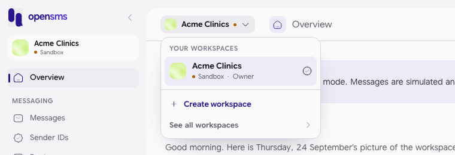
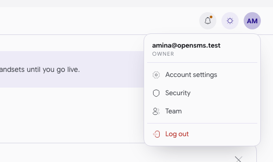

# Overview dashboard

The Overview is the first page you see after signing in. It shows how your workspace is doing at a glance: whether you are in sandbox or live, what is left to set up, how many messages went out in the last 30 days and how many were delivered, your wallet balance, and any sender IDs that need attention. This guide is for everyone in a workspace. Every role can open it; a few buttons only appear for roles that can use them.

Open it with **Overview** at the top of the left-hand menu, or go to `/app`.

## What is on the page, top to bottom

### Status banner

A sandbox workspace shows: "This workspace is in sandbox mode. Messages are simulated and will not reach real handsets until you go live." with a **Go live** link. Other states show their own banner:

| Workspace status | Banner text | Link |
| --- | --- | --- |
| Sandbox | This workspace is in sandbox mode. Messages are simulated and will not reach real handsets until you go live. | Go live |
| Pending review | Your workspace is with our review team. Sandbox sending keeps working while you wait. | Check review status |
| Suspended | This workspace is suspended, so sending is stopped. | What to do |
| Live | No banner. | |

Click the **X** to hide the banner. It comes back the next time you open the page.

Only the sandbox banner was seen on the local docs stack; the others are quoted from the app's code, because a workspace cannot be taken live locally (see [Go live](go-live.md#what-cannot-be-done-on-the-local-docs-stack)).

### Greeting and status chip

Under the title you see a greeting and today's date. On the right, a chip shows the workspace status (**SANDBOX** in the screenshot) and a **Status** link that opens the public [system status page](status-page.md) in a new tab.

### Get started

A checklist of four steps, with a progress bar ("1 of 4 steps done"). Only the steps you have not finished are listed; click one to go straight to it.

| Step | Done when | Goes to |
| --- | --- | --- |
| Create your first API key | The workspace has at least one API key. | [API keys](api-keys.md) |
| Send a test message | At least one message exists. | [Messages > Compose](messages.md) |
| Apply for a sender ID | At least one sender ID exists (any status). | [Sender IDs > New](sender-ids.md) |
| Go live | The workspace is live. | [Go live](go-live.md) |

If a step is for a role you do not have, it is shown without a link and says "An owner or admin can do this." When only one step is left, the card shrinks to a single line, "One step left: ...", with a **Finish up** link.

Click the **X** on the card to dismiss it. This is remembered on this browser only, so it can reappear on another computer.

### Sending volume

A chart of messages sent, delivered and failed per day over the last 30 days. With nothing sent yet it says **No messages sent yet**.

### Delivery rate

A ring showing the share of messages delivered over the last 30 days. With nothing sent it says **Nothing sent in this range**.

### Wallet

Your available balance in the workspace currency (for example **KES 10,000.00** for a new sandbox workspace), how much is held back for messages still being sent, and how much you spent in the last 30 days. **Billing** opens the [Billing](billing.md) page. If the balance is zero or below, a warning reads "Balance is empty. Sending will pause until you top up." and, for owners, admins and finance members, a **Top up** button appears.

In sandbox this is your simulated sandbox balance, not real money. See [Billing](billing.md#sandbox-credits).

### Sender IDs

Lists up to four sender IDs. If any are not approved, the card is headed **Needs your attention** and lists those first, with their status (for example **PENDING ADMIN**); a rejected one shows the reason. When all are approved it says **All sender IDs approved**. **Apply** (owners and admins) starts a new application. With none yet: **No sender IDs yet**.

### Top countries

The five countries you sent to most in the last 30 days. Empty: **Nowhere yet**.

### Recent messages

Your six most recent messages with the number, carrier, how long ago, and status. **View all** opens [Messages](messages.md). Empty: **No messages yet**, with a **Compose** button for roles that can send.

## The top bar

Click the workspace name at the top left to open the switcher. It lists **Your workspaces** with each one's status and your role in it, plus **Create workspace** and **See all workspaces**. Details are in [Choose a workspace](signing-up-and-signing-in.md#choose-a-workspace).

Click your initials at the top right for the account menu. It shows your email and role, then **Account settings**, **Security**, **Team** and **Log out**. If your login is also an OpenSMS operator account, an extra **Ops console** entry appears; ordinary customers never see it.

## If a card cannot load

Each card loads on its own. If one fails you see a short message in that card, such as "Couldn't load your sending volume" or "Couldn't load wallet balance", and the rest of the page keeps working. Reload the page to try again.

## Related

- [Usage](usage.md) for the same numbers over 7, 30 or 90 days
- [Billing](billing.md)
- [Go live](go-live.md)
- [Sender IDs](sender-ids.md)
