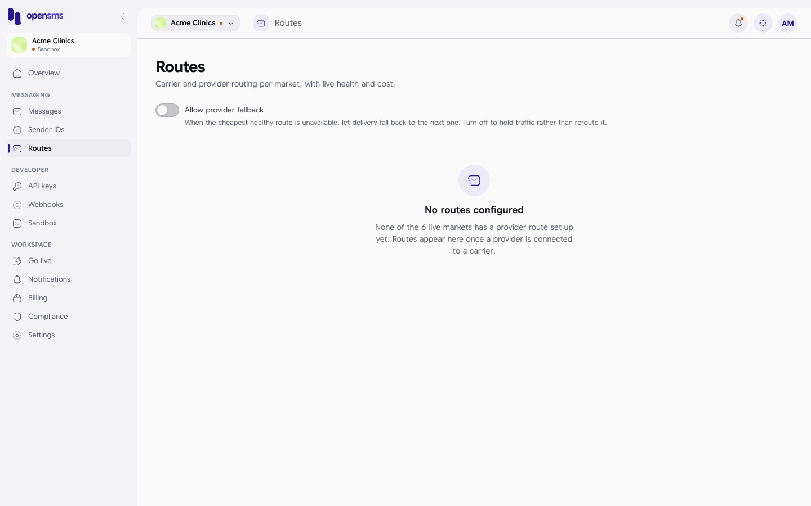

# Routes

A route is the path a message takes to a phone: through a messaging provider to a mobile carrier in a country. The Routes page lists, for every country OpenSMS serves, which carriers can be reached, through which provider, at what cost and how healthy each route is. It also holds the one routing choice you control: whether OpenSMS may fall back to another route when the preferred one is unavailable. This guide is for anyone who wants to know whether a country can be reached, and for owners and admins who decide on fallback.

Open **Routes** in the left-hand menu, under **Messaging** (`/app/routes`).

## Check which countries you can reach

1. Open **Routes**.
2. Under **Provider routes**, click a country tab. Each tab shows the country name and how many routes it has, and the heading gives the total in the form "N across M markets".
3. Read the table for that country:

   | Column | Meaning |
   | --- | --- |
   | Carrier | The mobile network, or **All carriers** when one route covers the whole country. |
   | Provider | The messaging provider OpenSMS uses for this route. |
   | Cost | OpenSMS's own cost for this route per message, or **Quote required** when there is no fixed price. This is not the price you pay; see [Billing](billing.md). |
   | Health | **HEALTHY**, or a warning state when the route is degraded or down. |

The list shows active markets only. Picking a market during [onboarding](onboarding.md) does not add routes; routes appear when OpenSMS connects a provider to a carrier in that country.

### Empty states

| You see | Meaning |
| --- | --- |
| No routes configured. "None of the 6 live markets has a provider route set up yet. Routes appear here once a provider is connected to a carrier." | Countries are switched on, but no provider is connected. This is what the docs stack shows. |
| No routes in *country* | That one country has no connected provider yet. |
| No active markets yet | No country is switched on for sending. |
| Couldn't load routes | The list could not be fetched. Click **Retry**. |

On the docs stack six markets are active (Ghana, Kenya, Nigeria, South Africa, United Kingdom and United States) and none has a provider route, so the per-country table could not be shown with real rows. The columns above are described from the app's code.

When a route changes health you get a "Route health changed" [notification](notifications.md), unless you turned it off in [Settings > Notifications](settings.md#notifications).

## Allow provider fallback

**Who can do this:** owners and admins. Other roles see "Only the workspace owner or an admin can change routing fallback." instead of the switch.

**Allow provider fallback** decides what happens when the cheapest healthy route for a message is not available:

| Switch | Effect |
| --- | --- |
| On | Delivery falls back to the next route. |
| Off | Traffic is held rather than rerouted. |

1. Click the switch next to **Allow provider fallback**.
2. The change saves immediately. You see "Provider fallback allowed." or "Provider fallback blocked."

A new workspace starts with fallback **off**, as in the screenshot.

There is no way to pin a particular provider from this page; the product does not support it.

## Related

- [Onboarding](onboarding.md) (choosing markets)
- [Messages](messages.md) ("No delivery route is available for this destination right now.")
- [Notifications](notifications.md)
