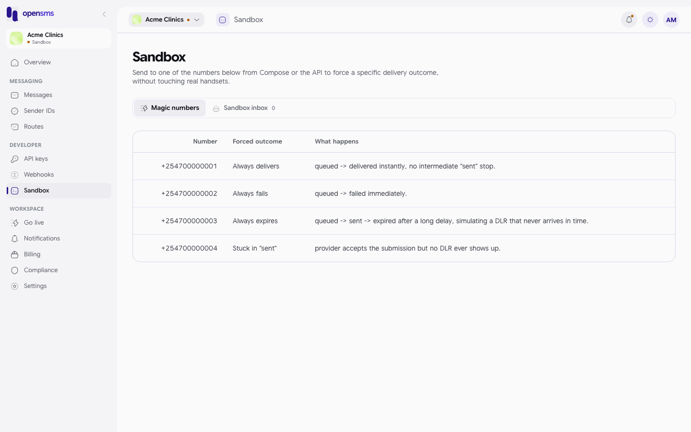
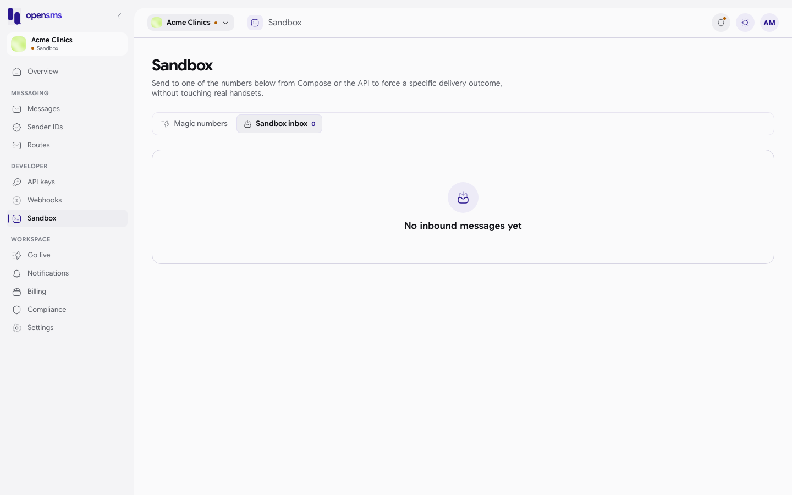

# Sandbox

Sandbox is the free practice mode every workspace starts in. Messages you send in sandbox are simulated: they go through OpenSMS as normal, get a status and a delivery result, but never reach a real phone and never cost real money. The **Sandbox** page (`/app/sandbox`, under **Developer** in the left-hand menu) explains how to make a test message succeed or fail on purpose. This guide is for anyone testing the platform, especially developers.

## How sandbox works

- A workspace stays in sandbox until OpenSMS approves it to [go live](go-live.md). The top of the console shows a **Sandbox** tag next to the workspace name, and pages that send say "This workspace is not live yet."
- Sandbox has its own wallet of simulated credits, separate from the live wallet. A new workspace starts with 10,000 credits in its currency. See [Billing](billing.md#sandbox-credits).
- Sandbox messages still need a verified email address before they can be sent ("email verification is required for sandbox sending").
- Sandbox messages use the shared sender `OPENSMS` unless you have your own approved [sender ID](sender-ids.md).
- API keys made for sandbox start with `sk_test_` and can only send sandbox messages. See [API keys](api-keys.md).

## Magic numbers

The page's **Magic numbers** tab lists four numbers and the result each one is supposed to force:

> **The table on this page is wrong in this version.** OpenSMS's sandbox provider does not use these four numbers. It decides the result by the **range** the number falls in, and all four numbers in the table are in the "delivered" range, so only the first row behaves as described. Use the ranges below instead.

What actually happens to a sandbox message, by destination number:

| Destination | Result | Reason recorded |
| --- | --- | --- |
| +254700000000 to +254700000099 | Delivered | |
| +254700000100 to +254700000199 | Failed | `carrier_rejected` |
| +254700000200 to +254700000299 | Expired | `dlr_timeout` |
| Any other number | Delivered | |

There is no sandbox number that leaves a message stuck in "sent".

These ranges come from the OpenSMS code and its engineering notes. They could not be tried end to end on the local docs stack, because no account there can verify its email and so no sandbox message could be sent.

## Sandbox inbox

The **Sandbox inbox** tab is meant to show sandbox traffic, but it actually lists the workspace's received (inbound) messages, which only exist for live numbers. In sandbox it therefore always shows **No inbound messages yet**, with a count of 0.

To see what your sandbox messages said, open them in [Messages](messages.md). (The API also has a sandbox outbox, `GET /v1/sandbox/messages`, that the console does not use.)

There is no button to reset the sandbox. The sandbox wallet balance is reset to 10,000 credits automatically every day at 00:00 UTC.

## Related

- [Messages](messages.md)
- [API keys](api-keys.md)
- [Billing: sandbox credits](billing.md#sandbox-credits)
- [Go live](go-live.md)
