# Sender IDs

A sender ID is the name your recipients see as the sender of your text, such as `ACMECLINIC`, instead of a phone number. Carriers only let you use a name after it has been checked and registered, so OpenSMS walks you through an application and then tracks it market by market. This guide is for workspace owners and admins who apply for sender IDs, and for anyone who wants to check where an application stands.

Open **Sender IDs** in the left-hand menu (`/app/sender-ids`).

## Who can do what

| Action | Owner | Admin | Developer | Finance | Viewer |
| --- | --- | --- | --- | --- | --- |
| See sender IDs and their status | Yes | Yes | Yes | Yes | Yes |
| Apply, save drafts, upload documents, withdraw, resubmit | Yes | Yes | No | No | No |

Members who cannot apply can still open the pages; the buttons are greyed out with the reason.

## The sender ID list

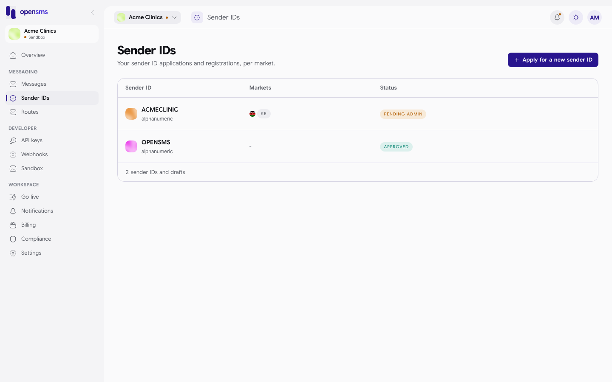

Each row shows the name and its type (alphanumeric), the markets it is registered or requested in (as country codes), and its status. A draft row has a **Continue application** link. Click a row to open its [detail page](#check-an-application).

Every workspace also sees **OPENSMS**, the platform's shared sender, already **Approved**. You can send with it straight away (in sandbox) while your own name is being reviewed.

### Statuses

| Status | Meaning |
| --- | --- |
| Draft | Saved but not submitted. Only your workspace can see it; nothing has been filed. |
| Pending admin | Submitted. OpenSMS is reviewing your request and documents. |
| Pending provider | OpenSMS approved it and has filed it with the carriers' providers; waiting for them. |
| Approved | Ready to use. It appears in the Sender ID picker when you [compose](messages.md#send-a-message). |
| Rejected | Not accepted. The reason is shown, and you can amend and resubmit. |
| Suspended | Was approved but has been stopped. Contact OpenSMS support. |

On the detail page each market's filing has its own status too (**PENDING**, **SUBMITTED**, **APPROVED** or **REJECTED**), because every carrier decides separately.

## Apply for a sender ID

Click **Apply for a new sender ID** (or **Continue application** on a draft). The application opens as a full-screen, seven-step page at `/app/sender-ids/new`. The step counter is in the bottom-right corner, and **Back to dashboard** at the top right leaves the wizard.

From step 2 on, **Save for later** stores everything you have entered as a draft ("Application draft saved. You can continue it from Sender IDs."). Each **Continue** also saves the draft.

### Step 1: pick how you want to send

Click the **YOUR BRAND** card (marked **NEEDS APPROVAL**) and then **Continue**. The button is greyed out until the card is picked.

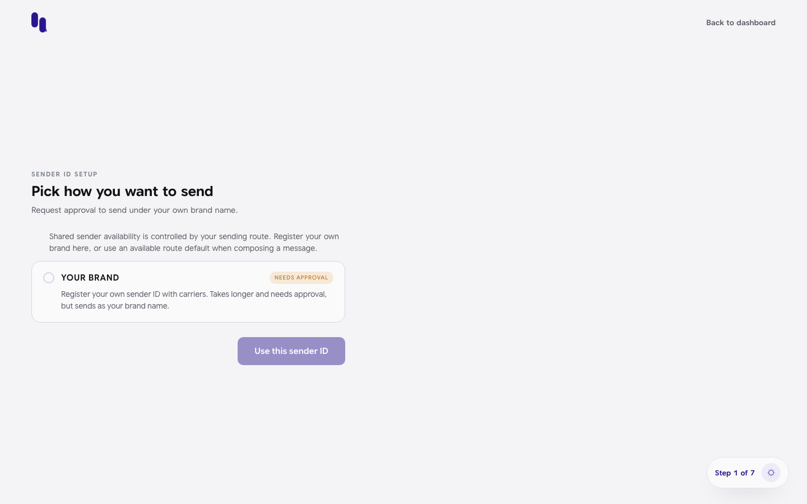

### Step 2: choose your sender ID

1. Type the name. It is changed to capitals, and anything other than letters and numbers is removed. The counter shows how many of the 11 characters you have used.
2. The three rules must all turn green: **11 characters or fewer**, **Letters and numbers only**, **Not a reserved sender ID**.
3. Wait for "This name is available to request. Approval is still required."
4. Tick **I own this brand or have permission to use it**.
5. Click **Continue**.

The **Preview** shows how the name will look on a phone.

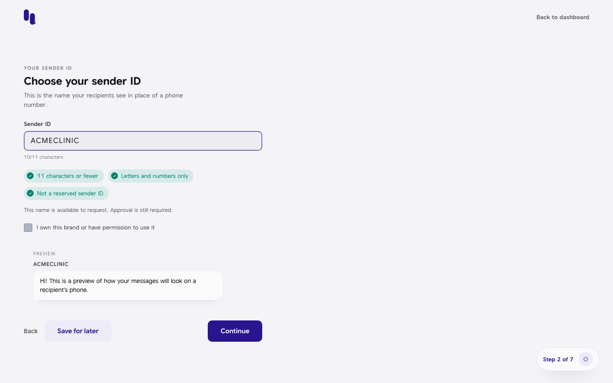

### Step 3: where will you send

Click each market (country) you need. A tick appears on the ones you pick. Each row shows the carriers there and how long approval usually takes (on the docs stack every market says **PROVIDER REVIEW**). When your picks are checked you see "Sender ID can be requested in the selected markets." If a name is blocked in one market, that market and the reason are shown instead.

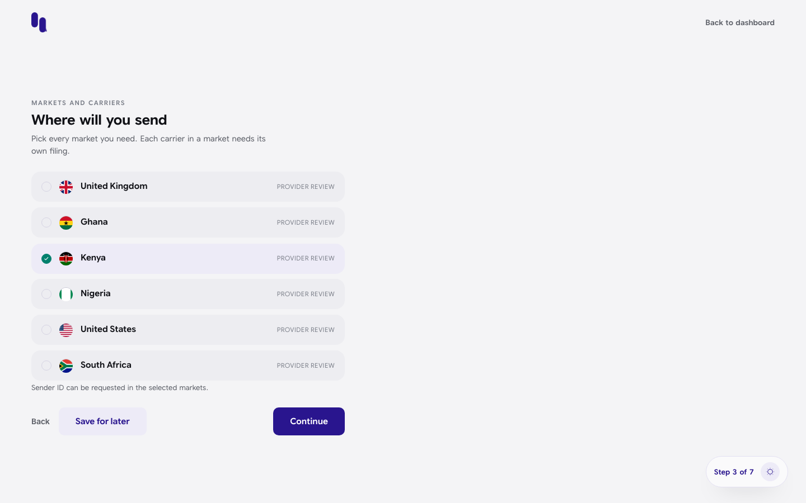

Each carrier in a market needs its own filing, and some charge a fee (shown in step 6).

### Step 4: what will you send

1. Pick the **Traffic type**: OTP, Transactional or Marketing. Each card shows an example message. Nothing is picked at first, and you cannot continue until you pick one.
2. Type a **Sample message**: a real example of what you will send. Carriers read it.
3. Click **Continue**.

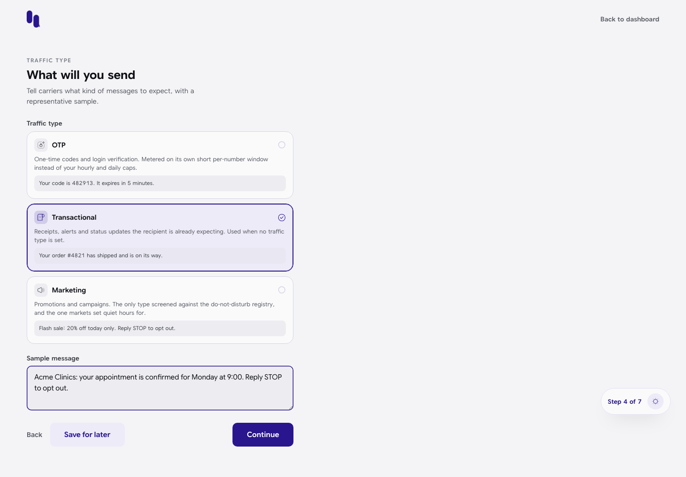

### Step 5: verify your business (documents)

Carriers need three documents before they approve a new sender ID. All three are required.

| Document | What it is |
| --- | --- |
| Certificate of incorporation | A copy of your business registration certificate. |
| Signatory ID | A government-issued ID for the person authorising this sender ID. |
| Letter of authorization | A signed letter authorising OpenSMS to file on your behalf. |

1. Click **UPLOAD** on a row (or drop the file on it). Files must be **PDF, PNG or JPEG, up to 10 MiB**.
2. When a file is accepted the row turns green and shows **ATTACHED** with the file name and size. The **x** removes it.
3. Repeat for all three, then click **Continue**.

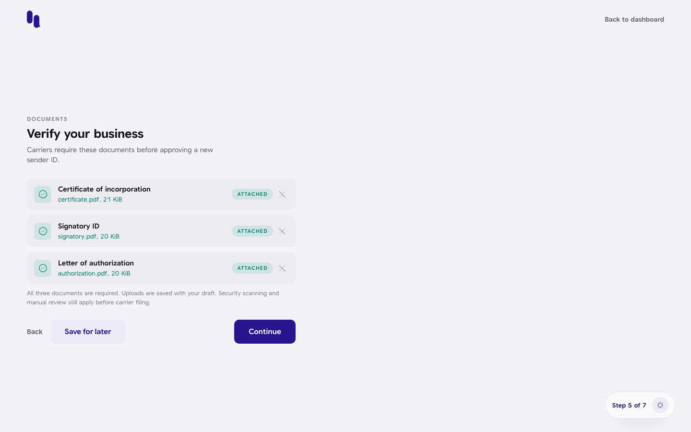

The server checks that each file really is a PDF, PNG or JPEG, not just that its name ends in `.pdf`. A damaged or fake file turns the row red with "document must be a valid PDF, PNG or JPEG" and a **RETRY** label:

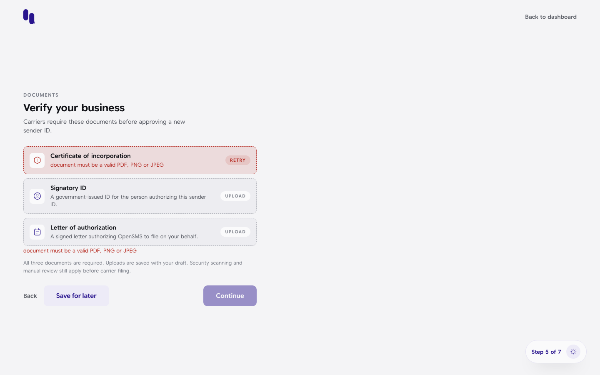

As the page notes, uploaded files are security-scanned and reviewed by a person before anything is filed with carriers.

### Step 6: check and file

The review card lists the sender ID, markets, traffic type, sample message and "3 of 3 attached". Below it, **Carrier registration fees** lists each market and provider with its current fee, and an **Estimated total** when there are fees.

1. Check everything. Use **Back** to change anything.
2. Tick **I have reviewed these filing fees and authorize submission**. Fees may be charged to your workspace wallet when each filing is submitted.
3. Click **Submit for review**.

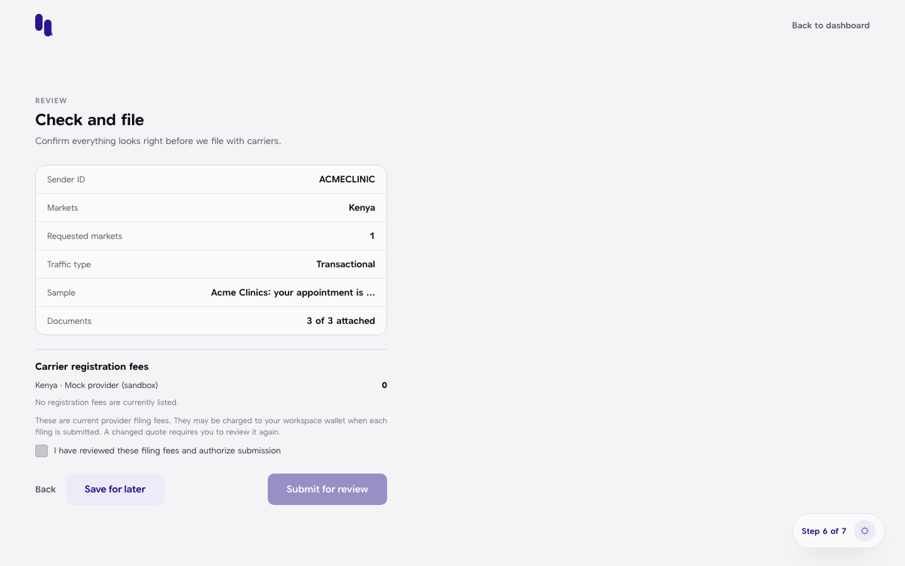

If the fees changed while you were on this page, the submission is refused, the tick is cleared, and the new quote is loaded: review it and tick again.

On the docs stack the only provider is a sandbox mock, so the fee line reads **0** and "No registration fees are currently listed."

### Step 7: filed

You see "Sender ID request submitted for review." and **Your sender ID request is in review**, with a summary and one line per market marked **IN REVIEW**. Click **View sender ID** to open its detail page.

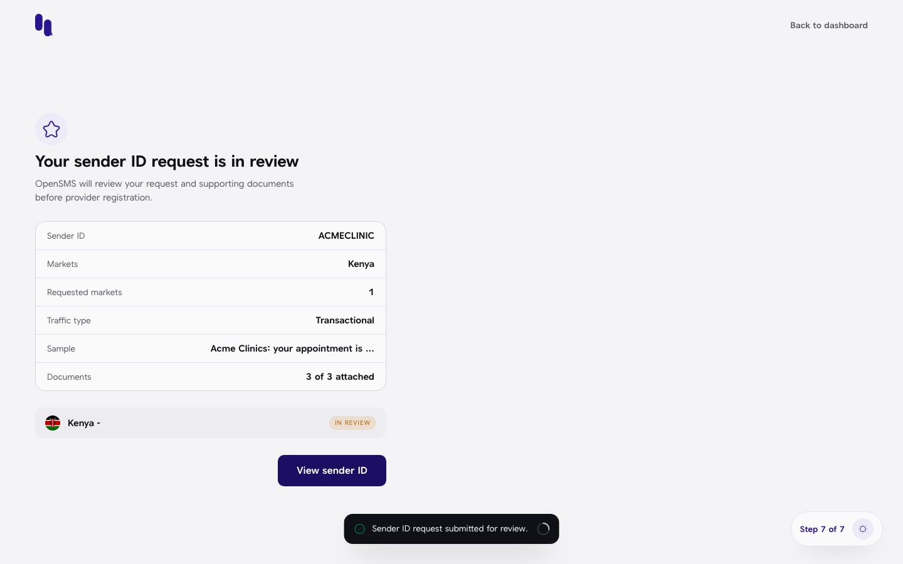

## Check an application

Open a sender ID from the list (`/app/sender-ids/<id>`).

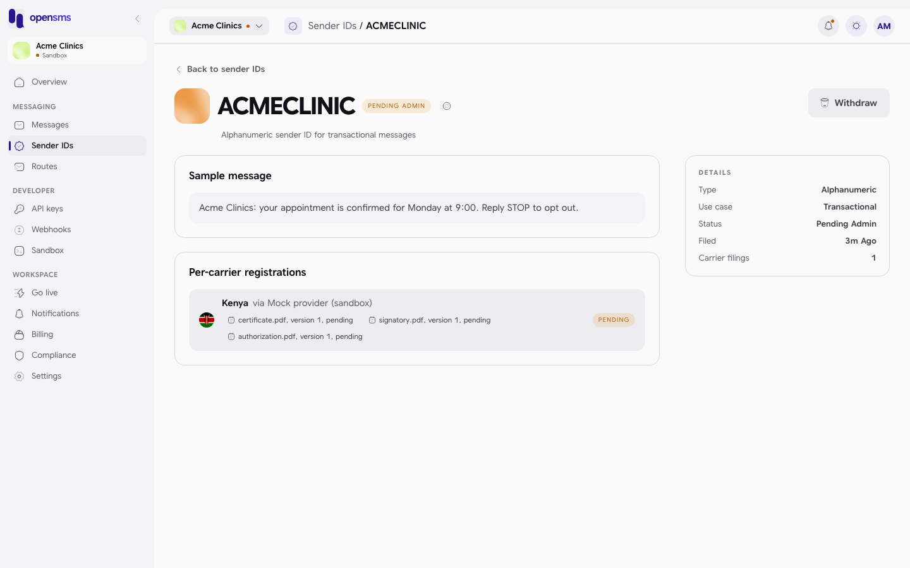

The page shows:

- the name, its status badge, and a refresh button to reload the status;
- **Sample message** you filed;
- **Per-carrier registrations**: one row per market and provider, with its own status, any fee, the provider's reference once filed, when it was filed and answered, and a chip per document with its file name, version and review state (`pending`, `approved` or `rejected`, plus the reviewer's reason when rejected);
- **Details**: type, use case, status, when it was filed and how many carrier filings there are.

An approved name that needs no carrier filing (like the shared `OPENSMS`) says **No per-carrier filing needed**:

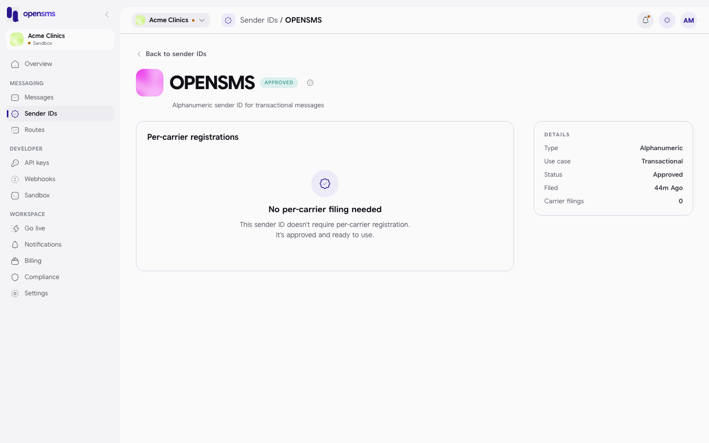

## Withdraw an application

While a sender ID is a draft, pending, or rejected, owners and admins see **Withdraw**.

1. Click **Withdraw**.
2. Read the warning: you would need to file again from scratch to use the name later, and it cannot be undone.
3. Click **Withdraw sender ID**. You see "Sender ID withdrawn." and return to the list.

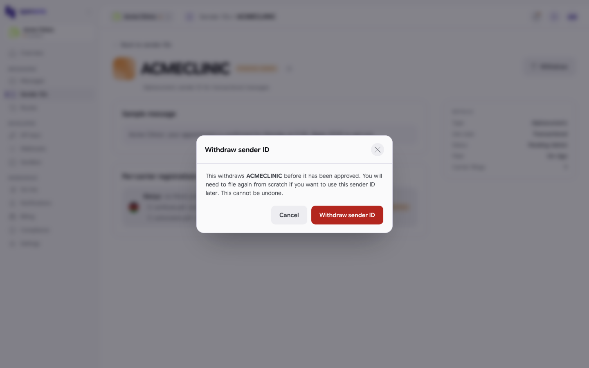

An approved or suspended sender ID cannot be withdrawn from here.

## If an application is rejected

The following describes the page as built. It could not be captured locally, because approving or rejecting needs an OpenSMS operator signed in with two-factor authentication, which the docs stack's operator account does not have.

- A red banner at the top shows the rejection reason, with **Amend and resubmit**.
- A rejected market row shows its reason and a **Resubmit** button.
- Either button opens **Resubmit filing**: read the reason, edit the **Sample message**, optionally replace any of the three documents, then click **Resubmit for review**. Your existing documents are kept unless you replace them. You see "Sender ID resubmitted for review."

A rejected **document** (its chip says `rejected` with a reason) is replaced the same way, through **Resubmit**.

## Related

- [Onboarding](onboarding.md) (where your first sender ID draft is started)
- [Messages](messages.md) (using an approved sender ID)
- [Routes](routes.md) (which markets you can actually reach)
- [Billing](billing.md) (registration fees come out of your wallet)
