# Settings

Settings is where you manage the workspace itself (its name, spending limit, how long history is kept, your team, exporting or deleting it) and your own account (two-factor authentication, where you are signed in, which alerts you get, and the legal documents on record). This guide is for workspace owners and admins, who manage the workspace, and for every member, who manages their own account.

Open **Settings** at the bottom of the left-hand menu (`/app/settings`), or choose **Account settings** from the menu under your initials at the top right.

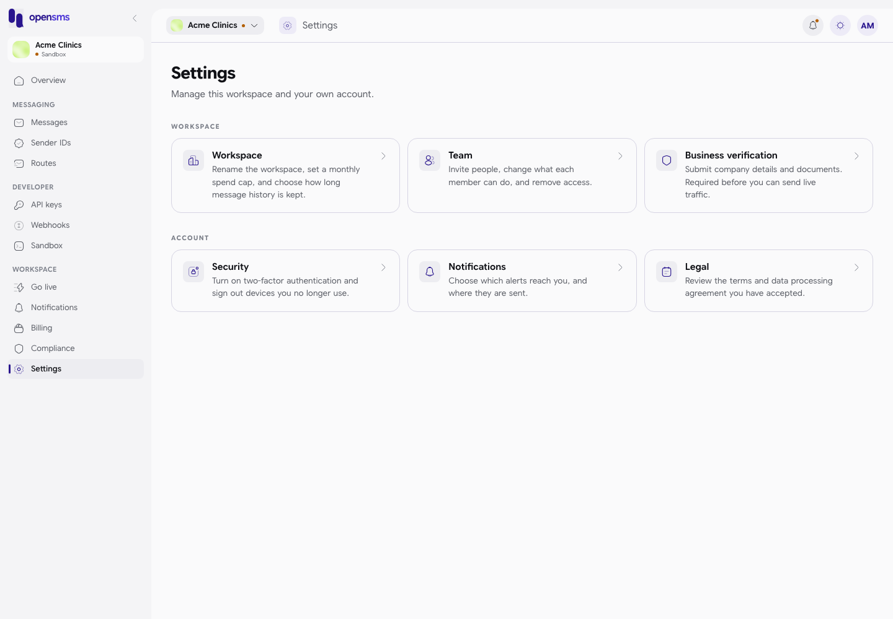

| Card | Goes to | Section |
| --- | --- | --- |
| Workspace | `/app/settings/workspace` | [Workspace](#workspace) |
| Team | `/app/settings/team` | [Team](#team) |
| Business verification | `/app/verification/company` | [Compliance and verification](compliance-and-verification.md#business-verification) |
| Security | `/app/settings/security` | [Security](#security) |
| Notifications | `/app/settings/notifications` | [Notifications](#notifications) |
| Legal | `/app/settings/legal` | [Legal](#legal) |

## Workspace

**Who can do what:** owners and admins can rename the workspace and export its data. Only the owner can change the spend cap and data retention, and only the owner sees the **Danger zone**. Other roles see the values read-only, with "Only workspace owners and admins can edit workspace settings." or "Only the workspace owner can edit the spend cap and data retention window."

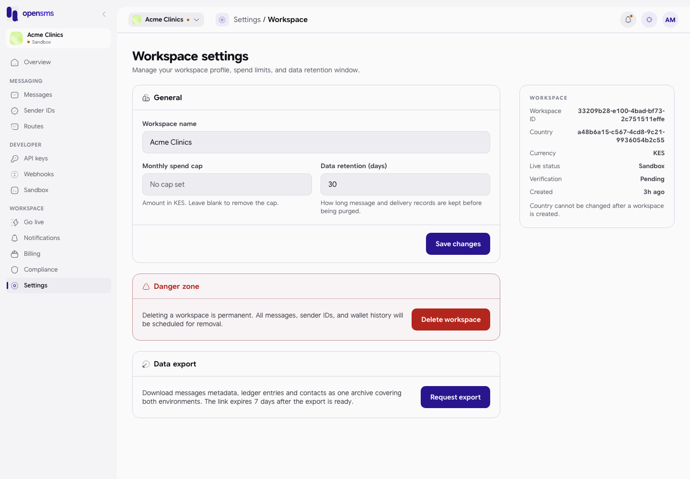

### Change the name, spend cap or data retention

1. Edit any of these fields:

   | Field | What it does |
   | --- | --- |
   | Workspace name | The name shown in the switcher and to your team. |
   | Monthly spend cap | The most the workspace may spend in a month, in your currency. Leave it blank for no cap. You are warned as you approach it and sending stops when you reach it (see [Notifications](notifications.md)). At most two decimal places. |
   | Data retention (days) | How long message and delivery records are kept before they are deleted, from 1 to 400 days. A new workspace keeps 30 days. |

2. Click **Save changes**. You see "Workspace settings saved."

If a value is out of range the server's message appears, for example "days must be an integer between 1 and 400.":

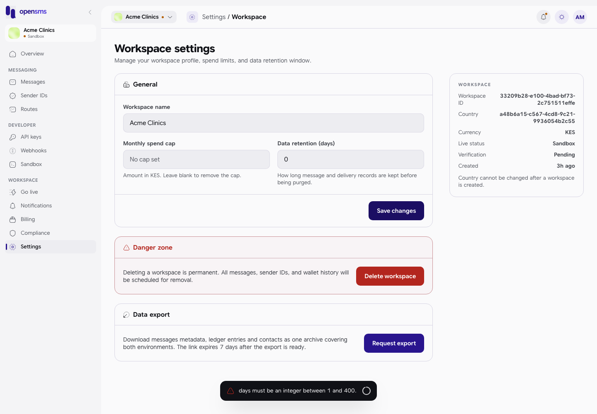

The panel on the right lists the workspace ID, country, currency, live status, verification status and when it was created. The country (and so the currency) cannot be changed after the workspace is created. **Known display problem:** in this version the **Country** line shows a long internal code instead of the country name, as in the screenshot.

### Data export

Download a copy of your message records (without message text), wallet movements and contacts, for both sandbox and live, as one file.

1. Click **Request export**. You see "Export requested. The archive is being prepared."
2. Wait. The status refreshes by itself every few seconds; **Refresh status** checks immediately. On the docs stack it was ready within seconds.
3. When it says "Export ... is ready", click **Download archive**. The file is named `workspace-export-<id>.json`.

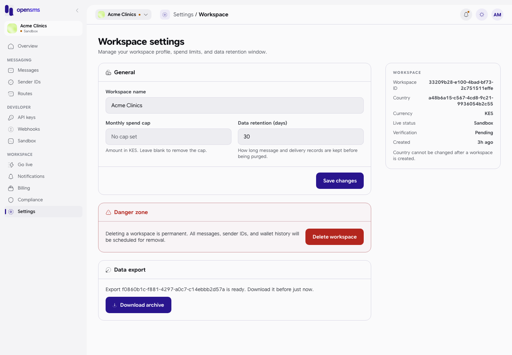

The download link lasts 7 days. After that you see "This export has expired. Request a fresh one." If preparing it fails, you see why and a **Start over** button. Once the workspace is live, owners and finance members must enter a current authenticator code before exporting.

**Known display problem:** the ready message says "Download it before just now." instead of showing the expiry date. The real expiry is 7 days after the export became ready.

A "Data export ready" [notification](notifications.md) also points you back to this page.

### Delete the workspace

**Who can do this:** the owner only.

1. In the **Danger zone**, click **Delete workspace**.
2. Type the workspace name exactly.
3. Enter a current 6-digit code from your authenticator app.
4. Click **Delete workspace**. You see "Workspace deletion requested."

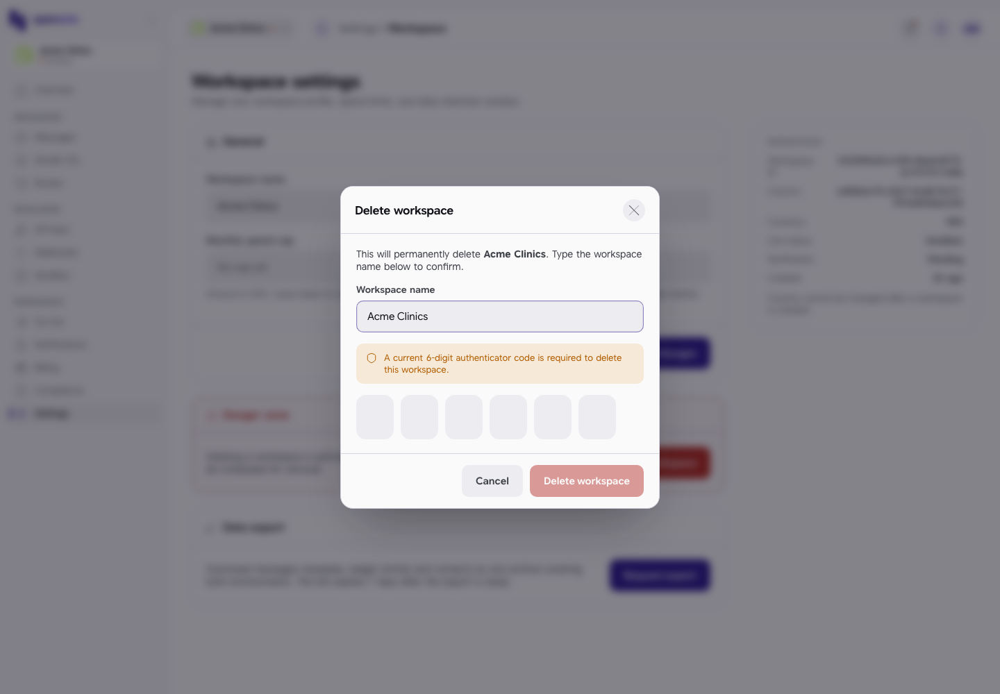

What the server requires and does:

- You must have [two-factor authentication](#security) turned on, even in sandbox. Without it: "Enable two-factor authentication before requesting deletion." The form has no way round this, so turn 2FA on first.
- You cannot delete your only workspace: "Create or join another active workspace before deleting your final workspace."
- Deletion is **scheduled 30 days ahead**, not immediate. Until then, **Cancel deletion** in the same place keeps the workspace. (The cancel button is shown right after you request deletion; if you leave the page and come back it is no longer shown, even though the deletion is still scheduled.)

On the docs stack the deletion was tried through the API only, and stopped at the two rules above.

## Team

**Who can open it:** owners and admins. Other roles cannot manage the team.

### Invite a teammate

1. Enter their **Email**.
2. Choose a **Role**: **Admin**, **Developer**, **Finance** or **Viewer** (the default). See [Roles](README.md#roles-in-one-table). The form does not offer **Owner**; to hand the workspace over, use [Transfer](#change-roles-remove-people-and-transfer-ownership). (The API itself does let an owner invite another owner, see the [API reference](../reference/api/README.md).)
3. Click **Invite**.

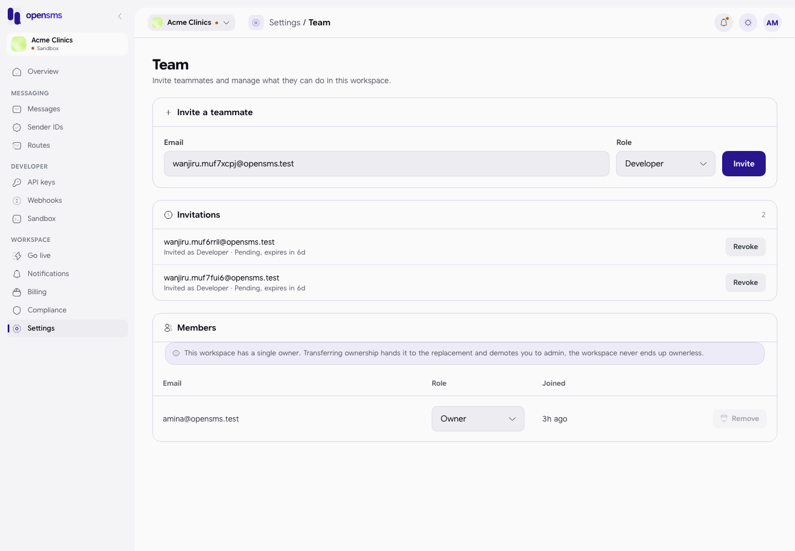

An **Invitation link** appears with a **Copy link** button. The link expires in seven days. When email works, the invitation is also emailed ("Invitation email queued. You can also share the link."). On the docs stack no email is sent, so the page says "Invitation created. Share the link with your teammate." and "No email has been sent. Copy it before leaving this page." The link is shown only once, so copy it before you leave the page.

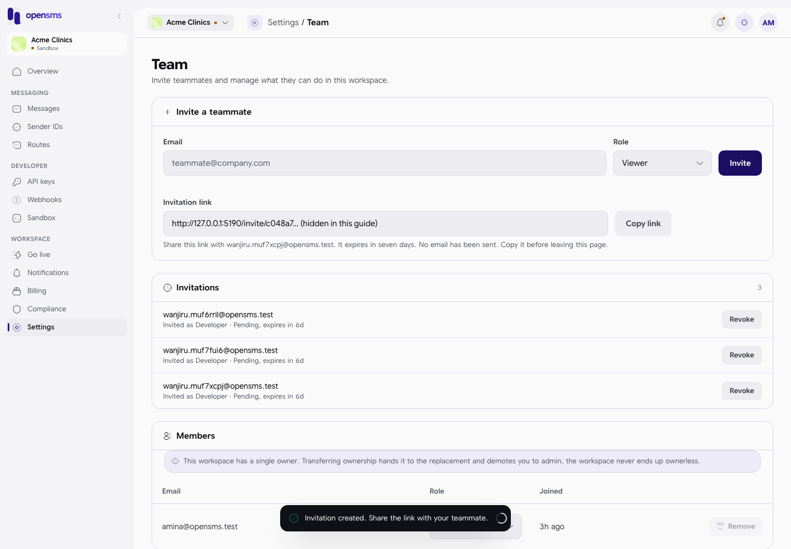

The **Invitations** card lists each invitation with its role and state: **Pending, expires in 6d**, **Accepted**, **Expired** or **Cancelled**. Click **Revoke** on a pending one to cancel it; you see "Invitation to ... revoked."

### What the invited person sees

Opening the link shows **Join your team**: "Sign in with the email address that received this invitation. Your email must be verified before you can join." with **Log in to accept invitation** and **Create an account**.

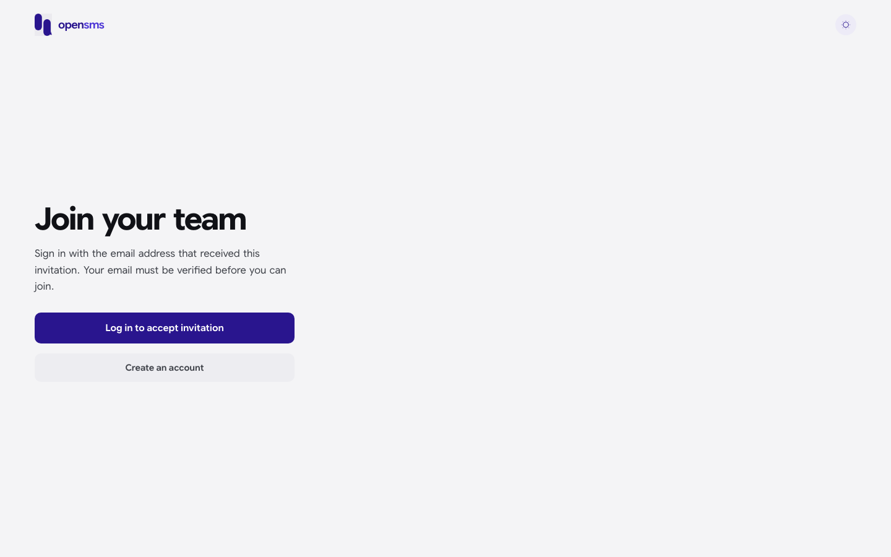

They must sign in with exactly the invited email address, and that address must be verified. The rest of their steps are in [Accept an invitation to a team](signing-up-and-signing-in.md#accept-an-invitation-to-a-team).

**Could not complete locally:** accepting needs a verified email, and the docs stack cannot verify email, so accepting was refused with "Verified invited email identity required." For that reason no workspace used for these guides has a second member, and the member actions below are described from the app's code.

### Change roles, remove people and transfer ownership

The **Members** table lists each member's email, role and when they joined.

- **Change a role:** pick a new one in the **Role** box on their row. You see "Role updated." Admins cannot change the owner or make anyone owner; if a change is not allowed you see "You are not allowed to make that role change."
- **Remove:** click **Remove** and confirm. They "will immediately lose access". The owner cannot be removed.
- **Transfer ownership** (owner only): click **Transfer** on the new owner's row, type their email to confirm, and click **Transfer ownership**. They become owner and you become an admin in one step, so the workspace is never left without an owner. On a live workspace the new owner must already have two-factor authentication on, otherwise you see "The replacement owner must enable two-factor authentication first."

## Security

Every member manages their own security. Open **Security** from Settings or from the menu under your initials.

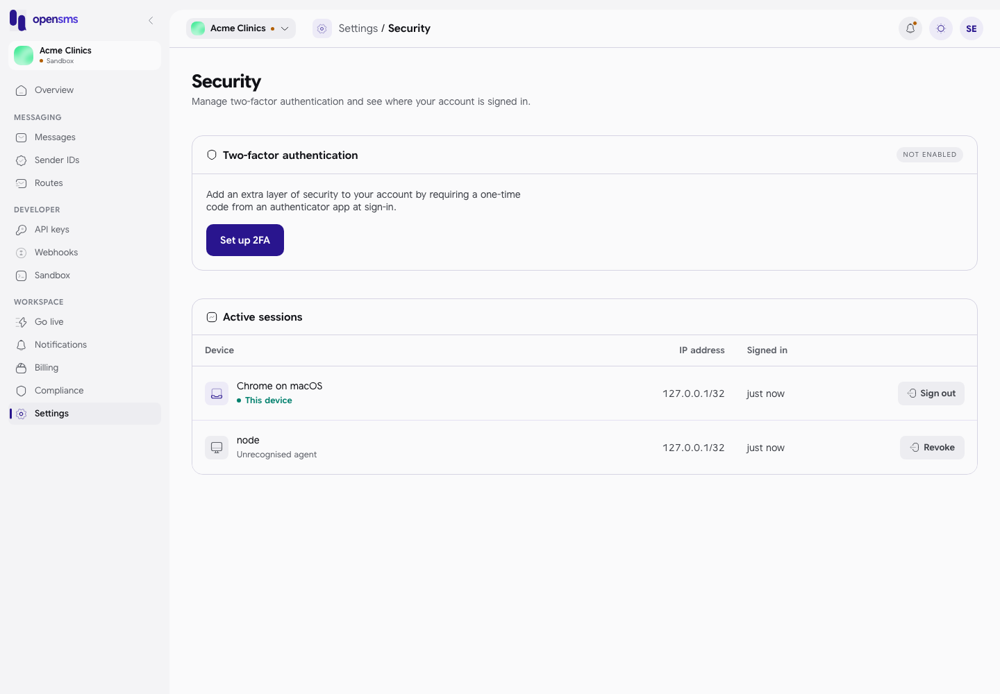

### Turn on two-factor authentication (2FA)

With 2FA on, signing in asks for a 6-digit code from an authenticator app on your phone as well as your password (see [Two-factor authentication](signing-up-and-signing-in.md#two-factor-authentication)).

1. Click **Set up 2FA**.
2. In your authenticator app (for example Google Authenticator, Microsoft Authenticator or 1Password), add an account by typing the **setup key** shown on screen, and choose a time-based code. The page shows the key only; there is no QR code to scan.
3. Type the 6-digit code from the app. It is checked when the sixth digit is in, or click **Enable**.
4. You see "Two-factor authentication enabled." and the badge changes from **NOT ENABLED** to **ENABLED**.

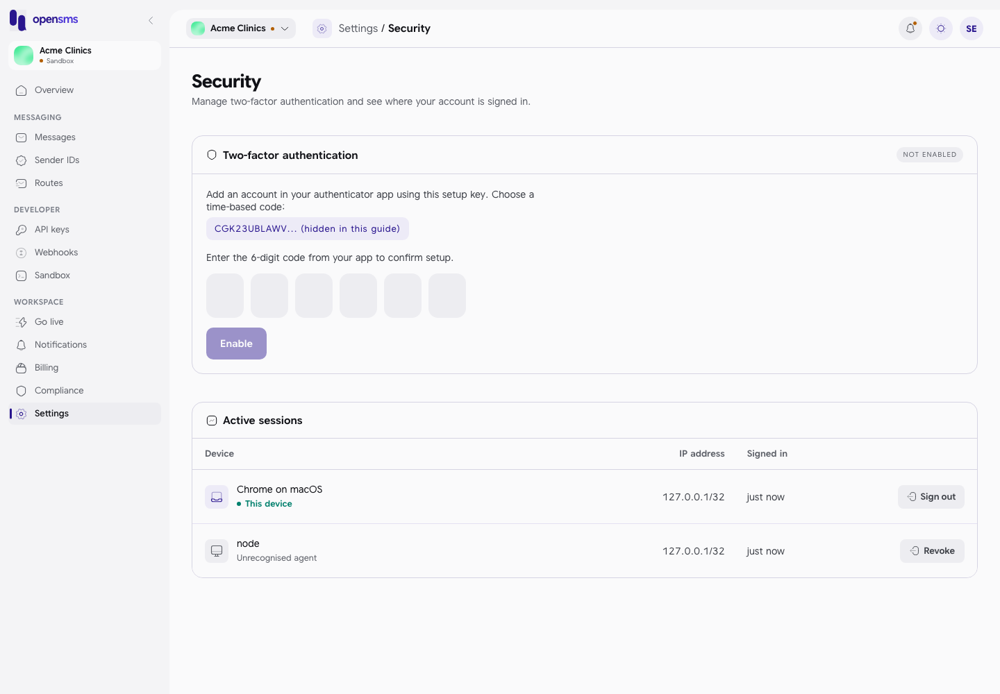

A wrong code turns the boxes red with "invalid authenticator code":

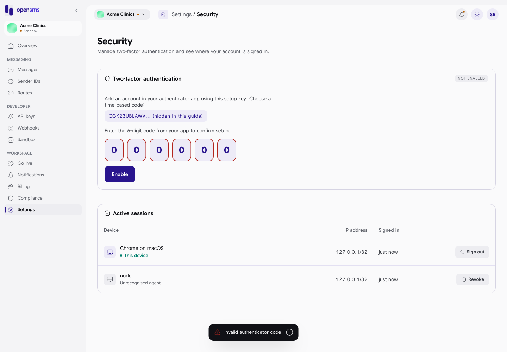

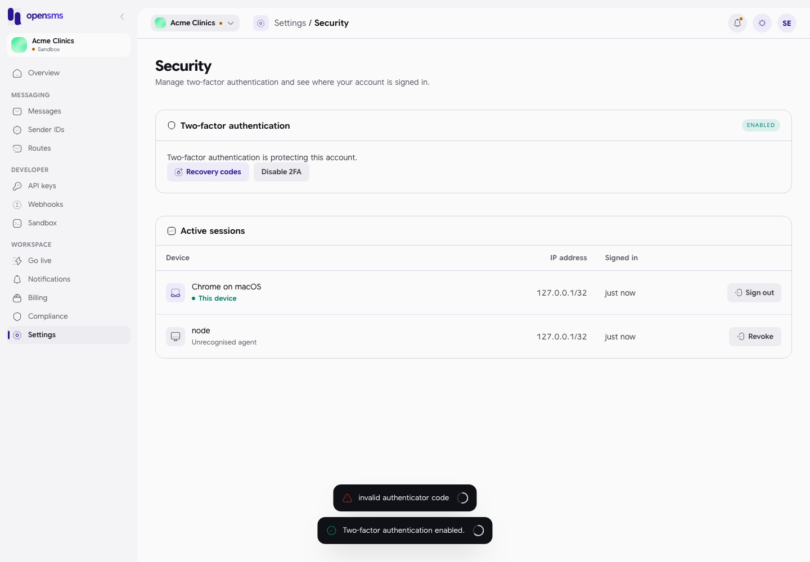

You need 2FA for: deleting a workspace (always), submitting a bank-transfer proof in [Billing](billing.md#fund-the-live-wallet), and, once the workspace is live, for owners and finance members to create live [API keys](api-keys.md), add credits and export data, and for rent or release of [numbers](numbers.md).

### Recovery codes

Recovery codes let you sign in if you lose your phone.

1. Click **Recovery codes**.
2. Enter a current 6-digit code from your app.
3. Ten codes are shown, once. Click **Copy all** and store them somewhere safe, then click **Done**. You see "New recovery codes generated. Previous codes no longer work."

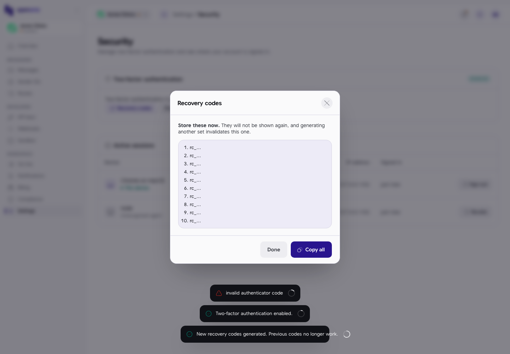

Generating a new set cancels the old one.

### Turn off 2FA

Click **Disable 2FA**, enter a current code and confirm. Owners and finance members of a live workspace cannot turn it off: "Two-factor authentication is required for owners and finance members of live workspaces and cannot be disabled."

### Active sessions

The table lists everywhere your account is signed in: the device and browser, the internet address, and when it signed in. Your current browser is marked **This device**. Sign-ins made by software rather than a browser show their raw name (for example "node") and "Unrecognised agent".

1. Click **Revoke** on a session you do not recognise (or **Sign out** on this device).
2. Confirm with **Revoke**. That device is signed out immediately. Revoking this device signs you out and returns you to the login page.

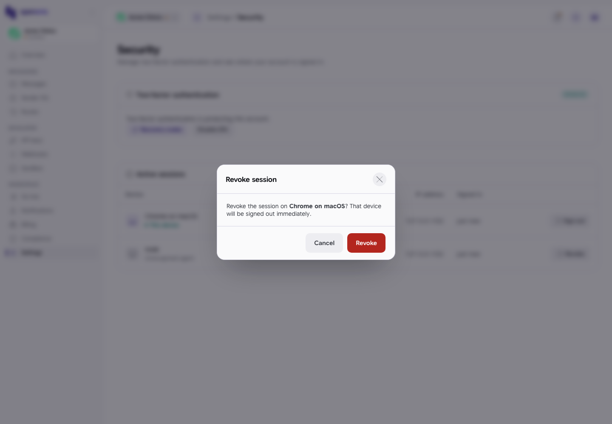

## Notifications

Choose, per event, whether you get an email, an in-app notification, both or neither. This is covered with screenshots in [Notifications: choose which alerts reach you](notifications.md#choose-which-alerts-reach-you).

## Legal

The Legal page lists the terms of service, privacy policy and data processing agreement, each with its version, publication date and a **Read it** link, and whether you have accepted it (**Accepted 1.0**, **Accepted ..., newer available**, or **Not accepted**). See [Legal acceptance](legal-acceptance.md#see-what-you-have-accepted) for a screenshot and for how accepting works.

## Related

- [Signing up and signing in](signing-up-and-signing-in.md)
- [Compliance and verification](compliance-and-verification.md)
- [Billing](billing.md)
- [Notifications](notifications.md)
