# Signing up and signing in

This guide covers getting into OpenSMS: creating an account, verifying your email, logging in with a password or an emailed code, two-factor authentication, resetting a forgotten password, choosing between workspaces, and joining a team you were invited to. It is written for anyone who uses the OpenSMS web app, whatever their role.

> **Local docs stack:** these screenshots come from a test copy of OpenSMS with email switched off. Anything that needs an email to arrive (the verification code, a login code, a password reset link, an invitation link) stops with an "email delivery" message in these screenshots. On a real deployment those emails are sent normally.

## Create an account

Anyone can sign up. The person who signs up becomes the **owner** of a new workspace.

1. Go to `/signup` (or click **Create an account** on the login page).
2. Fill in the three fields and click **Continue**.

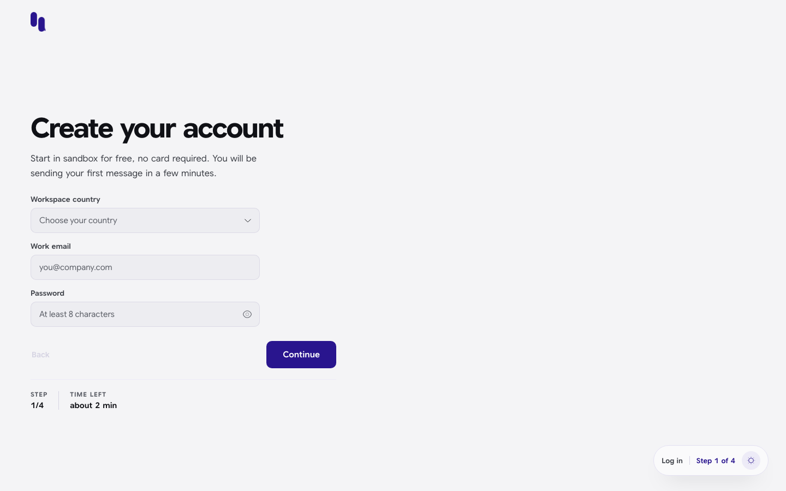

| Field | What to enter |
| --- | --- |
| Workspace country | The country your business is registered in. It sets your workspace's billing currency (for example Kenya uses KES) and **cannot be changed later**. Only countries the platform has switched on are listed. |
| Work email | The email you will sign in with. It must be one you can read, because a verification code is sent to it. |
| Password | At least 8 characters. Click the eye icon to show or hide what you typed. |

If a field is wrong, the form marks it in red and tells you what to fix:

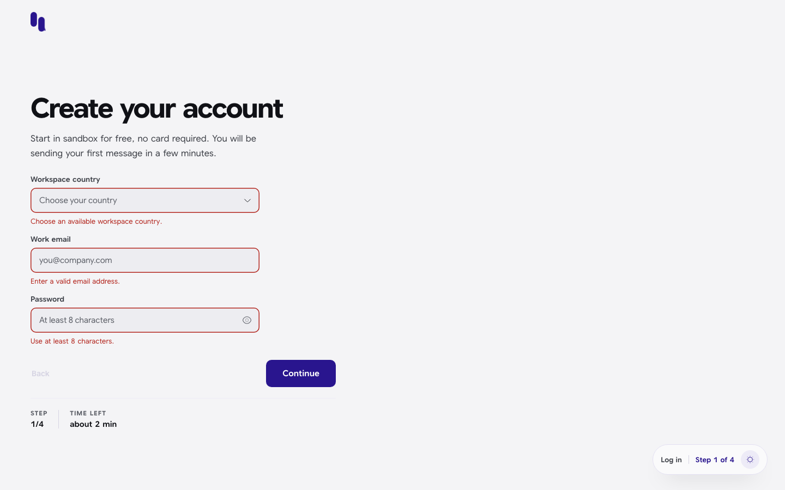

| Message | Meaning |
| --- | --- |
| Choose an available workspace country. | No country was picked. |
| Enter a valid email address. | The email is missing or not a valid address. |
| Use at least 8 characters. | The password is too short. |
| That email is already registered. | An account already uses this email. Log in instead, or reset the password. |

Your new workspace is called **My workspace** when you sign up here. You can rename it later in [Settings > Workspace](settings.md#workspace).

The signup screens show a step counter at the bottom ("Step 1 of 4"). The four steps are: Account, Verify, Markets, Sender ID. The last two are covered in [Onboarding](onboarding.md).

## Verify your email

Right after signup you land on **Check your inbox** (step 2 of 4). OpenSMS sends a 6-digit code to your email as soon as this page opens.

1. Open the email and type the 6 digits into the boxes. The code is checked as soon as the sixth digit is in, or click **Continue**.
2. If the code does not arrive, click **Send again**. You can ask for a new code once every 60 seconds; the link shows a countdown such as "Send again (42s)".
3. When the code is accepted you move on to [choosing your markets](onboarding.md).

Codes expire after 10 minutes. A wrong or expired code turns the boxes red and shows "invalid or expired verification code".

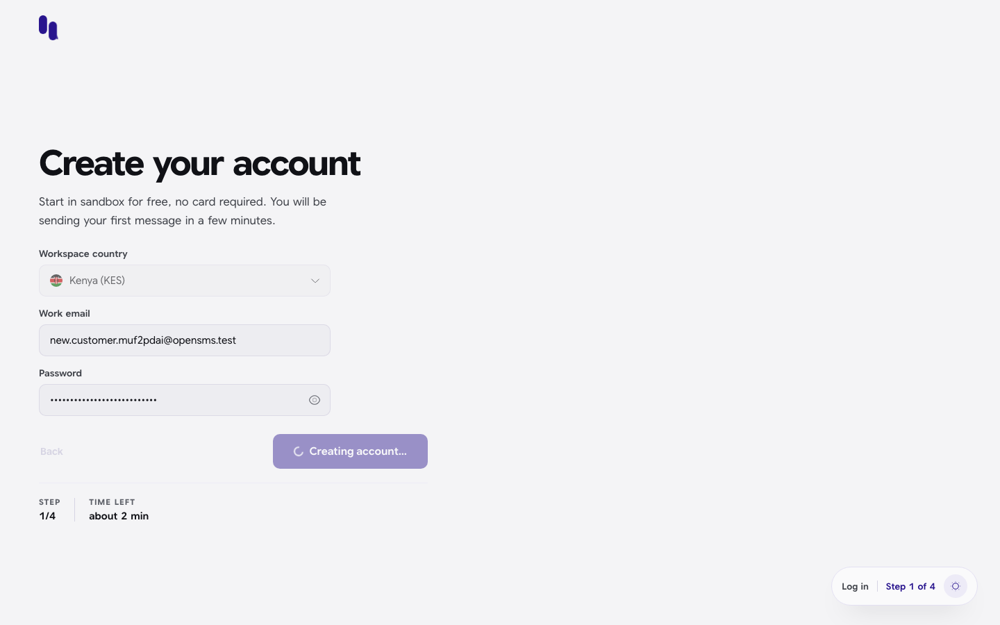

**Why it matters:** until your email is verified, you cannot send any message, not even a free sandbox test. The API answers "email verification is required for sandbox sending". Verifying your email is also the first item on the [Go live](go-live.md) checklist.

If you skip this step (for example by closing the tab), you can finish it later from **Go live > Verify your email address**.

> On the local docs stack the page shows the error "email delivery is not configured", because no email can be sent. For the same reason, none of the accounts used for these guides could be verified, so the guides show sandbox sending up to the point where the server refuses it.

## Log in

1. Go to `/login`.
2. Enter your **Email** and **Password**.
3. Click **Log in**.

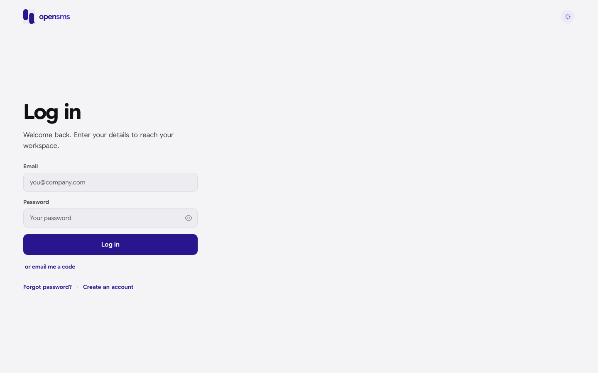

Where you land depends on your account:

| Your situation | Where you land |
| --- | --- |
| You belong to one workspace | The [Overview](overview-dashboard.md) of that workspace. |
| You belong to several workspaces | The workspace you used last on this browser. |
| You belong to no workspace yet | The [workspace chooser](#choose-a-workspace), so you can create one. |
| Your account has two-factor authentication | The [two-factor screen](#two-factor-authentication) first. |

If your terms of service or data processing agreement need accepting, a blocking screen appears on top of the console. See [Legal acceptance](legal-acceptance.md).

A wrong email or password shows "invalid email or password":

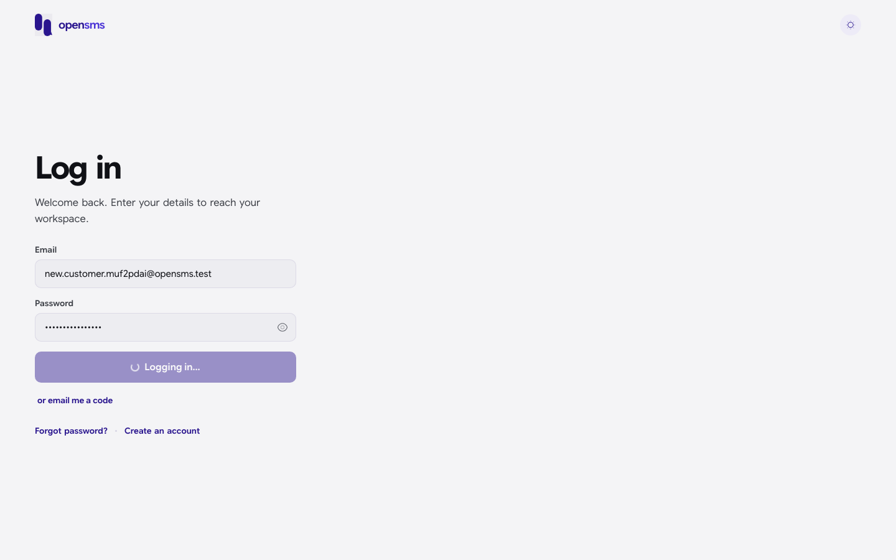

After 8 failed attempts in a row, the page stops accepting tries and shows **Too many attempts** with a **Reset password** button. Reloading the page clears this pause, but the server keeps its own limits.

**How long you stay signed in:** your sign-in is kept for the browser tab you logged in from. Closing the browser signs you out. Opening the console by typing its address into a brand-new tab asks you to log in again.

## Log in with an emailed code

If you prefer not to type your password, you can ask for a one-time code instead.

1. On the login page, type your email in the **Email** field.
2. Click **or email me a code**. (If the email field is empty you see "Enter your email above first.")
3. On **Enter your code**, type the 6-digit code from the email.
4. Use **Send again** if it did not arrive (once every 60 seconds), or **Use your password instead** to go back.

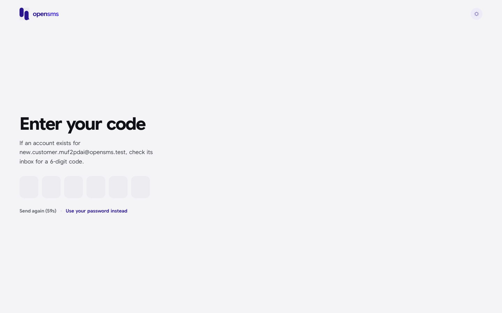

The page never tells you whether an account exists for that email ("If an account exists for ..."). That is deliberate, so nobody can use it to find out who has an account.

> On the local docs stack, clicking **or email me a code** shows "email delivery unavailable" and stays on the login page:
>
> 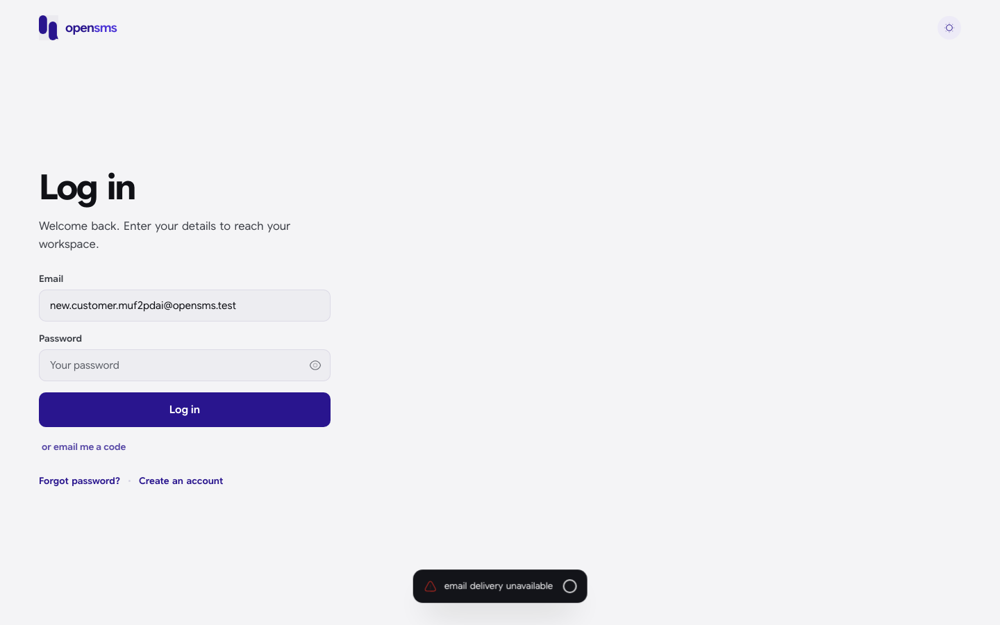

## Two-factor authentication

If you turned on two-factor authentication (2FA) in [Settings > Security](settings.md#security), logging in takes one more step.

1. Log in with your email and password (or an emailed code) as usual.
2. On **Two-factor verification**, open your authenticator app and type the current 6-digit code.
3. You are signed in as soon as the sixth digit is entered.

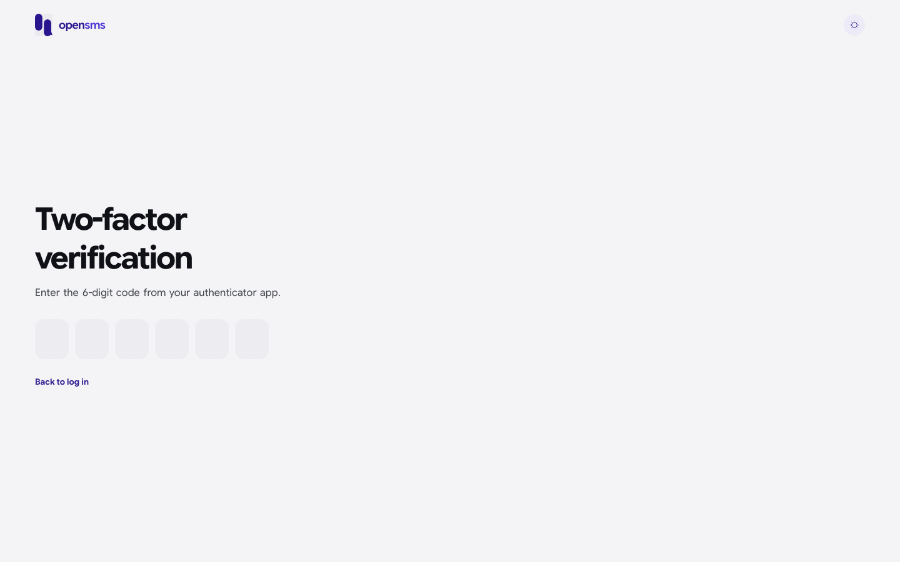

A wrong code turns the boxes red with "invalid authenticator code". Click the last box, delete the digits and type the new code.

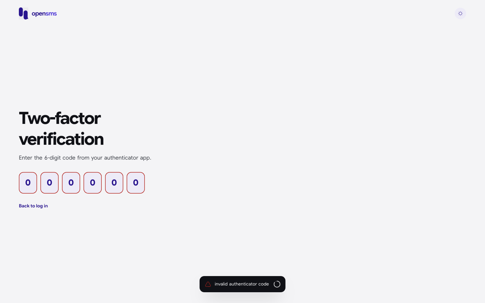

Things to know:

- The two-factor step expires after five minutes and allows at most five wrong codes. After that, go back and log in again. If the page notices the step has expired it says "Login expired. Please enter your password again." and returns you to the login page.
- **Back to log in** abandons the attempt.
- **Recovery codes are not accepted on this screen.** The boxes only take 6 digits. The API does accept a recovery code at this step, but the web app has no field for it yet. If you lose your authenticator, contact OpenSMS support: an operator can reset two-factor on your account.

## Forgot your password

1. On the login page click **Forgot password?**
2. Enter your email and click **Send reset link**.
3. You see **Check your email**. The page says the same thing whether or not the account exists.
4. Open the link in the email. It opens **Set a new password**.
5. Enter the new password twice and click **Reset password**.
6. You see "Password updated. Please log in." and go back to the login page.

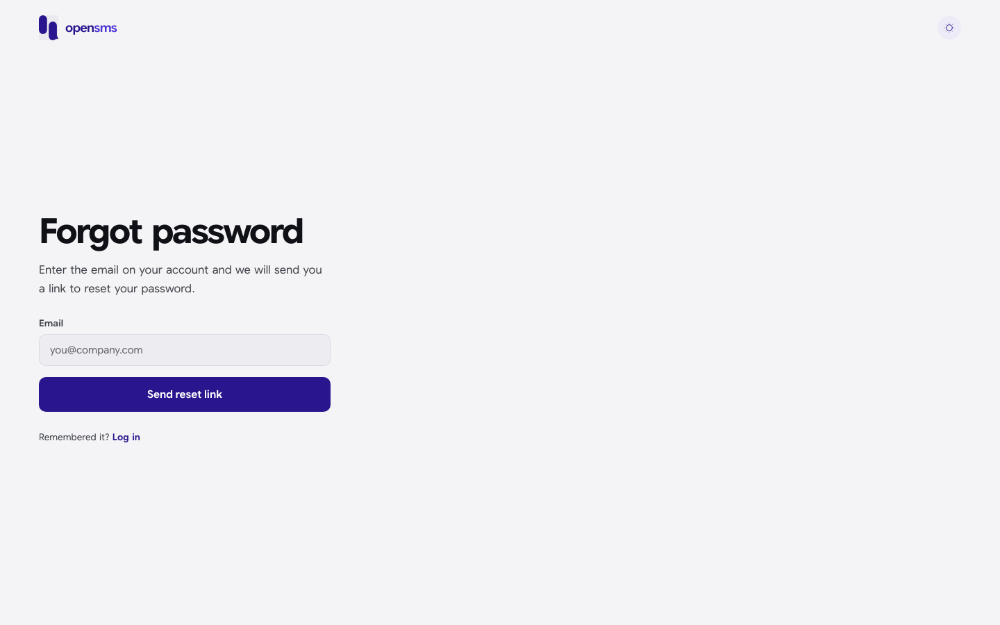

The new-password form checks your entry before sending it:

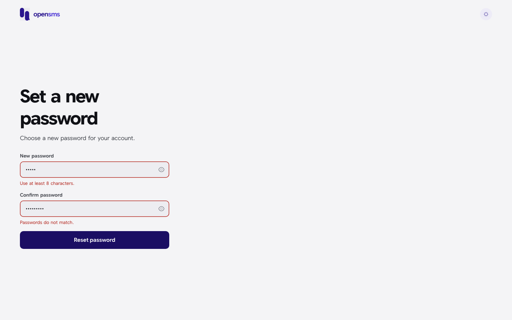

| Message | Meaning |
| --- | --- |
| Use at least 8 characters. | The new password is too short. |
| Passwords do not match. | The two fields differ. |
| invalid token or password | The link is wrong, already used, or expired. Ask for a new one. |

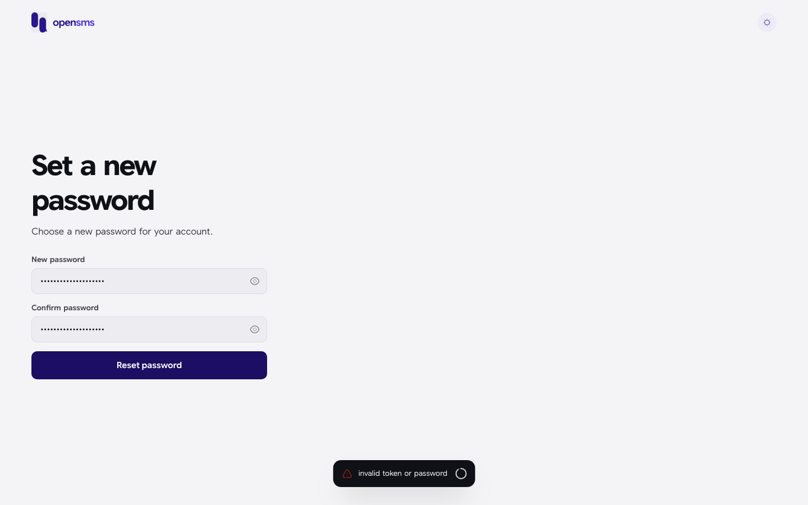

> On the local docs stack, **Send reset link** shows "email delivery unavailable" because no email can go out, so the full reset cannot be completed here:
>
> 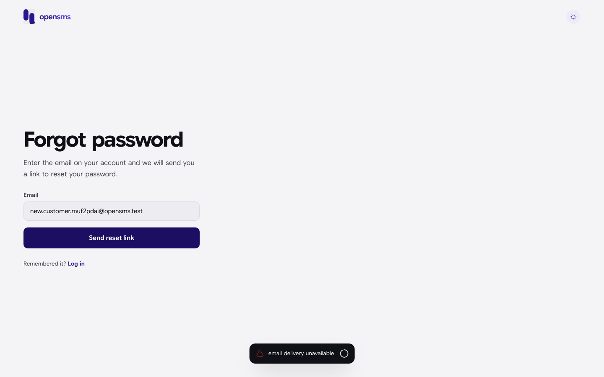

There is no "change password" form inside the console. To change a password you know, sign out and use **Forgot password?**.

## Choose a workspace

A workspace is a separate account for one business or project: its own wallet, sender IDs, API keys, team and go-live status. Nothing is shared between workspaces. One login can belong to many workspaces, with a different role in each.

The workspace chooser lives at `/workspaces`. You reach it:

- automatically, if your login belongs to no workspace;
- from the workspace name at the top left of the console, then **See all workspaces**;
- by going to `/workspaces` directly.

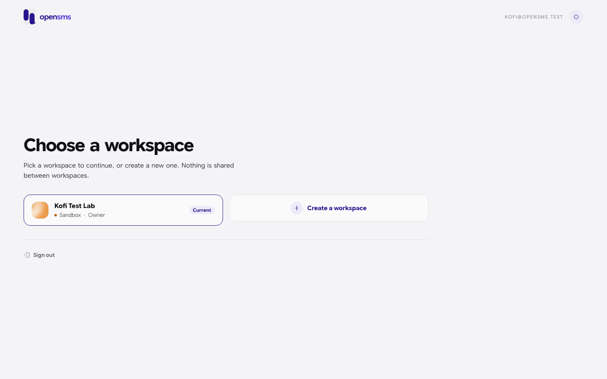

Each card shows the workspace name, whether it is in **Sandbox**, **In review** or **Live**, and your role there. The one you are in now is marked **Current**.

To switch, click a card. The console reloads into that workspace's Overview. (It reloads on purpose, so that no numbers from the old workspace stay on screen.)

### Create another workspace

1. On the chooser, click **Create a workspace** (or use **Create workspace** in the workspace menu at the top of the console).
2. Enter a **Workspace name** and choose a **Registration country**. The country sets the billing currency and cannot be changed later.
3. Click **Create workspace**. The console reloads into the new workspace and opens its [Go live](go-live.md) checklist.

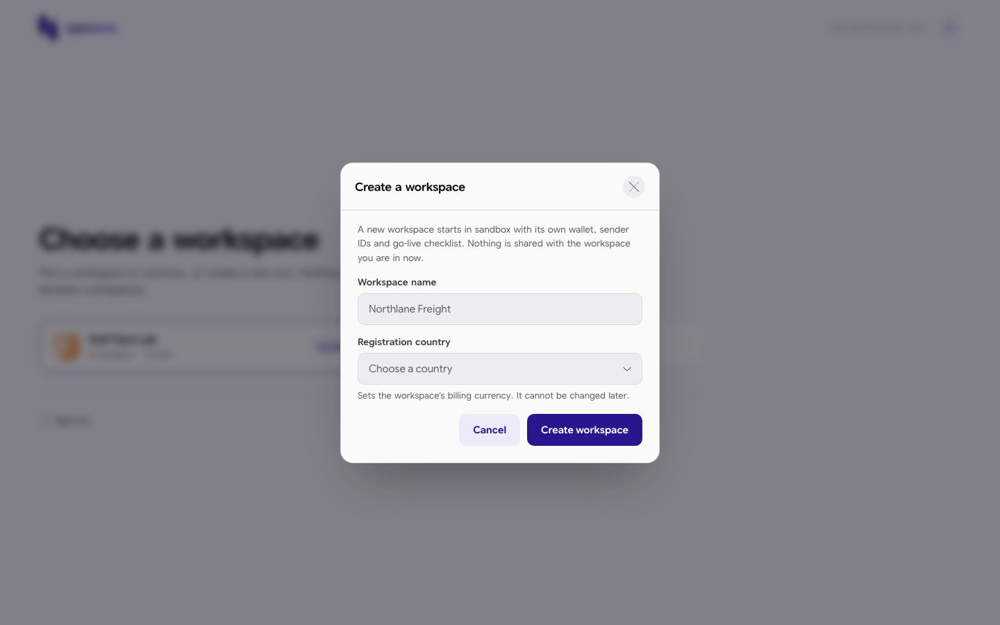

A new workspace always starts in sandbox with you as owner. Leaving the name empty shows "Give the workspace a name."; leaving the country empty shows "Choose a registration country."

**Sign out** at the bottom of the chooser ends your session.

## Accept an invitation to a team

When a workspace owner or admin invites you (see [Settings > Team](settings.md#team)), you receive an email with a link that looks like `/invite/<long code>`.

1. Open the link. You see **Join your team**.
2. If you are not signed in, click **Log in to accept invitation**, or **Create an account** if you have no account yet. Use the same email address the invitation was sent to.
3. After signing in (and verifying your email, if the account is new) click **Accept invitation**.
4. You see "Invitation accepted." and the console switches to the workspace you joined.

Rules the server enforces:

- Your email must be **verified**, and it must match the invited email exactly.
- An invitation can be used once. An expired, revoked or already used link shows "Could not accept this invitation. The link may have expired."

If you are signed in and have been invited somewhere, the workspace chooser shows a **Pending invitations** card with the workspace name and the role you were invited as. There is no Accept button on that card: accepting only works from the link in the email, because the server never shows the invitation code again. See the screenshot in [Settings > Team](settings.md#what-the-invited-person-sees).

> On the local docs stack invitation emails are not sent, and no account can verify its email, so accepting an invitation cannot be completed here.

## Sign out

Click your initials at the top right of the console and choose **Log out**. Your session is ended on the server as well as in the browser. To sign out other devices, use [Settings > Security > Active sessions](settings.md#active-sessions).

## Related

- [Onboarding: markets and sender ID](onboarding.md)
- [Legal acceptance](legal-acceptance.md)
- [Settings: security and two-factor setup](settings.md#security)
- [Go live](go-live.md)
