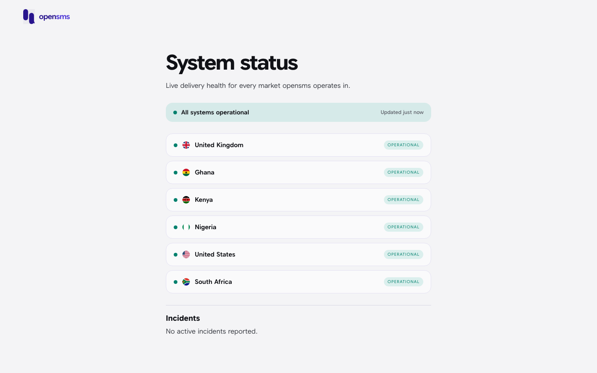

# System status page

The status page is a public web page, at `/status` on your console's web address, that shows whether OpenSMS is delivering normally in each market. It is for anyone who wants to check for an outage before contacting support: customers, their support teams, and people who have no OpenSMS account. You do not need to sign in to see it.

## What the page shows

| Part | What it tells you |
| --- | --- |
| Summary bar | The worst state across all markets: **All systems operational**, **Some markets are degraded**, **Some markets are down** or **Some markets are not reporting yet**, with the time of the last update ("Updated just now"). |
| Market list | One row per active market, with its flag and a badge: **Operational**, **Degraded**, **Down** or **No data yet**. A market's badge is the worst state reported by any delivery provider serving it. **No data yet** means no provider is reporting health for that market. |
| Incidents | Incidents published by the OpenSMS operations team, each with its title, state and last update. When there are none the page says "No active incidents reported." |

If the page cannot reach OpenSMS at all it shows "Could not load status right now. Please try again shortly." If only the incident feed fails, the markets still show and the Incidents area says "Incident reporting is unavailable right now."

## Checking status from software

The page reads the public, unversioned `GET /status` endpoint (no key needed). It returns the overall `status` (for example `"operational"`), one component per provider and country, and the list of open `incidents`. See the [API reference for /status](../reference/api/status.md).

## Related

- [Routes](routes.md): the markets and carriers your own workspace can reach.
- [Notifications](notifications.md): route health alerts for your workspace.
