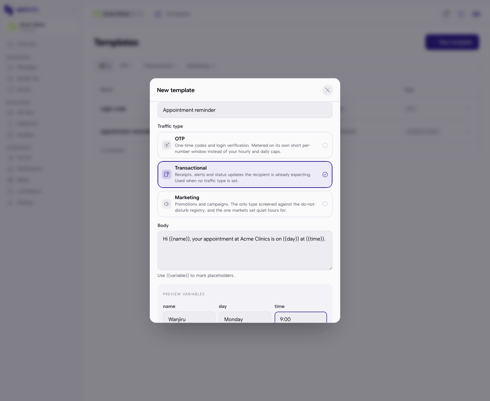
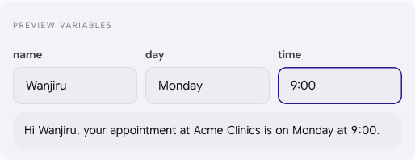
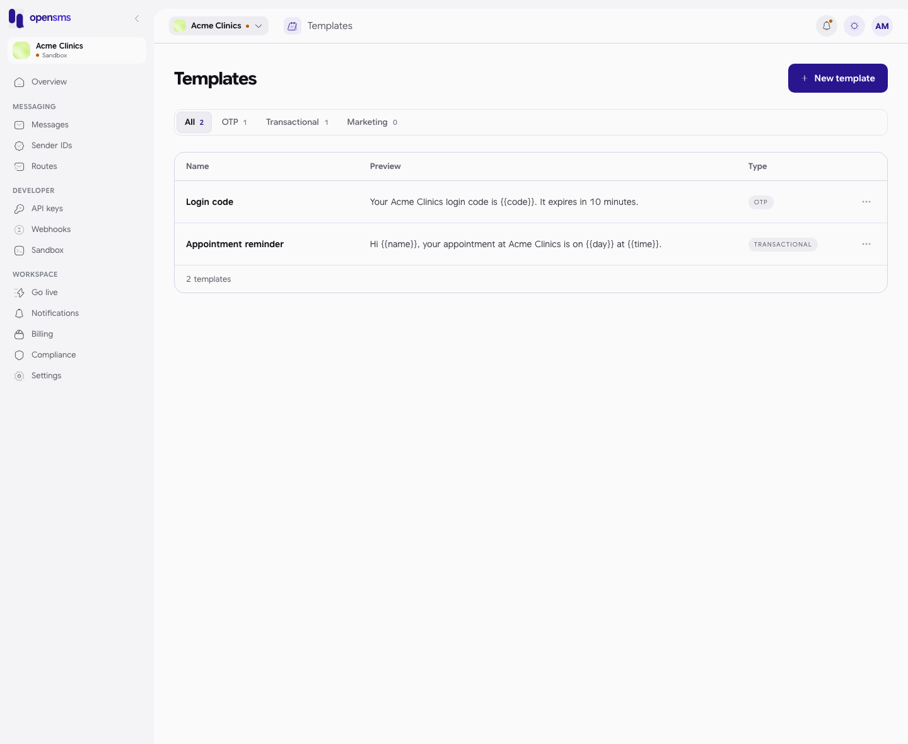

# Templates

Templates are saved message texts with blanks to fill in, such as `Hi {{name}}, your appointment is on {{day}}.` Keeping your common messages here means everyone in the workspace, and your developers' code, uses the same approved wording. This guide is for owners, admins and developers who write templates, and for anyone who wants to read them.

**Where to find it:** Templates is not in the left-hand menu in this version of the console. Open it by going to `/app/templates`.

**What templates are used for today:** the console stores, previews and organises templates. The [Compose](messages.md#send-a-message) page and the group send panel do not offer a "use template" option yet; templates are used by your integration through the API (for example, sending a template to a contact group by its ID).

## Who can do what

| Action | Owner | Admin | Developer | Finance | Viewer |
| --- | --- | --- | --- | --- | --- |
| See templates | Yes | Yes | Yes | Yes | Yes |
| Create, edit, delete | Yes | Yes | Yes | No | No |

Templates belong to the environment you are in: a sandbox workspace's templates are separate from the ones it will have once live.

## Create a template

1. Go to `/app/templates` and click **New template**.
2. Fill in the form:

   | Field | What to enter |
   | --- | --- |
   | Name | A short name you will recognise, for example `Appointment reminder`. Up to 100 characters, and unique in this workspace. |
   | Traffic type | OTP, Transactional or Marketing (see below). Transactional is picked for you. |
   | Body | The text. Put each blank inside double curly brackets, for example `{{name}}`. A blank's name uses letters, numbers and underscores, and starts with a letter or underscore. |

3. As soon as the body has blanks, a **Preview variables** box appears with one field per blank. Type example values to see the finished text. These values are only for the preview and are not saved.
4. Click **Save**. You see "Template created."

Leaving the name or body empty shows "Name and body are required."

## Traffic types

The form explains each type:

| Type | Use it for | What changes |
| --- | --- | --- |
| OTP | One-time codes and login verification. | Metered on its own short per-number window instead of your hourly and daily caps. |
| Transactional | Receipts, alerts and status updates the recipient is expecting. | The default when no type is set. |
| Marketing | Promotions and campaigns. | The only type screened against the do-not-disturb registry, and the one markets set quiet hours for. |

## Find, edit and delete templates

- The tabs **All**, **OTP**, **Transactional** and **Marketing** filter the list and show a count for each.
- Each row shows the name, the start of the text, and the type.
- Click **...** on a row and choose **Edit template** to change it, then **Save** ("Template updated."), or **Delete template** to remove it ("Template deleted."). Messages already sent from a template are not affected.

A new workspace shows **No templates yet** with a **New template** button.

## Related

- [Messages](messages.md)
- [Contacts and groups](contacts-and-groups.md)
- [OTP (verification codes)](otp.md) for one-time codes the platform generates for you
