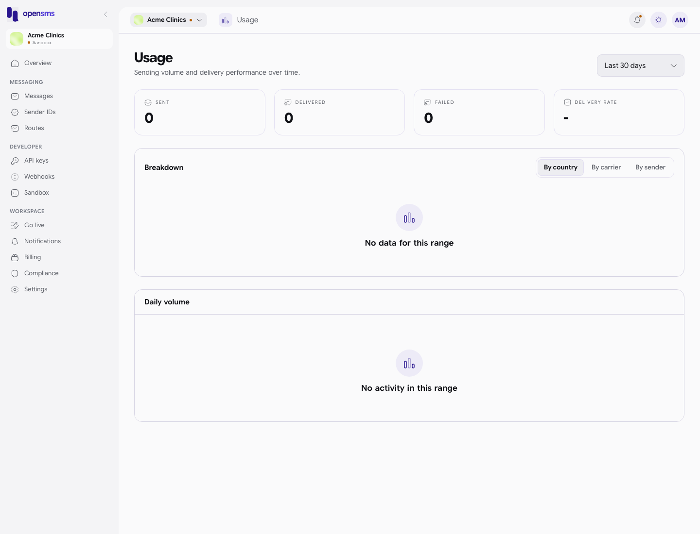

# Usage

The Usage page shows how many messages your workspace sent, how many were delivered and how many failed, over the last 7, 30 or 90 days, broken down by country, carrier or sender ID and day by day. It is for anyone who wants to check volume or delivery, such as managers and finance teams. Every role can open it.

**Where to find it:** Usage is not in the left-hand menu in this version of the app. Go to `/app/usage` in your browser's address bar. The [Overview](overview-dashboard.md) shows a 30-day version of the same numbers.

## Read your usage

1. Open `/app/usage`.
2. Pick a period in the box at the top right: **Last 7 days**, **Last 30 days** (the default) or **Last 90 days**. Everything on the page updates.
3. Read the four figures along the top:

   | Figure | Meaning |
   | --- | --- |
   | Sent | Messages sent in the period. |
   | Delivered | Messages the carrier confirmed as delivered. |
   | Failed | Messages that did not get through. |
   | Delivery rate | Delivered divided by sent. Shows **-** when nothing was sent. |

4. Under **Breakdown**, choose **By country**, **By carrier** or **By sender**. Each row is a bar with the number of messages sent. The choice is kept in the page address (for example `?breakdown=carrier`), so you can bookmark or share it.
5. **Daily volume** lists each day with its sent, delivered and failed counts. Dates are in UTC.

## Empty and error states

| You see | Meaning |
| --- | --- |
| No data for this range | Nothing was sent in the chosen period for this breakdown. |
| No activity in this range | No daily figures for the period. |
| Couldn't load this breakdown / Couldn't load usage data | The figures could not be fetched. Reload the page. |

In sandbox the page counts sandbox (simulated) messages; once you are live it counts live messages. The two are never mixed.

On the local docs stack no message could be sent (email verification is required first, see [Messages](messages.md)), so the screenshot shows the empty states only.

## Related

- [Overview dashboard](overview-dashboard.md)
- [Messages](messages.md)
- [Billing](billing.md) for what the messages cost
