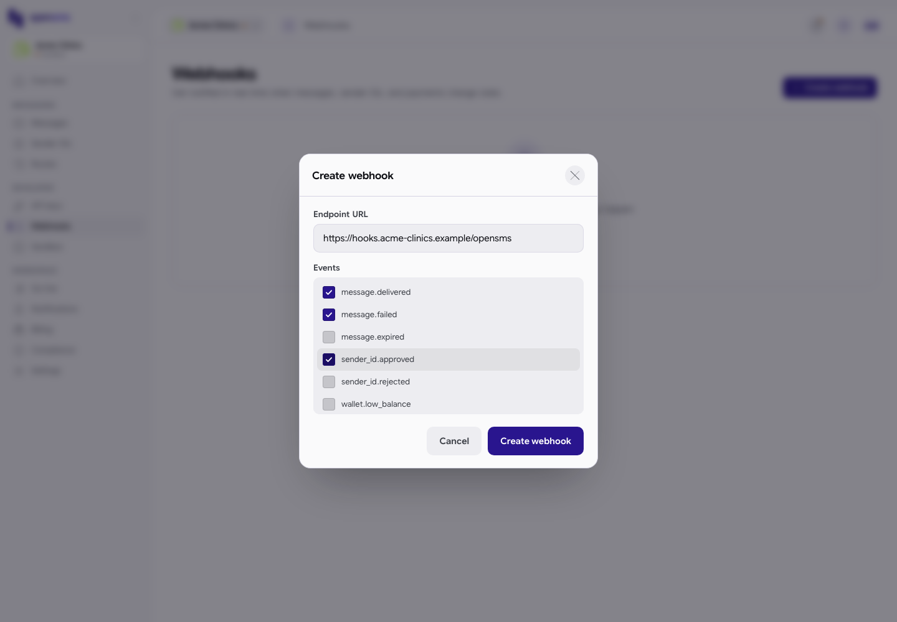
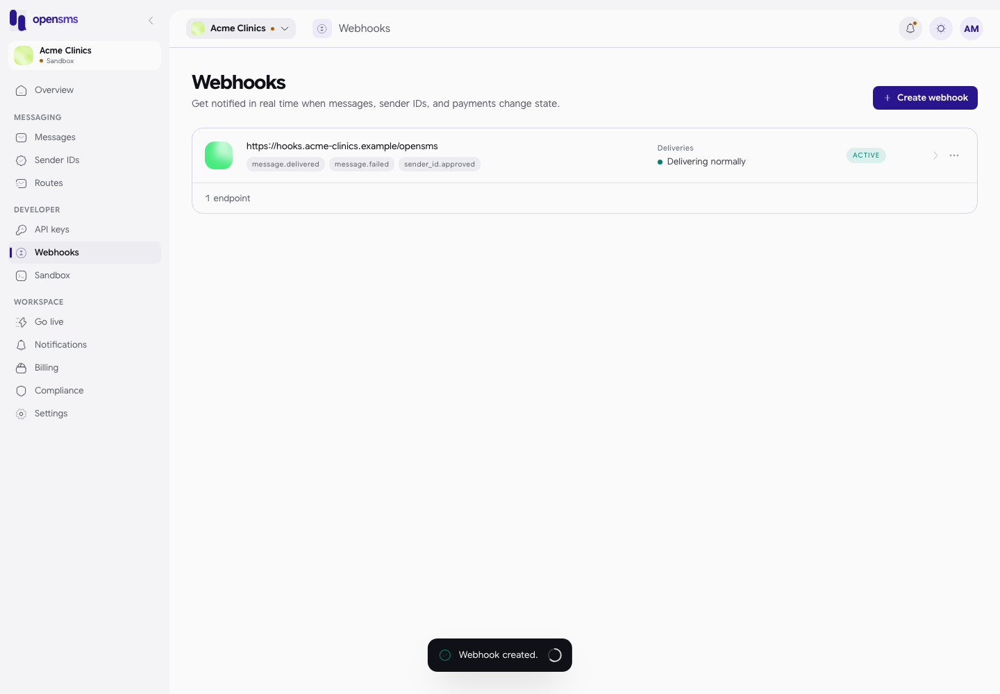
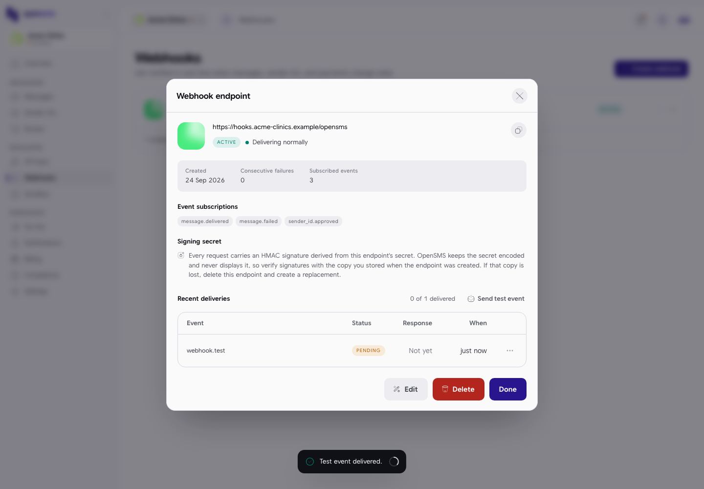
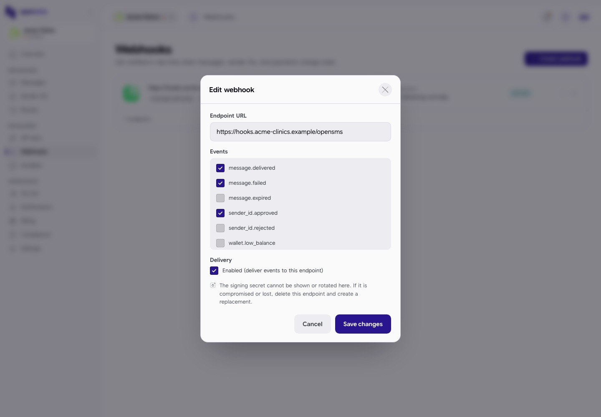
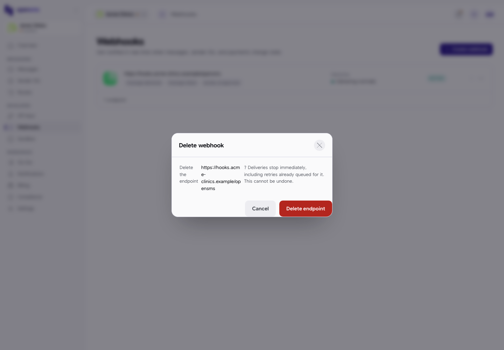

# Webhooks

A webhook is an address on your own system (a URL) that OpenSMS calls automatically when something happens, for example when a message is delivered or a sender ID is approved. It saves your software from asking OpenSMS over and over. This page covers adding, testing, editing and deleting webhook endpoints. It is for owners, admins and developers; you will usually set one up with, or for, a developer who has built the receiving end.

Open **Webhooks** in the left-hand menu, under **Developer** (`/app/webhooks`).

## Who can do what

| Action | Owner | Admin | Developer | Finance | Viewer |
| --- | --- | --- | --- | --- | --- |
| See endpoints and delivery history | Yes | Yes | Yes | Yes | Yes |
| Create, edit, test, replay, delete | Yes | Yes | Yes | No | No |

Members who cannot make changes see the reason "Your role can view webhooks but not create or trigger them."

Endpoints belong to the environment the workspace is in: sandbox endpoints only receive sandbox events.

## Create a webhook

1. Click **Create webhook**. A new workspace shows **No webhooks yet** with the same button.
2. Enter the **Endpoint URL**, for example `https://hooks.acme-clinics.example/opensms`.
3. Tick the **Events** you want (scroll the list to see all of them):

   | Event | Sent when |
   | --- | --- |
   | `message.delivered` | A message reached the phone. |
   | `message.failed` | A message could not be delivered. |
   | `message.expired` | No delivery receipt arrived in time. |
   | `sender_id.approved` | A sender ID was approved. |
   | `sender_id.rejected` | A sender ID was rejected. |
   | `wallet.low_balance` | Your wallet dropped below its low-balance threshold. |
   | `batch.completed` | A batch send finished. |

4. Click **Create webhook**. You see "Webhook created." An empty URL shows "Enter an endpoint URL."

An endpoint with no events ticked is allowed, but it will never be called; its details say "Nothing is subscribed, so this endpoint will never be called. Pick at least one event."

### The signing secret: not shown in the console

Every webhook request OpenSMS sends carries an `X-OpenSMS-Signature` header, made with a secret that belongs to the endpoint. Your developer's code uses that secret to check the request really came from OpenSMS.

> **Known gap:** OpenSMS generates the secret and returns it once, when the endpoint is created (the API's create response includes `"secret": "whsec_..."`). The console does not display it, and there is no way to see it later. So an endpoint created in the console has a secret nobody can read, and its signatures cannot be checked. Until this is fixed, **have your developer create endpoints through the API** (`POST /v1/webhooks`) and store the secret from that response. The page's own note ("verify signatures with the copy you stored when the endpoint was created") assumes you have that copy.

## Check an endpoint and its deliveries

Click a row (or **...** then **Open details**) to open **Webhook endpoint**.

It shows:

- the URL with a copy button (you see "Endpoint URL copied."), whether it is **ACTIVE**, and a health line such as "Delivering normally";
- **Created**, **Consecutive failures** and the number of **Subscribed events**;
- **Event subscriptions**;
- **Signing secret** (an explanation only; see above);
- **Recent deliveries**: each call OpenSMS made, with the **Event**, **Status** (for example PENDING or DELIVERED), the **Response** code your server gave ("Not yet" before it answers) and **When**, plus a summary such as "0 of 1 delivered".

From the row menu of a delivery you can choose **Replay delivery** to send it again.

## Send a test event

1. Open the endpoint's details.
2. Click **Send test event**. A `webhook.test` delivery appears in **Recent deliveries**.

The toast says "Test event delivered." as soon as the test is queued, even before your server has answered. Check the delivery row: it shows **PENDING** with Response "Not yet" until your server answers.

## Edit an endpoint

1. Click **...** on the row and choose **Edit endpoint** (or **Edit** in the details).
2. Change the **Endpoint URL** or the **Events**.
3. Untick **Enabled (deliver events to this endpoint)** to pause deliveries without deleting the endpoint, or tick it to switch it back on. Switching it back on also resets the failure count.
4. Click **Save changes**. You see "Webhook updated."

As the form says, the signing secret cannot be shown or rotated here; if it is compromised or lost, delete the endpoint and create a replacement.

If your endpoint keeps failing, OpenSMS disables it automatically and sends a "Webhook disabled" [notification](notifications.md). Fix your server, then re-enable it here.

## Delete an endpoint

1. Click **...** on the row and choose **Delete endpoint** (or **Delete** in the details).
2. Confirm with **Delete endpoint**. Deliveries stop immediately, including retries already queued, and this cannot be undone. You see "Webhook deleted."

## Related

- [API keys](api-keys.md)
- [Notifications](notifications.md)
- [Messages](messages.md)
