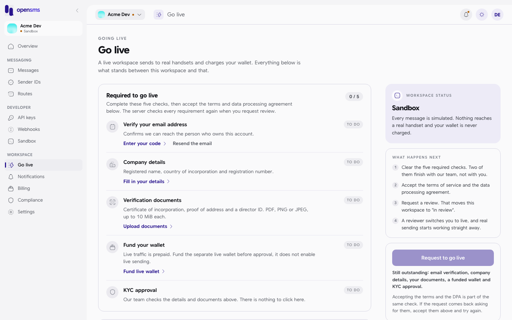

# Going live

This page walks through everything between a working sandbox integration and real messages reaching handsets: identity checks, legal acceptance, funding, a sender ID and live keys. It is for the developer or workspace owner preparing a production launch. Several steps are done by opensms operators, not by you; each step says who acts.

The server enforces every requirement again when the workspace is activated, so the order below is the order that works.



## Summary

| # | Step | Who | API |
| --- | --- | --- | --- |
| 1 | Verify the owner's email | Owner | `POST /v1/auth/email/send`, `POST /v1/auth/verify-email` |
| 2 | Submit company details | Owner | `PUT /v1/onboarding/company` |
| 3 | Upload three verification documents | Owner | `POST /v1/onboarding/documents` |
| 4 | Review documents and approve KYC | **Operator** | `/admin/v1/workspaces/{id}/kyc/approve` |
| 5 | Fund the live wallet | Owner, admin or finance (plus **operator** for bank transfers) | `POST /v1/wallet/topups`, `POST /v1/wallet/topups/manual` |
| 6 | Accept the terms of service and the DPA | Owner | `POST /v1/legal/accept` |
| 7 | Turn on two-factor authentication for every owner and finance member | Each of those users | `POST /v1/auth/2fa/setup`, `POST /v1/auth/2fa/enable` |
| 8 | Request live review | Owner | `POST /v1/onboarding/request-live` |
| 9 | Activate the workspace | **Operator** | `PUT /admin/v1/workspaces/{id}` |
| 10 | Get a sender ID approved | Owner or admin, then **operator** | `POST /v1/sender-ids` |
| 11 | Create live keys and switch your integration | Owner or admin | `POST /v1/keys` with `"test": false` |

Track progress with `GET /v1/onboarding` (owner session, `X-Workspace-ID`). A new workspace returns:

```json
{
  "company_details": null,
  "documents": [],
  "kyc_status": "pending",
  "live_status": "sandbox",
  "steps": [
    { "step": "admin_approved", "status": "pending", "updated_at": "2026-09-24T07:13:30.053095+03:00" },
    { "step": "company_details", "status": "pending", "updated_at": "2026-09-24T07:13:30.053095+03:00" },
    { "step": "documents_uploaded", "status": "pending", "updated_at": "2026-09-24T07:13:30.053095+03:00" },
    { "step": "email_verified", "status": "pending", "updated_at": "2026-09-24T07:13:30.053095+03:00" },
    { "step": "payment_method_added", "status": "pending", "updated_at": "2026-09-24T07:13:30.053095+03:00" },
    { "step": "phone_verified", "status": "pending", "updated_at": "2026-09-24T07:13:30.053095+03:00" },
    { "step": "sender_id_approved", "status": "pending", "updated_at": "2026-09-24T07:13:30.053095+03:00" },
    { "step": "wallet_funded", "status": "pending", "updated_at": "2026-09-24T07:13:30.053095+03:00" }
  ],
  "workspace_id": "f98e3f20-d354-493d-b003-c39d945e29db"
}
```

Only five steps gate going live: `email_verified`, `company_details`, `documents_uploaded`, `admin_approved` and `wallet_funded`, all `approved`, plus the owner's acceptance of the current terms and DPA. `phone_verified`, `payment_method_added` and `sender_id_approved` are tracked but not required by the server.

`live_status` moves `sandbox` to `pending_review` (after step 8) to `live` (after step 9). An operator can later move a live workspace to `suspended` and back.

> **Local stack limitation.** The local docs stack has email delivery, file scanning and card payments disabled. Steps 1, 4 and the approval half of 5 cannot complete there, so the walkthrough below stops at the real `422` from step 8.

## 1. Verify the owner's email

Covered in the [quickstart](quickstart.md#2-verify-your-email-address). It also unlocks sandbox sending.

## 2. Submit company details

```sh
curl -s -X PUT $OPENSMS_API/v1/onboarding/company \
  -H "authorization: Bearer $SESSION" -H "x-workspace-id: $WORKSPACE" \
  -H 'content-type: application/json' \
  -d '{"name":"Acme Logistics Ltd","country_iso2":"KE","registration_number":"PVT-2026-0042"}'
```

```json
{"payload":{"name":"Acme Logistics Ltd","country_iso2":"KE","registration_number":"PVT-2026-0042"},"status":"submitted","step":"company_details","workspace_id":"29ce64bb-8ec7-424f-8f44-9c0f22393323"}
```

Owner only. `name` (1 to 200 characters), `country_iso2` and `registration_number` (1 to 100 characters) are required. Approved details cannot be edited.

## 3. Upload the verification documents

Upload one file per request as `multipart/form-data`, with `kind` set to `incorporation_certificate`, `proof_of_address` or `director_id`. Files must be real PDF, PNG or JPEG content, at most 10 MiB.

```sh
curl -s -X POST $OPENSMS_API/v1/onboarding/documents \
  -H "authorization: Bearer $SESSION" -H "x-workspace-id: $WORKSPACE" \
  -F kind=director_id -F file=@director_id.png
```

```json
{"content_type":"image/png","filename":"director_id.png","id":"c3003eac-cdc6-4de3-a5d2-e44a91626995","is_current":true,"kind":"director_id","review_status":"pending","scan_status":"pending","size":70,"status":"submitted","version":1}
```

When all three kinds exist, `documents_uploaded` becomes `submitted`. A file whose content is not a valid PDF, PNG or JPEG is refused:

```json
{"type":"about:blank","title":"Unprocessable Entity","status":422,"detail":"document must be a valid PDF, PNG or JPEG"}
```

## 4. KYC review (operator)

Each document is malware scanned (`scan_status` goes from `pending` to `clean`) and then reviewed by an operator. When every current document is clean and approved, the operator approves KYC, which marks `company_details`, `documents_uploaded` and `admin_approved` as `approved`. Approval does not make the workspace live. If a document is rejected, `GET /v1/onboarding` shows the reason on the step or document; upload a corrected file and it is reviewed again.

On the local docs stack the scanner is off, so the operator's approval call is refused:

```json
{"type":"about:blank","title":"Conflict","status":409,"detail":"each current required document must pass scanning and human review before KYC approval"}
```

## 5. Fund the live wallet

Live traffic is prepaid. Either method sets `wallet_funded` to `approved` once money is confirmed; starting a payment does not.

**Card or mobile money.** Owner, admin or finance session (or an API key with `wallet:topup`) calls `POST /v1/wallet/topups` with `X-Environment: live`, `amount`, `currency`, `channel` (`card`, `mobile_money` or `bank_transfer`) and the payer `email`, which must belong to a verified workspace member. The response contains an `authorization_url` to send the payer to. The wallet is credited only when the payment provider confirms it. The local docs stack has no payment provider configured and the test account's email is unverified, so this call returns `403` `"payer email must belong to a verified workspace member"` there.

**Bank transfer.** Upload the proof of transfer. This needs a browser session of an owner, admin or finance member with two-factor authentication on, `X-Environment: live`, and an `Idempotency-Key`:

```sh
curl -s -X POST $OPENSMS_API/v1/wallet/topups/manual \
  -H "authorization: Bearer $SESSION" -H "x-workspace-id: $WORKSPACE" \
  -H 'x-environment: live' -H 'idempotency-key: manual-1' \
  -F amount=5000.00 -F currency=KES -F file=@proof.png
```

```json
{"id":"0e91734d-ff9d-43e5-90cd-2d4cdc5659a8","status":"awaiting_approval"}
```

A finance operator then approves the payment, which credits the wallet. That approval also requires a clean malware scan, so on the local docs stack it is refused with `422` `"A clean malware scan of the payment proof is required."`

## 6. Accept the terms of service and the DPA

List the current versions, then accept each one with the exact version string:

```sh
curl -s $OPENSMS_API/v1/legal/documents -H "authorization: Bearer $SESSION" -H "x-workspace-id: $WORKSPACE"
```

```json
{"documents":[
  {"id":"ddad007d-0ac9-4823-b083-d2965a7af750","document":"dpa","version":"1.0","url":"https://opensms.io/legal/dpa/1.0","published_at":"2026-09-24T07:08:21.163602+03:00"},
  {"id":"30ca7041-ca82-4eaa-94ea-422969ca10ca","document":"privacy","version":"1.0","url":"https://opensms.io/legal/privacy/1.0","published_at":"2026-09-24T07:08:21.163602+03:00"},
  {"id":"1d1ef5b2-dfa8-45dd-a3b0-83bdc600c08f","document":"terms","version":"1.0","url":"https://opensms.io/legal/terms/1.0","published_at":"2026-09-24T07:08:21.163602+03:00"}
]}
```

```sh
curl -s -X POST $OPENSMS_API/v1/legal/accept \
  -H "authorization: Bearer $SESSION" -H "x-workspace-id: $WORKSPACE" \
  -H 'content-type: application/json' -d '{"document":"terms","version":"1.0"}'
```

```json
{"accepted_at":"2026-09-24T07:24:58.433494+03:00","document":"terms","id":6,"version":"1.0","workspace_id":"f98e3f20-d354-493d-b003-c39d945e29db"}
```

Repeat with `"document":"dpa"`. Accepting the same version again returns the original receipt. A version that is not the current one returns `409` with `"code":"legal_version_not_current"`. `GET /v1/legal/acceptances` shows what you have accepted. Only the terms and the DPA gate going live; the privacy notice does not.

## 7. Turn on two-factor authentication

Activation is refused until every active owner and finance member has an authenticator enabled. Two-factor is also required for bank-transfer top-ups, live number purchases, and owner lookups in live. See [authentication](../integrate/authentication.md#two-factor-authentication) for the setup calls. Once a workspace is live, its owners and finance members cannot turn two-factor off (`409`).

## 8. Request live review

```sh
curl -s -X POST $OPENSMS_API/v1/onboarding/request-live \
  -H "authorization: Bearer $SESSION" -H "x-workspace-id: $WORKSPACE"
```

When every prerequisite is met this returns `202` with `{"workspace_id":"...","live_status":"pending_review"}`. It does not enable live sending. Owner only; a workspace that is not in `sandbox` gets `409`.

With anything missing (the real response on the local docs stack):

```json
{"type":"about:blank","title":"Unprocessable Entity","status":422,"detail":"live sending prerequisites are incomplete"}
```

The response does not say which step is missing; read `GET /v1/onboarding` and `GET /v1/legal/acceptances`.

## 9. Activation (operator)

An operations operator reviews the request and sets the workspace to `live` (or back to `sandbox` with a reason). The server re-checks KYC, the five steps, legal acceptance and two-factor for owners and finance members at that moment. The change is emitted as a `workspace.live_status_changed` event in the live environment, which your live [webhooks](../integrate/delivery-reports-and-webhooks.md) can subscribe to.

## 10. Get a sender ID approved

Live messages need an approved sender ID: one approved for your workspace, or a platform default sender configured on the route for the destination. Custom sender IDs are requested with `POST /v1/sender-ids` (owner or admin session, or a key with `senders:manage`) and need a certificate, a signatory ID and an authorization letter uploaded first; without them the request is refused:

```json
{"type":"about:blank","title":"Unprocessable Entity","status":422,"detail":"certificate, signatory-id, and authorization documents are required for a custom sender ID"}
```

An operator decides on the request and, where the carrier requires it, registers it with the provider. Some markets charge a registration fee; `GET /v1/sender-ids/quote?countries=KE` shows it before you submit. The console's **Sender IDs** page walks through the same flow.

## 11. Create live keys and switch over

Owners and admins create live keys with `"test": false`:

```sh
curl -s -X POST $OPENSMS_API/v1/keys \
  -H "authorization: Bearer $SESSION" -H "x-workspace-id: $WORKSPACE" \
  -H 'content-type: application/json' -d '{"label":"live","test":false}'
```

```json
{"key":"sk_live_ya8M-wVQ...","key_info":{"id":"44da5572-01ad-41a6-a70f-368ddb0a778d","prefix":"sk_live_","label":"live","scopes":["messages:read","messages:write"],"created_at":"2026-09-24T07:27:28.844455+03:00","last_used_at":null}}
```

You can create a live key before the workspace is live, but it cannot send yet:

```json
{"type":"about:blank","title":"Forbidden","status":403,"detail":"workspace is not approved for live sending"}
```

Things that change when you switch from `sk_test_` to `sk_live_`:

- Live data is separate. Recreate webhooks, templates and contacts in live; they do not carry over from the sandbox.
- Messages cost money and can be refused with `402` (insufficient funds or spend cap). See [billing and wallet](../integrate/billing-and-wallet.md).
- Destinations must have a live route and price, or the send is refused with `422` `"no eligible live route"` or `"no verified live price"`.
- Country rules apply: quiet hours, do-not-disturb registries for marketing traffic, and content rules. See [sending messages](../integrate/sending-messages.md#why-a-message-is-refused).
- Carriers send delivery reports, so messages go `queued`, `sending`, `sent`, then `delivered`, `failed` or `expired`.

A live payment review hold (set by operators after a disputed payment) pauses live sending with `403` `"live sending is paused pending payment review"` until it is resolved.
