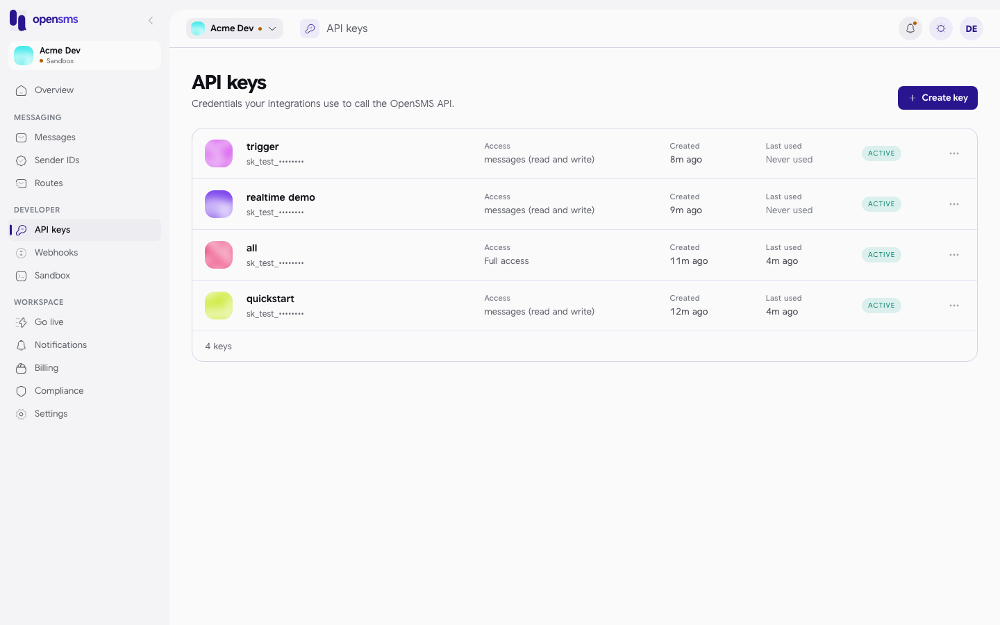

# Quickstart: your first sandbox message

This guide takes you from nothing to a sandbox message in about five minutes: create an account, verify your email, mint a sandbox API key, send a message and check its status. It is for developers trying OpenSMS for the first time.

> **About the example output.** Every response on this page was returned by a running OpenSMS API (secrets are shortened). The workspace used for them had not verified its owner's email, and an unverified workspace cannot send, so steps 4 and 5 show the `403` refusal and an empty message list. No successful send is reproduced here. The `201` response is described field by field in the API reference: the [`POST /v1/messages` responses](../reference/api/messages.md#post-v1messages) and the [Message schema](../reference/api/schemas.md#message).

You need `curl`. From step 4 on, every example also has a tab for each [official SDK](../integrate/sdk.md): install the one for your language to follow along in code.

> **Getting access.** Create an account at [opensms.io/signup](https://opensms.io/signup), or [sign in](https://opensms.io/login) if you already have one. The API origin to use below is `https://opensms.io`.

```sh
export OPENSMS_API=https://opensms.io
```

## 1. Create an account and workspace

`POST /v1/auth/signup` creates your user, a sandbox workspace in which you are the owner, and a session.

Steps 1 to 3 use a session, not an API key, so they are not in the SDKs and are shown with cURL only.

```sh
curl -s -X POST $OPENSMS_API/v1/auth/signup \
  -H 'content-type: application/json' \
  -d '{"email":"dev-quickstart-1@opensms.test","password":"Quickstart-Passw0rd-2026!","country_iso2":"KE","workspace_name":"Acme Dev"}'
```

```json
{
  "admin_role": null,
  "user": { "id": "d850fdf0-ccee-4ed2-971b-c4f28b40164e", "email": "dev-quickstart-1@opensms.test", "totp_enabled": false },
  "workspace": {
    "id": "f98e3f20-d354-493d-b003-c39d945e29db",
    "name": "Acme Dev",
    "live_status": "sandbox",
    "wallet_balance": "0.000000",
    "wallet_currency": "KES"
  },
  "role": "owner",
  "user_id": "d850fdf0-ccee-4ed2-971b-c4f28b40164e",
  "token": "sess_YXFMj1PC...",
  "expires_at": "2026-10-24T07:13:30.053095+03:00"
}
```

| Field | Rules |
| --- | --- |
| `email` | Required. An existing account returns `409` with `"detail":"account already exists"`. |
| `password` | Required, 8 to 1024 bytes. Otherwise `400` with `"code":"validation_failed"` and a field message under `errors.password`. |
| `country_iso2` | Required. An active registration country. It fixes the workspace currency (`KE` gives `KES`). |
| `workspace_name` | Optional, up to 120 bytes. Defaults to `My workspace`. |

Keep `token` (the session) and `workspace.id`:

```sh
export SESSION=sess_YXFMj1PC...        # token from the response
export WORKSPACE=f98e3f20-d354-493d-b003-c39d945e29db
```

The session expires after 30 minutes without use and 30 days after it was issued, whichever is first. See [authentication](../integrate/authentication.md#session-tokens).

## 2. Verify your email address

Sandbox sending is blocked until the workspace owner's email is verified. Ask for a code, then submit the six digits from the email:

```sh
curl -s -X POST $OPENSMS_API/v1/auth/email/send -H "authorization: Bearer $SESSION"
# {"sent":true} when email delivery is configured

curl -s -X POST $OPENSMS_API/v1/auth/verify-email -H "authorization: Bearer $SESSION" \
  -H 'content-type: application/json' -d '{"code":"123456"}'
# {"verified":true} with the right code
```

Codes expire after 10 minutes, allow five wrong guesses, and you can ask for a new one once a minute (`429` with `Retry-After: 60` before that).

## 3. Create a sandbox API key

API keys are created with your session and the workspace header. `test: true` makes a sandbox key (`sk_test_`). Without `scopes` the key gets `messages:read` and `messages:write`.

```sh
curl -s -X POST $OPENSMS_API/v1/keys \
  -H "authorization: Bearer $SESSION" -H "x-workspace-id: $WORKSPACE" \
  -H 'content-type: application/json' \
  -d '{"label":"quickstart","test":true}'
```

```json
{
  "key": "sk_test_OHtA3aYT...",
  "key_info": {
    "id": "70c470cd-5e23-4b7f-8d3a-268ec9183a89",
    "prefix": "sk_test_",
    "label": "quickstart",
    "scopes": ["messages:read", "messages:write"],
    "created_at": "2026-09-24T07:13:35.871388+03:00",
    "last_used_at": null
  }
}
```

The full `key` is shown only in this response. Store it in your secret manager; `GET /v1/keys` never returns it again.

```sh
export OPENSMS_API_KEY=sk_test_OHtA3aYT...
```

You can also create keys in the console under **Developer > API keys**:



## 4. Send your first message

`POST /v1/messages` with the key. `Idempotency-Key` is required: reuse the same value when you retry the same send, so a network retry never sends twice.

<!-- tabs label="Send a message" -->
<!-- test:quickstart-curl -->
```sh tab="cURL" title="Terminal"
curl -s -X POST $OPENSMS_API/v1/messages \
  -H "authorization: Bearer $OPENSMS_API_KEY" \
  -H 'content-type: application/json' \
  -H 'idempotency-key: quickstart-001' \
  -d '{"to":"+254700000001","text":"Hello from the OpenSMS sandbox"}'
```

```ts tab="TypeScript" logo="typescript" title="send.ts"
const opensms = new Opensms({ apiKey: process.env.OPENSMS_API_KEY! });

const message = await opensms.messages.send(
  { to: '+254700000001', text: 'Hello from the OpenSMS sandbox' },
  { idempotencyKey: 'quickstart-001' },
);

console.log(message.id, message.status);
```

```python tab="Python" logo="python" title="send.py"
client = Opensms(api_key=os.environ["OPENSMS_API_KEY"])

message = client.messages.send(
    to="+254700000001",
    text="Hello from the OpenSMS sandbox",
    idempotency_key="quickstart-001",
)

print(message["id"], message["status"])
```

```go tab="Go" logo="golang" title="main.go"
client, err := opensms.NewClient(os.Getenv("OPENSMS_API_KEY"))
if err != nil {
	log.Fatal(err)
}

msg, err := client.Messages.Send(context.Background(), opensms.SendMessageParams{
	To:   "+254700000001",
	Text: "Hello from the OpenSMS sandbox",
}, opensms.WithIdempotencyKey("quickstart-001"))
if err != nil {
	log.Fatal(err)
}
fmt.Println(msg.ID, msg.Status)
```

```php tab="PHP" logo="php" title="send.php"
$opensms = new Client(getenv('OPENSMS_API_KEY'));

$message = $opensms->messages->send(
    ['to' => '+254700000001', 'text' => 'Hello from the OpenSMS sandbox'],
    ['idempotencyKey' => 'quickstart-001'],
);

echo $message['id'], ' ', $message['status'], PHP_EOL;
```

```java tab="Java" logo="java" title="Send.java"
OpensmsClient opensms = new OpensmsClient(System.getenv("OPENSMS_API_KEY"));

Message message = opensms.messages().send(
    new SendMessageParams("+254700000001", "Hello from the OpenSMS sandbox"),
    RequestOptions.idempotencyKey("quickstart-001"));

System.out.println(message.id + " " + message.status);
```

```csharp tab="C#" logo="dotnet" title="Program.cs"
using var client = new OpensmsClient(Environment.GetEnvironmentVariable("OPENSMS_API_KEY")!);

var message = await client.Messages.SendAsync(
    new SendMessageParams { To = "+254700000001", Text = "Hello from the OpenSMS sandbox" },
    new RequestOptions { IdempotencyKey = "quickstart-001" });

Console.WriteLine($"{message.Id} {message.Status}");
```

```ruby tab="Ruby" logo="ruby" title="send.rb"
client = Opensms::Client.new(api_key: ENV.fetch("OPENSMS_API_KEY"))

message = client.messages.send(
  to: "+254700000001",
  text: "Hello from the OpenSMS sandbox",
  idempotency_key: "quickstart-001"
)

puts "#{message[:id]} #{message[:status]}"
```

```rust tab="Rust" logo="rust" title="src/main.rs"
let client = Client::new(std::env::var("OPENSMS_API_KEY").unwrap())?;

let message = client
    .messages()
    .send_with(
        &SendMessage::new("+254700000001", "Hello from the OpenSMS sandbox"),
        &RequestOptions::idempotency_key("quickstart-001"),
    )
    .await?;

println!("{} {}", message.id, message.status.as_deref().unwrap_or_default());
```

```swift tab="Swift" logo="swift" title="main.swift"
let apiKey = ProcessInfo.processInfo.environment["OPENSMS_API_KEY"] ?? ""
let opensms = try OpensmsClient(apiKey: apiKey)

let message = try await opensms.messages.send(
    .init(to: "+254700000001", text: "Hello from the OpenSMS sandbox"),
    idempotencyKey: "quickstart-001"
)

print(message.id, message.status ?? "")
```
<!-- /tabs -->

The SDK clients (0.1.1 and later) call `https://opensms.io` by default; the [SDK guide](../integrate/sdk.md#client-setup) shows how to point them at another origin.

With a verified email this returns `201 Created` and the message object, with `status` `queued` and `price` `0`. That response was not captured for this page (see the note at the top); its fields are in the [Message schema](../reference/api/schemas.md#message), and [sending messages](../integrate/sending-messages.md#response) explains each one.

If the owner's email is not verified yet, the same call is refused (the SDKs raise their error type with `status` 403 and this `detail`):

```json
{"type":"about:blank","title":"Forbidden","status":403,"detail":"email verification is required for sandbox sending"}
```

The response also carries an `X-Request-Id` header. It identifies the recorded rejection; quote it to support.

### Without an SDK: Node

The same send over plain HTTP, with no dependency, then a read of the message it created.

<!-- test:quickstart-node -->
```js title="send.mjs"
// send.mjs: send one sandbox message and read it back (Node 18 or newer).
import { randomUUID } from 'node:crypto';

const API = process.env.OPENSMS_API; // the API origin, https://opensms.io
const KEY = process.env.OPENSMS_API_KEY; // sk_test_...

async function opensms(method, path, { body, idempotencyKey } = {}) {
  const headers = { authorization: `Bearer ${KEY}` };
  if (body) headers['content-type'] = 'application/json';
  if (idempotencyKey) headers['idempotency-key'] = idempotencyKey;
  const res = await fetch(API + path, { method, headers, body: body && JSON.stringify(body) });
  const data = res.status === 204 ? null : await res.json();
  if (!res.ok) throw Object.assign(new Error(data.detail), { status: res.status, problem: data });
  return data;
}

try {
  const message = await opensms('POST', '/v1/messages', {
    body: { to: '+254700000001', text: 'Hello from the OpenSMS sandbox' },
    idempotencyKey: randomUUID(),
  });
  console.log('accepted', message.id, message.status);
  const current = await opensms('GET', `/v1/messages/${message.id}`);
  console.log('status now', current.status);
} catch (err) {
  console.error('opensms error', err.status, JSON.stringify(err.problem));
  process.exitCode = 1;
}
```

If the owner's email is not verified yet, it prints the refusal:

```text
$ OPENSMS_API_KEY=sk_test_OHtA3aYT... node send.mjs
opensms error 403 {"type":"about:blank","title":"Forbidden","status":403,"detail":"email verification is required for sandbox sending"}
```

### Without an SDK: Python

The same over plain HTTP with `requests` (Python 3.9 or newer).

<!-- test:quickstart-python -->
```python title="send.py"
# send.py: send one sandbox message and read it back (Python 3.9+, requests).
import os, sys, uuid
import requests

API = os.environ["OPENSMS_API"]  # the API origin, https://opensms.io
KEY = os.environ["OPENSMS_API_KEY"]  # sk_test_...
session = requests.Session()
session.headers["Authorization"] = f"Bearer {KEY}"

res = session.post(
    f"{API}/v1/messages",
    json={"to": "+254700000001", "text": "Hello from the OpenSMS sandbox"},
    headers={"Idempotency-Key": str(uuid.uuid4())},
    timeout=10,
)
if not res.ok:
    print("opensms error", res.status_code, res.text.strip())
    sys.exit(1)
message = res.json()
print("accepted", message["id"], message["status"])
current = session.get(f"{API}/v1/messages/{message['id']}", timeout=10).json()
print("status now", current["status"])
```

If the owner's email is not verified yet, it prints the refusal:

```text
$ OPENSMS_API_KEY=sk_test_OHtA3aYT... python3 send.py
opensms error 403 {"type":"about:blank","title":"Forbidden","status":403,"detail":"email verification is required for sandbox sending"}
```

In production code, derive the idempotency key from your own operation (for example `order-1001-shipped`) instead of a random UUID, so that a retry after a crash reuses it.

## 5. Check the status

Read one message with `GET /v1/messages/{id}`, or list recent ones:

<!-- tabs label="List messages" -->
<!-- test:quickstart-list -->
```sh tab="cURL" title="Terminal"
curl -s "$OPENSMS_API/v1/messages?limit=5" -H "authorization: Bearer $OPENSMS_API_KEY"
```

```ts tab="TypeScript" logo="typescript" title="recent-messages.ts"
const opensms = new Opensms({ apiKey: process.env.OPENSMS_API_KEY! });

const page = await opensms.messages.list({ limit: 5 });

for (const message of page.items) console.log(message.id, message.status);
```

```python tab="Python" logo="python" title="recent_messages.py"
client = Opensms(api_key=os.environ["OPENSMS_API_KEY"])

page = client.messages.list(limit=5)

for message in page.items:
    print(message["id"], message["status"])
```

```go tab="Go" logo="golang" title="main.go"
client, err := opensms.NewClient(os.Getenv("OPENSMS_API_KEY"))
if err != nil {
	log.Fatal(err)
}

page, err := client.Messages.List(context.Background(), opensms.ListMessagesParams{Limit: 5})
if err != nil {
	log.Fatal(err)
}
for _, msg := range page.Items {
	fmt.Println(msg.ID, msg.Status)
}
```

```php tab="PHP" logo="php" title="recent-messages.php"
$opensms = new Client(getenv('OPENSMS_API_KEY'));

$page = $opensms->messages->list(['limit' => 5]);

foreach ($page->items as $message) {
    echo $message['id'], ' ', $message['status'], PHP_EOL;
}
```

```java tab="Java" logo="java" title="RecentMessages.java"
OpensmsClient opensms = new OpensmsClient(System.getenv("OPENSMS_API_KEY"));

Page<Message> page = opensms.messages().list(new MessageListParams().limit(5));

for (Message message : page.items) {
    System.out.println(message.id + " " + message.status);
}
```

```csharp tab="C#" logo="dotnet" title="Program.cs"
using var client = new OpensmsClient(Environment.GetEnvironmentVariable("OPENSMS_API_KEY")!);

var page = await client.Messages.ListAsync(new MessageListParams { Limit = 5 });

foreach (var message in page.Items)
    Console.WriteLine($"{message.Id} {message.Status}");
```

```ruby tab="Ruby" logo="ruby" title="recent_messages.rb"
client = Opensms::Client.new(api_key: ENV.fetch("OPENSMS_API_KEY"))

page = client.messages.list(limit: 5)

page.items.each { |message| puts "#{message[:id]} #{message[:status]}" }
```

```rust tab="Rust" logo="rust" title="src/main.rs"
let client = Client::new(std::env::var("OPENSMS_API_KEY").unwrap())?;

let page = client
    .messages()
    .list(ListMessages { limit: Some(5), ..Default::default() })
    .await?;

for message in &page.items {
    println!("{} {}", message.id, message.status.as_deref().unwrap_or_default());
}
```

```swift tab="Swift" logo="swift" title="main.swift"
let apiKey = ProcessInfo.processInfo.environment["OPENSMS_API_KEY"] ?? ""
let opensms = try OpensmsClient(apiKey: apiKey)

let page = try await opensms.messages.list(.init(limit: 5))

for message in page.items {
    print(message.id, message.status ?? "")
}
```
<!-- /tabs -->

```json
{"items":[],"next_cursor":null}
```

This list is empty because nothing had been sent from the workspace yet. Once a send is accepted, the message appears in `items`.

In the sandbox, a built-in mock provider settles each message moments after it is accepted, based on the destination number:

| Destination | Final status | `status_reason` |
| --- | --- | --- |
| `+2547000000` followed by any two digits (for example `+254700000001`) | `delivered` | none |
| `+2547000001` followed by any two digits (for example `+254700000101`) | `failed` | `carrier_rejected` |
| `+2547000002` followed by any two digits (for example `+254700000201`) | `expired` | `dlr_timeout` |
| Any other number | `delivered` | none |

Sandbox messages go straight from `queued` to their final status; they do not stop at `sent`.

To be told about status changes instead of polling, add a [webhook](../integrate/delivery-reports-and-webhooks.md) or open a [realtime](../integrate/realtime.md) connection.

## Next steps

- [Authentication](../integrate/authentication.md): scopes, rotation, live keys.
- [Sending messages](../integrate/sending-messages.md): scheduling, batches, encoding and statuses.
- [Errors](../integrate/errors.md): every error shape you can get back.
- [Going live](going-live.md): what it takes to send real messages.
